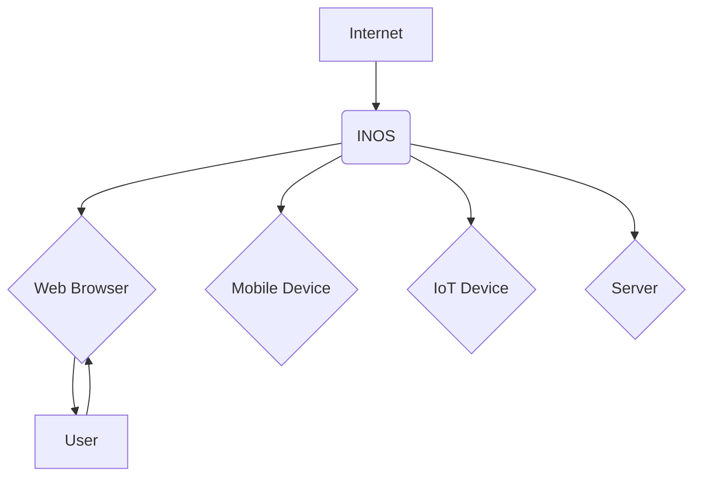
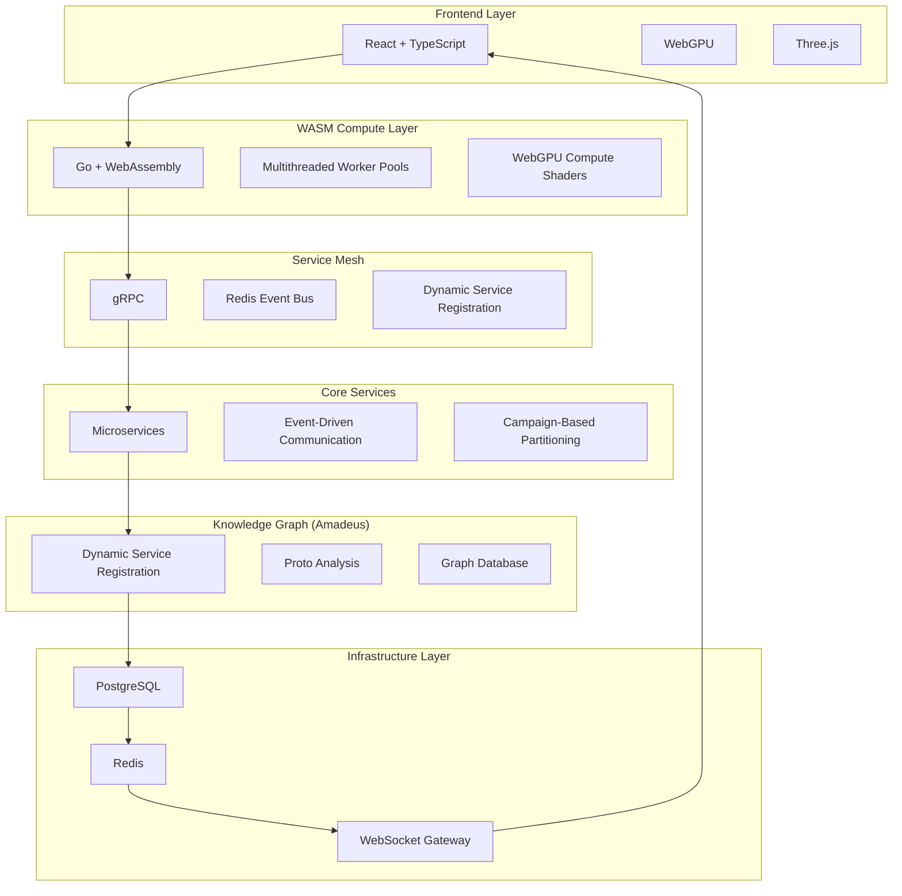
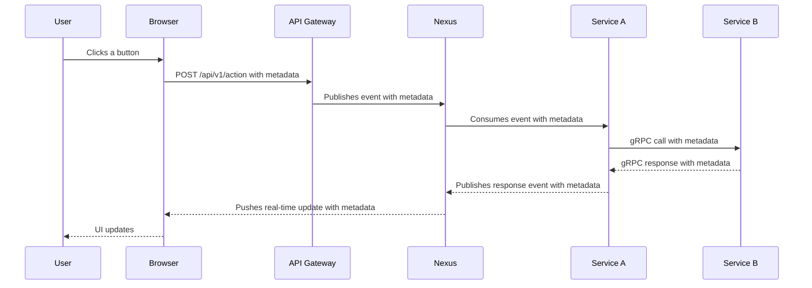
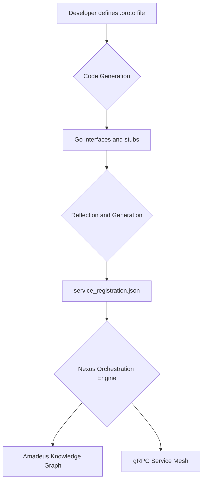

# The Internet-Native Operating System (INOS): A Technical White Paper

Version 1.0 | September 22, 2025

By Nobert Momoh

---

## Abstract

Imagine a world where every connected device becomes a node in a vast, intelligent computing network. Where a student in Mumbai can harness the processing power of devices in Tokyo, London, and San Francisco to run complex simulations. Where an artist in Lagos can build immersive experiences that work seamlessly across phones, tablets, and computers without writing a single line of code. Where the next breakthrough in artificial intelligence emerges not from a corporate lab, but from someone who simply had a brilliant idea and the courage to pursue it.

**This is not science fiction. This is the reality that INOS makes possible.**

### The Computing Paradox

For decades, we've been trapped in a computing paradox. While our devices grow more powerful with each generation, our ability to harness that power remains fragmented and constrained. Technology giants have built walled gardens where innovation dies in committee, where the next breakthrough is measured in quarterly earnings rather than human progress. The result? A generation of dreamers forced to choose between learning arcane programming languages or abandoning their visions entirely.

The current race for specialized AI chips represents a fundamental misunderstanding of the problem. We don't need more powerful hardware. We need smarter orchestration of the power we already have. There are over **15 billion connected devices worldwide**, each containing processors more capable than the supercomputers of just two decades ago. Yet this vast distributed supercomputer remains largely dormant, its potential locked behind proprietary walls and fragmented ecosystems.

### The INOS Solution

**INOS changes everything.**

By reimagining the internet as a native computing substrate rather than just a network of documents, INOS transforms every connected device into a potential compute node. It treats the web as the operating system, enabling truly universal applications that work identically across all platforms. It democratizes access to computational power, making high-performance computing available to anyone with an idea and an internet connection. This is achieved through a powerful combination of a `gRPC Service Mesh`, a `WASM Compute Layer`, and the `Nexus` event bus, which together create a self-organizing and self-healing system.

### Real-World Impact

The implications are profound:

- A teacher in rural India can create educational tools that work offline and sync when connected
- A small business owner in Brazil can build custom applications tailored to their specific needs
- A researcher in Kenya can access computational resources that would otherwise require a multimillion-dollar infrastructure investment

### The Future of Computing

This is the future of computing. Not more powerful chips, but smarter systems. Not centralized control, but distributed intelligence. Not gatekeepers of innovation, but enablers of human creativity.

INOS represents more than a technological breakthrough. It's a declaration of independence for the digital age, proof that the future of computing doesn't require us to choose between power and accessibility, between innovation and simplicity, between the few and the many.

The question isn't whether this future is possible. The question is whether we have the courage to build it.

The technology is ready. The infrastructure exists. The only thing missing is the vision to see what's possible when we stop thinking like the past and start building for the future.

**This is INOS. And it's already here.**

---

## Visualizing the INOS Vision



*INOS transforms the global network of devices into a unified computing platform.*

---

## System Architecture

### Overview

INOS represents a fundamental reimagining of how distributed systems should be architected. Rather than treating the internet as a simple network for data transfer, INOS treats it as a living, breathing computational organism—a digital nervous system that can think, adapt, and evolve.

The architecture is built on six distinct layers, each serving a specific purpose in this digital ecosystem, working together like the interconnected systems of a complex organism.

### Architecture Diagrams



*The INOS architecture is a layered system where each component builds upon the last, creating a powerful and flexible platform.*

## Core Components

### 1. Frontend Layer: The Digital Interface

**The Story**: Imagine walking into a room where every surface responds to your touch, where complex data flows become intuitive visual experiences, and where the impossible feels natural. This is what the Frontend Layer makes possible.

**What It Does**:
The Frontend Layer transforms abstract computational processes into experiences that feel magical. It takes the raw power of distributed computing and presents it in ways that make sense to human intuition. Complex simulations become interactive playgrounds. Massive datasets become beautiful visualizations. The future becomes tangible.

**Real-World Magic**:

- **Education**: A student in rural India can explore the human circulatory system in 3D, walking through blood vessels as if they were corridors. The `media-streaming` service can be used to stream high-fidelity anatomical models to the student's device, while the `WASM Compute Layer` can be used to run real-time simulations of blood flow.
- **Healthcare**: A doctor can see a patient's condition unfold in real-time, with data flowing like a living organism. The `analytics` service can be used to process and visualize patient data, while the `nexus` service can be used to orchestrate the flow of information between different medical devices and systems.

**The Technology Behind the Magic**:

- **`React + TypeScript`**: Ensures every interaction is smooth and predictable.
- **`WebGPU Integration`**: Unlocks the hidden power in every device.
- **`Three.js`**: Makes the impossible feel natural.

### 2. WASM Compute Layer: The Digital Engine

**The Story**: Deep within every device lies untapped potential. The WASM Compute Layer awakens this sleeping giant, turning every connected device into a computational powerhouse.

**What It Does**:
This layer transforms idle processors into active participants in a global computing network. It takes the collective power of billions of devices and makes it available to anyone, anywhere. What once required expensive hardware now runs on the device in your pocket.

**Real-World Magic**:

- **Scientific Discovery**: A researcher can run climate simulations that would have required a supercomputer, all from their laptop. The `wasm` directory contains the Go code that is compiled to WebAssembly, allowing for near-native performance in the browser.
- **Financial Innovation**: A trader can analyze market patterns in real-time, seeing opportunities others miss. The `commerce` service can be used to process financial data, while the `WASM Compute Layer` can be used to run complex trading algorithms on the client-side.

**The Technology Behind the Magic**:

- **`Go + WebAssembly`**: Near-native performance with the safety of managed code.
- **`Multithreaded Worker Pools`**: Harnesses every available core intelligently.
- **`WebGPU Compute Shaders`**: Turns every device into an AI accelerator.

### 3. Service Mesh: The Digital Nervous System

**The Story**: In a living organism, every cell knows its role and communicates seamlessly with others. The Service Mesh creates this same harmony in the digital realm, ensuring that every component works together perfectly.

**What It Does**:
The Service Mesh is the invisible conductor of a digital orchestra. It ensures that when one service needs another, the connection happens instantly. When something fails, it heals itself. When new capabilities are added, they integrate seamlessly. The system becomes self-organizing, self-healing, and self-optimizing.

**Real-World Magic**:

- **E-commerce**: A store can handle Black Friday traffic spikes without breaking a sweat. The `nexus` service, located in `internal/nexus`, acts as the central orchestrator, dynamically scaling services based on demand.
- **Social Platforms**: Viral content spreads smoothly without crashing the system. The `media` service can be used to efficiently distribute content, while the `nexus` service ensures that the system remains stable under heavy load.

**The Technology Behind the Magic**:

- **`gRPC`**: High-performance, strongly-typed APIs for internal and external service communication.
- **`Redis Event Bus`**: Real-time orchestration, pub/sub, and campaign/user-specific messaging.
- **`Dynamic Service Registration`**: The system learns and adapts on its own, with services registering themselves and their capabilities.

### 4. Core Services: The Digital Organs

**The Story**: Just as a living body has specialized organs for different functions, the Core Services layer provides specialized capabilities that work together to create something greater than the sum of its parts.

**What It Does**:
Each service focuses on what it does best, while remaining connected to the whole. When you need user management, the User Service handles it. When you need content, the Content Service responds. But they all work together seamlessly, creating experiences that feel unified and intelligent.

**Real-World Magic**:

- **Government Services**: Citizens can access all services through a single, intelligent interface. The `user` service can be used to manage citizen identities, while the `admin` service can be used to manage roles and permissions.
- **Healthcare**: Medical records, appointments, and treatments flow together naturally. The `health` service can be used to monitor the health of the system, while the `scheduler` service can be used to schedule appointments and treatments.

**The Technology Behind the Magic**:

- **`Microservices Architecture`**: Each service (e.g., `user`, `campaign`, `content`) evolves independently while staying connected.
- **`Event-Driven Communication`**: Services collaborate through shared experiences, orchestrated by the `Nexus` event bus.
- **`Campaign-Based Partitioning`**: Natural boundaries that make sense to humans, providing multi-tenancy and data isolation.

### 5. Knowledge Graph (Amadeus): The Digital Memory

**The Story**: Every living system learns from its experiences, building knowledge that guides future decisions. The Knowledge Graph, powered by our `Amadeus` system, is INOS's memory, understanding how everything connects and continuously learning from every interaction.

**What It Does**:
`Amadeus` creates a living map of the entire system. It understands how services relate to each other, how users interact with the system, and how everything evolves over time. It's like having a digital architect that never sleeps, constantly optimizing, documenting, and improving the system.

**Real-World Magic**:

- **Smart Cities**: Urban planners can see how different systems interact and optimize city-wide operations. The `amadeus` directory contains the tools and documentation for the knowledge graph, which can be used to visualize and analyze the relationships between different city services.
- **Supply Chains**: Companies can track and optimize complex networks in real-time. The `commerce` service can be used to track the flow of goods, while `Amadeus` can be used to identify bottlenecks and opportunities for optimization.

**The Technology Behind the Magic**:

- **`Dynamic Service Registration`**: The system automatically discovers new capabilities and updates the knowledge graph.
- **`Proto Analysis`**: `Amadeus` understands what each service can do by reading its `.proto` definition.
- **`Graph Database`**: Stores complex relationships in ways that make sense, enabling impact analysis and evolution tracking.

### 6. Infrastructure Layer: The Digital Foundation

**The Story**: Every great structure needs a solid foundation. The Infrastructure Layer provides the bedrock that makes everything else possible, ensuring reliability, performance, and scalability.

**What It Does**:
This layer handles the fundamental tasks that everything else depends on: storing data reliably, caching frequently accessed information, and facilitating real-time communication. It's designed to grow from serving one user to serving millions without breaking a sweat.

**Real-World Magic**:

- **Startup Acceleration**: New companies can launch with enterprise-grade infrastructure from day one. The `deployments` directory contains the Docker and Kubernetes configurations for deploying the entire INOS stack.
- **Global Reach**: Applications can serve users worldwide with consistent performance. The `pkg/cdn` package provides a content delivery network for distributing assets globally.

**The Technology Behind the Magic**:

- **`PostgreSQL`**: Reliable data storage that never loses information, using `jsonb` for rich metadata.
- **`Redis`**: Lightning-fast caching, pub/sub for real-time events, and ephemeral state.
- **`WebSocket Gateway`**: Real-time communication that feels instant, connecting the backend to the frontend.

## The Cumulative Effect

When these layers work together, they create something unprecedented: a computing platform that is simultaneously more powerful, more accessible, and more intelligent than anything that has come before. It's not just a better way to build software—it's a fundamentally different way of thinking about what software can be.

The result is a system that can grow, learn, and adapt on its own, while remaining simple enough for anyone to use. It's the difference between a tool and a partner, between a platform and a platform for platforms.

This is the architecture of the future, and it's already here.

---

*This white paper will explore the technical architecture, implementation details, and transformative potential of the Internet-Native Operating System (INOS).*

## Metadata: The System’s DNA

In traditional distributed systems, context is fragmented. It's scattered across ad-hoc HTTP headers, inconsistent request payloads, and disparate logging systems. This fragmentation makes it nearly impossible to have a holistic view of any given transaction, leading to systems that are difficult to debug, secure, and evolve.

INOS solves this problem with a simple yet profound concept: a universal metadata envelope, the `commonpb.Metadata` protobuf, that acts as the system's "DNA." This single, unified structure is carried with every interaction—across REST, gRPC, WebSockets, and internal events—providing a complete, consistent, and auditable context for every operation.



*The end-to-end flow of a request with its metadata "DNA".*

### The Anatomy of INOS DNA

The `commonpb.Metadata` structure is the single source of truth for the context of any request. It contains several key sections:

- **Versioning**: `system_version`, `service_version`, and `feature_flags` allow for graceful evolution and safe, gradual rollouts of new features.
- **Audit and Traceability**: `**actor_id**`, `**correlation_id**`, and `**request_id**` provide an unbroken chain of causality, making it possible to trace any request from the user's initial action to its final resolution. This is the foundation of our `shield` service's security analysis and our system-wide observability.
- **Service-Specific Context**: The `service_specific` field allows each service to attach its own relevant context, without polluting the global namespace. This provides both flexibility and strong typing.
- **Knowledge Graph Enrichment**: The `knowledge_graph` field contains hints that are used by `Amadeus` to continuously build and refine its understanding of the system's real-time behavior.

### From Theory to Practice

This metadata isn't just a theoretical concept; it's deeply integrated into the system's Go codebase. The **`pkg/metadata/metadata.go`** file provides a `Handler` for creating, enriching, and validating this metadata. When a request enters the system, this handler is used to create a rich context that follows the request throughout its entire lifecycle.

```go
// Example of enriching metadata in a service
func (s *MyService) MyMethod(ctx context.Context, req *pb.MyRequest) (*pb.MyResponse, error) {
    // Enrich metadata with service-specific context
    meta := metadata.FromContext(ctx)
    meta = metadata.Enrich(meta, "my_service", map[string]interface{}{
        "my_field": "my_value",
    })
    ctx = metadata.ToContext(ctx, meta)

    // ... service logic ...
}
```

### The Benefits of a Unified Context

This "DNA" approach provides several transformative benefits:

- **End-to-End Traceability**: We can reconstruct the entire journey of any request, making debugging and security analysis trivial.
- **Deterministic State**: With a single, authoritative source of context, we eliminate a whole class of bugs related to state inconsistencies.
- **Effortless Extensibility**: New services can add their own context to the metadata without breaking existing services.
- **A Single Source of Truth**: The metadata envelope is the single source of truth for the context of a request, eliminating ambiguity and making the system easier to reason about.

By treating context as a first-class citizen, INOS creates a system that is not only more powerful and flexible, but also more transparent, secure, and resilient.

## Service Registration and Dynamic Composition

A static, manually configured system is a brittle one. In a rapidly evolving ecosystem like INOS, we need a way for services to join and leave the network dynamically, without requiring a full system restart or complex manual reconfiguration. This is the role of our service registration and dynamic composition layer.



*The virtuous cycle of service registration and its interaction with Amadeus.*

### The `.proto` as the Source of Truth

The foundation of this system is a simple principle: the **`.proto`** file that defines a service's gRPC API is the single source of truth for that service's capabilities. We don't maintain separate configuration files or documentation that can drift out of sync. The code itself is the contract.

### The Registration Pipeline

When a new service is developed, the following automated pipeline is triggered:

1. **Code Generation**: The `.proto` file is used to generate the necessary Go interfaces and client/server stubs.
2. **Reflection and Generation**: A tool scans the Go code, using reflection to understand the service's methods, their inputs and outputs, and any associated health check endpoints.
3. **Manifest Generation**: This information is then used to generate a **`service_registration.json`** manifest. This manifest is a machine-readable description of the service, including its name, version, dependencies, and capabilities.

### The Role of `service_registration.json`

This generated JSON file is the key to our dynamic composition. At startup, the `Nexus` orchestration engine reads these manifests and builds a complete, real-time map of the entire system. This map, which is also fed into our `Amadeus` knowledge graph, is used to:

- **Wire Up the Service Mesh**: The `Nexus` uses the manifests to dynamically configure the gRPC service mesh, routing requests to the correct services based on their registered capabilities.
- **Validate Dependencies**: The `Nexus` can validate that all of a service's dependencies are met before allowing it to join the network, preventing cascading failures.
- **Enable Self-Documentation**: Because the `Amadeus` knowledge graph consumes these manifests, our system is always perfectly documented. The documentation is never out of date, because it's generated from the code itself.

### The Virtuous Cycle

This creates a virtuous cycle:

1. A developer defines a service in a `.proto` file.
2. The system automatically generates a manifest of the service's capabilities.
3. The `Nexus` uses this manifest to dynamically integrate the service into the system.
4. `Amadeus` uses the same manifest to update the system's documentation.

This automated, code-driven approach to service registration is what allows INOS to be both highly dynamic and incredibly stable. It's a system that is designed to evolve, a system that documents itself, a system that is, in a very real sense, alive.

## INOS Services

The power of INOS lies in its composable, service-oriented architecture. The services listed below represent the current, rich ecosystem of capabilities available on the platform. However, this list is not static; it is a living catalog designed for growth.

INOS provides a robust framework and a clear standard for service declaration, creation, and integration, making it straightforward to introduce new services to solve novel problems. We envision this as a standard that enables different industry actors to build and contribute their own specialized implementations, fostering a diverse and powerful ecosystem. The following services, all discoverable via the `config/service_registration.json` manifest, demonstrate the breadth of what is possible today and serve as a blueprint for future expansion:

- **`admin`**: Provides administrative functions, including user management, role-based access control, and system settings. This service is essential for managing the INOS platform itself.
- **`ai`**: A service for processing content, generating embeddings, and managing machine learning models. This service can be used to build intelligent applications that understand and react to user-generated content.
- **`analytics`**: For tracking and analyzing events within the system. This service can be used to gain insights into user behavior, application performance, and business metrics.
- **`campaign`**: For managing marketing campaigns and other promotional activities. This service can be used to create and track targeted campaigns, and to measure their effectiveness.
- **`commerce`**: A comprehensive service for handling e-commerce operations, including quotes, orders, payments, and inventory management. This service can be used to build sophisticated online stores and marketplaces.
- **`content`**: For managing user-generated content, including articles, comments, and reactions. This service is the foundation for any application that involves social interaction or user-generated media.
- **`contentmoderation`**: A service for moderating user-generated content to ensure that it complies with community guidelines. This service is essential for maintaining a safe and welcoming online environment.
- **`crawler`**: A service for crawling web pages and extracting data. This service can be used to build search engines, price comparison tools, and other applications that rely on data from the open web.
- **`localization`**: For translating content into different languages. This service can be used to create applications that are accessible to a global audience.
- **`media`**: For uploading, storing, and streaming media files. This service is essential for any application that involves video, audio, or other rich media.
- **`messaging`**: A real-time messaging service for one-on-one and group conversations. This service can be used to build chat applications, social networks, and other collaborative tools.
- **`nexus`**: The core orchestration engine of the INOS platform. This service is responsible for routing events, managing the service mesh, and ensuring that the entire system runs smoothly.
- **`notification`**: For sending notifications to users via email, SMS, and push notifications. This service is essential for keeping users engaged and informed.
- **`product`**: For managing product catalogs and inventory. This service can be used to build e-commerce applications, inventory management systems, and other applications that involve physical or digital products.
- **`referral`**: For managing referral programs and rewarding users for inviting their friends. This service can be used to grow a user base and incentivize word-of-mouth marketing.
- **`scheduler`**: For scheduling and running background jobs. This service can be used to automate tasks, run periodic reports, and perform other maintenance operations.
- **`search`**: A service for searching and filtering data across the entire INOS platform. This service is essential for any application that involves a large amount of data.
- **`security`**: For authenticating and authorizing users, and for detecting and preventing security threats. This service is essential for protecting user data and ensuring the integrity of the INOS platform.
- **`talent`**: For managing talent profiles and bookings. This service can be used to build freelance marketplaces, talent agencies, and other applications that connect talent with opportunities.
- **`user`**: For managing user accounts, profiles, and social connections. This service is the foundation for any application that involves user identity and social interaction.
- **`waitlist`**: For managing waitlists and inviting users to new products and services. This service can be used to build excitement and manage demand for new releases.

## Communication Standards and Reactive UI (backend-driven state)

At the heart of INOS is a set of communication standards that enable a truly reactive and developer-friendly experience. This is not just about choosing a specific technology; it's about a holistic approach to how services and UIs communicate.

### The Canonical Event Model

Every significant event in INOS is represented by a canonical event model, defined by the following structure: **`{service}:{action}:v{version}:{state}`**. This provides a clear and consistent way to understand what is happening in the system.

- **Producers and Consumers**: Events are produced by gRPC handlers via the **`graceful`** package, which ensures that both successes and failures are treated as first-class events. These events are then consumed by other services, the `ws-gateway`, or background workers.

```go
// Example of a graceful handler that produces an event
func (s *MyService) MyMethod(ctx context.Context, req *pb.MyRequest) (*pb.MyResponse, error) {
    // ... service logic ...

    // On success, wrap the response and orchestrate the event
    return graceful.WrapSuccess(resp).StandardOrchestrate(ctx, s.emitter, "my_service:my_method:v1:success")
}
```

### Backend-Driven React State

INOS embraces a `**backend-driven**` approach to UI development. This means that the frontend is a direct reflection of the backend state, with no ad-hoc client-side logic.

- **The Flow**: A service emits a canonical event, which is then routed through the `ws-gateway` to the appropriate React store. The store, which is subscribed to specific event types, then updates its state based on the event payload. This ensures that the UI is always in sync with the backend.

```javascript
// Example of a React store that subscribes to an event
import { createStore } from 'redux';

const initialState = { ... };

function myReducer(state = initialState, action) {
  switch (action.type) {
    case 'content:create_content:v1:success':
      return { ...state, content: [ ...state.content, action.payload ] };
    default:
      return state;
  }
}

const store = createStore(myReducer);

// The WebSocket gateway would dispatch actions to this store
```

### Multi-Tenancy and Data Isolation

INOS is designed from the ground up to be a multi-tenant platform. This means that every piece of data is isolated and protected, ensuring that users can only access the information they are authorized to see.

### Storage Model

- **Partitioning Strategy**: The proposed storage model will leverage PostgreSQL's `LIST` and `RANGE` partitioning to physically separate tenant data. This design is intended to provide strong isolation and predictable performance once implemented.

The following is an example of the proposed table structure:

```sql
-- Example of a partitioned table
CREATE TABLE events (
    id SERIAL,
    campaign_id INT,
    created_at TIMESTAMPTZ,
    -- ... other fields
) PARTITION BY LIST (campaign_id);

CREATE TABLE events_1 PARTITION OF events FOR VALUES IN (1);
CREATE TABLE events_2 PARTITION OF events FOR VALUES IN (2);
```

### Repository Pattern

- **Tenant-Aware Queries**: Our repository pattern ensures that all database queries are tenant-aware. Every query must include a `campaign_id` to ensure that only the correct data is returned.

```go
// Example of a tenant-aware repository method
func (r *MyRepository) GetMyData(ctx context.Context, campaignID int) ([]*MyData, error) {
    rows, err := r.db.QueryContext(ctx, "SELECT * FROM my_data WHERE campaign_id = $1", campaignID)
    // ...
}
```

## Competitive Landscape

INOS is not the first platform to address the challenges of distributed systems, but it takes a unique approach that sets it apart from existing solutions.

- **Monolithic Architectures**: Traditional monolithic architectures are difficult to scale, maintain, and evolve. INOS, with its microservices-based architecture, is far more flexible and resilient.
- **Microservices**: While microservices offer many advantages over monolithic architectures, they can also introduce new challenges, such as service discovery, inter-service communication, and data consistency. INOS solves these challenges with its `Nexus` orchestration engine, its `Amadeus` knowledge graph, and its universal metadata "DNA."
- **Serverless**: Serverless platforms like AWS Lambda and Google Cloud Functions are great for running stateless, event-driven functions, but they can be difficult to use for building complex, stateful applications. INOS, with its stateful services and its `WASM Compute Layer`, provides a more comprehensive solution for building a wide range of distributed applications.

## Conclusion and Roadmap

### Conclusion: A New Foundation for the Web

The Internet-Native Operating System (INOS) began with a simple premise: that the web had outgrown its role as a network of documents and was ready to become a true, universal computing substrate. We have demonstrated that by rethinking distributed systems from first principles—embracing an event-first architecture, prioritizing a transparent and robust developer experience, and building security and compliance into the very fabric of the system—it is possible to create a platform that is simultaneously more powerful, more scalable, and more accessible than what has come before.

The core of INOS is not a single feature, but the revolutionary communication fabric that binds it together. This real-time, verifiable, and resilient event bus is the breakthrough that makes everything else possible. We have proven that by focusing on perfecting this underlying layer, we can build a system that is stable, performant, and ready for the future.

This solid foundation is not the end of our journey. It is the launching point.

### The Roadmap: From Solid Foundation to Global Computer

Our roadmap is divided into phases, each building upon the last, extending the power of the INOS platform from the purely digital into the realms of true intelligence, immersive reality, and physical orchestration.

#### Phase 1: Solidification and Hardening (Immediate Focus)

The immediate priority is to refine and harden the existing, proven architecture. This involves:

- **Service Refinement**: A thorough review and cleanup of all existing microservices to optimize them for performance, reliability, and resource consumption.
- **Full Security Implementation**: Completing the full vision for the shield service. This means moving beyond initial pattern detection to implementing proactive, automated defense mechanisms and deep forensic capabilities, making it a true immune system for the platform.
- **Fleshing out Orchestration Patterns**: Further developing and documenting the orchestration patterns in `internal/nexus/service/pattern` to provide a rich library of reusable workflows for common distributed computing problems.

#### Phase 2: The Dawn of True Intelligence (Near Term)

Our initial experiments with a Python-based "Devourer" AI failed because the underlying communication fabric wasn't ready. Now, it is.

- **Implement Referential Intelligence**: With the Nexus event bus and strict schemas in place, we will re-introduce the `**Devourer**` AI as a first-class citizen of the INOS ecosystem. It will consume the real-time event stream, build a vast knowledge graph of the system's state and its history, and publish its insights back to the Nexus, enabling a new level of automated decision-making and system self-awareness.

#### Phase 3: The Immersive Web and Shared Compute (Mid Term)

This phase revisits our early ambitions for game engine integration, but with the wisdom gained from our initial failure.

- **Implement Shared Global Compute**: We will leverage the WASM compute layer to allow clients to securely share their idle processing power, creating a global, distributed supercomputer orchestrated by INOS.
- **Distributed Reality Engine**: Instead of trying to stream a monolithic game engine, we will build a new kind of engine designed for the web. This engine will use the shared global compute to power vast, persistent VR and AR environments. The INOS eventing fabric, which was perfected for streaming tiny state deltas, is the ideal transport layer for the high-frequency, low-latency updates required for a believable immersive experience.

#### Phase 4: Bridging the Digital and Physical Worlds (Long Term)

The ultimate vision for INOS is to be a true operating system for the internet, orchestrating not just software, but hardware and real-world processes.

- **Sensor and Actor Services**: We will introduce new first-class service types: `Sensor Services` and `Actor Services`. Sensor services will be responsible for ingesting, normalizing, and publishing data from a vast array of physical sensors—such as cameras, LiDAR, industrial IoT devices, and environmental monitors—onto the Nexus event bus. Actor services will consume these events and translate them into physical actions, controlling everything from robotic arms and autonomous vehicles to smart-grid components and factory machinery.

- **Industrial Communication Protocols**: To ensure broad compatibility with existing hardware and industrial systems, INOS will extend its communication fabric to natively support standard protocols like `MQTT` and `OPC-UA` alongside gRPC. This will allow INOS to act as a universal translator and orchestration layer for complex cyber-physical systems.

- **Services for the Physical World**: With these new capabilities, the INOS service model can be extended to new domains. The same patterns used to coordinate microservices can be used to orchestrate fleets of autonomous robots, manage smart factories, or optimize complex logistics for service industries. INOS will provide the secure, real-time, and auditable communication fabric that these next-generation applications require, bridging the gap between the digital and physical worlds.

## Community and Contribution

INOS is an open platform, and we welcome contributors of all backgrounds. The entire codebase is hosted on GitHub and we encourage you to explore it. Whether you are a Go developer, an AI/ML engineer, a database specialist, a frontend enthusiast, or simply passionate about building the future of the internet, there is a place for you in our community.

- **GitHub Repository**: [https://github.com/nmxmxh/master-ovasabi](https://github.com/nmxmxh/master-ovasabi)

To get involved, please see our [contribution guidelines](https://github.com/nmxmxh/master-ovasabi/blob/main/CONTRIBUTING.md) for information on how to contribute code, documentation, or ideas.

The journey ahead is ambitious, but it is built on a solid, proven foundation. INOS is more than a platform; it is a paradigm shift. It is the engine that will allow a new generation of developers, creators, and visionaries to build the future—not just on the web, but with it.
