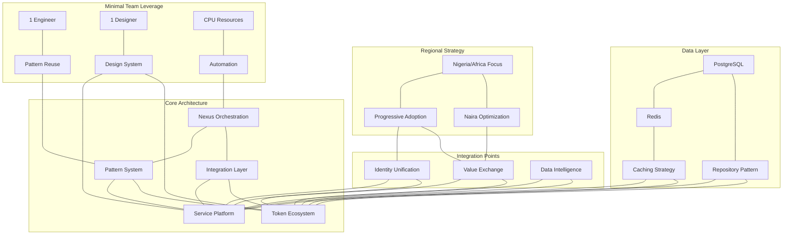

# OVASABI System Knowledge Graph

This document provides a comprehensive knowledge graph of the OVASABI system architecture,
connecting all key components, services, patterns, and practices that form the integrated
service-token platform.

## 1. Core System Relationships

```json
{
  "system_components": {
    "service_platform": {
      "core_services": [
        "user",
        "finance",
        "asset",
        "marketplace",
        "notification",
        "referral",
        "campaign",
        "quotes"
      ],
      "infrastructure": ["nexus", "patterns", "database", "redis", "tracing", "metrics"],
      "interfaces": ["api_gateway", "grpc_services", "event_bus"]
    },
    "token_ecosystem": {
      "tokens": ["OvaStable", "OvaUtility"],
      "components": ["exchange_orchestration", "wallet_gateway", "token_governance", "treasury"],
      "mechanisms": ["currency_basket", "UBI_distribution", "staking", "governance"]
    },
    "integration_layer": {
      "services": [
        "exchange_orchestration",
        "wallet_gateway",
        "incentive_management",
        "reputation_bridge",
        "value_router"
      ],
      "patterns": ["identity_unification", "value_exchange", "data_intelligence"],
      "interfaces": ["nexus_integration", "pattern_registry", "event_streams"]
    }
  }
}
```

## 2. Repository Structure Knowledge Graph

```json
{
  "repository_structure": {
    "root_directories": {
      "api": {
        "purpose": "API definitions and contracts",
        "key_components": ["protos"],
        "relationship_to_services": "defines service interfaces",
        "subdirectories": {
          "protos": {
            "purpose": "Protocol buffer definitions",
            "service_mapping": {
              "asset": "asset management services",
              "auth": "authentication services",
              "broadcast": "messaging and notification",
              "campaign": "marketing campaigns",
              "finance": "financial operations",
              "i18n": "internationalization",
              "notification": "user notifications",
              "quotes": "price quotes and estimation",
              "referral": "referral program",
              "user": "user management"
            }
          }
        }
      },
      "cmd": {
        "purpose": "Application entry points",
        "key_components": ["server"],
        "relationship_to_services": "service initialization and configuration"
      },
      "config": {
        "purpose": "Configuration files",
        "relationship_to_services": "service configuration",
        "affects": ["service_behavior", "environment_settings"]
      },
      "database": {
        "purpose": "Database related files",
        "key_components": ["migrations"],
        "relationship_to_services": "data persistence layer"
      },
      "docs": {
        "purpose": "Documentation",
        "key_components": ["api", "architecture", "deployment", "development"],
        "knowledge_base": "patterns, services, integrations",
        "relationship_to_services": "documents service design and usage"
      },
      "internal": {
        "purpose": "Private application code",
        "key_components": ["nexus", "repository", "server", "service", "shared"],
        "relationship_to_services": "service implementations",
        "nexus_location": "internal/nexus",
        "services_location": "internal/service"
      },
      "pkg": {
        "purpose": "Public packages",
        "key_components": ["di", "errors", "logger", "metrics", "models", "redis", "tracing"],
        "relationship_to_services": "reusable components across services"
      },
      "tools": {
        "purpose": "Development tools",
        "key_components": ["codegen", "docgen", "lint", "protoc"],
        "relationship_to_services": "service development support"
      },
      "amadeus": {
        "purpose": "System knowledge persistence",
        "key_components": ["system_knowledge_graph"],
        "relationship_to_services": "meta-documentation of system relationships"
      }
    }
  }
}
```

## 3. Services Knowledge Graph

```json
{
  "service_ecosystem": {
    "core_services": {
      "user_service": {
        "purpose": "Manages user identity, profiles, and authentication",
        "location": "internal/service/user",
        "repositories": ["user_repository"],
        "patterns_used": ["identity_unification_pattern"],
        "integration_points": ["auth_service", "referral_service", "notification_service"],
        "token_integration": "wallet association, governance participation"
      },
      "finance_service": {
        "purpose": "Handles financial transactions, wallets, and payment processing",
        "location": "internal/service/finance",
        "repositories": ["transaction_repository", "wallet_repository", "payment_repository"],
        "patterns_used": ["value_exchange_pattern"],
        "integration_points": ["user_service", "exchange_orchestration_service"],
        "token_integration": "token transactions, fiat-token exchange"
      },
      "asset_service": {
        "purpose": "Manages digital assets, documents, and multimedia content",
        "location": "internal/service/asset",
        "repositories": ["asset_repository"],
        "patterns_used": ["content_management_pattern"],
        "integration_points": ["user_service", "marketplace_service"],
        "token_integration": "asset tokenization, NFT capabilities"
      },
      "marketplace_service": {
        "purpose": "Facilitates service matching, transactions, and ratings",
        "location": "internal/service/marketplace",
        "repositories": ["listing_repository", "order_repository", "rating_repository"],
        "patterns_used": ["marketplace_token_integration_pattern"],
        "integration_points": ["user_service", "finance_service", "asset_service"],
        "token_integration": "token-gated features, staking for quality"
      },
      "notification_service": {
        "purpose": "Delivers notifications across multiple channels",
        "location": "internal/service/notification",
        "repositories": ["notification_repository", "preference_repository"],
        "patterns_used": ["event_subscription_pattern"],
        "integration_points": ["user_service", "all_services"],
        "token_integration": "premium notification features"
      },
      "referral_service": {
        "purpose": "Manages referral programs and rewards",
        "location": "internal/service/referral",
        "repositories": ["referral_repository", "reward_repository"],
        "patterns_used": ["incentive_distribution_pattern"],
        "integration_points": ["user_service", "finance_service"],
        "token_integration": "token rewards for referrals"
      }
    },
    "token_services": {
      "token_service": {
        "purpose": "Manages token issuance, transfers, and balances",
        "location": "internal/service/token",
        "repositories": ["token_repository", "balance_repository"],
        "patterns_used": ["token_lifecycle_pattern"],
        "integration_points": ["finance_service", "exchange_orchestration_service"],
        "service_integration": "service rewards, premium features"
      },
      "governance_service": {
        "purpose": "Handles proposal submission, voting, and execution",
        "location": "internal/service/governance",
        "repositories": ["proposal_repository", "vote_repository"],
        "patterns_used": ["governance_coordination_pattern"],
        "integration_points": ["token_service", "user_service"],
        "service_integration": "service parameter governance"
      },
      "treasury_service": {
        "purpose": "Manages protocol-owned assets and allocations",
        "location": "internal/service/treasury",
        "repositories": ["treasury_repository", "allocation_repository"],
        "patterns_used": ["treasury_management_pattern"],
        "integration_points": ["finance_service", "token_service"],
        "service_integration": "service subsidy, incentive funding"
      }
    },
    "integration_services": {
      "exchange_orchestration_service": {
        "purpose": "Manages value exchange between service and token domains",
        "location": "internal/service/exchange",
        "repositories": ["rate_repository", "liquidity_repository"],
        "patterns_used": ["exchange_orchestration_pattern"],
        "integration_points": ["finance_service", "token_service"],
        "key_components": ["rate_oracle", "routing_engine", "liquidity_manager"]
      },
      "wallet_gateway_service": {
        "purpose": "Provides unified wallet capabilities",
        "location": "internal/service/wallet",
        "repositories": ["wallet_repository", "custody_repository"],
        "patterns_used": ["wallet_abstraction_pattern"],
        "integration_points": ["user_service", "finance_service", "token_service"],
        "key_components": ["custody_manager", "transaction_signer", "security_module"]
      },
      "incentive_management_service": {
        "purpose": "Coordinates rewards across domains",
        "location": "internal/service/incentive",
        "repositories": ["incentive_repository", "reward_repository"],
        "patterns_used": ["incentive_coordination_pattern"],
        "integration_points": ["all_services", "token_service"],
        "key_components": ["reward_calculator", "distribution_engine", "vesting_manager"]
      }
    }
  }
}
```

## 4. Nexus Service Knowledge Graph

```json
{
  "nexus_system": {
    "core_components": {
      "pattern_registry": {
        "purpose": "Stores and manages all system patterns",
        "location": "internal/nexus/service/pattern",
        "interfaces": ["RegisterPattern", "FindPattern", "ExecutePattern"],
        "storage": "database with redis cache",
        "relationship_to_services": "provides patterns for service composition"
      },
      "service_catalog": {
        "purpose": "Maintains registry of all available services",
        "location": "internal/nexus/service/catalog",
        "interfaces": ["RegisterService", "DiscoverService", "GetServiceMetadata"],
        "storage": "database with redis cache",
        "relationship_to_services": "service discovery and metadata"
      },
      "transaction_manager": {
        "purpose": "Ensures atomic execution across services",
        "location": "internal/nexus/service/transaction",
        "interfaces": ["BeginTransaction", "CommitTransaction", "RollbackTransaction"],
        "storage": "distributed transaction log",
        "relationship_to_services": "cross-service transaction coordination"
      },
      "event_bus": {
        "purpose": "Asynchronous event distribution",
        "location": "internal/nexus/service/event",
        "interfaces": ["PublishEvent", "SubscribeToEvent", "ProcessEvent"],
        "storage": "redis streams",
        "relationship_to_services": "inter-service communication"
      }
    },
    "orchestration_engine": {
      "pattern_execution": {
        "purpose": "Executes patterns across services",
        "location": "internal/nexus/service/execution",
        "key_algorithms": ["dependency_resolution", "parallel_execution", "failure_recovery"],
        "relationship_to_services": "service composition execution"
      },
      "state_management": {
        "purpose": "Maintains execution state",
        "location": "internal/nexus/service/state",
        "storage_options": ["redis", "database", "distributed_cache"],
        "relationship_to_services": "cross-service state coordination"
      }
    },
    "integration_capabilities": {
      "service_token_bridge": {
        "purpose": "Facilitates service-token domain integration",
        "location": "internal/nexus/service/integration",
        "key_components": ["domain_translator", "protocol_adapter", "schema_mapper"],
        "relationship_to_services": "cross-domain orchestration"
      },
      "external_system_connectors": {
        "purpose": "Connects to non-OVASABI systems",
        "location": "internal/nexus/service/connector",
        "supported_systems": ["payment_processors", "identity_providers", "external_marketplaces"],
        "relationship_to_services": "external integration points"
      }
    }
  }
}
```

## 5. Patterns System Knowledge Graph

```json
{
  "patterns_system": {
    "pattern_categories": {
      "core_patterns": {
        "identity_unification_pattern": {
          "purpose": "Creates unified identity spanning service and token domains",
          "location": "internal/nexus/patterns/identity",
          "services_used": ["user_service", "auth_service", "wallet_gateway_service"],
          "integration_points": ["user_profile", "wallet_address", "authentication"],
          "composition_potential": "High - foundation for many other patterns"
        },
        "value_exchange_pattern": {
          "purpose": "Enables value transfer between service and token economies",
          "location": "internal/nexus/patterns/exchange",
          "services_used": ["finance_service", "token_service", "exchange_orchestration_service"],
          "integration_points": ["service_fees", "token_rewards", "fiat_token_exchange"],
          "composition_potential": "High - core economic integration pattern"
        },
        "data_intelligence_pattern": {
          "purpose": "Unifies analytics across domains with privacy preservation",
          "location": "internal/nexus/patterns/intelligence",
          "services_used": ["analytics_service", "user_service", "all_services"],
          "integration_points": ["service_metrics", "token_metrics", "user_insights"],
          "composition_potential": "Medium - specialized analytics composition"
        }
      },
      "service_patterns": {
        "marketplace_token_integration_pattern": {
          "purpose": "Integrates marketplace with token economics",
          "location": "internal/nexus/patterns/marketplace",
          "services_used": ["marketplace_service", "token_service", "finance_service"],
          "composed_of": [
            "identity_unification_pattern",
            "value_exchange_pattern",
            "data_intelligence_pattern"
          ],
          "integration_points": ["listing_enhancement", "quality_staking", "reputation_systems"],
          "composition_potential": "Medium - domain-specific composition"
        },
        "referral_reward_pattern": {
          "purpose": "Manages multi-level referral systems with token rewards",
          "location": "internal/nexus/patterns/referral",
          "services_used": ["referral_service", "user_service", "token_service"],
          "composed_of": ["identity_unification_pattern", "value_exchange_pattern"],
          "integration_points": ["referral_tracking", "reward_distribution", "social_graph"],
          "composition_potential": "Medium - specialized reward system"
        }
      },
      "token_patterns": {
        "token_lifecycle_pattern": {
          "purpose": "Manages token issuance, distribution, and retirement",
          "location": "internal/nexus/patterns/token",
          "services_used": ["token_service", "treasury_service", "governance_service"],
          "integration_points": ["token_supply", "distribution_mechanics", "token_parameters"],
          "composition_potential": "High - foundation for token operations"
        },
        "governance_coordination_pattern": {
          "purpose": "Coordinates governance processes and execution",
          "location": "internal/nexus/patterns/governance",
          "services_used": ["governance_service", "token_service", "affected_services"],
          "integration_points": ["proposal_creation", "voting", "execution"],
          "composition_potential": "Medium - specialized governance operations"
        }
      },
      "integration_patterns": {
        "exchange_orchestration_pattern": {
          "purpose": "Manages complex value exchange operations",
          "location": "internal/nexus/patterns/exchange_orchestration",
          "services_used": ["exchange_orchestration_service", "finance_service", "token_service"],
          "composed_of": ["value_exchange_pattern", "token_lifecycle_pattern"],
          "integration_points": ["rate_determination", "liquidity_management", "exchange_routing"],
          "composition_potential": "High - core financial operations"
        },
        "regional_adaptation_pattern": {
          "purpose": "Adapts system behavior for regional requirements",
          "location": "internal/nexus/patterns/regional",
          "services_used": ["all_services"],
          "composed_of": ["multiple_base_patterns"],
          "integration_points": [
            "regulatory_compliance",
            "currency_optimization",
            "cultural_adaptation"
          ],
          "composition_potential": "High - meta-pattern for regional customization"
        }
      }
    },
    "pattern_composition_rules": {
      "dependency_resolution": {
        "purpose": "Ensures patterns are composed with correct dependencies",
        "algorithm": "Topological sorting of pattern dependencies",
        "handling": "Automatic dependency injection and resolution"
      },
      "configuration_inheritance": {
        "purpose": "Manages configuration across composed patterns",
        "algorithm": "Hierarchical configuration with override capabilities",
        "handling": "Configuration merging with priority rules"
      },
      "conflict_resolution": {
        "purpose": "Resolves conflicts between composed patterns",
        "algorithm": "Priority-based conflict resolution",
        "handling": "Explicit conflict handlers or policy-based resolution"
      }
    }
  }
}
```

## 6. Database Practices Knowledge Graph

```json
{
  "database_practices": {
    "architecture": {
      "primary_database": {
        "technology": "PostgreSQL",
        "purpose": "Primary persistent storage",
        "location": "database/",
        "migration_strategy": "Up/down versioned migrations",
        "relationship_to_services": "All services use for persistent storage"
      },
      "read_replicas": {
        "technology": "PostgreSQL read replicas",
        "purpose": "Scaling read operations",
        "relationship_to_services": "Read-heavy services use for queries"
      },
      "service_databases": {
        "strategy": "Schema-per-service",
        "isolation_level": "Logical isolation within shared cluster",
        "cross_service_access": "Via API only, never direct cross-schema queries"
      }
    },
    "data_access_patterns": {
      "repository_pattern": {
        "implementation": "internal/repository/*",
        "purpose": "Abstract database operations",
        "transaction_support": "Context-based transaction propagation",
        "relationship_to_services": "Each service has dedicated repositories"
      },
      "query_patterns": {
        "basic_crud": "Standard repository methods",
        "complex_queries": "Custom repository methods with optimized queries",
        "pagination": "Cursor-based for optimal performance",
        "relationship_to_services": "Services interact via repository interfaces"
      }
    },
    "performance_optimization": {
      "indexing_strategy": {
        "approach": "Proactive indexing based on query patterns",
        "monitoring": "Query performance monitoring and index suggestions",
        "relationship_to_services": "Service-specific index optimization"
      },
      "caching_strategy": {
        "write_through": "For frequently accessed reference data",
        "cache_aside": "For frequently read entity data",
        "technology": "Redis used as primary cache",
        "relationship_to_services": "Service-specific cache configurations"
      },
      "data_partitioning": {
        "time_based": "For time-series and historical data",
        "key_based": "For evenly distributed workloads",
        "relationship_to_services": "Service-specific partitioning schemes"
      }
    },
    "migration_practices": {
      "version_control": {
        "location": "database/migrations",
        "naming_convention": "timestamp_description.sql",
        "direction_support": "Up and down migrations"
      },
      "deployment_strategy": {
        "approach": "Automated migration during deployment",
        "rollback_capability": "Automatic rollback on error",
        "zero_downtime": "Compatible schema changes, multi-phase migrations"
      },
      "integration_testing": {
        "approach": "Automated tests against migrated schema",
        "test_data": "Migration-aware test data generation"
      }
    },
    "service_database_mapping": {
      "user_service": {
        "schema": "user_schema",
        "key_tables": ["users", "profiles", "credentials", "sessions"],
        "query_patterns": ["user lookup", "authentication", "profile management"]
      },
      "finance_service": {
        "schema": "finance_schema",
        "key_tables": ["wallets", "transactions", "payment_methods", "balances"],
        "query_patterns": ["balance lookup", "transaction history", "payment processing"]
      },
      "marketplace_service": {
        "schema": "marketplace_schema",
        "key_tables": ["listings", "orders", "ratings", "categories"],
        "query_patterns": ["listing search", "order tracking", "rating aggregation"]
      },
      "token_service": {
        "schema": "token_schema",
        "key_tables": ["tokens", "balances", "transfers", "metadata"],
        "query_patterns": ["balance check", "transfer history", "token metadata"]
      }
    }
  }
}
```

## 7. Redis Practices Knowledge Graph

```json
{
  "redis_practices": {
    "architecture": {
      "deployment_model": {
        "primary": "Redis Cluster for high availability",
        "purpose": "Caching, session management, real-time features",
        "configuration_location": "redis.conf",
        "relationship_to_services": "Used by all services for performance optimization"
      },
      "data_structures": {
        "strings": {
          "use_cases": ["simple caching", "counters", "flags"],
          "services_using": ["all services"]
        },
        "hashes": {
          "use_cases": ["entity caching", "metadata storage", "configuration"],
          "services_using": ["user_service", "marketplace_service", "token_service"]
        },
        "lists": {
          "use_cases": ["queues", "recent activity", "time-ordered data"],
          "services_using": ["notification_service", "activity_service"]
        },
        "sets": {
          "use_cases": ["unique collections", "relationships", "tagging"],
          "services_using": ["marketplace_service", "referral_service"]
        },
        "sorted_sets": {
          "use_cases": ["rankings", "leaderboards", "time-series data"],
          "services_using": ["marketplace_service", "analytics_service", "token_service"]
        },
        "streams": {
          "use_cases": ["event streaming", "activity feeds", "real-time updates"],
          "services_using": [
            "nexus_service",
            "notification_service",
            "exchange_orchestration_service"
          ]
        },
        "geospatial": {
          "use_cases": ["location-based features", "proximity search"],
          "services_using": ["marketplace_service", "regional_service"]
        }
      }
    },
    "usage_patterns": {
      "caching_patterns": {
        "read_through": {
          "implementation": "pkg/redis/cache.go",
          "use_cases": ["entity caching", "computed results"],
          "services_using": ["all services"],
          "configuration": "TTL based on data volatility"
        },
        "write_through": {
          "implementation": "pkg/redis/cache.go",
          "use_cases": ["session data", "user preferences"],
          "services_using": ["user_service", "session_service"],
          "configuration": "Immediate consistency with database"
        },
        "cache_aside": {
          "implementation": "internal/*/repository/*.go",
          "use_cases": ["entity data with database backup"],
          "services_using": ["all services"],
          "configuration": "Service-controlled cache management"
        }
      },
      "real_time_patterns": {
        "pub_sub": {
          "implementation": "pkg/redis/pubsub.go",
          "use_cases": ["real-time notifications", "cache invalidation"],
          "services_using": ["notification_service", "nexus_service"],
          "integration": "Event-driven architecture component"
        },
        "streams": {
          "implementation": "pkg/redis/streams.go",
          "use_cases": ["event sourcing", "activity tracking", "data processing"],
          "services_using": ["nexus_service", "analytics_service"],
          "integration": "Core event processing infrastructure"
        }
      },
      "distributed_patterns": {
        "distributed_locks": {
          "implementation": "pkg/redis/lock.go",
          "use_cases": ["concurrency control", "resource locking"],
          "services_using": ["finance_service", "token_service", "marketplace_service"],
          "integration": "Critical for transaction integrity"
        },
        "rate_limiting": {
          "implementation": "pkg/redis/ratelimit.go",
          "use_cases": ["API protection", "abuse prevention"],
          "services_using": ["all services", "api_gateway"],
          "integration": "Security and stability protection"
        },
        "distributed_counters": {
          "implementation": "pkg/redis/counter.go",
          "use_cases": ["high-volume counting", "statistics"],
          "services_using": ["analytics_service", "marketplace_service"],
          "integration": "Real-time metrics component"
        }
      }
    },
    "service_redis_mapping": {
      "nexus_service": {
        "key_data_structures": ["streams", "hashes", "sorted_sets"],
        "primary_use_cases": ["pattern execution state", "event streaming", "service coordination"],
        "key_prefixes": ["nx:pattern:", "nx:execution:", "nx:event:"],
        "critical_operations": ["pattern execution tracking", "cross-service event streaming"]
      },
      "user_service": {
        "key_data_structures": ["hashes", "strings", "sets"],
        "primary_use_cases": ["session management", "profile caching", "feature flags"],
        "key_prefixes": ["user:", "session:", "pref:"],
        "critical_operations": ["authentication state", "user preferences"]
      },
      "marketplace_service": {
        "key_data_structures": ["sorted_sets", "hashes", "geospatial"],
        "primary_use_cases": [
          "listing rankings",
          "search results caching",
          "location-based matching"
        ],
        "key_prefixes": ["mkt:listing:", "mkt:search:", "mkt:geo:"],
        "critical_operations": ["search result caching", "real-time listing updates"]
      },
      "finance_service": {
        "key_data_structures": ["hashes", "sorted_sets", "strings"],
        "primary_use_cases": ["balance caching", "transaction tracking", "rate limiting"],
        "key_prefixes": ["fin:balance:", "fin:tx:", "fin:rate:"],
        "critical_operations": ["balance checking", "transaction deduplication"]
      },
      "token_service": {
        "key_data_structures": ["hashes", "sorted_sets", "streams"],
        "primary_use_cases": ["token balance caching", "transfer tracking", "price updates"],
        "key_prefixes": ["token:balance:", "token:transfer:", "token:price:"],
        "critical_operations": ["balance caching", "real-time price updates"]
      },
      "exchange_orchestration_service": {
        "key_data_structures": ["sorted_sets", "hashes", "streams"],
        "primary_use_cases": [
          "exchange rate caching",
          "order book management",
          "transaction tracking"
        ],
        "key_prefixes": ["exch:rate:", "exch:book:", "exch:tx:"],
        "critical_operations": ["rate tracking", "liquidity management"]
      }
    },
    "performance_optimization": {
      "memory_management": {
        "implementation": "redis.conf settings",
        "key_strategies": ["TTL-based expiration", "maxmemory policies", "eviction strategies"],
        "monitoring": "Memory usage tracking and alerting"
      },
      "connection_pooling": {
        "implementation": "pkg/redis/pool.go",
        "configuration": "Service-specific connection pools",
        "optimization": "Pool sizing based on service workload"
      },
      "pipelining": {
        "implementation": "pkg/redis/pipeline.go",
        "use_cases": ["batch operations", "multi-key transactions"],
        "services_using": ["all services for bulk operations"]
      },
      "lua_scripting": {
        "implementation": "pkg/redis/script.go",
        "use_cases": ["atomic operations", "complex data processing"],
        "services_using": ["finance_service", "token_service", "exchange_orchestration_service"]
      }
    }
  }
}
```

## 8. System Integration Map



## 9. Hypothetical System Ties for Amadeus

```json
{
  "amadeus_integration": {
    "purpose": "Knowledge persistence and system evolution tracking",
    "integration_points": {
      "nexus_integration": {
        "pattern": "knowledge_graph_pattern",
        "purpose": "Maintain system knowledge graph alongside patterns",
        "implementation": "Nexus pattern that updates knowledge graph on system changes"
      },
      "service_integration": {
        "integration_services": ["all_services"],
        "purpose": "Capture service interaction knowledge",
        "implementation": "Service event hooks that update knowledge graph"
      },
      "pattern_integration": {
        "pattern_types": ["all_patterns"],
        "purpose": "Track pattern usage and evolution",
        "implementation": "Pattern registry hooks for knowledge graph updates"
      }
    },
    "knowledge_management": {
      "versioning": "Git-based version history of knowledge graph",
      "real_time_updates": "Event-driven updates from system activities",
      "visualization": "Dynamic generation of system visualization from graph data"
    },
    "system_evolution": {
      "change_impact_analysis": "Predictive analysis of change impacts across system",
      "historical_traceability": "Tracing system evolution over time",
      "recommendation_engine": "AI-based recommendations for system improvements"
    }
  }
}
```

This comprehensive knowledge graph provides a complete map of the OVASABI system, connecting all
components from the repository structure to the services, Nexus system, patterns, database
practices, and Redis implementation. It serves as both documentation and a foundation for system
analysis, optimization, and evolution.

The Amadeus directory can be expanded with additional knowledge artifacts to maintain system
understanding and enable continuous evolution of the architecture.
