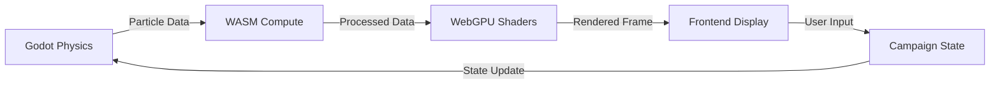
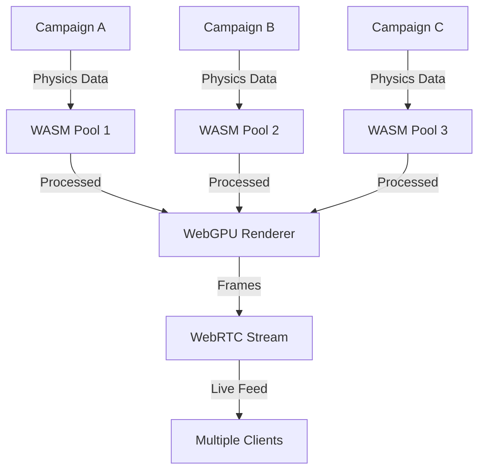

# Distributed Live Streaming Platform Architecture

## Overview

This document outlines the architecture for a **distributed live streaming platform** that connects
Godot (physics/behavioral engine), WASM (compute layer), and frontend (rendering/UI) with real-time
campaign state management, aligned with NVIDIA's live streaming ambitions.

## System Architecture

### **Core Components**

```
┌─────────────────────────────────────────────────────────────────┐
│                    DISTRIBUTED LIVE STREAMING PLATFORM          │
├─────────────────────────────────────────────────────────────────┤
│  Frontend Layer (WebGPU + Three.js)                            │
│  ├── Real-time Rendering Engine                                │
│  ├── WebGPU Compute Shaders                                    │
│  ├── Campaign State UI                                          │
│  └── Live Stream Controls                                       │
├─────────────────────────────────────────────────────────────────┤
│  WASM Compute Layer (Go + WebAssembly)                         │
│  ├── GPU Compute Orchestration                                 │
│  ├── Memory Pool Management                                    │
│  ├── Concurrent Processing                                     │
│  └── Real-time Data Streaming                                  │
├─────────────────────────────────────────────────────────────────┤
│  Godot Physics Engine (Headless)                               │
│  ├── 500K Particle Simulation                                  │
│  ├── Physics Behavior System                                   │
│  ├── Multi-Campaign Support                                    │
│  └── Real-time State Broadcasting                              │
├─────────────────────────────────────────────────────────────────┤
│  Backend Services (Go + gRPC)                                  │
│  ├── Campaign State Manager                                     │
│  ├── Event Bus (Redis Pub/Sub)                                 │
│  ├── WebSocket Gateway                                          │
│  └── Media Streaming Service                                    │
├─────────────────────────────────────────────────────────────────┤
│  Infrastructure Layer                                           │
│  ├── Redis Cluster (Event Distribution)                        │
│  ├── PostgreSQL (State Persistence)                            │
│  ├── WebRTC (Low-latency Streaming)                            │
│  └── CDN (Asset Distribution)                                  │
└─────────────────────────────────────────────────────────────────┘
```

## **Technical Requirements**

### **1. Real-time Data Flow**

#### **Godot → WASM → Frontend Pipeline**



#### **Multi-Campaign Streaming**



### **2. Performance Requirements**

#### **Latency Targets**

- **Godot → WASM**: < 5ms
- **WASM → Frontend**: < 10ms
- **End-to-end**: < 50ms
- **WebRTC Streaming**: < 100ms

#### **Throughput Targets**

- **Particle Processing**: 500K particles @ 60 FPS
- **Concurrent Campaigns**: 10+ simultaneous
- **WebSocket Connections**: 1000+ concurrent
- **WebRTC Streams**: 100+ simultaneous

### **3. Scalability Architecture**

#### **Horizontal Scaling**

```go
// Campaign State Distribution
type CampaignCluster struct {
    Campaigns    map[string]*CampaignNode
    LoadBalancer *LoadBalancer
    StateSync    *StateSynchronizer
}

type CampaignNode struct {
    GodotEngine  *GodotHeadless
    WASMCompute  *WASMProcessor
    StateManager *CampaignStateManager
    StreamOutput *WebRTCStreamer
}
```

#### **Vertical Scaling**

- **GPU Compute**: Multiple WebGPU contexts
- **Memory Pools**: Dynamic allocation based on load
- **Worker Pools**: Auto-scaling based on particle count

## **Implementation Plan**

### **Phase 1: Core Integration (4-6 weeks)**

#### **1.1 Godot-WASM Bridge Enhancement**

```go
// Enhanced Godot-WASM communication
type GodotWASMBridge struct {
    ParticleStream    chan ParticleData
    StateUpdates      chan CampaignState
    CommandQueue      chan GodotCommand
    PerformanceMetrics chan PerformanceData
}

type ParticleData struct {
    CampaignID    string
    ParticleCount int
    Buffer        []float32
    Timestamp     time.Time
    FrameID       uint64
}
```

#### **1.2 Real-time Streaming Protocol**

```go
// Streaming event types
const (
    EventTypeParticleUpdate = "particle:update:v1:stream"
    EventTypePhysicsState   = "physics:state:v1:stream"
    EventTypeCampaignSync   = "campaign:sync:v1:stream"
    EventTypePerformance    = "performance:metrics:v1:stream"
)
```

#### **1.3 WebRTC Integration**

```typescript
// WebRTC streaming for live feeds
class LiveStreamManager {
  private peerConnections: Map<string, RTCPeerConnection> = new Map();
  private dataChannels: Map<string, RTCDataChannel> = new Map();

  async startLiveStream(campaignId: string): Promise<void> {
    const peerConnection = new RTCPeerConnection({
      iceServers: [{ urls: 'stun:stun.l.google.com:19302' }]
    });

    // Setup data channel for real-time data
    const dataChannel = peerConnection.createDataChannel('particleData', {
      ordered: true,
      maxRetransmits: 3
    });

    this.peerConnections.set(campaignId, peerConnection);
    this.dataChannels.set(campaignId, dataChannel);
  }
}
```

### **Phase 2: Advanced Features (6-8 weeks)**

#### **2.1 Multi-Campaign Orchestration**

```go
// Campaign orchestration system
type CampaignOrchestrator struct {
    Campaigns     map[string]*CampaignInstance
    LoadBalancer  *LoadBalancer
    StateSync     *StateSynchronizer
    EventBus      *RedisEventBus
}

type CampaignInstance struct {
    ID           string
    GodotEngine  *GodotHeadless
    WASMCompute  *WASMProcessor
    StateManager *CampaignStateManager
    StreamOutput *WebRTCStreamer
    Performance  *PerformanceMonitor
}
```

#### **2.2 Advanced Physics Integration**

```gdscript
# Enhanced Godot physics with WASM integration
extends Node

class_name PhysicsWASMBridge

var wasm_interface: WASMInterface
var particle_system: ParticleSystem
var physics_engine: PhysicsEngine3D

func _ready():
    wasm_interface = WASMInterface.new()
    particle_system = ParticleSystem.new()
    physics_engine = PhysicsEngine3D.new()

    # Connect to WASM compute layer
    wasm_interface.connect("compute_complete", self, "_on_compute_complete")
    wasm_interface.connect("state_update", self, "_on_state_update")

func stream_physics_data():
    var physics_data = {
        "particles": particle_system.get_particle_buffer(),
        "forces": physics_engine.get_force_data(),
        "collisions": physics_engine.get_collision_data(),
        "timestamp": Time.get_unix_time_from_system()
    }

    wasm_interface.send_physics_data(physics_data)
```

#### **2.3 Real-time Performance Monitoring**

```go
// Performance monitoring system
type PerformanceMonitor struct {
    Metrics      *MetricsCollector
    AlertSystem  *AlertSystem
    Scaling      *AutoScaler
}

type MetricsCollector struct {
    ParticleCount    int64
    ProcessingTime   time.Duration
    MemoryUsage      int64
    GPUUtilization   float64
    NetworkLatency   time.Duration
    FrameRate        float64
}
```

### **Phase 3: Production Features (8-10 weeks)**

#### **3.1 Advanced Streaming Features**

- **Adaptive Bitrate**: Dynamic quality based on network conditions
- **Multi-Resolution**: Different quality streams for different clients
- **Spatial Audio**: 3D audio integration with physics simulation
- **Interactive Controls**: Real-time user interaction with physics

#### **3.2 Enterprise Features**

- **Multi-Tenancy**: Isolated campaign environments
- **Security**: End-to-end encryption, access control
- **Analytics**: Real-time performance and usage analytics
- **Monitoring**: Comprehensive observability and alerting

## **NVIDIA Live Streaming Alignment**

### **1. GPU Compute Integration**

Your current WebGPU integration already aligns with NVIDIA's vision:

- **Parallel Processing**: WebGPU compute shaders for particle physics
- **Memory Management**: Efficient GPU memory pools
- **Real-time Rendering**: Low-latency frame generation

### **2. Streaming Architecture**

- **WebRTC Integration**: Low-latency streaming protocol
- **Adaptive Quality**: Dynamic bitrate adjustment
- **Multi-Resolution**: Scalable streaming for different clients

### **3. Distributed Computing**

- **Campaign Clustering**: Multiple physics engines running in parallel
- **State Synchronization**: Real-time state updates across instances
- **Load Balancing**: Dynamic resource allocation

## **Technical Implementation Details**

### **1. Enhanced Godot Integration**

#### **Real-time Data Streaming**

```gdscript
# Enhanced main.gd for live streaming
extends Node

var particle_count := 500000
var particles := []
var wasm_bridge: WASMBridge
var stream_manager: StreamManager

func _ready():
    # Initialize WASM bridge
    wasm_bridge = WASMBridge.new()
    wasm_bridge.connect("compute_complete", self, "_on_compute_complete")

    # Initialize stream manager
    stream_manager = StreamManager.new()
    stream_manager.connect("stream_ready", self, "_on_stream_ready")

    # Start physics simulation
    _init_particles()
    set_process(true)

func _process(delta):
    # Update particle physics
    _update_particles(delta)

    # Stream data to WASM
    var particle_data = {
        "particles": particles,
        "delta": delta,
        "timestamp": Time.get_unix_time_from_system()
    }

    wasm_bridge.send_particle_data(particle_data)

    # Stream to live feed
    if stream_manager.is_streaming():
        stream_manager.stream_frame(particles)
```

#### **WASM Compute Integration**

```go
// Enhanced WASM compute layer
type ParticleProcessor struct {
    GPUDevice    js.Value
    ComputeQueue chan ParticleData
    Results      chan ProcessedData
    Workers      []*ComputeWorker
}

func (p *ParticleProcessor) ProcessParticles(data ParticleData) {
    // GPU compute processing
    result := p.runGPUCompute(data.Particles)

    // Send to frontend
    p.Results <- ProcessedData{
        Particles: result,
        Timestamp: time.Now(),
        FrameID:   data.FrameID,
    }
}
```

### **2. Frontend Integration**

#### **Real-time Rendering**

```typescript
// Enhanced frontend rendering
class LiveStreamRenderer {
  private renderer: WebGPURenderer;
  private particleSystem: ParticleSystem;
  private streamManager: StreamManager;

  constructor() {
    this.renderer = new WebGPURenderer();
    this.particleSystem = new ParticleSystem();
    this.streamManager = new StreamManager();

    this.setupWebGPU();
    this.setupStreaming();
  }

  private setupWebGPU(): void {
    // Initialize WebGPU renderer
    this.renderer.setSize(window.innerWidth, window.innerHeight);
    document.body.appendChild(this.renderer.domElement);

    // Setup compute shaders
    this.particleSystem.setupComputeShaders();
  }

  private setupStreaming(): void {
    // Connect to live stream
    this.streamManager.on('particleData', data => {
      this.particleSystem.updateParticles(data);
    });

    this.streamManager.on('physicsState', state => {
      this.particleSystem.updatePhysics(state);
    });
  }

  public render(): void {
    // Render current frame
    this.particleSystem.update();
    this.renderer.render(this.scene, this.camera);

    // Request next frame
    requestAnimationFrame(() => this.render());
  }
}
```

## **Deployment Architecture**

### **1. Container Orchestration**

```yaml
# Kubernetes deployment
apiVersion: apps/v1
kind: Deployment
metadata:
  name: godot-physics-engine
spec:
  replicas: 3
  selector:
    matchLabels:
      app: godot-physics
  template:
    metadata:
      labels:
        app: godot-physics
    spec:
      containers:
        - name: godot
          image: ovasabi/godot-headless:latest
          resources:
            requests:
              memory: '2Gi'
              cpu: '1000m'
            limits:
              memory: '4Gi'
              cpu: '2000m'
          env:
            - name: REDIS_URL
              value: 'redis://redis-cluster:6379'
            - name: CAMPAIGN_ID
              value: '0'
```

### **2. Load Balancing**

```go
// Load balancer for campaign distribution
type CampaignLoadBalancer struct {
    Campaigns    map[string]*CampaignInstance
    LoadMetrics  *LoadMetrics
    HealthCheck  *HealthChecker
}

func (lb *CampaignLoadBalancer) RouteCampaign(campaignID string) *CampaignInstance {
    // Route to least loaded campaign instance
    instance := lb.findLeastLoadedInstance()
    return instance
}
```

## **Monitoring and Observability**

### **1. Performance Metrics**

- **Particle Processing Rate**: Particles per second
- **Frame Rate**: FPS across all components
- **Latency**: End-to-end processing time
- **Memory Usage**: RAM and GPU memory utilization
- **Network Throughput**: Data transfer rates

### **2. Health Monitoring**

- **Campaign Health**: Individual campaign instance status
- **WASM Health**: Compute layer performance
- **Stream Health**: WebRTC connection quality
- **Infrastructure Health**: Redis, PostgreSQL, CDN status

## **Security Considerations**

### **1. Data Protection**

- **Encryption**: End-to-end encryption for all data streams
- **Access Control**: Role-based access to campaigns
- **Audit Logging**: Comprehensive activity logging

### **2. Network Security**

- **WebSocket Security**: WSS with proper certificates
- **WebRTC Security**: STUN/TURN server security
- **API Security**: Rate limiting and authentication

## **Conclusion**

This distributed live streaming platform leverages your existing architecture while adding the
necessary components for NVIDIA-aligned live streaming. The system provides:

1. **Real-time Physics Simulation**: Godot headless with 500K particles
2. **GPU Compute Processing**: WASM layer with WebGPU integration
3. **Live Streaming**: WebRTC for low-latency delivery
4. **Multi-Campaign Support**: Scalable campaign management
5. **Performance Monitoring**: Comprehensive observability

The architecture is designed to scale horizontally and vertically, supporting multiple concurrent
campaigns with real-time physics simulation and live streaming capabilities.
