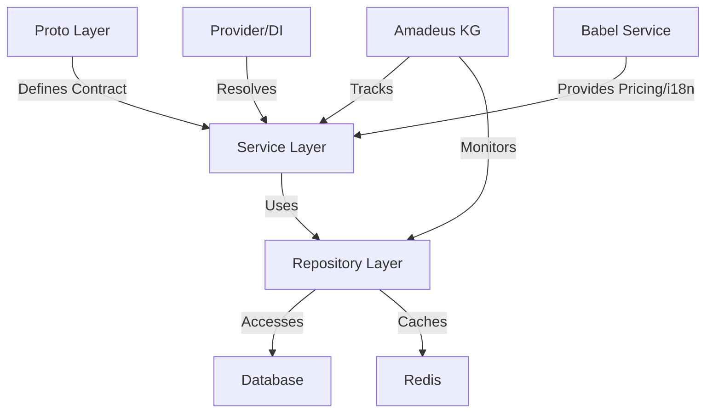

# Amadeus Context & Knowledge Graph

version: 2025-05-31

> **Context:** This is the canonical context and knowledge graph documentation for the OVASABI platform. For architecture and onboarding, see the [README](../../README.md).
>
> **🚧 Work in Progress (WIP):** This file is updated as the system evolves.

> **Note:** Always refer to this Amadeus context and knowledge graph documentation before implementing or updating any service. This ensures all dependencies, capabilities, and integration points are current and consistent across the platform.

## System Definition

Amadeus is the knowledge persistence system for the OVASABI platform, providing a comprehensive and programmatically accessible knowledge graph of all system components and their relationships. It serves as both documentation and a runtime-accessible knowledge repository that evolves with the system.

## Core Services

| Service      | Status | Capabilities                  | Dependencies       | Integration Points    |
| ------------ | ------ | ----------------------------- | ------------------ | --------------------- |
| User         | ✅     | User mgmt, profile, RBAC      | Security           | Notification, Nexus   |
| Notification | ✅     | Multi-channel, templates, real-time, streaming | User               | Nexus      |
| Campaign     | ✅     | Campaign mgmt, analytics      | User, Notification | Nexus                |
| Referral     | ✅     | Referral, rewards, fraud      | User, Notification | Nexus                |
| Security     | ✅     | Policies, audit, compliance   | All services       | Nexus                |
| Content      | ✅     | Articles, micro-posts, video, comments, reactions, FTS | User, Notification, Search, ContentModeration | Nexus, Analytics |
| Commerce     | ✅     | Orders, payments, billing     | User               | Nexus                |
| Localization | ✅     | i18n, translation             | -                  | User, Content        |
| Search       | ✅     | Full-text, fuzzy, entity search | Content, User      | Nexus                |
| Admin        | ✅     | Admin user mgmt, roles, audit | User (via gRPC)    | Security, Nexus      |
| Analytics    | ✅     | Event, usage, reporting       | User, Content      | Nexus                |
| ContentModeration | ✅ | Moderation, compliance        | Content, User      | Nexus                |
| Talent       | ✅     | Talent profiles, bookings     | User               | Nexus                |
| Nexus        | ✅     | Orchestration, patterns       | All services       | Amadeus, All         |

## System Components

- **Knowledge Graph Store** (`amadeus/knowledge_graph.json`): JSON-based data store
- **Knowledge Graph API** (`amadeus/pkg/kg`): Go package for programmatic access
- **CLI Tool** (`amadeus/cmd/kgcli`): Command-line interface for knowledge graph access
- **Nexus Pattern** (`internal/nexus/service/pattern`): Canonical integration with Nexus orchestration
- **Service Hooks** (`amadeus/examples`): Integration points for services
- **Provider/DI Container** (`internal/service/provider.go`): Centralized service registration and dependency injection
- **Babel Service** (`internal/service/babel`): Unified i18n and location-based pricing logic
- **PatternStore** (`internal/nexus/service/pattern_store.go`): Modular pattern registration for all services (canonical path)

## Knowledge Graph Structure

The knowledge graph is structured with these main sections:

- `system_components`: High-level system architecture components
- `repository_structure`: Code organization and structure
- `services`: Service descriptions, capabilities, and relationships
- `nexus`: Nexus orchestration system components
- `patterns`: Pattern descriptions and compositions
- `database_practices`: Database usage patterns and schema information
- `redis_practices`: Redis usage patterns and data structures
- `amadeus_integration`: Self-description of the knowledge graph system
- `service_registration`: Tracks all service registrations, DI relationships, and health/metrics endpoints
- `babel_integration`: Tracks Babel service integration points and pricing/i18n relationships
- `pattern_orchestration`: Tracks all service pattern registrations and orchestration logic

## Service Implementation Pattern

The platform follows a standardized service implementation pattern:



### Layer Components

1. **Proto Layer** (`api/protos/{service}/v0`)
   - Service interface definitions
   - Data model definitions
   - Version control
   - Language-agnostic contracts

2. **Service Layer** (`internal/service/{service}`)
   - Business logic implementation
   - gRPC service handlers
   - Internal service interfaces
   - Error mapping
   - Logging and tracing
   - Registered with Provider/DI container

3. **Repository Layer** (`internal/repository/{service}`)
   - Data access abstraction
   - Cache implementation
   - Transaction handling
   - Error mapping
   - Master-client pattern

## Canonical Error Handling & Graceful Orchestration

All services must use the `graceful` package for robust, context-aware error and success handling:

```go
// Error handling
err := graceful.WrapErr(ctx, codes.Internal, "something failed", cause)
err.StandardOrchestrate(graceful.ErrorOrchestrationConfig{
    Log: logger,
    // Custom audit, alert, fallback hooks
})

// Success handling
success := graceful.WrapSuccess(ctx, codes.OK, "user updated", response, nil)
success.StandardOrchestrate(ctx, graceful.SuccessOrchestrationConfig{
    Log:          logger,
    Cache:        cache,
    CacheKey:     user.ID,
    CacheValue:   response,
    CacheTTL:     10 * time.Minute,
    Metadata:     user.Metadata,
    EventEmitter: eventEmitter,
    EventType:    "user_updated",
    EventID:      user.ID,
    PatternType:  "user",
    PatternID:    user.ID,
    PatternMeta:  user.Metadata,
})
```

## Metadata as System Currency

All services use a unified, extensible `common.Metadata` proto for all metadata fields:

```protobuf
message Metadata {
  google.protobuf.Struct scheduling = 1;         // General scheduling and orchestration fields
  repeated string features = 2;                  // Feature toggles
  google.protobuf.Struct custom_rules = 3;       // Custom rules
  google.protobuf.Struct audit = 4;              // Audit info
  repeated string tags = 5;                      // Tags for search, analytics
  google.protobuf.Struct service_specific = 6;   // Service-specific extensions
  google.protobuf.Struct knowledge_graph = 7;    // For knowledge graph enrichment
}
```

## Integration Methods

Services can integrate with Amadeus via:

1. **Service Hooks**: Used at service startup and during runtime
2. **Nexus Patterns**: For system-wide knowledge operations
3. **CLI Tools**: For manual and CI/CD operations
4. **Webhook API**: For external system integration
5. **Provider/DI Container**: For runtime dependency resolution and modular registration
6. **Babel Service**: For i18n and location-based pricing

## Update Mechanisms

The knowledge graph is kept up-to-date through:

- **Service lifecycle hooks**: Updates during service startup/runtime
- **Provider/DI registration**: Ensures all services are registered and resolved centrally
- **CI/CD integration**: Automated updates during deployments
- **Webhook-based updates**: External system integration
- **Scheduled jobs**: Regular validation and scanning
- **Manual updates**: CLI or direct API updates when needed

## Evolution Tracking

The knowledge graph maintains its own evolution history:

- **Version field**: Explicit version of the knowledge graph format
- **Last updated timestamp**: When the graph was last modified
- **Backups**: Historical versions stored in `amadeus/backups`

## References

For detailed information, see:

- [Service Patterns & Research-Backed Best Practices](service_patterns_and_research.md)
- [Implementation Guide](implementation_guide.md)
- [Integration Examples](integration_examples.md)
- [Architecture Overview](architecture.md)
- [API Reference](api_reference.md)
- [Consistent Update Guide](consistent_updates.md)
- [Service Implementation Pattern](../services/implementation_pattern.md)
- [Service List](../services/service_list.md)
- [Database Tables & Functions Reference](../development/database_tables.md)
