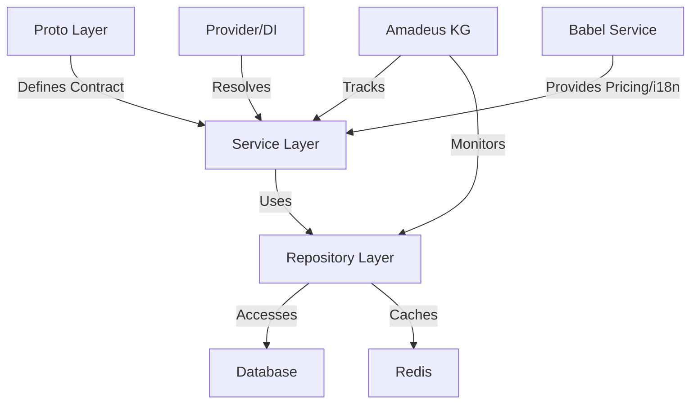

# Amadeus Context File

> **Note:** Always refer to this Amadeus context and knowledge graph documentation before implementing or updating any service. This ensures all dependencies, capabilities, and integration points are current and consistent across the platform.
> **New:** For research-backed best practices and reference architectures for each service, see [Service Patterns & Research-Backed Best Practices](service_patterns_and_research.md). All new and refactored services must follow the patterns, integration points, and extensibility guidelines described there. Use this guide to update the knowledge graph and document all relationships.

> **Database Reference:** For a full list of all tables, functions, and their responsibilities, see [Database Tables & Functions Reference](../development/database_tables.md). This document is tightly integrated with the Amadeus context for system-wide knowledge, impact analysis, and documentation.

This file provides continuous context about the Amadeus Knowledge Graph system for AI assistants
working with the OVASABI platform.

## System Definition

Amadeus is the knowledge persistence system for the OVASABI platform, providing a comprehensive and
programmatically accessible knowledge graph of all system components and their relationships. It
serves as both documentation and a runtime-accessible knowledge repository that evolves with the
system.

## Core Services

| Service      | Status | Capabilities                  | Dependencies       | Integration Points    |
| ------------ | ------ | ----------------------------- | ------------------ | --------------------- |
| User         | ✅     | User mgmt, profile, RBAC      | Security           | Notification, Nexus   |
| Notification | ✅     | Multi-channel, templates, real-time, streaming | User               | Nexus      |
| Campaign     | ✅     | Campaign mgmt, analytics      | User, Notification | Nexus                |
| Referral     | ✅     | Referral, rewards, fraud      | User, Notification | Nexus                |
| Security     | ✅     | Policies, audit, compliance   | All services       | Nexus                |
| Content      | ✅     | Articles, micro-posts, video, comments, reactions, FTS | User, Notification, Search, ContentModeration | Nexus, Analytics |
| Commerce     | ✅     | Orders, payments, billing     | User               | Nexus                |
| Localization | ✅     | i18n, translation             | -                  | User, Content        |
| Search       | ✅     | Full-text, fuzzy, entity search | Content, User      | Nexus                |
| Admin        | ✅     | Admin user mgmt, roles, audit | User (via gRPC)    | Security, Nexus      |
| Analytics    | ✅     | Event, usage, reporting       | User, Content      | Nexus                |
| ContentModeration | ✅ | Moderation, compliance        | Content, User      | Nexus                |
| Talent       | ✅     | Talent profiles, bookings     | User               | Nexus                |
| Nexus        | ✅     | Orchestration, patterns       | All services       | Amadeus, All         |

## Core Capabilities

- **Self-documenting architecture**: System components register their capabilities automatically
- **Knowledge persistence**: Maintains a persistent, evolving model of the system
- **Programmatic accessibility**: Makes system knowledge accessible to both humans and services
- **Impact analysis**: Identifies affected components before changes
- **Architectural compliance**: Enforces architectural principles
- **Visualization generation**: Auto-generates visual representations from system knowledge
- **Decision intelligence**: Provides insights for architectural decisions
- **Centralized service registration**: All services are registered and resolved via a central
  Provider using a DI container, ensuring modular, single registration and easy dependency
  management.
- **Health and metrics**: All services expose health and metrics endpoints, managed centrally for
  observability and monitoring.
- **Babel service integration**: The Babel service provides i18n and dynamic, location-based pricing
  rules, and is integrated with Quotes, Finance, Campaign, and other services.
- **Pattern orchestration**: All services are registered as patterns in Nexus for orchestration, introspection, and automation.

## Campaign Scaffolding & Documentation Workflow

To ensure rapid, consistent, and reproducible campaign launches, the OVASABI platform uses a standardized campaign scaffolding and documentation workflow:

- **Numbered Campaign Files:** All campaign documentation must be created as a numbered file in `docs/campaign/` (e.g., `001_ovasabi_website.md`, `002_new_campaign.md`). This ensures clear versioning, ordering, and reproducibility.
- **Documentation Requirements:** Each campaign file must include:
  1. Overview and user stories
  2. Required backend functionality and service responsibilities
  3. Frontend-backend communication patterns (REST, WebSocket/SSE, gRPC)
  4. Extensibility and reproducibility notes
  5. Implementation notes and next steps
  6. Campaign-specific API endpoints and event types
  7. Mapping to existing services and identification of new requirements
- **Scaffolding Steps:**
  1. Define campaign requirements and document in a new numbered file
  2. Map features to services and identify new event types
  3. Design and document APIs and event payloads
  4. Add campaign metadata and rules to CampaignService
  5. Integrate frontend with APIs and real-time events
  6. Test, monitor, and review
  7. Update Amadeus context and knowledge graph with new campaign and relationships
- **Reference Example:** See [001_ovasabi_website.md](../campaign/001_ovasabi_website.md) for a complete, production-ready campaign documentation example.
- **Amadeus Context Integration:** All new campaigns must be referenced in this context file and the knowledge graph, with relationships and dependencies updated accordingly.

For more details and the latest campaign scaffolding best practices, always refer to the numbered campaign files in `docs/campaign/` and this Amadeus context.

## System Components

- **Knowledge Graph Store** (`amadeus/knowledge_graph.json`): JSON-based data store
- **Knowledge Graph API** (`amadeus/pkg/kg`): Go package for programmatic access
- **CLI Tool** (`amadeus/cmd/kgcli`): Command-line interface for knowledge graph access
- **Nexus Pattern** (`amadeus/nexus/pattern`): Integration with Nexus orchestration
- **Service Hooks** (`amadeus/examples`): Integration points for services
- **Provider/DI Container** (`internal/service/provider.go`): Centralized service registration and
  dependency injection
- **Babel Service** (`internal/service/babel`): Unified i18n and location-based pricing logic
- **PatternStore** (`internal/nexus/service/pattern_store.go`): Modular pattern registration for all services

## Knowledge Graph Structure

The knowledge graph is structured with these main sections:

- `system_components`: High-level system architecture components
- `repository_structure`: Code organization and structure
- `services`: Service descriptions, capabilities, and relationships
- `nexus`: Nexus orchestration system components
- `patterns`: Pattern descriptions and compositions
- `database_practices`: Database usage patterns and schema information
- `redis_practices`: Redis usage patterns and data structures
- `amadeus_integration`: Self-description of the knowledge graph system
- `service_registration`: Tracks all service registrations, DI relationships, and health/metrics
  endpoints
- `babel_integration`: Tracks Babel service integration points and pricing/i18n relationships
- `pattern_orchestration`: Tracks all service pattern registrations and orchestration logic

For advanced configuration and implementation details, see the
[Super Knowledge Graph Configuration](super_knowledge_graph.md) and
[Implementation Guide](implementation_guide.md).

## Service Implementation Pattern

The platform follows a standardized service implementation pattern:



### Layer Components

1. **Proto Layer** (`api/protos/{service}/v0`)

   - Service interface definitions
   - Data model definitions
   - Version control
   - Language-agnostic contracts

2. **Service Layer** (`internal/service/{service}`)

   - Business logic implementation
   - gRPC service handlers
   - Internal service interfaces
   - Error mapping
   - Logging and tracing
   - Registered with Provider/DI container

3. **Repository Layer** (`internal/repository/{service}`)
   - Data access abstraction
   - Cache implementation
   - Transaction handling
   - Error mapping
   - Master-client pattern

### Service Registration

Services must register with Amadeus and the Provider/DI container:

```go
type ServiceRegistration struct {
    Name         string           `json:"name"`
    Version      string           `json:"version"`
    Capabilities []string         `json:"capabilities"`
    Dependencies []string         `json:"dependencies"`
    Schema       *ServiceSchema   `json:"schema"`
    Endpoints    []EndpointInfo   `json:"endpoints"`
    Models       []ModelInfo      `json:"models"`
    HealthCheck  string           `json:"health_check"`
    Metrics      string           `json:"metrics"`
}
```

### Service Evolution

Services maintain their evolution history in Amadeus:

- Version tracking
- Capability changes
- Breaking changes
- Migration paths
- Impact analysis

## Integration Methods

Services can integrate with Amadeus via:

1. **Service Hooks**: Used at service startup and during runtime
2. **Nexus Patterns**: For system-wide knowledge operations
3. **CLI Tools**: For manual and CI/CD operations
4. **Webhook API**: For external system integration
5. **Provider/DI Container**: For runtime dependency resolution and modular registration
6. **Babel Service**: For i18n and location-based pricing

## Update Mechanisms

The knowledge graph is kept up-to-date through:

- **Service lifecycle hooks**: Updates during service startup/runtime
- **Provider/DI registration**: Ensures all services are registered and resolved centrally
- **CI/CD integration**: Automated updates during deployments
- **Webhook-based updates**: External system integration
- **Scheduled jobs**: Regular validation and scanning
- **Manual updates**: CLI or direct API updates when needed

## AI & Data Science Integration

Amadeus enables:

- **Machine Learning Foundation**: Structured knowledge for AI model training
- **Decision Support Systems**: AI-assisted architectural decisions
- **Anomaly Detection**: Identifying architectural anomalies
- **Pattern Recognition**: Data analysis to identify architectural patterns
- **Evolution Tracking**: Historical analysis of system changes
- **Technical Debt Quantification**: Statistical analysis to identify refactoring needs

## Development State

- **Core Components**: Knowledge Graph Store, API, and CLI tool implemented
- **Integration Points**: Service Hooks, Provider/DI, Babel, and Nexus Pattern available
- **Documentation**: Implementation guide, integration examples, and architecture docs complete
- **Visualization**: Mermaid-based diagram generation implemented
- **Service Pattern**: Standardized implementation pattern established

## Evolution Tracking

The knowledge graph maintains its own evolution history:

- **Version field**: Explicit version of the knowledge graph format
- **Last updated timestamp**: When the graph was last modified
- **Backups**: Historical versions stored in `amadeus/backups`
- **Service implementations**: Tracks service implementation patterns
- **Provider/DI registration**: Tracks all service registrations and relationships
- **Babel integration**: Tracks all pricing/i18n relationships

## Implementation Status

- Basic implementation complete
- Service hooks functional
- CLI tool available
- Nexus and Provider/DI integration established
- Babel service integrated
- Documentation published
- Backup system set up
- Service pattern documented

## Usage Guidelines

1. Services should register with Amadeus and the Provider/DI container at startup
2. Service capabilities and dependencies should be tracked
3. CI/CD pipelines should validate knowledge graph consistency
4. Pattern implementations should be documented in the graph
5. Impact analysis should be performed before major changes
6. Follow standardized service implementation pattern
7. Integrate with Babel for i18n and pricing where relevant
8. Expose health and metrics endpoints for observability

## Future Development

- Real-time knowledge graph updates via event streams
- AI-assisted system analysis
- Specialized knowledge graph query language
- Advanced visualization capabilities
- System evolution tracking and prediction
- Automated service pattern compliance checking
- Deeper Babel integration for global pricing and localization

## Continuous Knowledge Graph Updates

The knowledge graph is continuously updated through multiple mechanisms to ensure it remains
accurate and valuable:

1. **Real-time Updates**

   - Service registration hooks trigger immediate graph updates
   - Provider/DI registration ensures all services are tracked
   - Event-driven updates based on system changes
   - Automatic schema and capability detection

2. **Batch Processing**

   - Scheduled validation jobs verify graph consistency
   - Periodic scans for new patterns and relationships
   - Historical analysis for evolution tracking

3. **Integration Points**

   ```mermaid
   graph TD
       A[Service Events] -->|Real-time| B[Knowledge Graph]
       C[CI/CD Pipeline] -->|Deployment| B
       D[Code Analysis] -->|Pattern Detection| B
       E[Manual Updates] -->|Curator API| B
       F[External Systems] -->|Webhook API| B
       G[Provider/DI] -->|Service Registration| B
       H[Babel Service] -->|Pricing/i18n| B
   ```

4. **Update Validation**

   - Pre-update validation ensures graph consistency
   - Post-update verification confirms relationships
   - Automatic backup creation before major changes

5. **Neural-Symbolic Integration**

   - Continuous learning from system behavior
   - Pattern recognition for new relationships
   - Automated suggestion of graph improvements

6. **Service-Level Updates**

   ```go
   type ServiceUpdate struct {
       ServiceID    string           `json:"service_id"`
       UpdateType   string           `json:"update_type"`
       Capabilities []string         `json:"capabilities"`
       Schema       *ServiceSchema   `json:"schema"`
       Timestamp    time.Time        `json:"timestamp"`
   }
   ```

7. **Pattern Detection**

   - Automated scanning for new implementation patterns
   - Relationship inference from service interactions
   - Usage pattern analysis for optimization

8. **Version Control Integration**

   - Git hooks for documentation updates
   - PR validation for graph consistency
   - Automatic documentation generation

9. **External System Integration**
   - Webhook API for third-party updates
   - Event stream processing
   - Batch import capabilities

### Update Policies

1. **Consistency Rules**

   - All updates must maintain graph consistency
   - Version tracking for all changes
   - Rollback capability for failed updates

2. **Access Control**

   - Role-based update permissions
   - Audit logging for all changes
   - Change approval workflows for major updates

3. **Performance Considerations**

   - Batching of minor updates
   - Async processing for non-critical changes
   - Cache invalidation strategies

4. **Backup Strategy**
   - Automatic backups before updates
   - Historical version retention
   - Point-in-time recovery capability

For detailed implementation of advanced querying, perspective-aware AI systems, and language model
integration, refer to the [Super Knowledge Graph Configuration](super_knowledge_graph.md).

## References

For detailed information, see:

- [Service Patterns & Research-Backed Best Practices](service_patterns_and_research.md)
- [Implementation Guide](implementation_guide.md)
- [Integration Examples](integration_examples.md)
- [Architecture Overview](architecture.md)
- [API Reference](api_reference.md)
- [Consistent Update Guide](consistent_updates.md)
- [Service Implementation Pattern](../services/implementation_pattern.md)
- [Service List](../services/service_list.md)
- [Database Tables & Functions Reference](../development/database_tables.md)
- [Campaign Scaffolding & Documentation Workflow](#campaign-scaffolding--documentation-workflow)
- [Ovasabi Website Campaign Example](../campaign/001_ovasabi_website.md)

## Build and Development Commands

The project includes a comprehensive Makefile that provides standardized commands for development,
testing, and deployment. Here are the key command categories:

### Core Development Commands

```makefile
# Setup and Installation
setup              # Sets up development environment
install-tools      # Installs required Go tools
deps              # Installs additional dependencies

# Build and Development
build             # Builds the binary with proto generation
dev               # Runs the server in development mode
clean             # Cleans build artifacts

# Testing
test              # Runs all tests (unit + integration)
test-unit         # Runs only unit tests
test-integration  # Runs integration tests
coverage          # Generates test coverage report
```

### Code Quality and Documentation

```makefile
# Linting
lint              # Full linting suite
lint-focused      # Excludes backup files and amadeus utilities
lint-safe         # Completely excludes amadeus directory

# Documentation
docs-format       # Formats documentation
docs-validate     # Validates documentation
docs-serve        # Serves documentation locally
docs-deploy-github # Deploys to GitHub Pages
```

### Container and Deployment

```makefile
# Docker Operations
docker-build      # Builds Docker images
docker-up         # Starts containers
docker-down       # Stops containers
docker-logs       # Shows container logs
docker-clean      # Removes containers and volumes

# Security Scanning
trivy-scan        # Vulnerability scanning
trivy-scan-ci     # CI/CD vulnerability checks

# Kubernetes Deployment
k8s-deploy        # Deploys to Kubernetes
k8s-status        # Shows deployment status
```

## Database Table Naming Convention

For all new and existing services, the following naming convention must be used for database tables:

- **Pattern:** `service_{service}_{entity}`
- **Examples:**
  - `service_user_master`
  - `service_admin_user`
  - `service_content_main`
  - `service_referral_main`
  - `service_commerce_order`
  - `service_analytics_event`

This ensures clarity, modularity, and analytics-readiness across the platform. All migrations, repository code, and documentation must reference tables using this convention.

For full details and rationale, see [Database Table Naming & Migration Best Practices](../development/database_table_naming.md).

## Repository and Data Management Best Practices

For a detailed explanation of the repository pattern, master-client-service-event architecture, and advanced strategies for archiving, partitioning, and analytics, see:
- [Master-Client-Service-Event Pattern: Repository Architecture & Best Practices](../architecture/master_client_event_pattern.md)
- [Database Practices: Advanced Strategies](../development/database_practices.md)

These documents cover:
- Automated archiving and partitioning
- Retention policies and cold storage
- Data lake integration and export
- Immutable audit/event logging
- Monitoring, index review, and documentation automation

## Standard: Provider/DI Registration Pattern File Comment

All new service/provider files must begin with a comment block describing the Provider/DI registration pattern, following this standard:

```
Provider/DI Registration Pattern (Modern, Extensible, DRY)
---------------------------------------------------------

This file implements the centralized Provider pattern for service registration and dependency injection (DI) across the platform. It ensures all services are registered, resolved, and composed in a DRY, maintainable, and extensible way.

Key Features:
- **Centralized Service Registration:** All gRPC services are registered with a DI container, ensuring single-point, modular registration and easy dependency management.
- **Repository & Cache Integration:** Each service can specify its repository constructor and (optionally) a cache name for Redis-backed caching.
- **Multi-Dependency Support:** Services with multiple or cross-service dependencies (e.g., ContentService, NotificationService) use custom registration functions to resolve all required dependencies from the DI container.
- **Extensible Pattern:** To add a new service, define its repository and (optionally) cache, then add a registration entry. For complex dependencies, use a custom registration function.
- **Consistent Error Handling:** All registration errors are logged and wrapped for traceability.
- **Self-Documenting:** The registration pattern is discoverable and enforced as a standard for all new services.

Standard for New Service/Provider Files:
1. Document the registration pattern and DI approach at the top of the file.
2. Describe how to add new services, including repository, cache, and dependency resolution.
3. Note any special patterns for multi-dependency or cross-service orchestration.
4. Ensure all registration and error handling is consistent and logged.
5. Reference this comment as the standard for all new service/provider files.
```

This comment block must be present and up-to-date in all new and refactored service/provider files. It serves as the canonical documentation for the Provider/DI pattern in the OVASABI platform.

## Standard: Performance Review Process & Continuous Evolution

### Purpose
To ensure the OVASABI platform remains performant, scalable, and robust, a standardized performance review process must be followed. This process is both technical (code, database, infrastructure) and procedural (continuous improvement, feedback, and automation).

### Performance Review Checklist

1. **Static Code Analysis**
   - Run linters and static analysis tools (e.g., gosec, revive, errcheck).
   - Identify anti-patterns (N+1 queries, full scans, unbounded goroutines, etc.).
   - Check for unchecked errors, resource leaks, and concurrency issues.

2. **Database & Query Efficiency**
   - Review schema, indexes, and migrations for optimal design.
   - Ensure queries use indexes and avoid full table scans.
   - Audit counting strategies (prefer increment/decrement counters over full scans).
   - Check for partitioning, archiving, and extension usage (e.g., pg_trgm).

3. **Caching & Data Access**
   - Verify use of Redis or other caches for hot data and counters.
   - Review cache invalidation and consistency strategies.

4. **Service & Dependency Injection**
   - Ensure DI/Provider patterns are followed for efficient service registration and resolution.
   - Audit cross-service calls for efficiency and asynchronicity where possible.

5. **Observability & Metrics**
   - Confirm all services expose health and metrics endpoints.
   - Review logging for structure, context, and traceability.
   - Ensure error wrapping and propagation is consistent.

6. **Scalability & Extensibility**
   - Check for statelessness and readiness for horizontal scaling.
   - Ensure code is modular, DRY, and easily extensible.

7. **Documentation & Onboarding**
   - Ensure all standards, patterns, and review processes are documented and discoverable.
   - Keep the Amadeus context and knowledge graph up-to-date.

8. **Automated Testing & CI/CD**
   - Review test coverage and critical path tests.
   - Ensure CI/CD pipelines enforce linting, testing, and deployment standards.

### Continuous Evolution of the Performance Review Process

- **Feedback Loops:** After each review, document lessons learned and update this standard with new checks, tools, or patterns.
- **Tooling Updates:** Regularly evaluate and integrate new static analysis, profiling, and monitoring tools.
- **Knowledge Graph Integration:** All performance review findings and improvements should be reflected in the Amadeus context and knowledge graph for system-wide visibility.
- **Automation:** Where possible, automate checks and integrate them into CI/CD pipelines.
- **Community & Team Input:** Encourage engineers to propose additions or changes to the review process based on real-world experience.
- **Versioning:** Track changes to the performance review standard and maintain an evolution history.

### How to Update This Process
1. Propose a change or addition (e.g., new tool, new check, new best practice).
2. Document the rationale and expected impact.
3. Update this section in the Amadeus context and notify the team.
4. Integrate the change into review checklists, automation, and onboarding materials.
5. Periodically review the process for relevance and effectiveness.

**This standard ensures that performance reviews are not static, but continuously evolve with the platform, technology, and team experience.**

## Standard: Robust Metadata Pattern for Extensible Services

### Overview
The Metadata pattern provides a unified, extensible structure for attaching rich, structured, and service-specific information to any entity (campaign, content, user, etc.). It is implemented as a `Metadata` message in all service protos, using `google.protobuf.Struct` for flexibility and future-proofing. This pattern enables:
- Dynamic orchestration and introspection via Nexus
- Rich, queryable nodes and edges in the knowledge graph
- Contextual, data-rich inputs for AI/ML
- Consistent, high-performance storage via Postgres `jsonb`

### Metadata Structure

```
syntax = "proto3";
package common;

import "google/protobuf/struct.proto";

message Metadata {
  google.protobuf.Struct scheduling = 1;         // General scheduling and orchestration fields
  repeated string features = 2;                  // Feature toggles (e.g., ["referral", "notification"])
  google.protobuf.Struct custom_rules = 3;       // Custom rules (e.g., {max_referrals: 10})
  google.protobuf.Struct audit = 4;              // Audit info (created_by, history, etc.)
  repeated string tags = 5;                      // Tags for search, analytics, etc.
  google.protobuf.Struct service_specific = 6;   // Service-specific extensions (e.g., {"content": {...}})
  google.protobuf.Struct knowledge_graph = 7;    // For knowledge graph enrichment
}
```

### Shared/General Fields
- **scheduling:** Start/end times, reminders, cron expressions
- **features:** List of enabled features for orchestration
- **custom_rules:** Arbitrary rules for business logic
- **audit:** Created by, last modified by, change history
- **tags:** For search, analytics, and grouping

### Service-Specific Extensions
- **service_specific:**
  - Each service can define and document its own fields under a namespaced key (e.g., `content`, `commerce`, `notification`).
  - Example: `metadata.service_specific.content.editor_mode = "richtext"`

### Usage Pattern
- All core entities in service protos use `Metadata metadata` instead of `map<string, string> metadata`.
- When storing in Postgres, metadata is mapped to a `jsonb` column for efficient querying and indexing.
- Services use shared helpers to extract, validate, and manipulate both general and service-specific fields.

### Knowledge Graph & Nexus Integration
- Metadata fields are ingested into the knowledge graph, enriching nodes and edges for advanced queries and impact analysis.
- Nexus uses metadata to dynamically orchestrate services, schedule jobs, and enable/disable features based on context.

### AI/ML Enablement
- Metadata provides rich, contextual features for AI/ML models (personalization, anomaly detection, recommendations, etc.).
- Enables explainable AI by tracing which metadata fields influenced decisions.

### Performance
- Use Postgres `jsonb` with GIN/partial indexes for efficient storage and querying.
- Cache hot metadata in Redis for low-latency access.
- Parse only relevant fields in service logic to minimize overhead.

### Developer Guidance
- Always use the shared `Metadata` message for extensible properties.
- Document any service-specific fields in your service's proto and onboarding docs.
- Use shared helpers for extracting and validating metadata fields.
- Keep metadata schemas up-to-date in the Amadeus context and knowledge graph.

### Example: Service-Specific Extension
```
// In content service:
metadata.service_specific["content"].editor_mode = "richtext"
// In commerce service:
metadata.service_specific["commerce"].payment_window = "24h"
```

### Migration Notes
- **Update all service protos** to import and use `common.Metadata`.
- **Update repositories and DB migrations** to store metadata as `jsonb` and add necessary indexes.
- **Update scheduling logic** to use the `scheduling` field and integrate with triggers and the Scheduler service.
- **Update documentation and onboarding guides** to reference the canonical pattern.

## Canonical Metadata Integration Pattern (System-Wide)

All services in OVASABI now use a single, extensible `common.Metadata` proto for all metadata fields. This enables:
- Consistent, high-performance storage (Postgres `jsonb`)
- Rich orchestration (Scheduler, Nexus)
- Knowledge graph enrichment
- Redis caching for hot metadata

### Integration Points
- **Redis:** Cache hot metadata for low-latency access using `CacheMetadata` and `GetCachedMetadata` helpers.
- **Scheduler:** Use the `scheduling` field in metadata to register jobs and orchestrate time-based actions. Use `RegisterSchedule` helper after create/update.
- **Knowledge Graph:** Enrich nodes/edges with metadata using `EnrichKnowledgeGraph` helper.
- **Nexus:** Register service patterns and metadata for orchestration using `RegisterWithNexus` helper.

### Implementation Pattern
After a successful create/update operation in any service:
```go
if s.Cache != nil && entity.Metadata != nil {
    _ = pattern.CacheMetadata(ctx, s.Cache, "entity_type", entity.Id, entity.Metadata, 10*time.Minute)
}
_ = pattern.RegisterSchedule(ctx, "entity_type", entity.Id, entity.Metadata)
_ = pattern.EnrichKnowledgeGraph(ctx, "entity_type", entity.Id, entity.Metadata)
_ = pattern.RegisterWithNexus(ctx, "entity_type", entity.Metadata)
```

### Scheduler Example
When scheduling a job, extract scheduling info from metadata:
```go
if job.Metadata != nil && job.Metadata.Scheduling != nil {
    _ = pattern.RegisterSchedule(ctx, "job", job.Id, job.Metadata)
}
```

### Onboarding Guidance
- Always use `common.Metadata` for extensible fields in protos and models.
- Document any service-specific fields under `service_specific` in your proto and onboarding docs.
- Use the shared helpers in `internal/service/pattern/metadata_pattern.go` for all integration points.
- Keep this context and the knowledge graph up-to-date with new fields and integration points.

For more, see `internal/service/pattern/metadata_pattern.go` and service implementation files.

## Real-Time Communication & WebSocket Management (2024)

The platform now implements a robust, production-grade WebSocket management pattern:
- **Per-client buffered outgoing channels**: Each WebSocket connection has its own buffered channel and write goroutine, ensuring slow clients do not block broadcasts.
- **Frame dropping for slow clients**: If a client's buffer is full, new frames are dropped and a warning is logged.
- **Dynamic broadcast frequency**: Each campaign can specify its own frequency via `metadata.scheduling.frequency` (default 1Hz).
- **Logging and monitoring**: All dropped frames and client disconnects are logged for observability.
- **Batching/compression and profiling hooks**: The system is designed for future extension with batching, compression, and resource profiling.
- **Extensible for multi-campaign, database-driven state**: The architecture supports loading campaigns from the database, starting/stopping broadcast goroutines per campaign, and dynamic campaign/user management.
- **Horizontal scaling ready**: The pattern is compatible with sharding, pub/sub, and distributed state for large-scale deployments.

### Servers and Endpoints
- **REST/WebSocket server**: Port 8090 (see Docker Compose for port exposure)
- **gRPC server**: Port 8080
- **Metrics server**: Port 9090

### Integration Pattern
- Campaigns can be loaded from the database at startup or dynamically.
- For each campaign, a broadcast goroutine is started using the campaign's metadata for frequency and settings.
- State updates can be driven by database changes, events, or other services.
- See `internal/server/websocket.go` for the canonical implementation.

### Available Services
- **User, Notification, Campaign, Referral, Security, Content, Commerce, Localization, Search, Admin, Analytics, ContentModeration, Talent, Nexus** (see Service List)
- **WebSocket endpoints**: `/ws/{campaign_id}/{user_id}`
- **REST endpoints**: `/api/...` (see OpenAPI/REST docs)
- **gRPC endpoints**: See proto definitions in `api/protos/`
- **Metrics endpoint**: `/metrics` on port 9090

**This standard is required for all new and refactored real-time/broadcast services.**