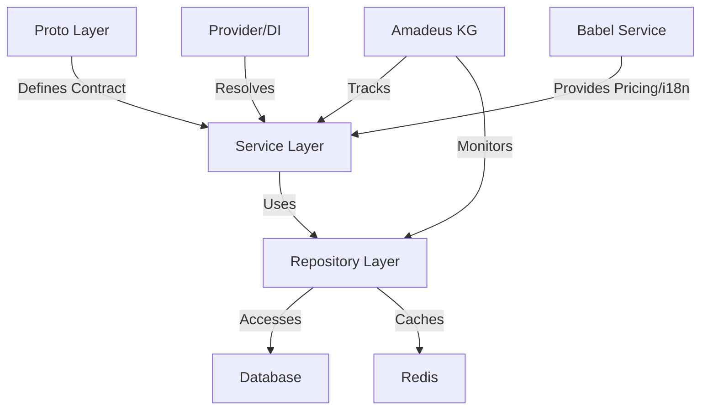
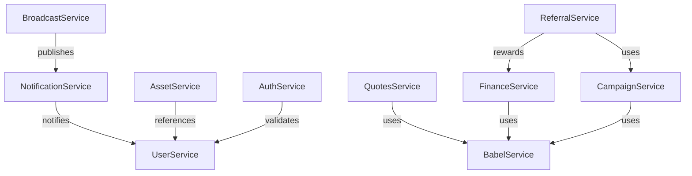
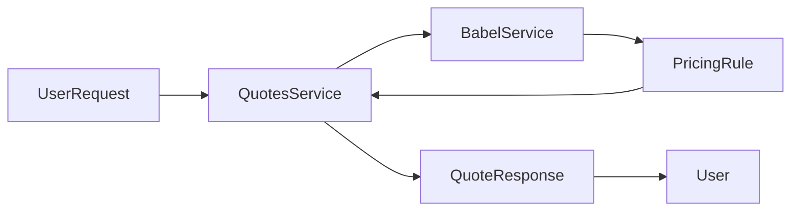

# Amadeus Context File

This file provides continuous context about the Amadeus Knowledge Graph system for AI assistants
working with the OVASABI platform.

## System Definition

Amadeus is the knowledge persistence system for the OVASABI platform, providing a comprehensive and
programmatically accessible knowledge graph of all system components and their relationships. It
serves as both documentation and a runtime-accessible knowledge repository that evolves with the
system.

## Core Capabilities

- **Self-documenting architecture**: System components register their capabilities automatically
- **Knowledge persistence**: Maintains a persistent, evolving model of the system
- **Programmatic accessibility**: Makes system knowledge accessible to both humans and services
- **Impact analysis**: Identifies affected components before changes
- **Architectural compliance**: Enforces architectural principles
- **Visualization generation**: Auto-generates visual representations from system knowledge
- **Decision intelligence**: Provides insights for architectural decisions
- **Centralized service registration**: All services are registered and resolved via a central Provider using a DI container, ensuring modular, single registration and easy dependency management.
- **Health and metrics**: All services expose health and metrics endpoints, managed centrally for observability and monitoring.
- **Babel service integration**: The Babel service provides i18n and dynamic, location-based pricing rules, and is integrated with Quotes, Finance, and Campaign services.

## System Components

- **Knowledge Graph Store** (`amadeus/knowledge_graph.json`): JSON-based data store
- **Knowledge Graph API** (`amadeus/pkg/kg`): Go package for programmatic access
- **CLI Tool** (`amadeus/cmd/kgcli`): Command-line interface for knowledge graph access
- **Nexus Pattern** (`amadeus/nexus/pattern`): Integration with Nexus orchestration
- **Service Hooks** (`amadeus/examples`): Integration points for services
- **Provider/DI Container** (`internal/service/provider.go`): Centralized service registration and dependency injection
- **Babel Service** (`internal/service/babel`): Unified i18n and location-based pricing logic

## Knowledge Graph Structure

The knowledge graph is structured with these main sections:

- `system_components`: High-level system architecture components
- `repository_structure`: Code organization and structure
- `services`: Service descriptions, capabilities, and relationships
- `nexus`: Nexus orchestration system components
- `patterns`: Pattern descriptions and compositions
- `database_practices`: Database usage patterns and schema information
- `redis_practices`: Redis usage patterns and data structures
- `amadeus_integration`: Self-description of the knowledge graph system
- `service_registration`: Tracks all service registrations, DI relationships, and health/metrics endpoints
- `babel_integration`: Tracks Babel service integration points and pricing/i18n relationships

For advanced configuration and implementation details, see the
[Super Knowledge Graph Configuration](super_knowledge_graph.md) and
[Implementation Guide](implementation_guide.md).

## Service Implementation Pattern

The platform follows a standardized service implementation pattern:



### Layer Components

1. **Proto Layer** (`api/protos/{service}/v0`)

   - Service interface definitions
   - Data model definitions
   - Version control
   - Language-agnostic contracts

2. **Service Layer** (`internal/service/{service}`)

   - Business logic implementation
   - gRPC service handlers
   - Internal service interfaces
   - Error mapping
   - Logging and tracing
   - Registered with Provider/DI container

3. **Repository Layer** (`internal/repository/{service}`)
   - Data access abstraction
   - Cache implementation
   - Transaction handling
   - Error mapping
   - Master-client pattern

### Service Registration

Services must register with Amadeus and the Provider/DI container:

```go
type ServiceRegistration struct {
    Name         string           `json:"name"`
    Version      string           `json:"version"`
    Capabilities []string         `json:"capabilities"`
    Dependencies []string         `json:"dependencies"`
    Schema       *ServiceSchema   `json:"schema"`
    Endpoints    []EndpointInfo   `json:"endpoints"`
    Models       []ModelInfo      `json:"models"`
    HealthCheck  string           `json:"health_check"`
    Metrics      string           `json:"metrics"`
}
```

### Service Evolution

Services maintain their evolution history in Amadeus:

- Version tracking
- Capability changes
- Breaking changes
- Migration paths
- Impact analysis

## Integration Methods

Services can integrate with Amadeus via:

1. **Service Hooks**: Used at service startup and during runtime
2. **Nexus Patterns**: For system-wide knowledge operations
3. **CLI Tools**: For manual and CI/CD operations
4. **Webhook API**: For external system integration
5. **Provider/DI Container**: For runtime dependency resolution and modular registration
6. **Babel Service**: For i18n and location-based pricing

## Update Mechanisms

The knowledge graph is kept up-to-date through:

- **Service lifecycle hooks**: Updates during service startup/runtime
- **Provider/DI registration**: Ensures all services are registered and resolved centrally
- **CI/CD integration**: Automated updates during deployments
- **Webhook-based updates**: External system integration
- **Scheduled jobs**: Regular validation and scanning
- **Manual updates**: CLI or direct API updates when needed

## AI & Data Science Integration

Amadeus enables:

- **Machine Learning Foundation**: Structured knowledge for AI model training
- **Decision Support Systems**: AI-assisted architectural decisions
- **Anomaly Detection**: Identifying architectural anomalies
- **Pattern Recognition**: Data analysis to identify architectural patterns
- **Evolution Tracking**: Historical analysis of system changes
- **Technical Debt Quantification**: Statistical analysis to identify refactoring needs

## Development State

- **Core Components**: Knowledge Graph Store, API, and CLI tool implemented
- **Integration Points**: Service Hooks, Provider/DI, Babel, and Nexus Pattern available
- **Documentation**: Implementation guide, integration examples, and architecture docs complete
- **Visualization**: Mermaid-based diagram generation implemented
- **Service Pattern**: Standardized implementation pattern established

## Evolution Tracking

The knowledge graph maintains its own evolution history:

- **Version field**: Explicit version of the knowledge graph format
- **Last updated timestamp**: When the graph was last modified
- **Backups**: Historical versions stored in `amadeus/backups`
- **Service implementations**: Tracks service implementation patterns
- **Provider/DI registration**: Tracks all service registrations and relationships
- **Babel integration**: Tracks all pricing/i18n relationships

## Implementation Status

- Basic implementation complete
- Service hooks functional
- CLI tool available
- Nexus and Provider/DI integration established
- Babel service integrated
- Documentation published
- Backup system set up
- Service pattern documented

## Usage Guidelines

1. Services should register with Amadeus and the Provider/DI container at startup
2. Service capabilities and dependencies should be tracked
3. CI/CD pipelines should validate knowledge graph consistency
4. Pattern implementations should be documented in the graph
5. Impact analysis should be performed before major changes
6. Follow standardized service implementation pattern
7. Integrate with Babel for i18n and pricing where relevant
8. Expose health and metrics endpoints for observability

## Future Development

- Real-time knowledge graph updates via event streams
- AI-assisted system analysis
- Specialized knowledge graph query language
- Advanced visualization capabilities
- System evolution tracking and prediction
- Automated service pattern compliance checking
- Deeper Babel integration for global pricing and localization

## Continuous Knowledge Graph Updates

The knowledge graph is continuously updated through multiple mechanisms to ensure it remains
accurate and valuable:

1. **Real-time Updates**

   - Service registration hooks trigger immediate graph updates
   - Provider/DI registration ensures all services are tracked
   - Event-driven updates based on system changes
   - Automatic schema and capability detection

2. **Batch Processing**

   - Scheduled validation jobs verify graph consistency
   - Periodic scans for new patterns and relationships
   - Historical analysis for evolution tracking

3. **Integration Points**

   ```mermaid
   graph TD
       A[Service Events] -->|Real-time| B[Knowledge Graph]
       C[CI/CD Pipeline] -->|Deployment| B
       D[Code Analysis] -->|Pattern Detection| B
       E[Manual Updates] -->|Curator API| B
       F[External Systems] -->|Webhook API| B
       G[Provider/DI] -->|Service Registration| B
       H[Babel Service] -->|Pricing/i18n| B
   ```

4. **Update Validation**

   - Pre-update validation ensures graph consistency
   - Post-update verification confirms relationships
   - Automatic backup creation before major changes

5. **Neural-Symbolic Integration**

   - Continuous learning from system behavior
   - Pattern recognition for new relationships
   - Automated suggestion of graph improvements

6. **Service-Level Updates**

   ```go
   type ServiceUpdate struct {
       ServiceID    string           `json:"service_id"`
       UpdateType   string           `json:"update_type"`
       Capabilities []string         `json:"capabilities"`
       Schema       *ServiceSchema   `json:"schema"`
       Timestamp    time.Time        `json:"timestamp"`
   }
   ```

7. **Pattern Detection**

   - Automated scanning for new implementation patterns
   - Relationship inference from service interactions
   - Usage pattern analysis for optimization

8. **Version Control Integration**

   - Git hooks for documentation updates
   - PR validation for graph consistency
   - Automatic documentation generation

9. **External System Integration**
   - Webhook API for third-party updates
   - Event stream processing
   - Batch import capabilities

### Update Policies

1. **Consistency Rules**

   - All updates must maintain graph consistency
   - Version tracking for all changes
   - Rollback capability for failed updates

2. **Access Control**

   - Role-based update permissions
   - Audit logging for all changes
   - Change approval workflows for major updates

3. **Performance Considerations**

   - Batching of minor updates
   - Async processing for non-critical changes
   - Cache invalidation strategies

4. **Backup Strategy**
   - Automatic backups before updates
   - Historical version retention
   - Point-in-time recovery capability

For detailed implementation of advanced querying, perspective-aware AI systems, and language model
integration, refer to the [Super Knowledge Graph Configuration](super_knowledge_graph.md).

## References

For detailed information, see:

- [Implementation Guide](implementation_guide.md)
- [Integration Examples](integration_examples.md)
- [Architecture Overview](architecture.md)
- [API Reference](api_reference.md)
- [Consistent Update Guide](consistent_updates.md)
- [Service Implementation Pattern](../services/implementation_pattern.md)
- [Service List](../services/service_list.md)

## Build and Development Commands

The project includes a comprehensive Makefile that provides standardized commands for development,
testing, and deployment. Here are the key command categories:

### Core Development Commands

```makefile
# Setup and Installation
setup              # Sets up development environment
install-tools      # Installs required Go tools
deps              # Installs additional dependencies

# Build and Development
build             # Builds the binary with proto generation
dev               # Runs the server in development mode
clean             # Cleans build artifacts

# Testing
test              # Runs all tests (unit + integration)
test-unit         # Runs only unit tests
test-integration  # Runs integration tests
coverage          # Generates test coverage report
```

### Code Quality and Documentation

```makefile
# Linting
lint              # Full linting suite
lint-focused      # Excludes backup files and amadeus utilities
lint-safe         # Completely excludes amadeus directory

# Documentation
docs-format       # Formats documentation
docs-validate     # Validates documentation
docs-serve        # Serves documentation locally
docs-deploy-github # Deploys to GitHub Pages
```

### Container and Deployment

```makefile
# Docker Operations
docker-build      # Builds Docker images
docker-up         # Starts containers
docker-down       # Stops containers
docker-logs       # Shows container logs
docker-clean      # Removes containers and volumes

# Security Scanning
trivy-scan        # Vulnerability scanning
trivy-scan-ci     # CI/CD vulnerability checks

# Kubernetes Deployment
k8s-deploy        # Deploys to Kubernetes
k8s-status        # Shows deployment status
```

### Knowledge Graph Specific

```makefile
# Proto Generation
proto             # Generates protobuf code for all services

# Backup and Restore
backup            # Creates KG backup
restore           # Restores from backup
```

1. **Development Workflow**:

   ```bash
   make setup     # First-time setup
   make build     # Build the project
   make dev       # Run in development mode
   ```

2. **Testing Workflow**:

   ```bash
   make test-unit # Run unit tests during development
   make test      # Run full test suite before commits
   make coverage  # Check test coverage
   ```

3. **Deployment Workflow**:

   ```bash
   make docker-build-scan # Build and security scan
   make k8s-deploy       # Deploy to Kubernetes
   ```

4. **Documentation Workflow**:

   ```bash
   make docs-format      # Format documentation
   make docs-validate    # Validate before commits
   make docs-deploy-github # Deploy documentation
   ```

### Environment Configuration

The Makefile uses these key variables:

- `BINARY_NAME=master-ovasabi`
- `DOCKER_IMAGE=ovasabi/$(BINARY_NAME)`
- `K8S_NAMESPACE=ovasabi`
- `K8S_CONTEXT=docker-desktop`

Environment variables are loaded from `.env` file and include:

- Database configuration
- Redis settings
- Knowledge graph parameters
- Service endpoints

### Best Practices

1. Always run `make lint-safe` before commits
2. Use `make test` to ensure all tests pass
3. Run `make docker-build-scan` before deployments
4. Keep documentation updated with `make docs-format`
5. Use `make backup` before major changes

For detailed implementation of specific commands, refer to the [`Makefile`](../../Makefile) in the
project root.

---

# Practical Reference & Knowledge Base

## 1. Concrete Code Examples

### Service Registration (Provider/DI)
```go
// Registering a new service in internal/service/provider.go
if err := p.container.Register((*quotespb.QuotesServiceServer)(nil), func(_ *di.Container) (interface{}, error) {
    cache, err := p.redisProvider.GetCache("quotes")
    if err != nil {
        return nil, fmt.Errorf("failed to get quotes cache: %w", err)
    }
    return quotesservice.NewQuotesService(p.log, quotesRepo, cache), nil
}); err != nil {
    p.log.Error("Failed to register QuotesService", zap.Error(err))
    return err
}
```

### Babel Integration in a Service
```go
// Example: Using Babel for location-based pricing in QuotesService
pricingRule, err := babelClient.GetLocationContext(ctx, &babelpb.LocationContextRequest{
    Country: user.Country,
    Region: user.Region,
    City: user.City,
})
if err != nil {
    // fallback or error handling
}
quote.Price = basePrice * pricingRule.Multiplier
```

## 2. Edge Cases & Gotchas
- **Do NOT register a service twice in the DI container**: This will cause fatal errors at runtime.
- **Always resolve dependencies via the Provider/DI**: Manual instantiation can break dependency chains and caching.
- **Health and metrics endpoints must be unique per service**: Avoid port conflicts.
- **Babel integration**: Ensure the pricing rules table is seeded and kept up to date for all supported locales.
- **Proto versioning**: Always increment proto versions for breaking changes.

## 3. Explicit Relationship Diagrams

### Service-to-Service & Babel Integration


### Data Flow: Quote Generation


## 4. API/Proto Reference Links
- [Quotes Proto](../../api/protos/quotes/v0/quotes.proto)
- [Finance Proto](../../api/protos/finance/v0/finance.proto)
- [Babel Proto](../../api/protos/babel/v0/babel.proto)
- [Campaign Proto](../../api/protos/campaign/v0/campaign.proto)
- [User Proto](../../api/protos/user/v0/user.proto)
- [Auth Proto](../../api/protos/auth/v0/auth.proto)

## 5. Data Flow Walkthroughs

### Example: Quote Generation with Location-Based Pricing
1. **User requests a quote** via the QuotesService gRPC endpoint.
2. QuotesService **calls BabelService** with the user's location (country, region, city).
3. BabelService **returns the best pricing rule** for that location.
4. QuotesService **applies the pricing rule** to generate the quote.
5. The **quote is returned** to the user.

### Example: Campaign Orchestration
1. User signs up for a campaign.
2. CampaignService checks eligibility and audience targeting (may use Babel for locale).
3. CampaignService triggers notifications and broadcasts as needed.
4. Campaign metrics are updated and tracked in Amadeus.

## 6. Testing & CI/CD Practices
- **Unit tests**: All business logic must be covered by unit tests.
- **Integration tests**: Test service-to-service and DB/Redis interactions.
- **Repository tests**: Use test containers for DB/Redis.
- **CI/CD**: Lint, test, and coverage checks must pass before merge. Docs are auto-generated and validated.
- **Pre-commit hooks**: Run `make lint-safe` and `make test-unit` before every commit.

## 7. Glossary
- **Provider/DI**: The central dependency injection container and service registry.
- **Babel**: The unified service for i18n and location-based pricing.
- **Amadeus**: The knowledge graph and system documentation engine.
- **Nexus**: The orchestration and pattern engine.
- **Service Registration**: The process of registering a service with both Amadeus and the DI container.
- **Health/Metrics**: Endpoints for service health and Prometheus metrics.
- **Master Repository**: Central DB abstraction for cross-service data.
- **Pattern**: A reusable orchestration or data flow template in Nexus/Amadeus.

---

# Changelog / What's New
- 2024-05-04: Added explicit DI/Provider, Babel, and health/metrics documentation. Added code examples, diagrams, and glossary for AI and human onboarding.
