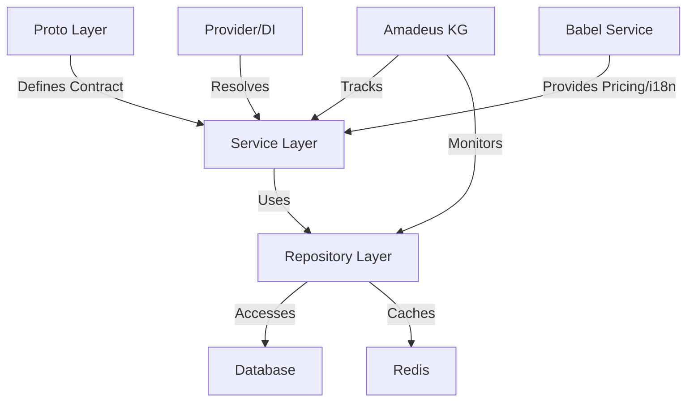
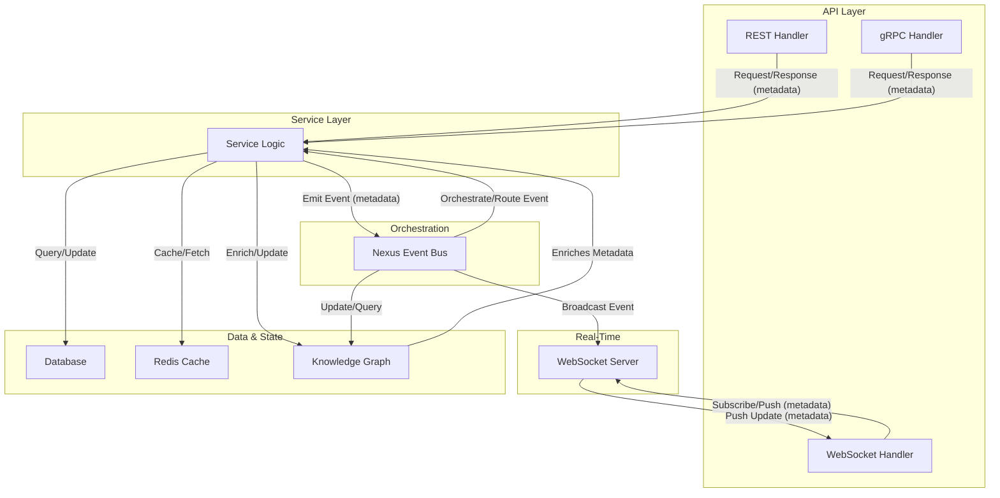

# Documentation

version: 2025-05-31

version: 2024-06-14

version: 2024-06-14


> **Context:** This is the canonical context and knowledge graph documentation for the Inos Internet-Native OS. For architecture and onboarding, see the [README](../../README.md).
>
> **🚧 Work in Progress (WIP):** This file is updated as the system evolves.

> **Note:** Always refer to this Amadeus context and knowledge graph documentation before implementing or updating any service. This ensures all dependencies, capabilities, and integration points are current and consistent across the platform.
> **New:** For research-backed best practices and reference architectures for each service, see [Service Patterns & Research-Backed Best Practices](service_patterns_and_research.md). All new and refactored services must follow the patterns, integration points, and extensibility guidelines described there. Use this guide to update the knowledge graph and document all relationships.

> **Database Reference:** For a full list of all tables, functions, and their responsibilities, see [Database Tables & Functions Reference](../development/database_tables.md). This document is tightly integrated with the Amadeus context for system-wide knowledge, impact analysis, and documentation.

> **Summary:** This file is tightly integrated with [General Metadata Documentation](../services/metadata.md) and [Versioning Standard & Documentation](../services/versioning.md). All service, orchestration, and knowledge graph documentation must reference these for metadata and versioning standards.

This file provides continuous context about the Amadeus Knowledge Graph system for AI assistants
working with the OVASABI platform.

## System Definition

Amadeus is the knowledge persistence system for the OVASABI platform, providing a comprehensive and
programmatically accessible knowledge graph of all system components and their relationships. It
serves as both documentation and a runtime-accessible knowledge repository that evolves with the
system.

## Core Services

| Service      | Status | Capabilities                  | Dependencies       | Integration Points    |
| ------------ | ------ | ----------------------------- | ------------------ | --------------------- |
| User         | ✅     | User mgmt, profile, RBAC      | Security           | Notification, Nexus   |
| Notification | ✅     | Multi-channel, templates, real-time, streaming | User               | Nexus      |
| Campaign     | ✅     | Campaign mgmt, analytics      | User, Notification | Nexus                |
| Referral     | ✅     | Referral, rewards, fraud      | User, Notification | Nexus                |
| Security     | ✅     | Policies, audit, compliance   | All services       | Nexus                |
| Content      | ✅     | Articles, micro-posts, video, comments, reactions, FTS | User, Notification, Search, ContentModeration | Nexus, Analytics |
| Commerce     | ✅     | Orders, payments, billing     | User               | Nexus                |
| Localization | ✅     | i18n, translation             | -                  | User, Content        |
| Search       | ✅     | Full-text, fuzzy, entity search | Content, User      | Nexus                |
| Admin        | ✅     | Admin user mgmt, roles, audit | User (via gRPC)    | Security, Nexus      |
| Analytics    | ✅     | Event, usage, reporting       | User, Content      | Nexus                |
| ContentModeration | ✅ | Moderation, compliance        | Content, User      | Nexus                |
| Talent       | ✅     | Talent profiles, bookings     | User               | Nexus                |
| Nexus        | ✅     | Orchestration, patterns       | All services       | Amadeus, All         |

## Search Service: Documentation & Architecture

The Search Service provides unified, high-performance, and extensible search capabilities across all major entities (content, user, campaign, etc.) in the OVASABI platform. It leverages PostgreSQL's full-text search, Redis caching, and the platform's robust metadata pattern, while integrating tightly with the master-client-service-event database architecture.

### Key Design Principles
- **PostgreSQL Full-Text Search First:** Uses `tsvector` columns and GIN indexes for scalable, relevance-ranked, multi-field search. No need for Elasticsearch for most use cases ([Qonto](https://medium.com/qonto-way/do-you-need-elasticsearch-when-you-have-postgresql-94ef69f5570f), [Huda](https://iniakunhuda.medium.com/postgresql-full-text-search-a-powerful-alternative-to-elasticsearch-for-small-to-medium-d9524e001fe0), [Xata](https://xata.io/blog/postgres-full-text-search-engine)).
- **Redis for Hot Query/Result Caching:** Caches frequent queries and results for low-latency responses and reduced DB load ([Redis Practices](../development/redis_practices.md)).
- **Metadata-Driven Extensibility:** All requests and results use the canonical `common.Metadata` pattern, enabling dynamic filters, context, and enrichment ([Metadata Pattern](#standard-robust-metadata-pattern-for-extensible-services)).
- **Master Table Integration:** All search operations are anchored to the `master` table, enabling polymorphic, cross-entity search, analytics, and event logging ([Database Practices](../development/database_practices.md)).
- **Composable, Future-Proof API:** Proto and REST APIs use composable request/response patterns, supporting new entity types, filters, and ranking strategies without breaking changes.

### System Architecture

#### 1. Database Layer
- **Master Table as Anchor:** All searchable entities (content, user, campaign, etc.) are referenced in the `master` table. Each service/entity table (e.g., `service_content_main`, `service_user_master`) has a `master_id` foreign key. Enables unified, cross-entity search and analytics.
- **Full-Text Search Columns:** Each entity table includes a `tsvector` column (e.g., `search_vector`) indexed with GIN. Populated/updated on insert/update triggers.
- **Flexible Metadata Storage:** Entity metadata is stored as `jsonb` for efficient filtering and enrichment.

#### 2. Search Service Layer
- **Unified Search API:** Accepts a query string, entity types, filters, and metadata. Supports full-text, fuzzy, and entity search. Returns paginated, relevance-ranked results with metadata enrichment.
- **Faceted Filtering & Aggregations:** Supports filtering by type, date, tags, and any metadata field. Returns facets/aggregations in response metadata for UI/analytics.
- **Suggest/Autocomplete API:** Provides fast, context-aware suggestions for query prefixes.

#### 3. Caching Layer
- **Redis Hot Query/Result Cache:** Caches results for frequent queries using structured keys (e.g., `cache:search:{hash(query+filters)}`). TTL and cache invalidation policies per [Redis Practices](../development/redis_practices.md).

#### 4. Event & Analytics Layer
- **Event Logging:** All search actions/events are logged in the `service_event` table, referencing `master_id` and including event type, payload, and metadata. Enables analytics, monitoring, and ML.

### Metadata Pattern Integration
- **All requests and results include a `metadata` field** (see [Robust Metadata Pattern](#standard-robust-metadata-pattern-for-extensible-services)):
  - **Filters:** Date ranges, tags, entity-specific fields.
  - **Context:** User, locale, device, session.
  - **Enrichment:** Facets, aggregations, audit info.
  - **Versioning:** All metadata includes version/environment fields for traceability.

### Example: Search Flow
1. **User submits a search query** (e.g., "AI orchestration") for content and campaigns.
2. **Search Service**:
   - Checks Redis for cached results.
   - If cache miss, queries Postgres using FTS on `service_content_main` and `service_campaign_main`, joining via `master_id`.
   - Applies filters from metadata (e.g., date, tags).
   - Ranks results using `ts_rank` and custom weights.
   - Logs the search event in `service_event`.
   - Caches the result in Redis.
3. **Response**:
   - Returns paginated, ranked results with key fields and enriched metadata (facets, context, etc.).

### Example: SearchRequest & SearchResult (Proto/JSON)
```json
{
  "query": "AI orchestration",
  "types": ["content", "campaign"],
  "page_size": 10,
  "page_number": 1,
  "metadata": {
    "service_specific": {
      "search": {
        "filters": {
          "date_from": "2024-01-01",
          "tags": ["ai", "orchestration"]
        },
        "user_context": {
          "user_id": "user_123",
          "locale": "en-US"
        }
      }
    }
  }
}
```

```json
{
  "results": [
    {
      "id": "content_456",
      "type": "content",
      "score": 0.98,
      "fields": {
        "title": "AI Orchestration Patterns",
        "snippet": "Learn how to orchestrate AI services at scale..."
      },
      "metadata": {
        "service_specific": {
          "content": {
            "editor_mode": "richtext",
            "tags": ["ai", "orchestration"]
          }
        }
      }
    }
  ],
  "total": 42,
  "page_number": 1,
  "page_size": 10,
  "metadata": {
    "service_specific": {
      "search": {
        "facets": {
          "tags": {"ai": 30, "orchestration": 12}
        }
      }
    }
  }
}
```

### Best Practices & References
- **Postgres FTS:** Use `tsvector`, GIN indexes, and weighted ranking ([Xata](https://xata.io/blog/postgres-full-text-search-engine), [Huda](https://iniakunhuda.medium.com/postgresql-full-text-search-a-powerful-alternative-to-elasticsearch-for-small-to-medium-d9524e001fe0)).
- **Master Table:** Anchor all search and analytics to the `master` table for extensibility and cross-entity queries ([Database Practices](../development/database_practices.md)).
- **Redis:** Cache hot queries/results, use structured key naming, and set appropriate TTLs ([Redis Practices](../development/redis_practices.md)).
- **Metadata:** Use the robust, extensible metadata pattern for all filters, context, and enrichment ([Amadeus Context](#standard-robust-metadata-pattern-for-extensible-services)).
- **Composable API:** All endpoints use composable request/response objects with metadata for future-proofing ([Composable Request Pattern](#composable-request-pattern-standard)).

### References
- [Do you need ElasticSearch when you have PostgreSQL? (Qonto)](https://medium.com/qonto-way/do-you-need-elasticsearch-when-you-have-postgresql-94ef69f5570f)
- [PostgreSQL Full-Text Search: A Powerful Alternative to Elasticsearch](https://iniakunhuda.medium.com/postgresql-full-text-search-a-powerful-alternative-to-elasticsearch-for-small-to-medium-d9524e001fe0)
- [How to build a full-text search engine with Postgres (Xata)](https://xata.io/blog/postgres-full-text-search-engine)
- [How to optimize PostgreSQL queries (v-checha)](https://v-checha.medium.com/how-to-optimize-postgresql-queries-226e6ff15f72)
- [OVASABI Metadata Pattern](#standard-robust-metadata-pattern-for-extensible-services)
- [Database Practices](../development/database_practices.md)
- [Redis Practices](../development/redis_practices.md)

**This documentation is the canonical reference for the Search Service. All implementation, onboarding, and future evolution must follow these patterns and reference this section.**

## User Service (Canonical Identity & Access Management)

The User Service is the platform's canonical service for all user management, authentication, authorization, RBAC (role-based access control), and audit logging. It replaces the deprecated Auth service and centralizes all identity and access management logic.

**Responsibilities:**
- User CRUD and profile management
- Authentication (login, token, session)
- Authorization (role/permission checks)
- RBAC (role assignment, permission management)
- Audit logging (login attempts, permission changes, etc.)
- Metadata-driven event logging for all user/auth actions

**Implementation:**
- All authentication and authorization logic is now handled by the User Service.
- All dependencies, integrations, and event logging should use the User Service.
- See [User Service Implementation Guide](user_service.md) for step-by-step migration and best practices.

## Core Capabilities

- **Self-documenting architecture**: System components register their capabilities automatically
- **Knowledge persistence**: Maintains a persistent, evolving model of the system
- **Programmatic accessibility**: Makes system knowledge accessible to both humans and services
- **Impact analysis**: Identifies affected components before changes
- **Architectural compliance**: Enforces architectural principles
- **Visualization generation**: Auto-generates visual representations from system knowledge
- **Decision intelligence**: Provides insights for architectural decisions
- **Centralized service registration**: All services are registered and resolved via a central
  Provider using a DI container, ensuring modular, single registration and easy dependency
  management.
- **Health and metrics**: All services expose health and metrics endpoints, managed centrally for
  observability and monitoring.
- **Babel service integration**: The Babel service provides i18n and dynamic, location-based pricing
  rules, and is integrated with Quotes, Finance, Campaign, and other services.
- **Pattern orchestration**: All services are registered as patterns in Nexus for orchestration, introspection, and automation.

## Campaign Scaffolding & Documentation Workflow

To ensure rapid, consistent, and reproducible campaign launches, the OVASABI platform uses a standardized campaign scaffolding and documentation workflow:

- **Numbered Campaign Files:** All campaign documentation must be created as a numbered file in `docs/campaign/` (e.g., `001_ovasabi_website.md`, `002_new_campaign.md`). This ensures clear versioning, ordering, and reproducibility.
- **Documentation Requirements:** Each campaign file must include:
  1. Overview and user stories
  2. Required backend functionality and service responsibilities
  3. Frontend-backend communication patterns (REST, WebSocket/SSE, gRPC)
  4. Extensibility and reproducibility notes
  5. Implementation notes and next steps
  6. Campaign-specific API endpoints and event types
  7. Mapping to existing services and identification of new requirements
- **Scaffolding Steps:**
  1. Define campaign requirements and document in a new numbered file
  2. Map features to services and identify new event types
  3. Design and document APIs and event payloads
  4. Add campaign metadata and rules to CampaignService
  5. Integrate frontend with APIs and real-time events
  6. Test, monitor, and review
  7. Update Amadeus context and knowledge graph with new campaign and relationships
- **Reference Example:** See [001_ovasabi_website.md](../campaign/001_ovasabi_website.md) for a complete, production-ready campaign documentation example.
- **Amadeus Context Integration:** All new campaigns must be referenced in this context file and the knowledge graph, with relationships and dependencies updated accordingly.

For more details and the latest campaign scaffolding best practices, always refer to the numbered campaign files in `docs/campaign/` and this Amadeus context.

## System Components

- **Knowledge Graph Store** (`amadeus/knowledge_graph.json`): JSON-based data store
- **Knowledge Graph API** (`amadeus/pkg/kg`): Go package for programmatic access
- **CLI Tool** (`amadeus/cmd/kgcli`): Command-line interface for knowledge graph access
- **Nexus Pattern** (`internal/nexus/service/pattern`): Canonical integration with Nexus orchestration
- **Service Hooks** (`amadeus/examples`): Integration points for services
- **Provider/DI Container** (`internal/service/provider.go`): Centralized service registration and
  dependency injection
- **Babel Service** (`internal/service/babel`): Unified i18n and location-based pricing logic
- **PatternStore** (`internal/nexus/service/pattern_store.go`): Modular pattern registration for all services (canonical path)

## Knowledge Graph Structure

The knowledge graph is structured with these main sections:

- `system_components`: High-level system architecture components
- `repository_structure`: Code organization and structure
- `services`: Service descriptions, capabilities, and relationships
- `nexus`: Nexus orchestration system components
- `patterns`: Pattern descriptions and compositions
- `database_practices`: Database usage patterns and schema information
- `redis_practices`: Redis usage patterns and data structures
- `amadeus_integration`: Self-description of the knowledge graph system
- `service_registration`: Tracks all service registrations, DI relationships, and health/metrics
  endpoints
- `babel_integration`: Tracks Babel service integration points and pricing/i18n relationships
- **pattern_orchestration**: Tracks all service pattern registrations and orchestration logic

For advanced configuration and implementation details, see the
[Super Knowledge Graph Configuration](super_knowledge_graph.md) and
[Implementation Guide](implementation_guide.md).

## Service Implementation Pattern

The platform follows a standardized service implementation pattern:



### Layer Components

1. **Proto Layer** (`api/protos/{service}/v0`)

   - Service interface definitions
   - Data model definitions
   - Version control
   - Language-agnostic contracts

2. **Service Layer** (`internal/service/{service}`)

   - Business logic implementation
   - gRPC service handlers
   - Internal service interfaces
   - Error mapping
   - Logging and tracing
   - Registered with Provider/DI container

3. **Repository Layer** (`internal/repository/{service}`)
   - Data access abstraction
   - Cache implementation
   - Transaction handling
   - Error mapping
   - Master-client pattern

### Service Registration

Services must register with Amadeus and the Provider/DI container:

```go
type ServiceRegistration struct {
    Name         string           `json:"name"`
    Version      string           `json:"version"`
    Capabilities []string         `json:"capabilities"`
    Dependencies []string         `json:"dependencies"`
    Schema       *ServiceSchema   `json:"schema"`
    Endpoints    []EndpointInfo   `json:"endpoints"`
    Models       []ModelInfo      `json:"models"`
    HealthCheck  string           `json:"health_check"`
    Metrics      string           `json:"metrics"`
}
```

### Service Evolution

Services maintain their evolution history in Amadeus:

- Version tracking
- Capability changes
- Breaking changes
- Migration paths
- Impact analysis

## Integration Methods

Services can integrate with Amadeus via:

1. **Service Hooks**: Used at service startup and during runtime
2. **Nexus Patterns**: For system-wide knowledge operations
3. **CLI Tools**: For manual and CI/CD operations
4. **Webhook API**: For external system integration
5. **Provider/DI Container**: For runtime dependency resolution and modular registration
6. **Babel Service**: For i18n and location-based pricing

## Update Mechanisms

The knowledge graph is kept up-to-date through:

- **Service lifecycle hooks**: Updates during service startup/runtime
- **Provider/DI registration**: Ensures all services are registered and resolved centrally
- **CI/CD integration**: Automated updates during deployments
- **Webhook-based updates**: External system integration
- **Scheduled jobs**: Regular validation and scanning
- **Manual updates**: CLI or direct API updates when needed

## AI & Data Science Integration

Amadeus enables:

- **Machine Learning Foundation**: Structured knowledge for AI model training
- **Decision Support Systems**: AI-assisted architectural decisions
- **Anomaly Detection**: Identifying architectural anomalies
- **Pattern Recognition**: Data analysis to identify architectural patterns
- **Evolution Tracking**: Historical analysis of system changes
- **Technical Debt Quantification**: Statistical analysis to identify refactoring needs

## Development State

- **Core Components**: Knowledge Graph Store, API, and CLI tool implemented
- **Integration Points**: Service Hooks, Provider/DI, Babel, and Nexus Pattern available
- **Documentation**: Implementation guide, integration examples, and architecture docs complete
- **Visualization**: Mermaid-based diagram generation implemented
- **Service Pattern**: Standardized implementation pattern established

## Evolution Tracking

The knowledge graph maintains its own evolution history:

- **Version field**: Explicit version of the knowledge graph format
- **Last updated timestamp**: When the graph was last modified
- **Backups**: Historical versions stored in `amadeus/backups`
- **Service implementations**: Tracks service implementation patterns
- **Provider/DI registration**: Tracks all service registrations and relationships
- **Babel integration**: Tracks all pricing/i18n relationships

## Implementation Status

- Basic implementation complete
- Service hooks functional
- CLI tool available
- Nexus and Provider/DI integration established
- Babel service integrated
- Documentation published
- Backup system set up
- Service pattern documented

## Usage Guidelines

1. Services should register with Amadeus and the Provider/DI container at startup
2. Service capabilities and dependencies should be tracked
3. CI/CD pipelines should validate knowledge graph consistency
4. Pattern implementations should be documented in the graph
5. Impact analysis should be performed before major changes
6. Follow standardized service implementation pattern
7. Integrate with Babel for i18n and pricing where relevant
8. Expose health and metrics endpoints for observability

## Future Development

- Real-time knowledge graph updates via event streams
- AI-assisted system analysis
- Specialized knowledge graph query language
- Advanced visualization capabilities
- System evolution tracking and prediction
- Automated service pattern compliance checking
- Deeper Babel integration for global pricing and localization

## Continuous Knowledge Graph Updates

The knowledge graph is continuously updated through multiple mechanisms to ensure it remains
accurate and valuable:

1. **Real-time Updates**

   - Service registration hooks trigger immediate graph updates
   - Provider/DI registration ensures all services are tracked
   - Event-driven updates based on system changes
   - Automatic schema and capability detection

2. **Batch Processing**

   - Scheduled validation jobs verify graph consistency
   - Periodic scans for new patterns and relationships
   - Historical analysis for evolution tracking

3. **Integration Points**

   ```mermaid
   graph TD
       A[Service Events] -->|Real-time| B[Knowledge Graph]
       C[CI/CD Pipeline] -->|Deployment| B
       D[Code Analysis] -->|Pattern Detection| B
       E[Manual Updates] -->|Curator API| B
       F[External Systems] -->|Webhook API| B
       G[Provider/DI] -->|Service Registration| B
       H[Babel Service] -->|Pricing/i18n| B
   ```

4. **Update Validation**

   - Pre-update validation ensures graph consistency
   - Post-update verification confirms relationships
   - Automatic backup creation before major changes

5. **Neural-Symbolic Integration**

   - Continuous learning from system behavior
   - Pattern recognition for new relationships
   - Automated suggestion of graph improvements

6. **Service-Level Updates**

   ```go
   type ServiceUpdate struct {
       ServiceID    string           `json:"service_id"`
       UpdateType   string           `json:"update_type"`
       Capabilities []string         `json:"capabilities"`
       Schema       *ServiceSchema   `json:"schema"`
       Timestamp    time.Time        `json:"timestamp"`
   }
   ```

7. **Pattern Detection**

   - Automated scanning for new implementation patterns
   - Relationship inference from service interactions
   - Usage pattern analysis for optimization

8. **Version Control Integration**

   - Git hooks for documentation updates
   - PR validation for graph consistency
   - Automatic documentation generation

9. **External System Integration**
   - Webhook API for third-party updates
   - Event stream processing
   - Batch import capabilities

### Update Policies

1. **Consistency Rules**

   - All updates must maintain graph consistency
   - Version tracking for all changes
   - Rollback capability for failed updates

2. **Access Control**

   - Role-based update permissions
   - Audit logging for all changes
   - Change approval workflows for major updates

3. **Performance Considerations**

   - Batching of minor updates
   - Async processing for non-critical changes
   - Cache invalidation strategies

4. **Backup Strategy**
   - Automatic backups before updates
   - Historical version retention
   - Point-in-time recovery capability

For detailed implementation of advanced querying, perspective-aware AI systems, and language model
integration, refer to the [Super Knowledge Graph Configuration](super_knowledge_graph.md).

## Accessibility & Compliance Metadata Pattern

To ensure all campaigns and localized assets are accessible and compliant with global standards, the platform implements a comprehensive accessibility and compliance metadata structure. This pattern enables:
- Tracking of language, script, and text direction for each asset
- Documentation of compliance with standards (WCAG, Section 508, EN 301 549, ADA, etc.)
- Recording of accessibility features (alt text, captions, ARIA labels, color contrast, font scalability, keyboard navigation, etc.)
- Audit and provenance information (who/what performed checks, when, method, issues found/resolved)
- Media-specific accessibility (alt text for images, captions/transcripts for video/audio)
- Platform support (desktop, mobile, screen reader, braille, voice input)

### Example Metadata Structure
```json
{
  "locale": "ar-EG",
  "script_code": "Arab",
  "text_direction": "rtl",
  "compliance": {
    "standards": [
      { "name": "WCAG", "level": "AA", "version": "2.1" },
      { "name": "Section 508", "compliant": true },
      { "name": "EN 301 549", "compliant": true }
    ],
    "features": {
      "alt_text": true,
      "captions": true,
      "transcripts": true,
      "aria_labels": true,
      "color_contrast_ratio": "4.5:1",
      "font_scalable": true,
      "keyboard_navigation": true,
      "language_attribute": true,
      "direction_attribute": true
    },
    "audit": {
      "checked_by": "localization-service-v2.3",
      "checked_at": "2024-05-15T12:00:00Z",
      "method": "automated",
      "issues_found": [
        {
          "type": "missing_alt_text",
          "location": "banner_image",
          "resolved": true
        }
      ]
    }
  },
  "media": {
    "images": [
      {
        "src": "banner.jpg",
        "alt": "Spring Sale Banner",
        "description": "A banner showing spring flowers and sale text"
      }
    ],
    "videos": [
      {
        "src": "promo.mp4",
        "captions": "promo_captions.vtt",
        "transcript": "promo_transcript.txt",
        "audio_description": true
      }
    ]
  },
  "platform_support": {
    "desktop": true,
    "mobile": true,
    "screen_reader": true,
    "braille": false,
    "voice_input": true
  }
}
```

### Integration with Campaign and Localization Services
- **Campaign Service:** When creating or updating a campaign, include an `accessibility` field in the metadata. This field should be populated or updated as localization and accessibility checks are performed.
- **Localization Service:** When generating or updating localized assets, automatically run accessibility checks and populate the compliance metadata. Store this metadata alongside each localized script/asset and return it to the campaign service for inclusion in campaign metadata.
- **Knowledge Graph:** Track accessibility and compliance metadata for all campaigns and assets, enabling queries, audits, and compliance reporting.

For more, see the [Metadata Pattern](#standard-robust-metadata-pattern-for-extensible-services) and [Accessibility & Compliance Metadata Pattern](#accessibility--compliance-metadata-pattern) sections.

## References

For detailed information, see:

- [Service Patterns & Research-Backed Best Practices](service_patterns_and_research.md)
- [Implementation Guide](implementation_guide.md)
- [Integration Examples](integration_examples.md)
- [Architecture Overview](architecture.md)
- [API Reference](api_reference.md)
- [Consistent Update Guide](consistent_updates.md)
- [Service Implementation Pattern](../services/implementation_pattern.md)
- [Service List](../services/service_list.md)
- [Database Tables & Functions Reference](../development/database_tables.md)
- [Campaign Scaffolding & Documentation Workflow](#campaign-scaffolding--documentation-workflow)
- [Ovasabi Website Campaign Example](../campaign/001_ovasabi_website.md)

## Build and Development Commands

The project includes a comprehensive Makefile that provides standardized commands for development,
testing, and deployment. **Always use the Makefile and Docker configuration for proto generation, code generation, and service builds to ensure consistency across environments.** Here are the key command categories:

### Core Development Commands

```makefile
setup              # Sets up development environment
install-tools      # Installs required Go tools
deps              # Installs additional dependencies

build             # Builds the binary with proto generation
dev               # Runs the server in development mode
clean             # Cleans build artifacts

test              # Runs all tests (unit + integration)
test-unit         # Runs only unit tests
test-integration  # Runs integration tests
coverage          # Generates test coverage report
```

### Code Quality and Documentation

```makefile
lint              # Full linting suite
lint-focused      # Excludes backup files and amadeus utilities
lint-safe         # Completely excludes amadeus directory

docs-format       # Formats documentation
docs-validate     # Validates documentation
docs-serve        # Serves documentation locally
docs-deploy-github # Deploys to GitHub Pages
```

### Container and Deployment

```makefile
docker-build      # Builds Docker images
docker-up         # Starts containers
docker-down       # Stops containers
docker-logs       # Shows container logs
docker-clean      # Removes containers and volumes

trivy-scan        # Vulnerability scanning
trivy-scan-ci     # CI/CD vulnerability checks

k8s-deploy        # Deploys to Kubernetes
k8s-status        # Shows deployment status
```

## Database Table Naming Convention

For all new and existing services, the following naming convention must be used for database tables:

- **Pattern:** `service_{service}_{entity}`
- **Examples:**
  - `service_user_master`
  - `service_admin_user`
  - `service_content_main`
  - `service_referral_main`
  - `service_commerce_order`
  - `service_analytics_event`

This ensures clarity, modularity, and analytics-readiness across the platform. All migrations, repository code, and documentation must reference tables using this convention.

For full details and rationale, see [Database Table Naming & Migration Best Practices](../development/database_table_naming.md).

## Repository and Data Management Best Practices

For a detailed explanation of the repository pattern, master-client-service-event architecture, and advanced strategies for archiving, partitioning, and analytics, see:
- [Master-Client-Service-Event Pattern: Repository Architecture & Best Practices](../architecture/master_client_event_pattern.md)
- [Database Practices: Advanced Strategies](../development/database_practices.md)

These documents cover:
- Automated archiving and partitioning
- Retention policies and cold storage
- Data lake integration and export
- Immutable audit/event logging
- Monitoring, index review, and documentation automation

## Standard: Provider/DI Registration Pattern File Comment

All new service/provider files must begin with a comment block describing the Provider/DI registration pattern, following this standard:

```
Provider/DI Registration Pattern (Modern, Extensible, DRY)
---------------------------------------------------------

This file implements the centralized Provider pattern for service registration and dependency injection (DI) across the platform. It ensures all services are registered, resolved, and composed in a DRY, maintainable, and extensible way.

Key Features:
- **Centralized Service Registration:** All gRPC services are registered with a DI container, ensuring single-point, modular registration and easy dependency management.
- **Repository & Cache Integration:** Each service can specify its repository constructor and (optionally) a cache name for Redis-backed caching.
- **Multi-Dependency Support:** Services with multiple or cross-service dependencies (e.g., ContentService, NotificationService) use custom registration functions to resolve all required dependencies from the DI container.
- **Extensible Pattern:** To add a new service, define its repository and (optionally) cache, then add a registration entry. For complex dependencies, use a custom registration function.
- **Consistent Error Handling:** All registration errors are logged and wrapped for traceability.
- **Self-Documenting:** The registration pattern is discoverable and enforced as a standard for all new services.

Standard for New Service/Provider Files:
1. Document the registration pattern and DI approach at the top of the file.
2. Describe how to add new services, including repository, cache, and dependency resolution.
3. Note any special patterns for multi-dependency or cross-service orchestration.
4. Ensure all registration and error handling is consistent and logged.
5. Reference this comment as the standard for all new service/provider files.
```

This comment block must be present and up-to-date in all new and refactored service/provider files. It serves as the canonical documentation for the Provider/DI pattern in the OVASABI platform.

## Standard: Performance Review Process & Continuous Evolution

### Purpose
To ensure the OVASABI platform remains performant, scalable, and robust, a standardized performance review process must be followed. This process is both technical (code, database, infrastructure) and procedural (continuous improvement, feedback, and automation).

### Performance Review Checklist

1. **Static Code Analysis**
   - Run linters and static analysis tools (e.g., gosec, revive, errcheck).
   - Identify anti-patterns (N+1 queries, full scans, unbounded goroutines, etc.).
   - Check for unchecked errors, resource leaks, and concurrency issues.

2. **Database & Query Efficiency**
   - Review schema, indexes, and migrations for optimal design.
   - Ensure queries use indexes and avoid full table scans.
   - Audit counting strategies (prefer increment/decrement counters over full scans).
   - Check for partitioning, archiving, and extension usage (e.g., pg_trgm).

3. **Caching & Data Access**
   - Verify use of Redis or other caches for hot data and counters.
   - Review cache invalidation and consistency strategies.

4. **Service & Dependency Injection**
   - Ensure DI/Provider patterns are followed for efficient service registration and resolution.
   - Audit cross-service calls for efficiency and asynchronicity where possible.

5. **Observability & Metrics**
   - Confirm all services expose health and metrics endpoints.
   - Review logging for structure, context, and traceability.
   - Ensure error wrapping and propagation is consistent.

6. **Scalability & Extensibility**
   - Check for statelessness and readiness for horizontal scaling.
   - Ensure code is modular, DRY, and easily extensible.

7. **Documentation & Onboarding**
   - Ensure all standards, patterns, and review processes are documented and discoverable.
   - Keep the Amadeus context and knowledge graph up-to-date.

8. **Automated Testing & CI/CD**
   - Review test coverage and critical path tests.
   - Ensure CI/CD pipelines enforce linting, testing, and deployment standards.

### Continuous Evolution of the Performance Review Process

- **Feedback Loops:** After each review, document lessons learned and update this standard with new checks, tools, or patterns.
- **Tooling Updates:** Regularly evaluate and integrate new static analysis, profiling, and monitoring tools.
- **Knowledge Graph Integration:** All performance review findings and improvements should be reflected in the Amadeus context and knowledge graph for system-wide visibility.
- **Automation:** Where possible, automate checks and integrate them into CI/CD pipelines.
- **Community & Team Input:** Encourage engineers to propose additions or changes to the review process based on real-world experience.
- **Versioning:** Track changes to the performance review standard and maintain an evolution history.

### How to Update This Process
1. Propose a change or addition (e.g., new tool, new check, new best practice).
2. Document the rationale and expected impact.
3. Update this section in the Amadeus context and notify the team.
4. Integrate the change into review checklists, automation, and onboarding materials.
5. Periodically review the process for relevance and effectiveness.

**This standard ensures that performance reviews are not static, but continuously evolve with the platform, technology, and team experience.**

## Standard: Robust Metadata Pattern for Extensible Services

### Overview
The Metadata pattern provides a unified, extensible structure for attaching rich, structured, and service-specific information to any entity (campaign, content, user, etc.). It is implemented as a `Metadata` message in all service protos, using `google.protobuf.Struct` for flexibility and future-proofing. This pattern enables:
- Dynamic orchestration and introspection via Nexus
- Rich, queryable nodes and edges in the knowledge graph
- Contextual, data-rich inputs for AI/ML
- Consistent, high-performance storage via Postgres `jsonb`

### Versioning & Environment Field (Required)

> **Standard:** All extensible metadata (including `service_specific` fields) MUST include a `versioning` field as described in [Versioning Standard & Documentation](../services/versioning.md). This field connects user, system, and environment versioning, and is required for all REST, gRPC, WebSocket, orchestration, analytics, and audit communication.

#### Canonical Example:
```json
{
  "metadata": {
    "service_specific": {
      "user": {
        "versioning": {
          "system_version": "2.0.0",
          "service_version": "1.2.0",
          "user_version": "1.0.0",
          "environment": "beta",
          "user_type": "beta_user",
          "feature_flags": ["new_ui"],
          "last_migrated_at": "2025-05-11T00:00:00Z"
        },
        "login_source": "mobile_app"
      }
    }
  }
}
```
- This field must be set at entity creation and updated on migration, environment, or user type change.
- All communication (REST, gRPC, WebSocket, orchestration, analytics, audit) must propagate and update this field as appropriate.
- See [Versioning Standard & Documentation](../services/versioning.md) for full schema, best practices, and implementation guidance.

### Metadata Structure

```
syntax = "proto3";
package common;

import "google/protobuf/struct.proto";

message Metadata {
  google.protobuf.Struct scheduling = 1;         // General scheduling and orchestration fields
  repeated string features = 2;                  // Feature toggles (e.g., ["referral", "notification"])
  google.protobuf.Struct custom_rules = 3;       // Custom rules (e.g., {max_referrals: 10})
  google.protobuf.Struct audit = 4;              // Audit info (created_by, history, etc.)
  repeated string tags = 5;                      // Tags for search, analytics, etc.
  google.protobuf.Struct service_specific = 6;   // Service-specific extensions (e.g., {"content": {...}})
  google.protobuf.Struct knowledge_graph = 7;    // For knowledge graph enrichment
}
```

### Shared/General Fields
- **scheduling:** Start/end times, reminders, cron expressions
- **features:** List of enabled features for orchestration
- **custom_rules:** Arbitrary rules for business logic
- **audit:** Created by, last modified by, change history
- **tags:** For search, analytics, and grouping

### Service-Specific Extensions
- **service_specific:**
  - Each service can define and document its own fields under a namespaced key (e.g., `content`, `commerce`, `notification`).
  - Example: `metadata.service_specific.content.editor_mode = "richtext"`

### Usage Pattern
- All core entities in service protos use `Metadata metadata` instead of `map<string, string> metadata`.
- When storing in Postgres, metadata is mapped to a `jsonb` column for efficient querying and indexing.
- Services use shared helpers to extract, validate, and manipulate both general and service-specific fields.

### Knowledge Graph & Nexus Integration
- Metadata fields are ingested into the knowledge graph, enriching nodes and edges for advanced queries and impact analysis.
- Nexus uses metadata to dynamically orchestrate services, schedule jobs, and enable/disable features based on context.

### AI/ML Enablement
- Metadata provides rich, contextual features for AI/ML models (personalization, anomaly detection, recommendations, etc.).
- Enables explainable AI by tracing which metadata fields influenced decisions.

### Performance
- Use Postgres `jsonb` with GIN/partial indexes for efficient storage and querying.
- Cache hot metadata in Redis for low-latency access.
- Parse only relevant fields in service logic to minimize overhead.

### Developer Guidance
- Always use the shared `Metadata` message for extensible properties.
- Document any service-specific fields in your service's proto and onboarding docs.
- Use shared helpers for extracting and validating metadata fields.
- Keep metadata schemas up-to-date in the Amadeus context and knowledge graph.

### Example: Service-Specific Extension
```
// In content service:
metadata.service_specific["content"].editor_mode = "richtext"
// In commerce service:
metadata.service_specific["commerce"].payment_window = "24h"
```

### Migration Notes
- **Update all service protos** to import and use `common.Metadata`.
- **Update repositories and DB migrations** to store metadata as `jsonb` and add necessary indexes.
- **Update scheduling logic** to use the `scheduling` field and integrate with triggers and the Scheduler service.
- **Update documentation and onboarding guides** to reference the canonical pattern.

## Canonical Metadata Integration Pattern (System-Wide)

All services in OVASABI now use a single, extensible `common.Metadata` proto for all metadata fields. This enables:
- Consistent, high-performance storage (Postgres `jsonb`)
- Rich orchestration (Scheduler, Nexus)
- Knowledge graph enrichment
- Redis caching for hot metadata

### Integration Points
- **Redis:** Cache hot metadata for low-latency access using `CacheMetadata` and `GetCachedMetadata` helpers.
- **Scheduler:** Use the `scheduling` field in metadata to register jobs and orchestrate time-based actions. Use `RegisterSchedule` helper after create/update.
- **Knowledge Graph:** Enrich nodes/edges with metadata using `EnrichKnowledgeGraph` helper.
- **Nexus:** Register service patterns and metadata for orchestration using `RegisterWithNexus` helper.

### Implementation Pattern
After a successful create/update operation in any service:
```go
if s.Cache != nil && entity.Metadata != nil {
    _ = pattern.CacheMetadata(ctx, s.Cache, "entity_type", entity.Id, entity.Metadata, 10*time.Minute)
}
_ = pattern.RegisterSchedule(ctx, "entity_type", entity.Id, entity.Metadata)
_ = pattern.EnrichKnowledgeGraph(ctx, "entity_type", entity.Id, entity.Metadata)
_ = pattern.RegisterWithNexus(ctx, "entity_type", entity.Metadata)
```

### Scheduler Example
When scheduling a job, extract scheduling info from metadata:
```go
if job.Metadata != nil && job.Metadata.Scheduling != nil {
    _ = pattern.RegisterSchedule(ctx, "job", job.Id, job.Metadata)
}
```

### Onboarding Guidance
- Always use `common.Metadata` for extensible fields in protos and models.
- Document any service-specific fields under `service_specific` in your proto and onboarding docs.
- Use the shared helpers in `internal/service/pattern/metadata_pattern.go` for all integration points.
- Keep this context and the knowledge graph up-to-date with new fields and integration points.

For more, see `internal/service/pattern/metadata_pattern.go` and service implementation files.

## Real-Time Communication & WebSocket Management (2024+)

The platform now implements a **unified, event-driven WebSocket architecture** fully integrated with the Nexus event bus. In this paradigm, **all WebSocket clients (browsers, WASM, mobile, edge, etc.) are both emitters and receivers of events**. This enables a true "nervous system" for the Internet-Native OS, where every connected client can:
- Emit events (e.g., search requests, actions, commands, custom events) to the backend via WebSocket.
- Receive events (e.g., search results, campaign updates, notifications, orchestration signals) from the backend, routed through the Nexus event bus.

### Unified Event Envelope
All WebSocket messages (from client or server) use a unified envelope:
```json
{
  "type": "search" | "campaign_action" | "custom_event" | ...,
  "payload": { ... },
  "metadata": { ... }
}
```
- `type`: Canonical event type (see Nexus event types)
- `payload`: Event-specific data (search query, action details, etc.)
- `metadata`: Canonical metadata (see Robust Metadata Pattern)

### Event Bus Integration
- **Emit:** When a client sends a message, the WebSocket server emits it as an event to the Nexus event bus. All services (including Search, Campaign, AI, etc.) can subscribe to relevant event types.
- **Receive:** When an event is emitted on the bus (by a service or another client), the WebSocket server routes it to the appropriate clients (by campaign, user, or broadcast).
- **Loose Coupling:** Clients, services, and orchestrators communicate only via events and metadata—no direct coupling.

### Client Participation
- **Emitters:** Any client can initiate actions (search, commands, custom events) by sending an event envelope via WebSocket.
- **Receivers:** Any client can receive events relevant to them (search results, campaign updates, notifications, etc.).
- **Extensible:** New event types and workflows can be added without changing the protocol or endpoints.
- **Auditable:** All events are tracked, versioned, and auditable via metadata and the knowledge graph.

### Example: Search via WebSocket
1. Client sends:
```json
{
  "type": "search",
  "payload": { "query": "AI orchestration", "types": ["content"] },
  "metadata": { ... }
}
```
2. WebSocket server emits `search.requested` event to Nexus.
3. Search service processes and emits `search.completed` event.
4. WebSocket server routes `search.completed` event to the requesting client.

### WASM and Edge Participation
- WASM modules (browser or server) can use the same event protocol to emit/receive events.
- Edge devices can participate as first-class event emitters/receivers.

### Benefits
- **Real-time, bi-directional orchestration**
- **Device-agnostic, distributed, and evolvable**
- **Unified, metadata-driven context for all communication**
- **Extensible and future-proof**

### Migration Guidance
- Refactor all WebSocket handlers to use the unified event envelope and emit/receive via Nexus.
- Document all new event types and workflows in the knowledge graph and onboarding docs.
- Update client SDKs and WASM modules to use the new pattern.

**This is now the canonical pattern for all real-time, event-driven communication in OVASABI.**

## Composable Request Pattern Standard

All service endpoints that accept POST, PATCH, or PUT requests must use a composable request pattern. This ensures extensibility, discoverability, and future-proofing across the platform.

### Naming Convention
- Top-level request object: `{Service}{Action}Request` (e.g., `UserLoginRequest`, `CampaignCreateRequest`, `CommercePaymentRequest`).
- Metadata field: Always named `metadata`, an object with `service_specific` keys.
- Service-specific fields: Namespaced under `metadata.service_specific.{service}` (e.g., `metadata.service_specific.user`).

### OpenAPI Schema Example
```yaml
components:
  schemas:
    UserLoginRequest:
      type: object
      properties:
        email:
          type: string
        password:
          type: string
        metadata:
          type: object
          properties:
            service_specific:
              type: object
              properties:
                user:
                  type: object
                  additionalProperties: true
      required:
        - email
        - password
    CampaignCreateRequest:
      type: object
      properties:
        name:
          type: string
        start_date:
          type: string
          format: date
        metadata:
          type: object
          properties:
            service_specific:
              type: object
              properties:
                campaign:
                  type: object
                  additionalProperties: true
      required:
        - name
        - start_date
```
- For advanced extensibility, use `oneOf` or `anyOf` for alternative request types or extensions.

### Best Practices
- Always include a `metadata` field in composable requests, even if initially empty.
- Service-specific extensions must be namespaced under `metadata.service_specific.{service}`.
- Use `additionalProperties: true` for maximum flexibility.
- Document all possible extensions in your OpenAPI spec and onboarding docs.
- Version your schemas and use `allOf`, `oneOf`, `anyOf` for future-proofing.

### Example: Service-Based Metadata in a Request
```json
{
  "email": "user@example.com",
  "password": "hunter2",
  "metadata": {
    "service_specific": {
      "user": {
        "login_source": "mobile_app",
        "device_id": "abc123"
      }
    }
  }
}
```
```json
{
  "name": "Spring Sale",
  "start_date": "2024-06-01",
  "metadata": {
    "service_specific": {
      "campaign": {
        "priority": "high",
        "target_audience": ["students", "teachers"]
      }
    }
  }
}
```

### Checklist for Every Service
- [ ] All POST/PATCH/PUT requests use a `{Service}{Action}Request` object.
- [ ] All requests include a `metadata` field with `service_specific` keys.
- [ ] Service-specific extensions are namespaced under `metadata.service_specific.{service}`.
- [ ] OpenAPI spec documents all extensions and uses `additionalProperties: true`.
- [ ] All new features/extensions are added under the correct namespace.

### Benefits
- Extensible and future-proof API design
- Rapid onboarding of new features and request types
- Easier integration for clients and internal teams

### References
- [Practical OpenAPI in Go (ITNEXT)](https://medium.com/itnext/practical-openapi-in-go-1e9e6c4ed439)
- [OpenAPI Specification](https://swagger.io/specification/)
- [JSON Schema: oneOf, anyOf, allOf](https://json-schema.org/understanding-json-schema/reference/combining.html)

**All services must follow this pattern for extensibility and future-proofing.**

## Bad Actor Identification Standard

To protect platform integrity and user safety, all services handling user actions, authentication, or moderation must implement a bad actor identification pattern using device/location triangulation and frequency analysis.

### Signals to Use
- **Device ID**: Unique identifier for each device (e.g., fingerprint, UUID, hardware ID)
- **Location**: Geo-location (city, country, region) and IP address
- **Frequency**: Number of suspicious or abusive actions/events within a time window
- **Account Linkage**: Multiple accounts using the same device/location
- **Behavioral Patterns**: Rapid signups, repeated failed logins, repeated content violations, etc.

### Metadata Structure Example
```json
{
  "bad_actor": {
    "score": 0.92,
    "reason": "Multiple abusive actions from same device/location",
    "device_ids": ["device_abc123", "device_xyz789"],
    "locations": [
      { "ip": "203.0.113.42", "city": "Berlin", "country": "DE" },
      { "ip": "203.0.113.43", "city": "Berlin", "country": "DE" }
    ],
    "frequency": {
      "window": "24h",
      "count": 7
    },
    "accounts_linked": ["user_456", "user_789"],
    "last_flagged_at": "2024-05-15T12:10:00Z",
    "history": [
      { "event": "content_violation", "timestamp": "2024-05-15T10:00:00Z" },
      { "event": "failed_login", "timestamp": "2024-05-15T11:00:00Z" }
    ]
  }
}
```

### Detection Logic (Pseudocode)
- On every suspicious event (e.g., content violation, failed login, rapid signup):
  1. Log device ID and location in the user's metadata.
  2. Increment frequency counter for the device/location/user.
  3. Check for multiple accounts using the same device/location.
  4. Calculate a "bad actor score" (e.g., using a weighted sum or ML model).
  5. If score exceeds threshold, flag user as a bad actor and take action (e.g., require CAPTCHA, block, escalate for review).

### Best Practices
- **Privacy:** Store only what's necessary, and comply with GDPR/CCPA for device/location data.
- **Transparency:** Log reasons and history for every flag (for audit and appeals).
- **Extensibility:** Allow new signals (e.g., browser fingerprint, behavioral biometrics) to be added to the metadata.
- **Automation:** Integrate with moderation and security services for real-time action.

### Checklist
- [ ] Add "bad_actor" section to user/content metadata schema.
- [ ] Log device ID, location, and event frequency for all suspicious actions.
- [ ] Implement logic to triangulate and score bad actor risk.
- [ ] Link accounts by device/location where possible.
- [ ] Store flagging history and reasons in metadata.
- [ ] Integrate with moderation and security workflows.

### References
- [OWASP Automated Threats to Web Applications](https://owasp.org/www-project-automated-threats-to-web-applications/)
- [Google Account Abuse Detection](https://security.googleblog.com/2019/05/new-research-how-effective-is-basic.html)
- [GDPR and Device Fingerprinting](https://gdpr.eu/fingerprinting/)

**All services must use this standard for consistent, privacy-aware bad actor detection and response.**


This section provides a canonical reference for how the platform's major standards and patterns are chained and enforced across all services. It is designed to help implementers, reviewers, and architects ensure that every service, endpoint, and workflow consistently applies the platform's extensibility, compliance, and orchestration standards.

## Overview

The following standards are foundational to the OVASABI platform:
- **Robust Metadata Pattern** (system-wide extensibility)
- **Accessibility & Compliance Metadata** (global accessibility/compliance)
- **Bad Actor Identification** (security, moderation, and abuse prevention)
- **Composable Request Pattern** (future-proof, extensible APIs)

Each standard is referenced, extended, and enforced at multiple layers and services. This section documents the canonical "path" through the services, showing how these standards are applied, extended, and chained together.

---

## 1. Robust Metadata Pattern (System-Wide)

**Purpose:**
- Provides a unified, extensible structure for attaching rich, structured, and service-specific information to any entity (campaign, content, user, etc.).
- Enables orchestration, analytics, AI/ML, and compliance across the platform.

**Chaining Path:**
- **Proto Layer:** All core entities use `common.Metadata` (see [Standard: Robust Metadata Pattern for Extensible Services](#standard-robust-metadata-pattern-for-extensible-services)).
- **Service Layer:** Business logic reads/writes metadata, including service-specific extensions under `metadata.service_specific.{service}`.
- **Repository Layer:** Metadata is stored as `jsonb` in Postgres, indexed for analytics and orchestration.
- **Integration Points:**
  - **Scheduler:** Uses `metadata.scheduling` for time-based actions.
  - **Nexus:** Orchestrates services using metadata.
  - **Knowledge Graph:** Ingests metadata for enrichment and impact analysis.
  - **Redis:** Caches hot metadata for low-latency access.

**Example:**
```json
{
  "metadata": {
    "features": ["referral", "notification"],
    "service_specific": {
      "campaign": {"priority": "high"},
      "user": {"login_source": "mobile_app"}
    }
  }
}
```

---

## 2. Accessibility & Compliance Metadata

**Purpose:**
- Ensures all campaigns and localized assets are accessible and compliant with global standards (WCAG, Section 508, EN 301 549, ADA, etc.).
- Enables audit, provenance, and platform support tracking.

**Chaining Path:**
- **Campaign Service:** Includes an `accessibility` or `compliance` field in campaign metadata (under `metadata.service_specific.campaign.accessibility`).
- **Localization Service:** On asset creation/update, runs accessibility checks and populates compliance metadata (under `metadata.service_specific.localization.compliance`).
- **Content Service:** Stores accessibility features for all media/content assets (under `metadata.service_specific.content.accessibility`).
- **Knowledge Graph:** Tracks accessibility/compliance metadata for all campaigns and assets, enabling queries, audits, and compliance reporting.

**Example:**
```json
{
  "metadata": {
    "service_specific": {
      "campaign": {
        "accessibility": {
          "compliance": {"standards": [{"name": "WCAG", "level": "AA"}]},
          "features": {"alt_text": true, "captions": true}
        }
      },
      "localization": {
        "compliance": {"checked_by": "localization-service-v2.3"}
      }
    }
  }
}
```

**Reference:** See [Accessibility & Compliance Metadata Pattern](#accessibility--compliance-metadata-pattern)

---

## 3. Bad Actor Identification

**Purpose:**
- Detects and mitigates abusive, fraudulent, or suspicious behavior using device/location triangulation, frequency analysis, and behavioral patterns.

**Chaining Path:**
- **User Service:** Adds/updates `bad_actor` section in user metadata (under `metadata.service_specific.user.bad_actor`).
- **Content Moderation Service:** Flags content/users and updates `bad_actor` metadata on violations (under `metadata.service_specific.content.bad_actor`).
- **Security Service:** Aggregates signals from all services, escalates or blocks as needed (under `metadata.service_specific.security.bad_actor`).
- **Audit Logging:** All flagging and actions are logged for transparency and appeals.
- **Knowledge Graph:** Enables queries and reporting on bad actor risk and history.

**Example:**
```json
{
  "metadata": {
    "service_specific": {
      "user": {
        "bad_actor": {
          "score": 0.92,
          "reason": "Multiple abusive actions from same device/location",
          "device_ids": ["device_abc123"],
          "locations": [{"ip": "203.0.113.42", "city": "Berlin"}],
          "frequency": {"window": "24h", "count": 7},
          "accounts_linked": ["user_456"],
          "last_flagged_at": "2024-05-15T12:10:00Z"
        }
      }
    }
  }
}
```

**Reference:** See [Bad Actor Identification Standard](#bad-actor-identification-standard)

---

## 4. Composable Request Pattern

**Purpose:**
- Ensures all POST/PATCH/PUT requests are extensible, discoverable, and future-proof by using a `{Service}{Action}Request` object with a `metadata` field.

**Chaining Path:**
- **API Layer:** All endpoints accept composable request objects (e.g., `UserLoginRequest`, `CampaignCreateRequest`).
- **Service Layer:** Reads/writes to the `metadata` field, including service-specific extensions.
- **OpenAPI/Docs:** All extensions and request patterns are documented and versioned.
- **Integration:** Enables rapid onboarding of new features and request types without breaking changes.

**Example:**
```json
{
  "name": "Spring Sale",
  "start_date": "2024-06-01",
  "metadata": {
    "service_specific": {
      "campaign": {"priority": "high"},
      "localization": {"locale": "ar-EG"}
    }
  }
}
```

**Reference:** See [Composable Request Pattern Standard](#composable-request-pattern-standard)

---

## 5. Chaining Example: Campaign Creation & Localization

1. **Campaign Service:** Receives a `CampaignCreateRequest` with `metadata` (including accessibility, scheduling, and custom rules).
2. **Localization Service:** On campaign creation, generates localized assets, runs accessibility checks, and updates compliance metadata under `metadata.service_specific.localization.compliance`.
3. **Content Service:** Stores all media/content with accessibility features in `metadata.service_specific.content.accessibility`.
4. **Security/Moderation:** Monitors for abuse, updates `bad_actor` metadata as needed.
5. **Knowledge Graph:** Ingests all metadata, enabling orchestration, analytics, and compliance reporting.

---

## 6. Implementation Checklist
- [ ] All services use `common.Metadata` for extensible fields.
- [ ] Accessibility/compliance metadata is populated and updated at each relevant service.
- [ ] Bad actor signals are logged and aggregated in user/content/security metadata.
- [ ] All POST/PATCH/PUT requests use the composable request pattern.
- [ ] All extensions are namespaced under `metadata.service_specific.{service}`.
- [ ] Knowledge graph is updated with all new fields and relationships.

---

## References
- [Robust Metadata Pattern](#standard-robust-metadata-pattern-for-extensible-services)
- [Accessibility & Compliance Metadata Pattern](#accessibility--compliance-metadata-pattern)
- [Bad Actor Identification Standard](#bad-actor-identification-standard)
- [Composable Request Pattern Standard](#composable-request-pattern-standard)
- [Service Patterns & Research-Backed Best Practices](service_patterns_and_research.md)
- [Implementation Guide](implementation_guide.md)
- [Integration Examples](integration_examples.md)

**This section is a living reference. Update it as new standards, patterns, or integration points are added to the platform.**


This section defines the new platform-wide standard for all service communication, calculation, and orchestration. It unifies gRPC, REST, and WebSocket patterns under a single, metadata-driven approach, ensuring all services, the knowledge graph, and Nexus orchestration are consistent, extensible, and UI-ready.

## 1. Canonical gRPC Calculation/Enrichment Pattern
- All services expose explicit calculation/enrichment endpoints (e.g., `CalculateRisk`, `EnrichLocalization`) that accept and return `common.Metadata`.
- These endpoints are chained together for cross-service calculation and metadata enrichment.
- See: [Canonical gRPC Calculation/Enrichment Endpoint Pattern](#canonical-grpc-calculationenrichment-endpoint-pattern)

## 2. REST/Web-Server Pattern
- All REST endpoints use the composable request pattern, with a `metadata` field for extensibility.
- Responses include enriched metadata, enabling orchestration and UI state hydration.
- REST endpoints should mirror gRPC calculation/enrichment endpoints where possible.

## 3. WebSocket Pattern
- All WebSocket endpoints use per-client buffered channels and metadata-driven state updates.
- Outgoing frames include the latest metadata for the relevant entity (user, campaign, etc.), enabling real-time UI state sync.
- WebSocket servers should support dynamic broadcast frequency and state updates based on metadata changes.

## 4. Metadata-Driven Orchestration (Nexus)
- Nexus orchestrates all service patterns using metadata as the canonical communication format.
- All orchestration, scheduling, and automation flows use metadata to enable dynamic, cross-service calculation and state management.
- The knowledge graph is updated in real time with all metadata changes, enabling advanced queries and impact analysis.

## 5. UI State Handling
- All UI clients (web, mobile, etc.) hydrate their state from the enriched metadata returned by REST/gRPC/WebSocket endpoints.
- UI state is kept in sync with backend state via real-time metadata updates (WebSocket) and on-demand fetches (REST/gRPC).
- Metadata includes all necessary fields for UI rendering, feature toggles, and compliance.

## 6. Documentation & Knowledge Graph Updates
- All service documentation, knowledge graph entries, and Nexus orchestration docs must reference this standard.
- Service onboarding and API docs must document calculation/enrichment endpoints, metadata fields, and UI state patterns.
- The knowledge graph tracks all metadata fields, calculation chains, and orchestration flows for system-wide visibility.

## References
- [Canonical gRPC Calculation/Enrichment Endpoint Pattern](#canonical-grpc-calculationenrichment-endpoint-pattern)
- [gRPC Calculation Chains for Cross-Service Metadata Enrichment](#grpc-calculation-chains-for-cross-service-metadata-enrichment)
- [Cross-Service Standards Integration Path](#cross-service-standards-integration-path)
- [Service Patterns & Research-Backed Best Practices](service_patterns_and_research.md)
- [Nexus Orchestration Docs](../nexus/pattern/README.md)

**This unified standard is required for all new and refactored services, orchestration flows, and UI integrations.**

## Metadata as the Backbone of Cross-Service Communication

All services (User, Security, Campaign, Notification, Referral, Asset, etc.) must use the canonical metadata pattern as defined in [General Metadata Documentation](../services/metadata.md). This includes the required versioning/environment field as described in [Versioning Standard & Documentation](../services/versioning.md). This pattern is mandatory for all communication (REST, gRPC, WebSocket, orchestration, analytics, audit, etc.), and is the backbone for:
- Cross-service orchestration (Nexus)
- Knowledge graph enrichment
- Scheduling and automation
- Real-time state sync (WebSocket)
- Analytics, compliance, and audit

**Authoritative Source:** For all metadata fields, patterns, and service-specific extensions, see [General Metadata Documentation](../services/metadata.md). All new and refactored services must register their metadata actions/extensions in this file and reference it in their service README.

## Service-Specific Metadata Actions/Extensions

| Service        | Metadata Namespace                | Example Actions/Fields                | Reference Location(s)                |
| -------------- | -------------------------------- | ------------------------------------- | ------------------------------------ |
| User           | service_specific.user             | login_source, bad_actor, versioning   | user/metadata.go, README, metadata.md|
| Security       | service_specific.security         | risk_score, audit, bad_actor          | security/metadata.go, README, metadata.md|
| Campaign       | service_specific.campaign         | accessibility, scheduling, rules      | campaign/metadata.go, README, metadata.md|
| Notification   | service_specific.notification     | delivery_channel, template_id         | notification/metadata.go, README, metadata.md|
| Referral       | service_specific.referral         | referral_code, fraud_signals          | referral/metadata.go, README, metadata.md|
| Asset          | service_specific.asset            | asset_type, compliance                | asset/metadata.go, README, metadata.md|
| Localization   | service_specific.localization     | locale, compliance, audit             | localization/metadata.go, README, metadata.md|
| Content        | service_specific.content          | editor_mode, accessibility, bad_actor | content/metadata.go, README, metadata.md|
| Commerce       | service_specific.commerce         | payment_window, billing_info          | commerce/metadata.go, README, metadata.md|
| Analytics      | service_specific.analytics        | event_type, reporting                 | analytics/metadata.go, README, metadata.md|
| Talent         | service_specific.talent           | profile_type, booking_info            | talent/metadata.go, README, metadata.md|
| Admin          | service_specific.admin            | admin_role, audit                     | admin/metadata.go, README, metadata.md|
| ContentModeration| service_specific.contentmoderation| moderation_flags, compliance         | contentmoderation/metadata.go, README, metadata.md|
| Search         | service_specific.search           | query_type, filters                   | search/metadata.go, README, metadata.md|
| Nexus          | service_specific.nexus            | orchestration_pattern                 | nexus/metadata.go, README, metadata.md|

> **Process Note:** Whenever a new service or metadata field is added, it must be registered in [General Metadata Documentation](../services/metadata.md) and referenced in this Amadeus context. Service READMEs must also reference both docs/services/metadata.md and docs/services/versioning.md for all extensible fields.

## Integration Points
- **Nexus:** Orchestrates all service patterns using canonical metadata ([metadata.md](../services/metadata.md)).
- **Knowledge Graph:** Ingests and enriches all metadata fields ([metadata.md](../services/metadata.md)).
- **Scheduler:** Uses metadata.scheduling for time-based actions ([metadata.md](../services/metadata.md)).
- **Redis:** Caches hot metadata for low-latency access ([metadata.md](../services/metadata.md)).
- **All Communication:** REST, gRPC, WebSocket, analytics, and audit must propagate and update metadata as per [metadata.md](../services/metadata.md) and [versioning.md](../services/versioning.md).

## Onboarding, Implementation, and Orchestration Guidance
- All onboarding, implementation, and orchestration documentation must point to [General Metadata Documentation](../services/metadata.md) for canonical patterns, required fields, and best practices.
- The [Versioning Standard & Documentation](../services/versioning.md) is required reading for all versioning/environment fields in metadata.
- All new and refactored services must follow these standards and register their metadata actions/extensions accordingly.

## Machine vs Human Translation & Translator Roles

### Translation Provenance in Metadata

To ensure transparency, quality, and compliance in all localized content, the metadata pattern must distinguish between machine-translated and human-translated assets. This is tracked in the `service_specific.localization` and `service_specific.content` fields as follows:

```json
{
  "metadata": {
    "service_specific": {
      "localization": {
        "translation_provenance": {
          "type": "machine", // or "human"
          "engine": "google_translate_v3", // if machine
          "translator_id": "talent_123",   // if human
          "translator_name": "Jane Doe",   // if human
          "reviewed_by": "talent_456",     // optional, for human QA
          "quality_score": 0.98,
          "timestamp": "2024-05-15T12:00:00Z"
        },
        "locale": "fr-FR"
      }
    }
  }
}
```
- `type`: "machine" or "human"
- `engine`: Name/version of MT engine (if machine)
- `translator_id`/`translator_name`: Reference to the human translator (if human)
- `reviewed_by`: Optional, for human QA/review
- `quality_score`: Numeric score (automated or human-assigned)
- `timestamp`: When translation was performed

### Translators as Role and Talent
- **Role:** Translators can be assigned as a user role (e.g., `role: translator`) in the User and Talent services. This enables RBAC, audit, and workflow assignment.
- **Talent:** Translators are also tracked as talent profiles in the Talent service, with language pairs, expertise, and ratings.
- **Optimization:** Translators (human or machine) can optimize language fields for clarity, compliance, and accessibility. This is tracked in the metadata under `service_specific.localization.optimizations` or `service_specific.content.optimizations`.

### Metadata Table Update
| Service        | Metadata Namespace                | Example Actions/Fields                | Reference Location(s)                |
| -------------- | -------------------------------- | ------------------------------------- | ------------------------------------ |
| Localization   | service_specific.localization     | translation_provenance, locale, compliance, audit, optimizations | localization/metadata.go, README, metadata.md|
| Content        | service_specific.content          | translation_provenance, accessibility, bad_actor, optimizations | content/metadata.go, README, metadata.md|
| Talent         | service_specific.talent           | profile_type, language_pairs, rating, booking_info | talent/metadata.go, README, metadata.md|

### Integration Points
- **Localization Service:** Must set `translation_provenance` for all translations, and reference the translator (human or machine).
- **Talent Service:** Tracks translators as talent, with language pairs, ratings, and booking history.
- **User Service:** Assigns `translator` role for RBAC and workflow.
- **Content Service:** Stores translation provenance and optimizations for all localized content.
- **Knowledge Graph:** Enables queries for translation provenance, translator performance, and optimization history.

### Guidance for Implementation
- Always set `translation_provenance` in metadata for any localized asset.
- Use the `translator_id` to link to a Talent profile for human translations.
- Use the `engine` field for machine translations.
- Track optimizations and reviews for continuous quality improvement.
- Reference [General Metadata Documentation](../services/metadata.md) for schema and best practices.

## OVASABI Service Instantiation Pattern (Canonical)

## Consistent Service Construction Standard (2025)

**All services in the OVASABI backend must be instantiated with both a repository and a cache.**

### Canonical Pattern

```go
// Master repository (shared)
masterRepo := repository.NewRepository(db, log)

// Example for a service that requires masterRepo (e.g., user, notification, referral):
serviceRepo := servicerepo.NewServiceRepository(db, masterRepo)
serviceCache, _ := redisProvider.GetCache("service_name")
serviceServer := service.NewService(log, serviceRepo, serviceCache)

// Example for a service that does not require masterRepo (e.g., commerce, localization, search, analytics, etc.):
serviceRepo := servicerepo.NewRepository(db)
serviceCache, _ := redisProvider.GetCache("service_name")
serviceServer := service.NewService(log, serviceRepo, serviceCache)
```

- **All service constructors must accept both a repository and a cache, even if the cache is not used immediately.**
- **All repositories should be constructed with `db` and, if required, `masterRepo`.**
- **All caches are retrieved from the Redis provider using `GetCache("service_name")`.**

### Why do some services use `masterRepo` and others do not?
- The `masterRepo` is used for services/entities that need to be tracked in the platform's master table for cross-entity relationships, analytics, and orchestration (e.g., user, notification, referral).
- Some services (e.g., commerce, localization, analytics) may not have originally required masterRepo if they did not participate in cross-entity orchestration or were designed as standalone modules.
- **Standardization:** Going forward, all repositories should accept `masterRepo` if their entities participate in the knowledge graph or cross-service orchestration.

### Why didn't analytics (or others) expect a cache?
- Some services may not have originally used a cache if their data was not performance-critical or if caching was not implemented at the time.
- **Standardization:** All services should now accept a cache for future extensibility, even if not immediately used. This enables hot data caching, event caching, and consistent patterns for all services.

### Summary Table
| Service         | Repository Constructor                | Requires masterRepo? | Requires Cache? |
|-----------------|--------------------------------------|----------------------|-----------------|
| User            | NewUserRepository(db, masterRepo)    | Yes                  | Yes             |
| Notification    | NewNotificationRepository(db, masterRepo) | Yes             | Yes             |
| Referral        | NewReferralRepository(db, masterRepo)| Yes                  | Yes             |
| Commerce        | NewRepository(db)                    | No                   | Yes             |
| Localization    | NewRepository(db)                    | No                   | Yes             |
| Search          | NewRepository(db)                    | No                   | Yes             |
| Admin           | NewRepository(db)                    | No                   | Yes             |
| Analytics       | NewRepository(db)                    | No                   | Yes             |
| ContentModeration| NewRepository(db)                   | No                   | Yes             |
| Talent          | NewRepository(db)                    | No                   | Yes             |

**All new and refactored services must follow this pattern.**

## New Standard: Minimal Provider, Event-Driven Orchestration, and Metadata-Driven Self-Registration (2025)

### Overview

The OVASABI backend now follows a **hybrid orchestration and dependency injection (DI) pattern** that maximizes modularity, testability, and extensibility, while minimizing boilerplate and central wiring. This approach is designed for modern, event-driven, metadata-centric architectures.

### Key Principles

1. **Minimal Provider**
   - The main provider is responsible only for wiring up shared resources: database, Redis, event bus (Nexus), and the DI container.
   - It does **not** manually construct or register every service; instead, it exposes the shared dependencies for use by services and modules.

2. **Service Self-Registration**
   - Each service is responsible for registering itself with the event bus and DI container, typically via a `Register` method or a module struct (e.g., `UserModule.Register(container, eventBus, db, redis)`).
   - This enables modular onboarding, hot-swapping, and feature-flagged services.

3. **Event Bus for Orchestration**
   - The Nexus event bus is the primary integration and orchestration point for all services.
   - Services emit and consume events for cross-service workflows, automation, and dynamic orchestration, rather than relying on direct service-to-service calls.

4. **Retain DI for Testability**
   - Services still accept dependencies (event bus, DB, cache, etc.) via constructors for testability and modularity.
   - This enables easy mocking, unit testing, and flexible configuration.

### Benefits
- **Modularity:** Services can be added, removed, or replaced without changing the provider.
- **Testability:** DI is retained for easy testing and mocking.
- **Decoupling:** Event-driven communication reduces tight coupling between services.
- **Extensibility:** New services and features can be introduced by simply registering with the event bus and DI container.
- **Minimal Provider:** The provider is easy to maintain and reason about, with no service-specific wiring.

### How the Common Metadata Pattern Improves This Architecture

The canonical `common.Metadata` pattern is foundational to this architecture, providing:

- **Rich, Extensible Event Payloads:** All events and service-to-service messages use the metadata pattern, enabling dynamic context, feature negotiation, and extensibility without breaking changes.
- **Versioning and Compliance:** Metadata includes versioning, audit, and compliance fields, ensuring traceability and forward compatibility across all services and events.
- **Dynamic Orchestration:** The event bus and orchestrator (Nexus) can route, enrich, and transform events based on metadata fields, supporting advanced workflows and automation.
- **Unified Context:** All services, events, and workflows share a common context, making analytics, monitoring, and impact analysis straightforward.
- **Service Discovery and Feature Flags:** Metadata can be used for dynamic service discovery, feature toggling, and capability negotiation at runtime.
- **AI/ML Enablement:** Rich metadata enables advanced analytics, anomaly detection, and AI-driven orchestration.

**Summary:**
This new standard combines the best of DI and event-driven patterns, powered by a robust metadata foundation. It enables OVASABI to scale, evolve, and onboard new features rapidly, while maintaining clarity, testability, and compliance across the platform.

---

## Unified Event Bus, WebSocket, and REST Architecture

The new event bus pattern (Nexus) is the backbone of all communication in the OVASABI backend, enabling seamless integration between REST APIs, WebSocket real-time updates, and service-to-service orchestration.

### How It Works

- **Event Bus as Backbone:** All services emit events to the Nexus event bus after important actions (create, update, delete, etc.). Services can also subscribe to relevant events for cross-service workflows.

- **WebSocket Integration:** WebSocket servers subscribe to the event bus for relevant event types (e.g., `campaign.updated`, `user.notification`). When an event is received, the WebSocket server broadcasts it to connected clients, enabling real-time updates to the frontend with no direct coupling between services and WebSocket logic.

- **REST API Integration:** REST endpoints perform actions (e.g., POST /api/campaigns). After a successful action, the service emits an event to the event bus. Other services or the WebSocket server can react to these events as needed. REST clients can poll for state, but real-time updates are handled via WebSocket.

- **Unified Metadata:** All events, regardless of origin (REST, gRPC, WebSocket), use the canonical metadata pattern. This ensures context, versioning, and service-specific data are always available.

### Benefits
- **Loose Coupling:** Services, REST, and WebSocket layers communicate via events, not direct calls.
- **Real-Time UX:** WebSocket clients get instant updates as soon as events occur.
- **Extensibility:** New event types or consumers (e.g., analytics, audit) can be added without changing existing code.
- **Unified Context:** All communication shares the same metadata structure for context, versioning, and auditing.

### Summary Table
| Flow                  | Pattern                                                                 |
|-----------------------|-------------------------------------------------------------------------|
| REST → Event Bus      | REST handler emits event after action                                   |
| WebSocket → Event Bus | WebSocket server subscribes to event bus, broadcasts to clients         |
| Service → Event Bus   | Services emit/subscribe to events for orchestration and automation      |
| All → Metadata        | All events carry common metadata for context, versioning, and auditing  |

**In short:**
The event bus acts as the "spinal cord" of your backend, connecting REST, WebSocket, and service logic in a unified, extensible, and real-time way.

---

# Error Handling Standard (Platform-Wide)

**All errors must be handled explicitly. Never ignore errors or assign them to underscore (`_`).**

- Every error returned by a function, especially in business logic, event emission, and integration points, must be checked and handled appropriately.
- Log all errors with sufficient context for observability and debugging.
- If an error is non-fatal but important, log it at the appropriate level (warn, info, etc.).
- If an error is fatal, propagate it with context using error wrapping or gRPC status codes.
- This standard applies to all Go code, service logic, event bus usage, and orchestration flows.
- **Rationale:** Ignoring errors leads to silent failures, poor observability, and unreliable systems. Robust error handling is required for production-grade, maintainable, and auditable services.

> **Checklist:**
> - [ ] Never use `_` for errors.
> - [ ] Always check and log errors from event emission, DB calls, and external integrations.
> - [ ] Propagate or wrap errors with context for upstream handling.
> - [ ] Review all code for error handling as part of onboarding and code review.

Reference this section in all service onboarding, implementation, and review checklists.

---

## Platform Standard: Graceful Error and Success Handling

All services must use the `graceful` package for robust, context-aware error and success handling. This includes:

- **Extensible Error Maps:**
  - Register all service-specific error mappings at startup using `graceful.RegisterErrorMap`.
  - Use `graceful.MapAndWrapErr` to map errors to gRPC codes/messages and wrap with context, eliminating repetitive switch/case logic.
  - Ensures consistent, DRY, and observable error handling across the platform.

- **Success Orchestration:**
  - Use `graceful.WrapSuccess` and `StandardOrchestrate` for all post-success activities (caching, event emission, knowledge graph enrichment, etc.).
  - Centralizes and standardizes all post-success flows, reducing repetition and improving maintainability.

- **Error Orchestration:**
  - Use `graceful.ContextError.StandardOrchestrate` for audit logging, alerting, and fallback on error flows.
  - Supports conditional/switch-based orchestration for advanced error handling patterns.

### Usage Pattern

- Register error maps at service startup:
  ```go
  graceful.RegisterErrorMap(map[error]graceful.ErrorMapEntry{
      user.ErrInvalidUsername:  {codes.InvalidArgument, "invalid username format"},
      user.ErrUsernameReserved: {codes.InvalidArgument, "username is reserved"},
      user.ErrUsernameTaken:    {codes.AlreadyExists, "username is already taken"},
      // ...
  })
  ```
- Use `MapAndWrapErr` in all error returns:
  ```go
  if err != nil {
      return nil, graceful.ToStatusError(
          graceful.MapAndWrapErr(ctx, err, "failed to create user", codes.Internal),
      )
  }
  ```
- Use `WrapSuccess` and `StandardOrchestrate` for all post-success flows.

### Migration Guidance
- Refactor all services to use the graceful error/success pattern.
- Remove repetitive switch/case error handling and manual orchestration code.
- Register all error mappings at startup for each service.
- Reference this section for onboarding and code review.

**This is now the canonical standard for all error and success handling in the OVASABI platform.**

---

# Automatic, Symmetrical Orchestration Pattern (Graceful Success & Error)

## Overview
This section documents the canonical, thesis-level orchestration pattern implemented in the OVASABI platform using the `graceful` package. It enables fully automatic, DRY, and symmetrical orchestration for both success and error flows, with extensibility for cross-cultural and collaborative development.

---

## Architectural Rationale
- **Centralized Orchestration:** All post-success and post-error actions (caching, metadata, event emission, knowledge graph, scheduler, nexus, audit, alerting, fallback) are managed centrally in the `graceful` package.
- **Automatic by Default:** If a custom hook is not provided, graceful runs the default action for each orchestration step using the metadata and context in the config.
- **Extensible:** Any step can be overridden with a custom hook, allowing for service-specific or culturally-specific logic.
- **Symmetrical (Yin & Yang):** Success and error flows are managed in a mirrored, back-and-forth pattern, ensuring consistency and clarity across the codebase.
- **Culturally Robust:** The pattern is clear, explicit, and easy for any team, anywhere in the world, to understand and extend. It is informed by global best practices and collaborative input from diverse sources (including DeepSeek, GPT, and others).

---

## Code Usage Example

### Success Orchestration
```go
success := graceful.WrapSuccess(ctx, codes.OK, "user updated", response, nil)
success.StandardOrchestrate(ctx, graceful.SuccessOrchestrationConfig{
    Log:          logger,
    Cache:        cache,
    CacheKey:     user.ID,
    CacheValue:   response,
    CacheTTL:     10 * time.Minute,
    Metadata:     user.Metadata,
    EventEmitter: eventEmitter,
    EventEnabled: eventEnabled,
    EventType:    "user_updated",
    EventID:      user.ID,
    PatternType:  "user",
    PatternID:    user.ID,
    PatternMeta:  user.Metadata,
    // Optionally override any step with a custom hook
    // MetadataHook: func(ctx context.Context) error { ... },
})
```

### Error Orchestration
```go
err := graceful.WrapErr(ctx, codes.Internal, "something failed", cause)
err.StandardOrchestrate(graceful.ErrorOrchestrationConfig{
    Log: logger,
    // Optionally override with custom audit, alert, fallback, etc.
})
```

---

## Cultural and Collaborative Context
- **Diversity of Perspective:** The pattern is informed by input from multiple AI models, global best practices, and real-world engineering experience.
- **Collaboration:** The architecture is designed to be robust to different coding styles, cultural values, and team structures.
- **Thesis Material:** This orchestration pattern is suitable for academic discussion, technical talks, and as a reference for future extensible backend systems.

---

## Benefits
- **DRY and Consistent:** No more repeated orchestration code in every service.
- **Easy to Extend:** Override any step with a custom hook as needed.
- **Centralized:** All orchestration logic is in one place (graceful).
- **Symmetrical:** Success and error flows are managed in a yin-yang, back-and-forth pattern.
- **Culturally Robust:** Ready for global collaboration and onboarding.

---

## References
- See `pkg/graceful/success.go` and `pkg/graceful/error.go` for implementation.
- See `internal/service/user/user.go` for usage in a real service.
- For more on the collaborative and cultural context, see the discussion in this documentation and related code review threads.

---

*This section is a living reference. Update it as new orchestration patterns, hooks, or cultural insights are added to the platform.*

---

## New Orchestration Standard (2025)

All orchestration (caching, event emission, knowledge graph enrichment, scheduling, audit, etc.) must be handled exclusively via the `graceful` package's orchestration config. Manual calls to orchestration helpers (such as `pattern.EnrichKnowledgeGraph`, `pattern.RegisterSchedule`, `pattern.CacheMetadata`, etc.) are forbidden in all service methods. 

- Both success and error flows must use `StandardOrchestrate` for full compliance.
- This ensures DRY, centralized, and platform-compliant orchestration for all services.
- See service code for canonical usage patterns.

## Nexus Communication Pipeline: Technical View

The following Mermaid diagram illustrates how the Nexus orchestrator sits at the heart of the communication pipeline, connecting REST/gRPC handlers, WebSocket servers, and the event bus for real-time, metadata-driven orchestration:



**Description:**
- REST and gRPC handlers receive requests, pass them (with metadata) to service logic.
- Service logic emits events to the Nexus event bus after actions (create, update, etc.).
- Nexus orchestrates, routes, and broadcasts events to other services and the WebSocket server.
- WebSocket server pushes real-time updates to connected clients via handlers.
- All layers communicate using the canonical metadata pattern, ensuring extensibility and traceability.
- Data flows to and from the database, cache, and knowledge graph, enriching the system's state and context.

## Metadata as System Currency

In OVASABI, metadata is not just a record of user actions or attributes—it is the universal ledger and currency of the entire system. Every entity (user, service, content, task, or event) maintains its own metadata, which can include scores, history, value, and relationships. The sum of all these scores and values across the system forms the "system currency": a living, auditable measure of reputation, contribution, and impact.

- **Universal Ledger:** Metadata tracks every operation, service, and relationship, making it possible to value and reward all forms of participation—human or machine.
- **Service and Task Scores:** Services and automated tasks can have their own metadata, including scores for reliability, uptime, contributions, and completed actions. These scores contribute to the overall system value.
- **Dynamic, Extensible Value:** As new entities, services, or tasks are added, their metadata is incorporated into the system currency, ensuring the ledger evolves with the ecosystem.
- **Proof of Work and Reputation:** The system currency is not just financial—it encodes trust, proof of work, and digital legacy, all transparently recorded in metadata.

## System Currency Explorer (Design)

The System Currency Explorer is a tool (UI or API) that visualizes and analyzes the total value, contributions, and flows within the OVASABI ecosystem. It enables users, admins, and services to:

- View the total system currency (sum of all metadata scores across users, services, content, and tasks)
- Drill down into individual entities to see their score, history, and percentage of the system
- Track contributions and value flows over time (e.g., who solved issues, which services contributed most uptime, etc.)
- Visualize relationships and impact using graphs and leaderboards
- Audit and verify the provenance of value, reputation, and rewards

**Example Explorer Features:**
- System dashboard: total currency, recent changes, top contributors
- Entity explorer: search and view metadata for any user, service, or task
- Value flow graph: visualize how value moves between entities (e.g., through tax, rewards, or task completion)
- Historical analytics: see how the system currency and individual scores evolve over time

This explorer makes the living ledger of OVASABI visible and actionable, empowering users and services to understand, participate in, and shape the digital economy of the platform.

# Inos: Hello-World Event Pattern (2025)

## Overview

The Inos hello-world event pattern is a modern, DRY, and extensible approach for service health signaling, orchestration, and onboarding verification across the OVASABI platform. It replaces the legacy event registry/subscriber pattern with a single, reusable package that every service can use.

## Purpose
- **Service Health & Heartbeat:** Each service emits a colorful, periodic `nexus.hello` event, signaling liveness and readiness to the orchestration layer (Nexus) and to developers.
- **Onboarding Verification:** New services can be instantly verified as correctly registered and emitting events.
- **DRY & Consistent:** Eliminates boilerplate and ensures every service follows the same pattern.
- **Extensible:** The pattern is easy to extend for richer health checks, onboarding flows, or orchestration triggers.

## How It Works
- The shared package `internal/service/hello/world.go` provides:
  - A loop that emits a `nexus.hello` event every 30 seconds (with a 1s lag before logging).
  - Colorful log output for easy visibility.
  - A subscriber for handling incoming hello events.
- Each service provider calls:
  ```go
  // Inos: Register the hello-world event loop for service health and orchestration
  hello.StartHelloWorldLoop(ctx, provider.(*service.Provider), log, "serviceName")
  ```
  - Replace `serviceName` with the actual service (e.g., "user", "referral").
  - This should be done after service registration in the provider file.

## Example: Service Provider Integration
```go
import hello "github.com/nmxmxh/master-ovasabi/internal/service/hello"

func Register(
    ctx context.Context,
    container *di.Container,
    eventEmitter EventEmitter,
    db *sql.DB,
    masterRepo repository.MasterRepository,
    redisProvider *redis.Provider,
    log *zap.Logger,
    eventEnabled bool,
    provider interface{},
) error {
    // ... service registration logic ...
    // Inos: Register the hello-world event loop for service health and orchestration
    hello.StartHelloWorldLoop(ctx, provider.(*service.Provider), log, "user")
    return nil
}
```

## Migration & Onboarding Guidance
- **Remove all old EventRegistry and StartEventSubscribers logic.**
- **Add the hello-world loop to every service provider.**
- **Document this pattern in all new service/provider files.**
- **Reference this section as the canonical onboarding and orchestration pattern.**

## Benefits
- **Unified health signaling and onboarding.**
- **No more boilerplate or duplicated event logic.**
- **Easy to extend for future orchestration or health checks.**

---

*This pattern is the new standard for all OVASABI services. For more, see the code in `internal/service/hello/world.go` and reference this documentation in all new service/provider files.*

## Canonical Orchestration Event Envelope (2025+)

All orchestration events in the OVASABI platform now use a single, robust, versioned proto envelope for maximum consistency, traceability, and extensibility. This envelope is used for all internal service-to-service, event bus (Nexus), and WebSocket communication (marshaled to JSON for clients).

### Proto Definition

```
syntax = "proto3";

package orchestration.v1;

import "common/metadata.proto";
import "google/protobuf/timestamp.proto";
import "google/protobuf/any.proto";

message OrchestrationEvent {
  string type = 1; // "orchestration.error" or "orchestration.success"
  OrchestrationPayload payload = 2;
  string version = 3; // Envelope version for evolution
}

message OrchestrationPayload {
  string code = 1; // e.g., "INTERNAL", "OK"
  string message = 2;
  common.Metadata metadata = 3; // Canonical, versioned metadata
  string yin_yang = 4; // "yin" (error) or "yang" (success)
  string correlation_id = 5;
  string service = 6;
  string entity_id = 7;
  google.protobuf.Timestamp timestamp = 8;
  string environment = 9; // e.g., "prod", "staging"
  string actor_id = 10; // User or system actor
  string request_id = 11; // For tracing
  repeated string tags = 12; // For analytics, routing, etc.
  google.protobuf.Any extra = 13; // For future extensibility (e.g., custom payloads)
}
```

### Usage
- **All internal orchestration events** (error/success) are emitted as `OrchestrationEvent` proto messages.
- **Metadata** is always the canonical `common.Metadata` proto, versioned and consistent everywhere.
- **WebSocket and client communication** uses JSON-marshal of the proto envelope.
- **All fields are versioned, traceable, and extensible.**
- **Observability, audit, and analytics** are enabled by correlation_id, actor_id, request_id, tags, and environment fields.

### System Architecture Integration
- **Event Bus (Nexus):** All events are routed as `OrchestrationEvent` proto messages.
- **Service-to-Service:** All internal calls use the canonical envelope and metadata.
- **WebSocket Bridge:** Proto envelope is marshaled to JSON for clients, and unmarshaled back to proto on receipt.
- **Extensibility:** Use the `extra` field for future or service-specific extensions.

**This is now the gold standard for orchestration, metadata, and event-driven communication in OVASABI.**
