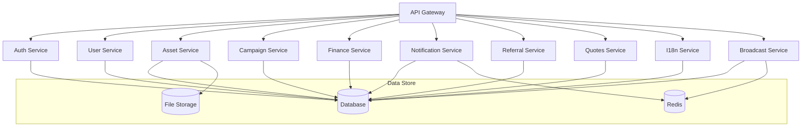
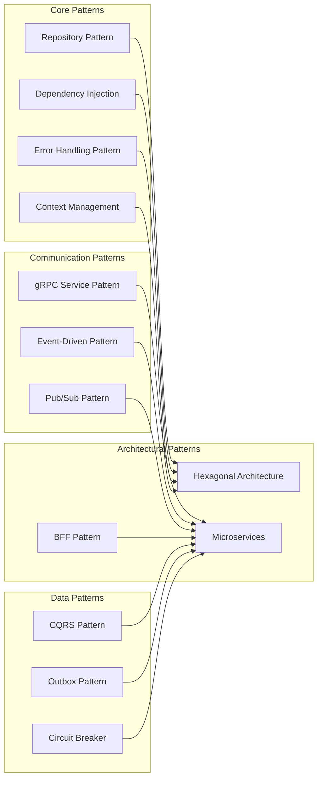
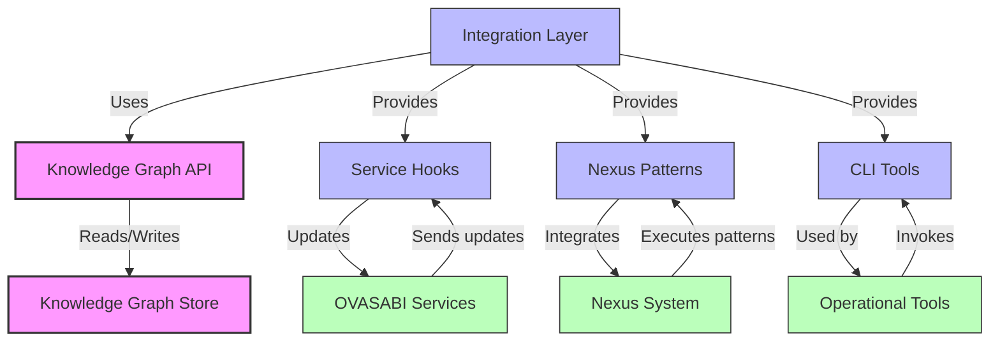
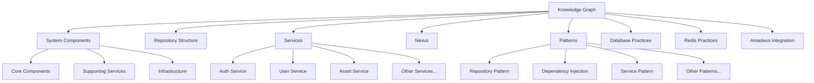

# Documentation

version: 2025-05-14

version: 2025-05-14

version: 2025-05-14

Welcome to the Amadeus Knowledge Graph documentation. This system provides a comprehensive and
programmatically accessible knowledge graph of all system components and their relationships.

## System Overview

The Amadeus Knowledge Graph serves as both documentation and a runtime-accessible knowledge
repository that evolves with the system. It helps maintain a consistent understanding of the system
architecture, components, and their relationships.

## Documentation

- [Quick Start Guide](quick_start.md)
- [Implementation Guide](implementation_guide.md)
- [Integration Examples](integration_examples.md)
- [Consistent Updates](consistent_updates.md)
- [Backup & Restore](backup_restore.md)
- [System Context](amadeus_context.md)
- [Architecture](architecture.md)
- [API Reference](api_reference.md)

## Diagrams

### Service Architecture

### Common Patterns

### Amadeus Architecture

### Knowledge Graph Structure

## Getting Help

If you need help with Amadeus Knowledge Graph, please check the documentation or contact the OVASABI
platform team.

## Contributing

To contribute to Amadeus Knowledge Graph:

1. Fork the repository
2. Make your changes
3. Add tests for new functionality
4. Submit a pull request

## License

Amadeus Knowledge Graph is part of the OVASABI platform and is licensed under the same terms.
