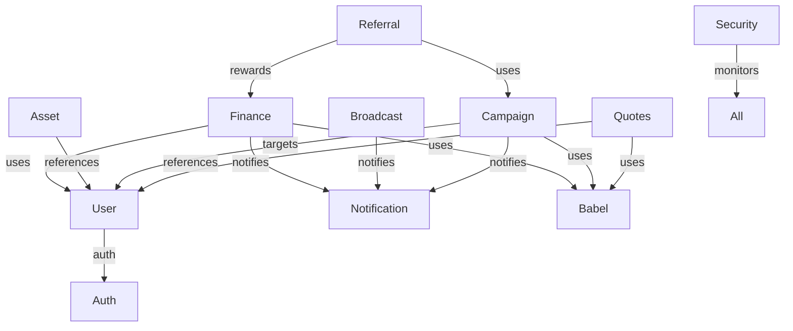
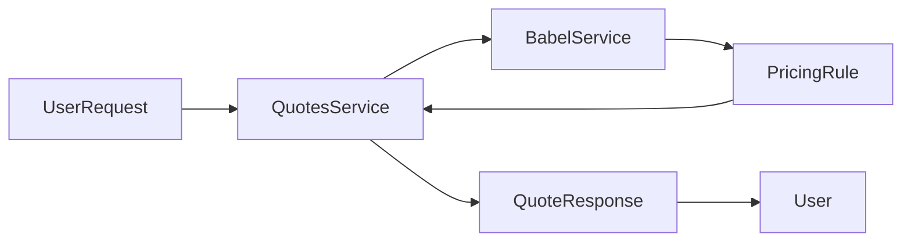

# OVASABI Service Network Overview

This document provides a central, living map of the OVASABI platform's services, their relationships, current status, unimplemented logic, and potential improvements. It is designed for both AI and human contributors to quickly understand, extend, and maintain the system.

---

## 1. Service Table

| Service         | Status      | Key APIs/Endpoints         | Depends On                | Consumes Babel? | Observability | Unimplemented Logic / TODOs         | Potential Improvements                |
|-----------------|-------------|----------------------------|---------------------------|-----------------|--------------|-------------------------------------|----------------------------------------|
| Finance         | Implemented | Create, Get, List, Pay     | User, Notification        | Yes             | Yes          | Advanced analytics, ML fraud        | More granular metrics, ML integration  |
| User            | Implemented | CRUD, Roles, Search        | Auth                      | No              | Yes          | SSO, OAuth, external IDP            | Add SSO, improve profile templates     |
| Auth            | Implemented | Login, Token, OTP, Events  | User                      | No              | Yes          | Passwordless, quantum-safe crypto   | Add passwordless, hardware keys        |
| Asset           | Implemented | Upload, Get, Optimize      | User, CDN, S3             | No              | Yes          | Media processing, AI optimization   | Integrate media/AI pipeline            |
| Broadcast       | Implemented | Publish, Subscribe, Topics | User, Notification        | No              | Yes          | Smart routing, analytics            | Add ML-based routing, analytics        |
| Campaign        | Implemented | CRUD, Metrics, Orchestration| User, Notification, Babel | Yes             | Yes          | A/B testing, smart targeting        | Add ML targeting, real-time analytics  |
| Notification    | Implemented | Send, Prefs, Mark, Delete  | User, Broadcast           | No              | Yes          | Rich media, cross-channel           | Add interactive, analytics, ML timing  |
| Quotes          | Implemented | Create, Get, List          | User, Babel               | Yes             | Yes          | Real-time updates, trend analytics  | Add WebSocket, advanced analytics      |
| Referral        | Implemented | Create, Get, Stats         | User, Campaign, Finance   | No              | Yes          | Multi-level, loyalty, fraud detect  | Add social, ML fraud, loyalty          |
| Security        | Designed    | IAM, Threat, Privacy       | All                       | No              | Yes          | AI threat, quantum-safe, ZKP        | Integrate with all, add AI/quantum     |

---

## 2. Service Relationship Diagram

---

## 3. Unimplemented Logic & TODOs

- **Finance**: ML-based fraud detection, predictive analytics, multi-currency, smart reporting.
- **User**: SSO, OAuth, external identity providers, advanced roles, behavior analysis.
- **Auth**: Passwordless, hardware keys, quantum-safe crypto, adaptive policies.
- **Asset**: Media/AI processing, auto-optimization, content analysis.
- **Broadcast**: ML-based routing, smart retries, analytics integration.
- **Campaign**: A/B testing, ML targeting, real-time analytics, behavioral targeting.
- **Notification**: Rich media, interactive notifications, ML-based timing, cross-channel coordination.
- **Quotes**: Real-time updates, trend/pattern analytics, WebSocket support.
- **Referral**: Multi-level, loyalty integration, ML-based fraud detection, social integration.
- **Security**: AI-driven threat detection, quantum-safe, zero-knowledge proofs, full integration with all services.

---

## 4. Potential Improvements

- **Observability**: Add more granular metrics, distributed tracing, and alerting for all services.
- **Testing**: Increase integration and end-to-end test coverage, especially for cross-service flows.
- **Docs**: Auto-generate API docs from proto files, keep service READMEs in sync with code.
- **CI/CD**: Enforce pre-merge checks for docs, tests, and code quality.
- **Babel**: Expand pricing rules, add more locales, automate rule updates from external data.
- **Amadeus**: Expose a queryable API for the knowledge graph, enable real-time impact analysis.
- **Security**: Integrate security checks and threat monitoring into CI/CD and runtime.

---

## 5. Data Flow Example: Quote Generation

---

## 6. Glossary

- **Provider/DI**: Central dependency injection container and service registry.
- **Babel**: Unified service for i18n and location-based pricing.
- **Amadeus**: Knowledge graph and system documentation engine.
- **Nexus**: Orchestration and pattern engine.
- **Service Registration**: Registering a service with both Amadeus and the DI container.
- **Health/Metrics**: Endpoints for service health and Prometheus metrics.
- **Master Repository**: Central DB abstraction for cross-service data.
- **Pattern**: Reusable orchestration or data flow template in Nexus/Amadeus.

---

**This file should be updated regularly as services evolve, new features are implemented, and relationships change.** 