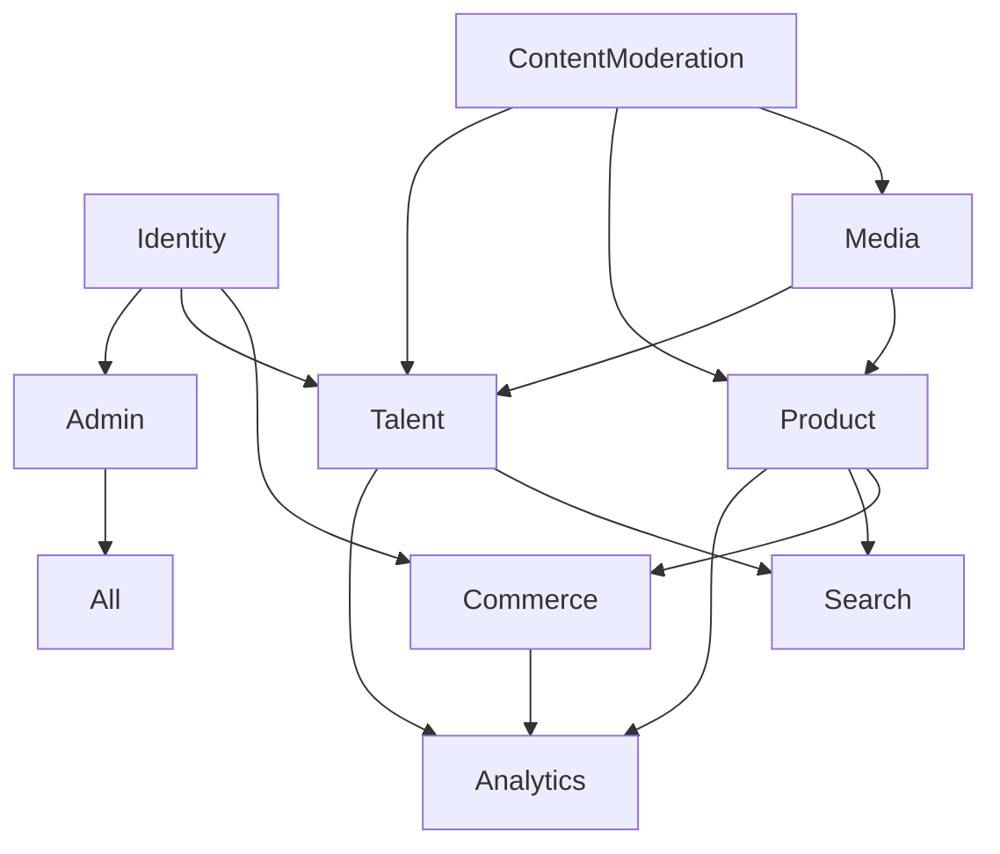

# Documentation

version: 2025-05-14

version: 2025-05-14

version: 2025-05-14

> This document summarizes how leading platforms implement each core service in a modular, extensible, and analytics-ready way. It is intended as a reference for OVASABI/Amadeus contributors and is tightly linked to the [Amadeus Context](amadeus_context.md).

---

## 1. Identity Service (User/Auth)
- **Best Practices:**
  - Use OAuth2/OIDC, RBAC, event sourcing for audit, extensible user profiles.
  - Support SSO, social login, MFA, and SCIM for enterprise.
  - API design: `/users`, `/sessions`, `/roles`, `/permissions`, `/audit-logs`.
- **References:**
  - [Keycloak API Docs](https://www.keycloak.org/docs-api/)
  - [Auth0 API Docs](https://auth0.com/docs/api)
  - [dexidp/dex](https://github.com/dexidp/dex)
- **Integration Points:** All services (esp. Commerce, Talent, Admin)
- **Knowledge Graph Links:** Registers user entities, relationships to sessions, roles, and audit events.

## 2. Media Service
- **Best Practices:**
  - Use object storage (S3, R2), CDN, signed URLs, metadata indexing, async processing for transcoding.
  - API design: `/media/upload`, `/media/{id}`, `/media/{id}/transform`, `/media/{id}/metadata`.
- **References:**
  - [Cloudinary API Docs](https://cloudinary.com/documentation/image_upload_api_reference)
  - [imgproxy](https://github.com/imgproxy/imgproxy)
- **Integration Points:** Product, Talent, ContentModeration
- **Knowledge Graph Links:** Tracks asset ownership, links to user/product/talent entities.

## 3. Product Service
- **Best Practices:**
  - Master-client-event DB pattern, flexible attributes (JSONB), inventory/events, analytics hooks.
  - API design: `/products`, `/products/{id}`, `/products/{id}/inventory`, `/products/{id}/events`.
- **References:**
  - [Shopify Admin API](https://shopify.dev/docs/api/admin-rest)
  - [Vendure API](https://www.vendure.io/docs/graphql-api/)
- **Integration Points:** Commerce, Media, Search, Analytics
- **Knowledge Graph Links:** Product entities, links to media, pricing, inventory, and analytics events.

## 4. Talent Service
- **Best Practices:**
  - Profile enrichment, skills graph, endorsements, availability, event-driven updates.
  - API design: `/talent`, `/talent/{id}`, `/talent/{id}/skills`, `/talent/{id}/endorsements`.
- **References:**
  - [Upwork API](https://developers.upwork.com/)
  - [LinkedIn API](https://docs.microsoft.com/en-us/linkedin/)
- **Integration Points:** Identity, Product, Search, Analytics
- **Knowledge Graph Links:** Talent entities, relationships to products, endorsements, and analytics.

## 5. Commerce Service
- **Best Practices:**
  - Payment provider abstraction, order/event tables, fraud detection, extensible pricing.
  - API design: `/orders`, `/orders/{id}`, `/payments`, `/refunds`, `/pricing`.
- **References:**
  - [Stripe API Docs](https://stripe.com/docs/api)
  - [Adyen API Docs](https://docs.adyen.com/api-explorer/)
- **Integration Points:** Product, Identity, Finance, Analytics
- **Knowledge Graph Links:** Orders, transactions, links to users/products, payment events.

## 6. Search Service
- **Best Practices:**
  - Indexing (Algolia/Elasticsearch), denormalized search docs, analytics on queries.
  - API design: `/search`, `/search/index`, `/search/analytics`.
- **References:**
  - [Algolia API Docs](https://www.algolia.com/doc/api-client/)
  - [Elasticsearch API Docs](https://www.elastic.co/guide/en/elasticsearch/reference/current/rest-apis.html)
- **Integration Points:** Product, Talent, ContentModeration
- **Knowledge Graph Links:** Search indices, links to product/talent/content entities.

## 7. Content Moderation
- **Best Practices:**
  - ML-based moderation, event-driven review, audit logs.
  - API design: `/moderation`, `/moderation/{id}`, `/moderation/events`.
- **References:**
  - [Perspective API](https://www.perspectiveapi.com/)
  - [OpenAI Moderation API](https://platform.openai.com/docs/guides/moderation)
- **Integration Points:** Media, Product, Talent, Admin
- **Knowledge Graph Links:** Moderation events, links to content entities.

## 8. Analytics Service
- **Best Practices:**
  - Event sourcing, time-series DB, user/product/talent analytics, privacy compliance.
  - API design: `/analytics/events`, `/analytics/aggregate`, `/analytics/entities/{id}`.
- **References:**
  - [Snowplow API](https://docs.snowplow.io/docs/collecting-data/collecting-from-own-applications/http-api/)
  - [ClickHouse API](https://clickhouse.com/docs/en/interfaces/http)
- **Integration Points:** All services
- **Knowledge Graph Links:** Analytics events, relationships to all tracked entities.

## 9. Admin Service
- **Best Practices:**
  - Policy-based access, audit trails, impersonation, system health dashboards.
  - API design: `/admin/users`, `/admin/audit`, `/admin/policies`, `/admin/impersonate`.
- **References:**
  - [Open Policy Agent API](https://www.openpolicyagent.org/docs/latest/rest-api/)
  - [Temporal API](https://docs.temporal.io/api/)
- **Integration Points:** All services
- **Knowledge Graph Links:** Admin actions, policy relationships, audit events.

---

## Service Relationship Diagram

---

## How to Use This Guide

- **For new service design:** Start here, then update [amadeus_context.md](amadeus_context.md) and the knowledge graph.
- **For refactoring:** Use these patterns to ensure extensibility and analytics readiness.
- **For knowledge graph updates:** Explicitly document new/changed relationships and integration points.

---

## Improving the Knowledge Graph

- When adding or updating a service, reference the best practices and API patterns here.
- Use the integration points and relationship diagrams to update the `services`, `patterns`, and `nexus` sections of the knowledge graph.
- Ensure all new endpoints, events, and relationships are reflected in the knowledge graph JSON and Amadeus context.
- For each service, document dependencies, extensibility points, and analytics hooks in the knowledge graph.

---

## References

- [Amadeus Context](amadeus_context.md)
- [Super Knowledge Graph](super_knowledge_graph.md)
- [Implementation Guide](implementation_guide.md) 
