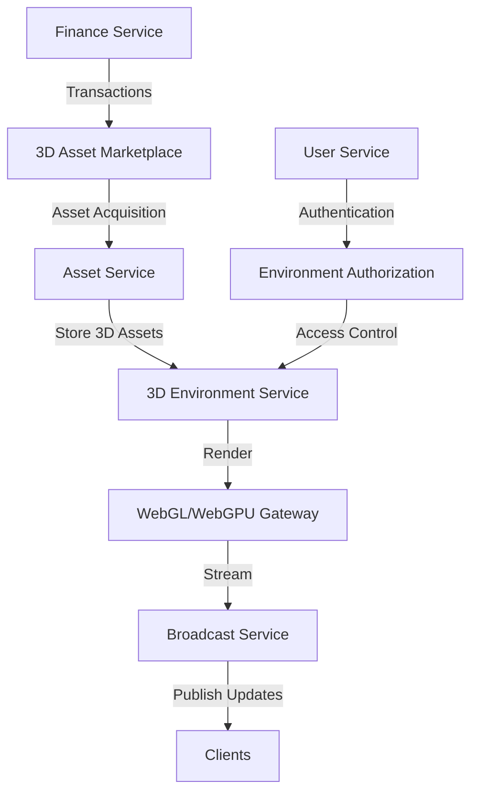

# Experimental Features and Integrations

## Real-Time 3D Environmental Systems

This document outlines experimental approaches for integrating real-time 3D environmental patterns,
assets, live environments, and animations with the OVASABI platform architecture.

### Overview

The OVASABI platform's existing service architecture provides a solid foundation for extending into
real-time 3D capabilities. By leveraging the asset management, broadcast, and notification services
alongside new specialized 3D rendering services, we can create a powerful ecosystem for 3D content
creation, sharing, and real-time interaction.

### System Architecture for 3D Integration



### New Service Components

#### 1. 3D Environment Service

A new service responsible for:

- 3D scene composition from asset components
- Physics simulation and environment logic
- Real-time state management
- Environment persistence

**Integration Pattern:**

```go
// 3D Environment Pattern
{
    "id": "3d_environment_creation",
    "steps": [
        {
            "type": "asset",
            "action": "batch_query",
            "parameters": {
                "asset_types": ["3d_model", "texture", "material", "sound"],
                "metadata": {
                    "environment_id": "{environment_id}"
                }
            }
        },
        {
            "type": "3d_environment",
            "action": "compose_scene",
            "parameters": {
                "assets": "{asset_results}",
                "physics_enabled": true,
                "lighting_model": "dynamic"
            },
            "depends_on": ["batch_query"]
        },
        {
            "type": "broadcast",
            "action": "create_channel",
            "parameters": {
                "type": "environment_state",
                "persistence": "transient",
                "rate_limit": "60hz"
            },
            "depends_on": ["compose_scene"]
        }
    ]
}
```

#### 2. Real-Time Animation System

Extends the Asset Service with:

- Skeletal animation processing
- Procedural animation generation
- Animation blending and transitions
- Real-time animation state machines

**Integration Pattern:**

```go
// Real-Time Animation Pattern
{
    "id": "realtime_animation_flow",
    "steps": [
        {
            "type": "asset",
            "action": "get_animated_model",
            "parameters": {
                "asset_id": "{model_id}",
                "include_animations": true
            }
        },
        {
            "type": "animation",
            "action": "create_state_machine",
            "parameters": {
                "model_data": "{asset_result}",
                "default_state": "idle",
                "transitions": [
                    {
                        "from": "idle",
                        "to": "walk",
                        "condition": "velocity > 0.1"
                    },
                    {
                        "from": "walk",
                        "to": "run",
                        "condition": "velocity > 2.0"
                    }
                ]
            },
            "depends_on": ["get_animated_model"]
        },
        {
            "type": "broadcast",
            "action": "publish",
            "parameters": {
                "channel": "entity_animations",
                "target_id": "{entity_id}",
                "data": "{animation_state}"
            },
            "depends_on": ["create_state_machine"]
        }
    ]
}
```

#### 3. Environmental Pattern Generator

A specialized service for:

- Procedural environment generation
- Pattern-based content creation
- Dynamic environment modification
- Rule-based environment behaviors

**Integration Pattern:**

```go
// Environmental Pattern Generation
{
    "id": "procedural_environment",
    "steps": [
        {
            "type": "pattern_generator",
            "action": "generate_terrain",
            "parameters": {
                "algorithm": "perlin_noise",
                "size": {
                    "x": 1024,
                    "y": 1024
                },
                "parameters": {
                    "octaves": 8,
                    "persistence": 0.5
                }
            }
        },
        {
            "type": "pattern_generator",
            "action": "populate_entities",
            "parameters": {
                "terrain": "{generate_terrain_result}",
                "distribution_rules": [
                    {
                        "asset_type": "tree",
                        "density": 0.3,
                        "conditions": "height > 0.2 && slope < 30"
                    },
                    {
                        "asset_type": "rock",
                        "density": 0.1,
                        "conditions": "height > 0.1"
                    }
                ]
            },
            "depends_on": ["generate_terrain"]
        },
        {
            "type": "asset",
            "action": "batch_create",
            "parameters": {
                "assets": "{populate_entities_result}",
                "storage_policy": "environment_linked"
            },
            "depends_on": ["populate_entities"]
        }
    ]
}
```

### Technical Architecture

#### WebGL/WebGPU Integration

The system can expose 3D environments to web clients via:

1. **Direct WebGL/WebGPU Rendering**

   - OVASABI services provide scene data
   - Client-side rendering engines (Three.js, Babylon.js) process and display
   - WebSocket connections for state synchronization

2. **Server-Side Rendering with Streaming**
   - GPU-equipped servers render frames
   - Video streaming to thin clients
   - WebRTC for low-latency delivery

#### Asset Pipeline Extensions

The existing Asset Service can be extended with:

- 3D model optimization and LOD generation
- Material and texture processing
- Animation data standardization
- Asset dependency management

```go
// 3D Asset Processing Pipeline
{
    "id": "3d_asset_processing",
    "steps": [
        {
            "type": "asset",
            "action": "upload",
            "parameters": {
                "asset_type": "3d_model",
                "format": "glTF"
            }
        },
        {
            "type": "asset_processor",
            "action": "optimize_model",
            "parameters": {
                "target_formats": ["glTF", "WebGL_binary"],
                "generate_lod": true,
                "lod_levels": 3,
                "compress_textures": true
            },
            "depends_on": ["upload"]
        },
        {
            "type": "asset",
            "action": "update",
            "parameters": {
                "asset_id": "{asset_id}",
                "metadata": {
                    "optimized": true,
                    "formats": "{target_formats}",
                    "size_reduction": "{optimization_stats.size_reduction}"
                }
            },
            "depends_on": ["optimize_model"]
        }
    ]
}
```

### Real-Time Data Synchronization

Leveraging the existing Broadcast Service for:

- Entity position and state synchronization
- Physics state replication
- Environment modification events
- User interaction events

**Enhanced Broadcast Pattern for 3D:**

```go
// Real-Time 3D Broadcast Pattern
{
    "id": "3d_state_broadcast",
    "steps": [
        {
            "type": "broadcast",
            "action": "create_channel",
            "parameters": {
                "name": "environment_{id}",
                "type": "spatial",
                "partitioning": {
                    "type": "grid",
                    "cell_size": 50,
                    "dimensions": 3
                }
            }
        },
        {
            "type": "broadcast",
            "action": "subscribe",
            "parameters": {
                "channel": "environment_{id}",
                "subscriber_type": "user",
                "spatial_position": {
                    "x": "{user_position.x}",
                    "y": "{user_position.y}",
                    "z": "{user_position.z}"
                },
                "interest_radius": 100
            },
            "depends_on": ["create_channel"]
        }
    ]
}
```

### User-Environment Interactions

Combining User Service and new 3D capabilities for:

- User avatar representation in 3D space
- Multi-user collaboration in shared environments
- Permission-based environment modification
- Environment ownership and access control

**Integration with User Service:**

```go
// User-Environment Interaction Pattern
{
    "id": "user_environment_interaction",
    "steps": [
        {
            "type": "user",
            "action": "get_profile",
            "parameters": {
                "include_avatar": true
            }
        },
        {
            "type": "3d_environment",
            "action": "join",
            "parameters": {
                "environment_id": "{environment_id}",
                "user_data": "{user_profile}",
                "initial_position": {
                    "x": 0, "y": 0, "z": 0
                },
                "permissions": [
                    "view", "move", "interact"
                ]
            },
            "depends_on": ["get_profile"]
        },
        {
            "type": "broadcast",
            "action": "publish",
            "parameters": {
                "channel": "environment_{id}.users",
                "event": "user_joined",
                "data": {
                    "user_id": "{user_id}",
                    "avatar_data": "{user_profile.avatar}",
                    "position": "{initial_position}"
                }
            },
            "depends_on": ["join"]
        }
    ]
}
```

### Finance and Asset Marketplace Integration

Leveraging the Finance Service for:

- 3D asset marketplace
- Virtual land/environment ownership
- Creator economy and royalties
- Virtual goods transactions

## Implementation Roadmap

1. **Phase 1: Foundation**

   - Extend Asset Service for 3D model support
   - Implement basic WebGL/WebGPU gateway
   - Create environment composition service

2. **Phase 2: Real-Time Capabilities**

   - Enhance Broadcast Service for spatial data
   - Implement animation systems
   - Develop environment state synchronization

3. **Phase 3: Advanced Features**

   - Add procedural generation capabilities
   - Implement physics simulation
   - Create marketplace for 3D assets

4. **Phase 4: Scale and Optimize**
   - Implement spatial partitioning for large environments
   - Add server-side rendering capabilities
   - Optimize for mobile devices

## Technical Considerations

### Performance Requirements

- High-frequency state updates (60+ Hz)
- Low-latency networking (<100ms for real-time interactions)
- Efficient asset streaming and caching
- Scalable concurrent user support

### Storage Requirements

- Large asset storage capacity
- Environment persistence
- Version control for environments
- Asset dependency management

### Processing Requirements

- GPU-accelerated servers for rendering
- Physics simulation nodes
- Asset processing pipeline

## Conclusion

By extending the OVASABI platform with specialized 3D services while leveraging existing asset
management, broadcast, and user service capabilities, we can create a powerful ecosystem for
real-time 3D environmental applications. This approach maintains the platform's architectural
patterns while opening up new possibilities for immersive applications, digital twin environments,
and interactive 3D experiences.
