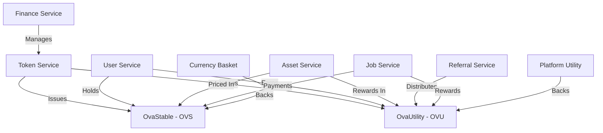
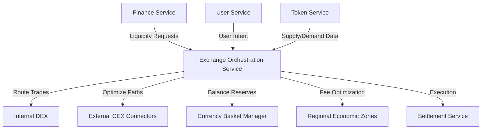

# Documentation

version: 2025-05-14

version: 2025-05-14

version: 2025-05-14

## Multi-Currency Token System with Economic Incentives

This document outlines an experimental approach for implementing a basket-pegged currency and
utility token system within the OVASABI platform. The design leverages existing services while
adding specialized token functionality to create a comprehensive economic ecosystem.

### Overview

The token system extends the OVASABI platform with a dual-token approach:

1. **OvaStable (OVS)**: A basket-pegged stablecoin backed by a mix of currencies
2. **OvaUtility (OVU)**: A utility token for platform access, rewards, and governance

This architecture integrates deeply with existing finance, user, asset, and referral services to
create a self-sustaining economic ecosystem that incentivizes platform growth, rewards contribution,
and enables economic opportunities.

### System Architecture



### Token Design

#### 1. OvaStable (OVS) - Basket-Pegged Currency

The OvaStable token is designed as a stablecoin backed by a currency basket with the following
properties:

**Currency Basket Composition:**

- Nigerian Naira (NGN): 25%
- US Dollar (USD): 20%
- Euro (EUR): 20%
- Chinese Yuan (CNY): 20%
- British Pound (GBP): 15%

**Stability Mechanism:**

- Full reserve backing (100% of tokens backed by held currencies)
- Dynamic rebalancing based on currency volatility
- Slight bias toward Naira stability during high-volatility periods

**Implementation Pattern:**

```go
// OvaStable Token Pattern
{
    "id": "ovastable_creation",
    "steps": [
        {
            "type": "finance",
            "action": "create_token",
            "parameters": {
                "token_type": "stable",
                "token_name": "OvaStable",
                "token_symbol": "OVS",
                "backing_mechanism": "currency_basket",
                "basket": {
                    "NGN": 0.25,
                    "USD": 0.20,
                    "EUR": 0.20,
                    "CNY": 0.20,
                    "GBP": 0.15
                },
                "initial_supply": 1000000,
                "minting_policy": "backed_only"
            }
        },
        {
            "type": "finance",
            "action": "create_reserves",
            "parameters": {
                "token_id": "{token_id}",
                "reserve_currencies": ["NGN", "USD", "EUR", "CNY", "GBP"],
                "initial_funding": {
                    "amount": 1000000,
                    "currency": "USD"
                },
                "reserve_ratio": 1.0
            },
            "depends_on": ["create_token"]
        },
        {
            "type": "finance",
            "action": "create_exchange",
            "parameters": {
                "token_id": "{token_id}",
                "supported_currencies": ["NGN", "USD", "EUR", "CNY", "GBP"],
                "fee_structure": {
                    "base_fee": 0.005,
                    "discount_token": "OVU"
                }
            },
            "depends_on": ["create_reserves"]
        }
    ]
}
```

#### 2. OvaUtility (OVU) - Platform Utility Token

The OvaUtility token serves as the platform's internal utility token with the following
characteristics:

**Token Utility:**

- Platform access and premium features
- Fee discounts for transactions
- Governance voting rights
- Staking rewards
- Talent/skill certification

**Distribution Mechanism:**

- Universal basic income (UBI) for active verified users
- Rewards for platform contribution
- Referral bonuses
- Task completion incentives
- Initial allocation for early adopters

**Implementation Pattern:**

```go
// OvaUtility Token Pattern
{
    "id": "ovautility_creation",
    "steps": [
        {
            "type": "finance",
            "action": "create_token",
            "parameters": {
                "token_type": "utility",
                "token_name": "OvaUtility",
                "token_symbol": "OVU",
                "backing_mechanism": "platform_utility",
                "initial_supply": 100000000,
                "minting_policy": "controlled_inflation",
                "inflation_rate": {
                    "initial": 0.05,
                    "minimum": 0.01,
                    "decay": 0.1
                }
            }
        },
        {
            "type": "finance",
            "action": "create_distribution",
            "parameters": {
                "token_id": "{token_id}",
                "allocation": {
                    "ecosystem_rewards": 0.40,
                    "development": 0.20,
                    "founding_team": 0.15,
                    "community": 0.15,
                    "reserve": 0.10
                },
                "vesting": {
                    "ecosystem_rewards": "none",
                    "development": "4_years_linear",
                    "founding_team": "4_years_cliff_1_year",
                    "community": "2_years_linear",
                    "reserve": "locked_1_year"
                }
            },
            "depends_on": ["create_token"]
        },
        {
            "type": "finance",
            "action": "create_staking",
            "parameters": {
                "token_id": "{token_id}",
                "staking_tiers": [
                    {
                        "name": "Basic",
                        "minimum_stake": 100,
                        "benefits": ["fee_discount_5", "basic_features"]
                    },
                    {
                        "name": "Premium",
                        "minimum_stake": 1000,
                        "benefits": ["fee_discount_15", "premium_features"]
                    },
                    {
                        "name": "Enterprise",
                        "minimum_stake": 10000,
                        "benefits": ["fee_discount_30", "enterprise_features"]
                    }
                ],
                "reward_rate": 0.08
            },
            "depends_on": ["create_distribution"]
        }
    ]
}
```

### Universal Basic Income (UBI) Implementation

The system implements a Universal Basic Income for verified active users, distributing OVU tokens
based on local economic conditions:

**UBI Distribution Pattern:**

```go
// Universal Basic Income Pattern
{
    "id": "universal_basic_income",
    "steps": [
        {
            "type": "user",
            "action": "verify_identity",
            "parameters": {
                "verification_level": "full",
                "required_documents": ["government_id", "biometric"]
            }
        },
        {
            "type": "i18n",
            "action": "get_local_economic_metrics",
            "parameters": {
                "user_location": "{user_location}",
                "metrics": ["cost_of_living", "minimum_wage", "average_income"]
            },
            "depends_on": ["verify_identity"]
        },
        {
            "type": "finance",
            "action": "create_ubi_distribution",
            "parameters": {
                "token": "OVU",
                "distribution_frequency": "weekly",
                "base_amount": 100,
                "localization_factor": "{economic_metrics}",
                "activity_requirements": {
                    "login_frequency": "weekly",
                    "minimum_transactions": 1
                }
            },
            "depends_on": ["get_local_economic_metrics"]
        }
    ]
}
```

### Integration with Existing Services

#### 1. Finance Service Integration

The Finance Service is extended to manage token issuance, distribution, and exchange:

**Finance Service Extensions:**

- Token management module
- Currency basket management
- Reserve monitoring and adjustment
- Exchange rate mechanism
- Automated distribution system

**Implementation Considerations:**

- Real-time exchange rate feeds
- Reserve auditing mechanism
- Regulatory compliance by jurisdiction
- Liquidity management

#### 2. User Service Integration

The User Service is enhanced to incorporate token balances, rewards, and economic activity:

**User Service Extensions:**

- Token wallet integration
- UBI eligibility tracking
- Identity verification levels
- Reputation and contribution metrics
- Token-gated feature access

**User Economic Profile:**

```go
// User Economic Profile Extension
{
    "id": "user_economic_profile",
    "steps": [
        {
            "type": "user",
            "action": "extend_profile",
            "parameters": {
                "new_fields": [
                    {
                        "name": "economic_profile",
                        "schema": {
                            "wallet_address": "string",
                            "token_balances": {
                                "OVS": "decimal",
                                "OVU": "decimal"
                            },
                            "contribution_score": "integer",
                            "ubi_eligibility": "boolean",
                            "verification_level": "string",
                            "staking_position": {
                                "amount": "decimal",
                                "tier": "string",
                                "locked_until": "timestamp"
                            }
                        }
                    }
                ]
            }
        },
        {
            "type": "finance",
            "action": "create_wallet",
            "parameters": {
                "user_id": "{user_id}",
                "wallet_type": "token",
                "supported_tokens": ["OVS", "OVU"]
            },
            "depends_on": ["extend_profile"]
        }
    ]
}
```

#### 3. Asset Service Integration

The Asset Service links digital assets with token economy:

**Asset Service Extensions:**

- Token-based pricing for assets
- Fractional ownership of assets
- Asset marketplace with token payments
- Creator royalties in tokens

```go
// Asset Tokenization Pattern
{
    "id": "asset_tokenization",
    "steps": [
        {
            "type": "asset",
            "action": "tokenize",
            "parameters": {
                "asset_id": "{asset_id}",
                "token_standard": "fractional",
                "total_fractions": 1000,
                "pricing_token": "OVS",
                "initial_price": 10.0,
                "royalty_percentage": 2.5,
                "creator_wallet": "{creator_wallet}"
            }
        },
        {
            "type": "finance",
            "action": "create_market",
            "parameters": {
                "asset_id": "{tokenized_asset_id}",
                "market_type": "continuous",
                "initial_liquidity": {
                    "token": "OVS",
                    "amount": 1000
                },
                "fee_structure": {
                    "maker": 0.001,
                    "taker": 0.002
                }
            },
            "depends_on": ["tokenize"]
        }
    ]
}
```

#### 4. Referral Service Integration

The Referral Service leverages tokens for growth incentives:

**Referral Service Extensions:**

- Token-based referral rewards
- Multi-level referral program
- Activity-based bonuses
- Team formation incentives

```go
// Token Referral Program
{
    "id": "token_referral_program",
    "steps": [
        {
            "type": "referral",
            "action": "create_program",
            "parameters": {
                "name": "OVU Growth Program",
                "reward_token": "OVU",
                "reward_structure": {
                    "referrer": 50,
                    "referee": 25
                },
                "levels": 3,
                "level_multipliers": [1.0, 0.3, 0.1],
                "qualification_criteria": {
                    "minimum_activity_days": 7,
                    "minimum_transactions": 1
                }
            }
        },
        {
            "type": "referral",
            "action": "create_team_bonus",
            "parameters": {
                "program_id": "{program_id}",
                "team_size_thresholds": [5, 10, 25, 50, 100],
                "bonus_amounts": [100, 250, 750, 2000, 5000],
                "bonus_token": "OVU",
                "activity_requirement": "80_percent_active"
            },
            "depends_on": ["create_program"]
        }
    ]
}
```

### Job and Project Marketplace

A new Job Service creates an economic layer for work and talent:

**Job Service Components:**

- Project listing and bidding
- Escrow for milestone-based payments
- Talent verification and reputation
- Skills marketplace

**Job Service Pattern:**

```go
// Job Marketplace Pattern
{
    "id": "job_marketplace",
    "steps": [
        {
            "type": "job",
            "action": "create_marketplace",
            "parameters": {
                "supported_categories": ["development", "design", "content", "marketing"],
                "payment_tokens": ["OVS"],
                "reward_token": "OVU",
                "fee_structure": {
                    "platform_fee": 0.05,
                    "escrow_fee": 0.01
                },
                "dispute_resolution": "community_vote"
            }
        },
        {
            "type": "job",
            "action": "create_escrow",
            "parameters": {
                "marketplace_id": "{marketplace_id}",
                "escrow_types": [
                    {
                        "name": "milestone",
                        "release_criteria": "client_approval"
                    },
                    {
                        "name": "hourly",
                        "release_criteria": "time_tracking_approved"
                    },
                    {
                        "name": "deliverable",
                        "release_criteria": "submission_approved"
                    }
                ]
            },
            "depends_on": ["create_marketplace"]
        },
        {
            "type": "job",
            "action": "create_reputation_system",
            "parameters": {
                "marketplace_id": "{marketplace_id}",
                "rating_dimensions": ["quality", "communication", "timeliness", "value"],
                "verification_levels": ["basic", "expert", "elite"],
                "verification_requirements": {
                    "basic": "identity_verified",
                    "expert": "skill_assessment",
                    "elite": "peer_review"
                }
            },
            "depends_on": ["create_marketplace"]
        }
    ]
}
```

**Project Creation and Payment Flow:**

```go
// Project Payment Flow
{
    "id": "project_payment_flow",
    "steps": [
        {
            "type": "job",
            "action": "create_project",
            "parameters": {
                "title": "{project_title}",
                "description": "{project_description}",
                "budget": {
                    "amount": "{budget_amount}",
                    "token": "OVS"
                },
                "timeline": "{timeline}",
                "skills_required": "{skills_list}"
            }
        },
        {
            "type": "finance",
            "action": "fund_escrow",
            "parameters": {
                "project_id": "{project_id}",
                "amount": "{budget_amount}",
                "token": "OVS",
                "milestone_breakdown": "{milestone_percentages}"
            },
            "depends_on": ["create_project"]
        },
        {
            "type": "job",
            "action": "assign_talent",
            "parameters": {
                "project_id": "{project_id}",
                "talent_id": "{selected_talent_id}",
                "agreement_terms": "{agreement_terms}"
            },
            "depends_on": ["fund_escrow"]
        },
        {
            "type": "notification",
            "action": "notify_project_start",
            "parameters": {
                "project_id": "{project_id}",
                "recipients": ["{client_id}", "{talent_id}"],
                "template": "project_kickoff",
                "channels": ["email", "push"]
            },
            "depends_on": ["assign_talent"]
        }
    ]
}
```

### Technical Architecture

#### Token Service Implementation

A new Token Service manages the technical implementation of the token system:

**Components:**

- Token smart contracts
- Wallet management
- Transaction processing
- Distribution engine
- Exchange mechanism

**Service Implementation:**

```go
// Token Service Pattern
{
    "id": "token_service_implementation",
    "steps": [
        {
            "type": "service",
            "action": "create_service",
            "parameters": {
                "name": "token",
                "dependencies": ["finance", "user", "asset", "referral"],
                "data_stores": ["token_ledger", "wallet_store", "distribution_store"]
            }
        },
        {
            "type": "service",
            "action": "define_interfaces",
            "parameters": {
                "service_id": "{service_id}",
                "interfaces": [
                    {
                        "name": "TokenManagement",
                        "methods": ["CreateToken", "IssueTokens", "BurnTokens"]
                    },
                    {
                        "name": "WalletOperations",
                        "methods": ["CreateWallet", "Transfer", "GetBalance"]
                    },
                    {
                        "name": "Distribution",
                        "methods": ["ScheduleDistribution", "ProcessDistribution", "TrackEligibility"]
                    },
                    {
                        "name": "Exchange",
                        "methods": ["CreateOrder", "FillOrder", "GetExchangeRate"]
                    }
                ]
            },
            "depends_on": ["create_service"]
        },
        {
            "type": "service",
            "action": "implement_data_model",
            "parameters": {
                "service_id": "{service_id}",
                "models": [
                    {
                        "name": "Token",
                        "fields": [
                            {"name": "ID", "type": "uuid"},
                            {"name": "Name", "type": "string"},
                            {"name": "Symbol", "type": "string"},
                            {"name": "TokenType", "type": "enum"},
                            {"name": "TotalSupply", "type": "decimal"},
                            {"name": "CirculatingSupply", "type": "decimal"},
                            {"name": "BackingMechanism", "type": "string"},
                            {"name": "MintingPolicy", "type": "string"}
                        ]
                    },
                    {
                        "name": "Wallet",
                        "fields": [
                            {"name": "ID", "type": "uuid"},
                            {"name": "UserID", "type": "uuid"},
                            {"name": "Address", "type": "string"},
                            {"name": "Balances", "type": "map<string,decimal>"},
                            {"name": "CreatedAt", "type": "timestamp"}
                        ]
                    },
                    {
                        "name": "Transaction",
                        "fields": [
                            {"name": "ID", "type": "uuid"},
                            {"name": "FromWallet", "type": "string"},
                            {"name": "ToWallet", "type": "string"},
                            {"name": "TokenSymbol", "type": "string"},
                            {"name": "Amount", "type": "decimal"},
                            {"name": "Timestamp", "type": "timestamp"},
                            {"name": "Type", "type": "enum"},
                            {"name": "Status", "type": "enum"}
                        ]
                    }
                ]
            },
            "depends_on": ["define_interfaces"]
        }
    ]
}
```

#### Security Considerations

The token system requires robust security measures:

- Multi-signature wallet controls for reserves
- Hardware security modules for key management
- Rate limiting and anomaly detection
- Regular security audits
- Compliance monitoring by jurisdiction

#### Scalability Requirements

To support the token ecosystem at scale:

- High-throughput transaction processing
- Sharded database architecture for wallet operations
- Optimistic processing with deferred consistency
- Caching layer for balance queries
- Batched processing for distributions

### Implementation Roadmap

1. **Phase 1: Foundation**

   - Core token service implementation
   - OVS stablecoin creation and reserve system
   - Basic wallet integration with User Service
   - Exchange functionality for core currencies

2. **Phase 2: Utility Layer**

   - OVU token implementation
   - Staking mechanisms
   - UBI distribution system
   - Integration with Referral Service

3. **Phase 3: Economic Expansion**

   - Job marketplace implementation
   - Asset tokenization and marketplace
   - Governance mechanisms
   - Advanced reward systems

4. **Phase 4: Scaling and Optimization**
   - Cross-chain interoperability
   - Performance optimization
   - Regulatory compliance expansion
   - Advanced economic instruments

### Regulatory Considerations

The implementation must address varying regulatory requirements:

- Token classification strategy by jurisdiction
- KYC/AML compliance framework
- Reporting mechanisms for relevant authorities
- Reserve auditing and transparency
- Consumer protection measures

### Regional Participation Enhancements

To increase participation from Chinese and European markets, the system implements specialized
regional features:

#### 1. Regional Economic Zones

The platform creates dedicated economic zones for different regional markets:

```go
// Regional Economic Zones Pattern
{
    "id": "regional_economic_zones",
    "steps": [
        {
            "type": "i18n",
            "action": "create_regional_zone",
            "parameters": {
                "region_name": "European Market",
                "primary_currencies": ["EUR", "OVS"],
                "languages": ["en", "de", "fr", "es", "it"],
                "regulatory_framework": "EU_compliant",
                "locale_specific_features": true
            }
        },
        {
            "type": "i18n",
            "action": "create_regional_zone",
            "parameters": {
                "region_name": "Chinese Market",
                "primary_currencies": ["CNY", "OVS"],
                "languages": ["zh-CN", "zh-TW", "en"],
                "regulatory_framework": "China_compliant",
                "locale_specific_features": true
            }
        },
        {
            "type": "marketplace",
            "action": "configure_regional_pricing",
            "parameters": {
                "use_local_currency": true,
                "price_adjustment_factors": {
                    "European": {
                        "base_currency": "EUR",
                        "purchasing_power_adjustment": true
                    },
                    "Chinese": {
                        "base_currency": "CNY",
                        "purchasing_power_adjustment": true
                    }
                }
            },
            "depends_on": ["create_regional_zone"]
        }
    ]
}
```

#### 2. Region-Specific Governance

The platform supports localized governance mechanisms to increase regional stakeholder
participation:

```go
// Regional Governance Pattern
{
    "id": "regional_governance",
    "steps": [
        {
            "type": "governance",
            "action": "create_regional_council",
            "parameters": {
                "region": "European",
                "council_size": 7,
                "election_mechanism": "token_weighted_vote",
                "min_stake_requirement": 10000,
                "term_length_days": 180,
                "decision_powers": ["regional_features", "locale_fees", "regional_initiatives"]
            }
        },
        {
            "type": "governance",
            "action": "create_regional_council",
            "parameters": {
                "region": "Chinese",
                "council_size": 7,
                "election_mechanism": "token_weighted_vote",
                "min_stake_requirement": 10000,
                "term_length_days": 180,
                "decision_powers": ["regional_features", "locale_fees", "regional_initiatives"]
            }
        },
        {
            "type": "finance",
            "action": "allocate_regional_treasury",
            "parameters": {
                "region": "European",
                "initial_funding": {
                    "OVS": 100000,
                    "OVU": 1000000
                },
                "control_mechanism": "council_multisig",
                "spending_limits": {
                    "monthly_cap": 10000,
                    "single_proposal_cap": 5000
                }
            },
            "depends_on": ["create_regional_council"]
        },
        {
            "type": "finance",
            "action": "allocate_regional_treasury",
            "parameters": {
                "region": "Chinese",
                "initial_funding": {
                    "OVS": 100000,
                    "OVU": 1000000
                },
                "control_mechanism": "council_multisig",
                "spending_limits": {
                    "monthly_cap": 10000,
                    "single_proposal_cap": 5000
                }
            },
            "depends_on": ["create_regional_council"]
        }
    ]
}
```

#### 3. Regional Payment Integrations

The system integrates with popular regional payment methods to reduce friction:

```go
// Regional Payment Integrations Pattern
{
    "id": "regional_payment_integrations",
    "steps": [
        {
            "type": "finance",
            "action": "add_payment_methods",
            "parameters": {
                "region": "European",
                "payment_methods": [
                    {
                        "name": "SEPA",
                        "type": "bank_transfer",
                        "currencies": ["EUR"],
                        "processing_time": "1-2_days",
                        "fee_structure": {
                            "percentage": 0.005,
                            "minimum_fee": 1.0
                        }
                    },
                    {
                        "name": "Sofort",
                        "type": "instant_bank",
                        "currencies": ["EUR"],
                        "processing_time": "instant",
                        "fee_structure": {
                            "percentage": 0.01,
                            "minimum_fee": 0.5
                        }
                    }
                ]
            }
        },
        {
            "type": "finance",
            "action": "add_payment_methods",
            "parameters": {
                "region": "Chinese",
                "payment_methods": [
                    {
                        "name": "WeChat Pay",
                        "type": "mobile_payment",
                        "currencies": ["CNY"],
                        "processing_time": "instant",
                        "fee_structure": {
                            "percentage": 0.006,
                            "minimum_fee": 0.1
                        }
                    },
                    {
                        "name": "Alipay",
                        "type": "mobile_payment",
                        "currencies": ["CNY"],
                        "processing_time": "instant",
                        "fee_structure": {
                            "percentage": 0.006,
                            "minimum_fee": 0.1
                        }
                    },
                    {
                        "name": "UnionPay",
                        "type": "card",
                        "currencies": ["CNY"],
                        "processing_time": "instant",
                        "fee_structure": {
                            "percentage": 0.008,
                            "minimum_fee": 0.5
                        }
                    }
                ]
            }
        }
    ]
}
```

#### 4. Localized UBI Distribution

The UBI distribution is enhanced with region-specific factors:

```go
// Regional UBI Enhancement Pattern
{
    "id": "regional_ubi_enhancements",
    "steps": [
        {
            "type": "finance",
            "action": "configure_regional_ubi",
            "parameters": {
                "region": "European",
                "base_amount_multiplier": 1.0,
                "distribution_schedule": "weekly",
                "regional_bonus_pool": {
                    "amount": 100000,
                    "distribution_period": "quarterly",
                    "qualification_criteria": "active_participation"
                },
                "local_economic_indicators": [
                    "eu_minimum_wage_index",
                    "eu_cost_of_living_index"
                ]
            }
        },
        {
            "type": "finance",
            "action": "configure_regional_ubi",
            "parameters": {
                "region": "Chinese",
                "base_amount_multiplier": 1.0,
                "distribution_schedule": "weekly",
                "regional_bonus_pool": {
                    "amount": 100000,
                    "distribution_period": "quarterly",
                    "qualification_criteria": "active_participation"
                },
                "local_economic_indicators": [
                    "cn_minimum_wage_index",
                    "cn_cost_of_living_index"
                ]
            }
        }
    ]
}
```

### Exchange Orchestration Service

A new Exchange Orchestration Service would significantly enhance the token platform by providing
advanced liquidity management, cross-region transactions, and smart trade routing.

#### 1. Exchange Orchestration Service Overview

The Exchange Orchestration Service acts as a specialized middleware layer between the Finance
Service and various internal/external exchange mechanisms:



#### 2. Core Functions

The Exchange Orchestration Service provides these key functions:

1. **Cross-Region Liquidity Pooling**

   - Aggregation of liquidity across all regional markets
   - Smart routing of trades to minimize slippage
   - Dynamic fee adjustment based on regional market conditions

2. **Naira-Optimized Exchange Strategies**

   - Specialized exchange logic for Naira pairs
   - Advanced market-making for Naira liquidity pools
   - Prioritized path-finding for Naira-based settlements

3. **Currency Basket Rebalancing**

   - Proactive reserve management
   - Arbitrage opportunity detection
   - Automated hedging strategies

4. **Smart Order Routing**
   - Transaction cost optimization
   - Exchange-specific execution strategies
   - Multi-hop transaction optimization

#### 3. Implementation Pattern

```go
// Exchange Orchestration Service Pattern
{
    "id": "exchange_orchestration_service",
    "steps": [
        {
            "type": "service",
            "action": "create_service",
            "parameters": {
                "name": "exchange_orchestration",
                "dependencies": ["finance", "token", "user"],
                "data_stores": ["liquidity_pools", "route_cache", "market_conditions"]
            }
        },
        {
            "type": "service",
            "action": "define_interfaces",
            "parameters": {
                "service_id": "{service_id}",
                "interfaces": [
                    {
                        "name": "LiquidityManager",
                        "methods": ["GetOptimalPath", "EstimateExecutionCost", "BalancePools"]
                    },
                    {
                        "name": "TradeRouter",
                        "methods": ["RouteTransaction", "SplitOrder", "TrackExecution"]
                    },
                    {
                        "name": "BasketBalancer",
                        "methods": ["MonitorReserves", "TriggerRebalance", "ProjectReserveNeeds"]
                    },
                    {
                        "name": "StrategyManager",
                        "methods": ["DeployStrategy", "EvaluatePerformance", "AdjustParameters"]
                    }
                ]
            },
            "depends_on": ["create_service"]
        }
    ]
}
```

#### 4. Naira-Focused Liquidity Enhancement Pattern

A specialized pattern to enhance Naira liquidity and maintain its weighted importance in the system:

```go
// Naira Liquidity Enhancement Pattern
{
    "id": "naira_liquidity_enhancement",
    "steps": [
        {
            "type": "exchange_orchestration",
            "action": "create_liquidity_strategy",
            "parameters": {
                "target_currency": "NGN",
                "strategy_type": "market_making",
                "priority_level": "high",
                "incentive_structure": {
                    "base_rewards": {
                        "token": "OVU",
                        "amount_factor": 1.5
                    },
                    "depth_rewards": {
                        "tier_thresholds": [10000, 50000, 100000],
                        "tier_multipliers": [1.0, 1.25, 1.5]
                    }
                },
                "spread_targets": {
                    "tight": 0.005,
                    "normal": 0.01,
                    "wide": 0.02
                }
            }
        },
        {
            "type": "finance",
            "action": "allocate_liquidity_fund",
            "parameters": {
                "strategy_id": "{strategy_id}",
                "initial_allocation": {
                    "NGN": 5000000,
                    "OVS": 500000,
                    "OVU": 1000000
                },
                "replenishment_rules": {
                    "threshold": 0.7,
                    "replenishment_amount": 0.2,
                    "max_replenishments": 3
                }
            },
            "depends_on": ["create_liquidity_strategy"]
        },
        {
            "type": "exchange_orchestration",
            "action": "deploy_liquidity_bots",
            "parameters": {
                "strategy_id": "{strategy_id}",
                "bot_types": [
                    {
                        "type": "market_maker",
                        "count": 3,
                        "parameter_ranges": {
                            "order_size": {"min": 100, "max": 5000},
                            "quote_frequency": {"min": 5, "max": 30},
                            "risk_parameters": {
                                "max_exposure": 50000,
                                "max_imbalance": 0.3
                            }
                        }
                    },
                    {
                        "type": "rebalancer",
                        "count": 2,
                        "parameter_ranges": {
                            "threshold_deviation": 0.05,
                            "rebalance_size": {"min": 1000, "max": 10000}
                        }
                    }
                ],
                "monitoring_frequency": 60
            },
            "depends_on": ["allocate_liquidity_fund"]
        }
    ]
}
```

#### 5. Cross-Border Transaction Optimization

A pattern for optimizing transactions between different currency regions:

```go
// Cross-Border Transaction Pattern
{
    "id": "cross_border_transaction_optimization",
    "steps": [
        {
            "type": "exchange_orchestration",
            "action": "create_corridor",
            "parameters": {
                "name": "NGN-EUR Corridor",
                "source_currency": "NGN",
                "destination_currency": "EUR",
                "intermediary_currencies": ["OVS", "USD"],
                "optimization_strategy": "cost_minimization",
                "liquidity_sources": ["internal_pools", "external_partners"]
            }
        },
        {
            "type": "exchange_orchestration",
            "action": "configure_path_finding",
            "parameters": {
                "corridor_id": "{corridor_id}",
                "algorithm": "multi_hop_dijkstra",
                "cost_factors": {
                    "exchange_fee": 1.0,
                    "slippage": 2.0,
                    "time_delay": 0.5
                },
                "constraints": {
                    "max_hops": 3,
                    "max_time": 10000,
                    "minimum_success_probability": 0.99
                }
            },
            "depends_on": ["create_corridor"]
        },
        {
            "type": "exchange_orchestration",
            "action": "create_settlement_strategy",
            "parameters": {
                "corridor_id": "{corridor_id}",
                "settlement_mechanisms": [
                    {
                        "type": "atomic_swap",
                        "priority": 1,
                        "conditions": "sufficient_liquidity"
                    },
                    {
                        "type": "bridge_token",
                        "priority": 2,
                        "bridge_currency": "OVS",
                        "conditions": "default"
                    },
                    {
                        "type": "external_settlement",
                        "priority": 3,
                        "partner": "global_settlement_network",
                        "conditions": "large_volume"
                    }
                ],
                "risk_management": {
                    "timeout_ms": 30000,
                    "rollback_procedure": "automatic",
                    "failure_handling": "retry_alternative_path"
                }
            },
            "depends_on": ["configure_path_finding"]
        }
    ]
}
```

#### 6. Market Intelligence System

To maintain efficient markets across all currency baskets:

```go
// Market Intelligence Pattern
{
    "id": "market_intelligence_system",
    "steps": [
        {
            "type": "exchange_orchestration",
            "action": "create_data_feeds",
            "parameters": {
                "feed_types": [
                    {
                        "type": "price_oracle",
                        "currencies": ["NGN", "USD", "EUR", "CNY", "GBP"],
                        "update_frequency_ms": 5000,
                        "sources": ["internal_markets", "external_exchanges", "central_banks"],
                        "aggregation_method": "median_with_outlier_rejection"
                    },
                    {
                        "type": "liquidity_depth",
                        "currencies": ["NGN", "USD", "EUR", "CNY", "GBP"],
                        "update_frequency_ms": 60000,
                        "depth_levels": [0.1, 0.5, 1.0, 2.0, 5.0],
                        "sources": ["internal_markets", "partner_exchanges"]
                    },
                    {
                        "type": "market_sentiment",
                        "update_frequency_ms": 300000,
                        "indicators": ["volume_change", "price_momentum", "order_imbalance"],
                        "sentiment_calculation": "weighted_indicator_composite"
                    }
                ]
            }
        },
        {
            "type": "exchange_orchestration",
            "action": "create_market_models",
            "parameters": {
                "model_types": [
                    {
                        "type": "liquidity_prediction",
                        "currencies": ["NGN", "USD", "EUR", "CNY", "GBP"],
                        "prediction_horizons": [5, 15, 60, 240],
                        "features": ["time_of_day", "day_of_week", "recent_volume", "volatility"],
                        "algorithm": "gradient_boosting"
                    },
                    {
                        "type": "optimal_reserve_allocation",
                        "update_frequency_ms": 3600000,
                        "optimization_objective": "minimize_rebalance_cost",
                        "constraints": {
                            "min_reserve_ratio": 1.0,
                            "max_single_currency_allocation": 0.3,
                            "liquidity_requirements": {
                                "NGN": "high",
                                "USD": "medium",
                                "EUR": "medium",
                                "CNY": "medium",
                                "GBP": "medium"
                            }
                        }
                    }
                ]
            },
            "depends_on": ["create_data_feeds"]
        },
        {
            "type": "exchange_orchestration",
            "action": "deploy_market_actions",
            "parameters": {
                "action_types": [
                    {
                        "type": "dynamic_fee_adjustment",
                        "target_markets": "all",
                        "adjustment_frequency_ms": 3600000,
                        "fee_range": {
                            "min": 0.001,
                            "max": 0.01,
                            "default": 0.005
                        },
                        "adjustment_factors": [
                            {
                                "factor": "volatility",
                                "weight": 0.4,
                                "direction": "positive"
                            },
                            {
                                "factor": "liquidity",
                                "weight": 0.4,
                                "direction": "negative"
                            },
                            {
                                "factor": "transaction_volume",
                                "weight": 0.2,
                                "direction": "negative"
                            }
                        ]
                    },
                    {
                        "type": "liquidity_incentives",
                        "target_markets": ["NGN_OVS", "NGN_USD", "NGN_EUR", "NGN_CNY"],
                        "incentive_budget": {
                            "token": "OVU",
                            "amount": 10000,
                            "period": "daily"
                        },
                        "distribution_formula": "proportional_to_liquidity_provided",
                        "additional_incentives": {
                            "markets": ["NGN_OVS"],
                            "multiplier": 1.5
                        }
                    }
                ]
            },
            "depends_on": ["create_market_models"]
        }
    ]
}
```

#### 7. Integration with Existing Services

**Finance Service Integration:**

- Provides execution capabilities for trades
- Manages reserve accounts
- Processes settlements

**User Service Integration:**

- User preferences for trading
- Risk profiles and permissions
- KYC/AML verification levels for trade limits

**Token Service Integration:**

- Issues and burns tokens based on exchange activity
- Monitors token velocity and usage patterns
- Implements token-based incentives for liquidity providers

#### 8. Key Benefits of the Exchange Orchestration Service

1. **Enhanced Naira Liquidity**

   - Special liquidity provisions for Naira pairs
   - Incentivized market-making in Naira markets
   - Prioritized execution for Naira transactions

2. **Reduced Cross-Border Friction**

   - Optimized transaction paths between currency zones
   - Minimal slippage through smart routing
   - Lower fees through bulk settlement

3. **Improved Price Stability**

   - Active market-making in all currency pairs
   - Arbitrage detection and exploitation
   - Reserve rebalancing to maintain basket weights

4. **Data-Driven Operations**
   - Real-time market intelligence
   - Predictive liquidity models
   - Dynamic fee optimization

#### 9. Technical Infrastructure Requirements

- Low-latency networking between regions
- High-availability architecture with geographic redundancy
- Real-time data processing pipeline
- Advanced monitoring and alerting systems

#### 10. Security and Compliance Measures

- Transaction signing authority segregation
- Multi-level approval for large trades
- Real-time risk monitoring
- Comprehensive audit logging
- Regulatory reporting integrations

This Exchange Orchestration Service would be fundamental to maintaining the 25% Naira weight in the
currency basket while ensuring efficient markets across all supported currencies and regions.

## Conclusion

This experimental token system leverages the existing OVASABI platform architecture while adding
specialized token functionality to create a comprehensive economic ecosystem. By combining a
basket-pegged stablecoin with a utility token, the system provides both stability and incentive
mechanisms that can drive platform adoption, reward contribution, and enable new economic
opportunities for users.

The integration with existing services ensures that tokens become a native part of the platform
experience rather than a bolted-on feature. This approach enables powerful synergies between user
identity, asset management, financial operations, and referral systems, creating a cohesive economic
layer that enhances all aspects of the platform.
