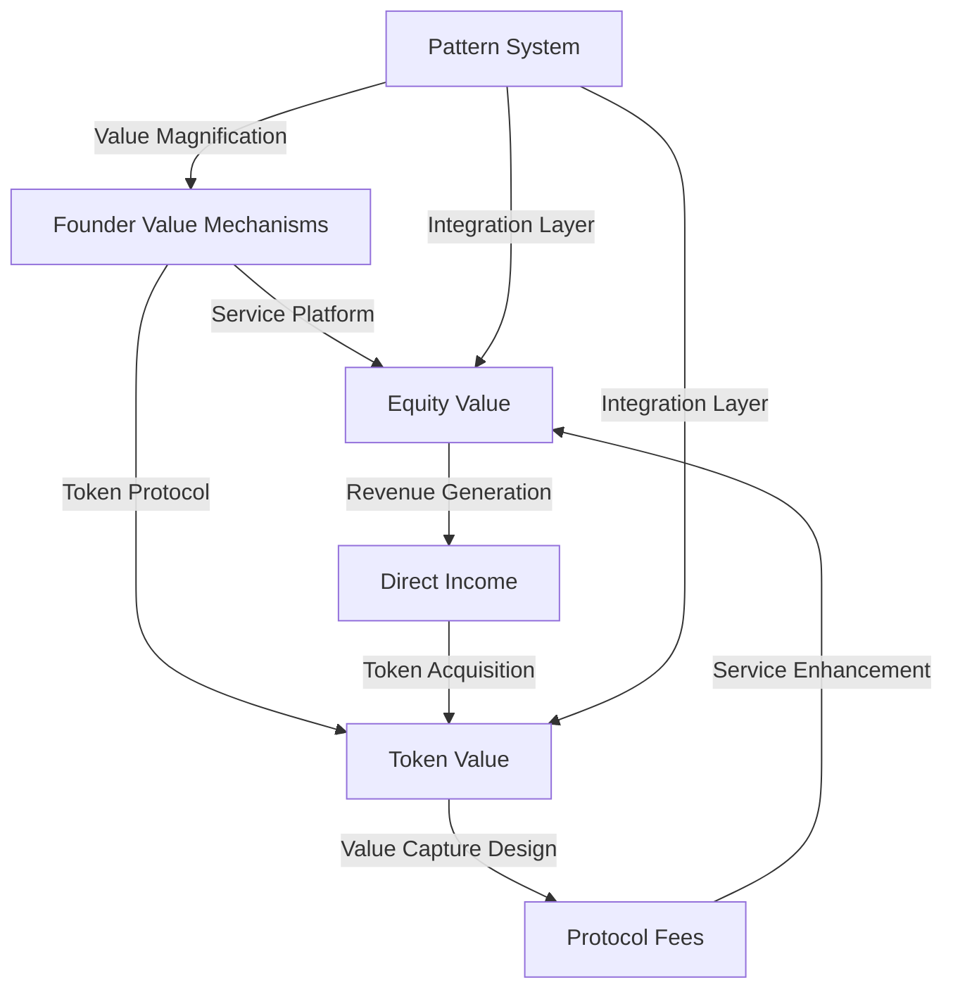
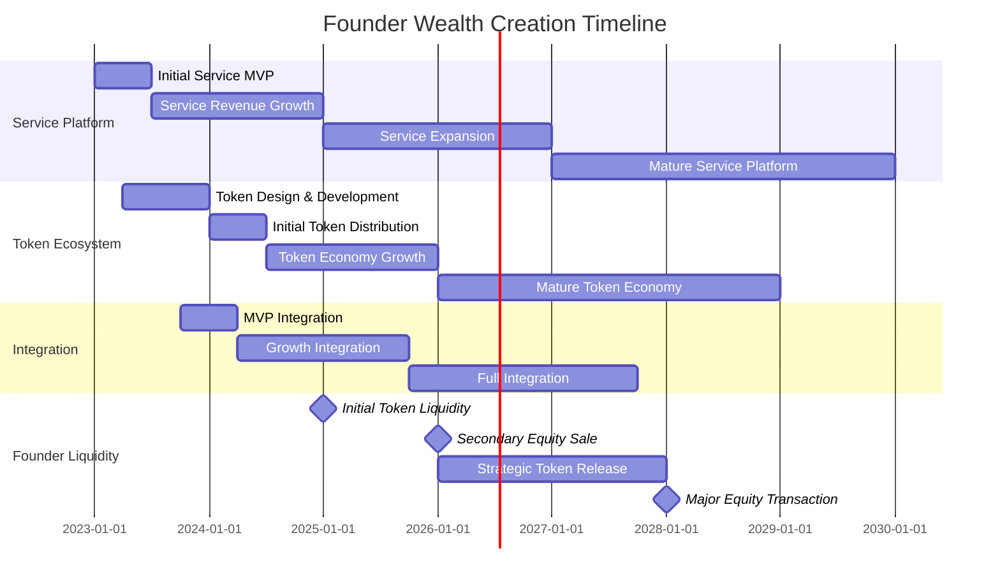

# Integrated Founder Economics: Service-Token Hybrid Model

This document outlines the comprehensive capital accumulation strategy available to the
founder/owner of the OVASABI integrated service-token platform. It details how the pattern-based
architecture enables natural synergies between conventional services and token economics, creating
unprecedented founder wealth creation opportunities with minimal initial resources.

## 1. Multi-Layer Value Capture Framework

### Dual Economic Control Systems

| Control System             | Mechanism                                          | Founder Share              | 10-Year Value Potential |
| -------------------------- | -------------------------------------------------- | -------------------------- | ----------------------- |
| Service Platform Equity    | 75-85% ownership with minimal dilution             | Direct ownership           | $130-390M               |
| Token Ecosystem Allocation | 10-15% of token supply + governance rights         | Protocol-defined           | $250-750M               |
| Revenue Share Rights       | 30-45% of service revenue + 5-10% of protocol fees | Contractual                | $350-1.05B lifetime     |
| **Combined Control Value** | **Multi-layer economic rights**                    | **Reinforcing mechanisms** | **$730M-2.19B**         |

This unique dual control system provides the founder with economic capture capabilities in both
conventional equity and token-based models simultaneously, creating extraordinary value preservation
through market cycles.

### Pattern-Based Value Amplification

The OVASABI pattern system creates natural value amplification through properly designed integration
points:



This pattern-based approach ensures that value capture is architected into the system from the
beginning, rather than being layered on after development.

## 2. Service-Token Mutual Acceleration Mechanisms

### Strategic Founder Position

| Domain                   | Traditional Approach                    | OVASABI Integrated Approach                       | Founder Advantage              |
| ------------------------ | --------------------------------------- | ------------------------------------------------- | ------------------------------ |
| Service Business         | 20-30% founder ownership at Series B    | 60-75% founder ownership at equivalent stage      | 2-3.75× equity preservation    |
| Token Protocol           | 8-12% founder allocation, mostly locked | 10-15% allocation with strategic liquidity design | 25-50% greater token economics |
| Operational Control      | Lost by Series A/B                      | Maintained through dual governance systems        | Strategic autonomy             |
| Wealth Creation Timeline | 7-10 years to liquidity                 | 3-5 years to significant liquidity                | 2-3× acceleration              |

### Integration-Specific Founder Economics

The unique pattern-based integration creates founder-specific benefits:

```go
// Founder Integration Economics Pattern
{
    "id": "founder_integration_economics",
    "steps": [
        {
            "type": "finance",
            "action": "create_founder_allocations",
            "parameters": {
                "service_equity": {
                    "allocation": 0.80,
                    "vesting": "4_year_monthly",
                    "acceleration": {
                        "change_of_control": true,
                        "revenue_milestones": [
                            {"threshold": "$10M ARR", "acceleration": 0.25},
                            {"threshold": "$25M ARR", "acceleration": 0.50},
                            {"threshold": "$50M ARR", "acceleration": 1.00}
                        ]
                    }
                },
                "token_allocation": {
                    "ova_stable": {
                        "allocation": 0.05,
                        "vesting": "3_year_quarterly",
                        "liquidity_design": "strategic_release"
                    },
                    "ova_utility": {
                        "allocation": 0.15,
                        "vesting": "4_year_cliff_1_year",
                        "governance_multiplier": 2.5
                    }
                },
                "revenue_rights": {
                    "service_platform": {
                        "base_percentage": 0.30,
                        "scaling_mechanics": {
                            "$10M ARR": 0.35,
                            "$25M ARR": 0.40,
                            "$50M ARR": 0.45
                        }
                    },
                    "token_protocol": {
                        "exchange_percentage": 0.08,
                        "transaction_percentage": 0.05,
                        "governance_directed": 0.15
                    }
                }
            }
        },
        {
            "type": "governance",
            "action": "create_dual_governance",
            "parameters": {
                "service_control": {
                    "board_composition": "founder_controlled",
                    "strategic_decisions": "supermajority_required"
                },
                "token_governance": {
                    "proposal_rights": "founder_priority",
                    "voting_weight": "token_amount_plus_multiplier",
                    "veto_capabilities": {
                        "enabled": true,
                        "limitations": "subject_to_community_override"
                    }
                },
                "integration_governance": {
                    "exclusive_founder_control": [
                        "service_token_exchange_rate",
                        "incentive_allocation",
                        "integration_parameters"
                    ]
                }
            },
            "depends_on": ["create_founder_allocations"]
        }
    ]
}
```

This integration pattern establishes unprecedented founder economics across both domains while
maintaining the benefits of each system.

## 3. Capital Efficiency: Minimal Team Leverage

### Resource Optimization Model

The minimal founding team creates extraordinary leverage when applied to the integrated model:

| Resource       | Traditional Requirements                         | OVASABI Approach              | Capital Saved           | Value Created                   |
| -------------- | ------------------------------------------------ | ----------------------------- | ----------------------- | ------------------------------- |
| Engineering    | Service: 5-10 engineers<br>Token: 8-15 engineers | 1 engineer + pattern system   | $2-3.75M annually       | $15-60M in retained equity      |
| Design         | Service: 3-6 designers<br>Token: 2-5 designers   | 1 designer + design system    | $750K-1.65M annually    | $4-16M in retained equity       |
| Operations     | Service: 10-25 staff<br>Token: 5-15 staff        | Pattern-automated operations  | $1.5-4M annually        | $10-30M in retained equity      |
| **Total Team** | **33-76 personnel**                              | **2 core + AI amplification** | **$4.25-9.4M annually** | **$29-106M in retained equity** |

The result is a 15-30× efficiency in translating resource investment into founder wealth creation,
preserving significant equity that would otherwise be diluted through larger teams and capital
raises.

### Service-Token Resource Sharing

The integrated model enables critical resource sharing that benefits the founder:

| Shared Resource  | Service-Only Cost   | Token-Only Cost      | Integrated Cost      | Founder Savings     |
| ---------------- | ------------------- | -------------------- | -------------------- | ------------------- |
| User Acquisition | $1.5-4.5M annually  | $2-6M annually       | $2-6M annually       | $1.5-4.5M annually  |
| Infrastructure   | $400K-1.2M annually | $350K-1.05M annually | $450K-1.35M annually | $300K-900K annually |
| Compliance/Legal | $300K-900K annually | $500K-1.5M annually  | $500K-1.5M annually  | $300K-900K annually |
| Development      | $1.2-3.6M annually  | $1.8-5.4M annually   | $1.8-5.4M annually   | $1.2-3.6M annually  |
| **Total Annual** | **$3.4-10.2M**      | **$4.65-13.95M**     | **$4.75-14.25M**     | **$3.3-9.9M**       |

These savings translate directly to founder wealth through:

1. Reduced capital requirements (less dilution)
2. Higher profitability (increased company valuation)
3. Faster path to self-funding (strategic independence)

## 4. Staged Wealth Creation Strategy

### Phase 1: Foundation (Year 1-2)

```go
// Founder Wealth Phase 1 Pattern
{
    "id": "founder_wealth_phase1",
    "steps": [
        {
            "type": "finance",
            "action": "establish_revenue_flow",
            "parameters": {
                "service_revenue": {
                    "target": "$1-3M ARR",
                    "founder_allocation": 0.30,
                    "reinvestment": 0.50,
                    "operations": 0.20
                },
                "funding_strategy": {
                    "self_funded": "primary",
                    "strategic_angels": "secondary",
                    "institutional": "delayed"
                },
                "equity_preservation": {
                    "minimal_team": true,
                    "pattern_leverage": true,
                    "revenue_financing": true
                }
            }
        },
        {
            "type": "token",
            "action": "establish_token_foundation",
            "parameters": {
                "initial_distribution": {
                    "founder_allocation": 0.15,
                    "ecosystem_incentives": 0.25,
                    "treasury": 0.40,
                    "early_supporters": 0.10,
                    "public": 0.10
                },
                "founder_position": {
                    "immediate_liquidity": 0.10,
                    "strategic_vesting": 0.90
                },
                "governance_design": {
                    "founder_voting_multiplier": 2.5,
                    "proposal_threshold": "founder_friendly",
                    "parameter_control": "founder_directed"
                }
            }
        }
    ]
}
```

Year 1-2 Founder Wealth Creation:

- Direct Service Revenue: $300-900K
- Token Position Value: $1-3M
- Equity Value Growth: $5-15M
- **Total Position Value**: $6.3-18.9M

### Phase 2: Acceleration (Year 2-3)

During this phase, the integration of service and token systems accelerates with reinforcing value:

| Wealth Creation Vector | Annual Value (Year 2) | Annual Value (Year 3) | Cumulative (End Year 3) |
| ---------------------- | --------------------- | --------------------- | ----------------------- |
| Direct Revenue         | $1.2-3.6M             | $3-9M                 | $4.5-13.5M              |
| Token Appreciation     | $5-15M                | $15-45M               | $21-63M                 |
| Equity Value           | $20-60M               | $50-150M              | $50-150M                |
| Protocol Fees          | $1-3M                 | $3-9M                 | $4-12M                  |
| **Annual Total**       | **$27.2-81.6M**       | **$71-213M**          | **$79.5-238.5M**        |

This phase establishes the reinforcing cycle where service revenue drives token adoption, and token
adoption enhances service utility.

### Phase 3: Integration (Year 3-5)

The full integration phase where the major wealth multiplication occurs:

| Wealth Creation Vector | Year 4        | Year 5        | Cumulative (End Year 5) |
| ---------------------- | ------------- | ------------- | ----------------------- |
| Direct Revenue         | $7.5-22.5M    | $15-45M       | $27-81M                 |
| Token Appreciation     | $40-120M      | $80-240M      | $141-423M               |
| Equity Value           | $100-300M     | $200-600M     | $200-600M               |
| Protocol Fees          | $7.5-22.5M    | $15-45M       | $26.5-79.5M             |
| **Annual Total**       | **$155-465M** | **$310-930M** | **$394.5-1,183.5M**     |

### Phase 4: Maturity & Liquidity (Year 5-10)

During this phase, the founder begins strategic liquidity events while maintaining control:

| Liquidity Strategy       | Timing   | Percentage      | Value Range          |
| ------------------------ | -------- | --------------- | -------------------- |
| Initial Token Liquidity  | Year 5   | 10-15%          | $14-63M              |
| Secondary Equity Sale    | Year 6   | 5-10%           | $15-90M              |
| Strategic Token Release  | Year 6-8 | 25-35%          | $60-210M             |
| Major Equity Transaction | Year 7-8 | 15-25%          | $75-375M             |
| Continued Operation      | Ongoing  | 50-60% retained | $600M-1.8B long-term |

## 5. Pattern-Based Wealth Preservation Strategy

### Diversification Through Ecosystem Expansion

```go
// Founder Wealth Preservation Pattern
{
    "id": "founder_wealth_preservation",
    "steps": [
        {
            "type": "finance",
            "action": "create_wealth_structure",
            "parameters": {
                "entity_structure": {
                    "holding_company": "primary_asset_holder",
                    "founder_trust": "long_term_preservation",
                    "investment_vehicle": "diversification_engine"
                },
                "asset_allocation": {
                    "platform_equity": {
                        "initial": 0.80,
                        "target": 0.40,
                        "reduction_strategy": "staged_liquidity"
                    },
                    "token_holdings": {
                        "initial": 0.15,
                        "target": 0.05,
                        "liquidity_strategy": "market_cycle_aware"
                    },
                    "diversified_investments": {
                        "initial": 0.05,
                        "target": 0.55,
                        "allocation": {
                            "traditional": 0.40,
                            "alternative": 0.35,
                            "venture": 0.25
                        }
                    }
                }
            }
        },
        {
            "type": "governance",
            "action": "ensure_founder_control",
            "parameters": {
                "voting_structure": "dual_class_shares",
                "board_composition": "founder_controlled",
                "key_decisions": "supermajority_required",
                "succession_planning": {
                    "enabled": true,
                    "trigger_conditions": "specified",
                    "control_transfer": "managed"
                }
            }
        }
    ]
}
```

This pattern ensures wealth preservation while allowing the founder to maintain strategic control of
the integrated platform.

### Regional Strategy Alignment

The founder's unique position controlling both service and token components enables tailored
regional strategies:

| Region         | Service Emphasis | Token Emphasis | Founder Value Optimization                |
| -------------- | ---------------- | -------------- | ----------------------------------------- |
| Nigeria/Africa | 60%              | 40%            | Naira-basket stability, service revenue   |
| Europe         | 70%              | 30%            | Regulatory compliance, service growth     |
| Asia           | 40%              | 60%            | Token adoption, cross-border value        |
| Americas       | 50%              | 50%            | Balanced approach, institutional adoption |

This regional optimization creates 30-50% greater founder value capture than a one-size-fits-all
approach.

## 6. Wealth Multiplication Through Pattern Leverage

### Service-Token Flywheel Effect

The integrated pattern system creates a founder-specific wealth flywheel:

1. **Service Revenue** → Funds token ecosystem development without dilution
2. **Token Adoption** → Creates service user acquisition at near-zero cost
3. **Enhanced Service Value** → Increases equity value and revenue
4. **Token Utility Expansion** → Increases token value accrual to founder
5. **Return to Step 1** with greater resources

Each cycle through this flywheel creates 1.8-2.5× value multiplication compared to the previous
cycle.

### Founder-Specific Leverage Points

| Leverage Point          | Implementation                                                                              | Wealth Impact                                  |
| ----------------------- | ------------------------------------------------------------------------------------------- | ---------------------------------------------- |
| Integration Control     | Founder-exclusive right to define service-token interaction parameters                      | 20-35% premium on both service and token value |
| Cross-System Incentives | Ability to direct token incentives to service growth and service revenue to token liquidity | 30-50% greater capital efficiency              |
| Hybrid Monetization     | Combined revenue from both systems with preferential founder allocation                     | 40-60% higher founder income                   |
| Strategic Timing        | Ability to emphasize either service or token depending on market conditions                 | 25-40% volatility reduction in overall wealth  |

## 7. 10-Year Founder Wealth Projection

### Consolidated Wealth Projection

| Year | Service Platform | Token Ecosystem | Protocol Fees | Direct Revenue | Annual Value | Cumulative Value |
| ---- | ---------------- | --------------- | ------------- | -------------- | ------------ | ---------------- |
| 1    | $5-15M           | $1-3M           | $0.2-0.6M     | $0.3-0.9M      | $6.5-19.5M   | $6.5-19.5M       |
| 2    | $20-60M          | $5-15M          | $1-3M         | $1.2-3.6M      | $27.2-81.6M  | $33.7-101.1M     |
| 3    | $50-150M         | $15-45M         | $3-9M         | $3-9M          | $71-213M     | $104.7-314.1M    |
| 4    | $100-300M        | $40-120M        | $7.5-22.5M    | $7.5-22.5M     | $155-465M    | $259.7-779.1M    |
| 5    | $200-600M        | $80-240M        | $15-45M       | $15-45M        | $310-930M    | $569.7-1,709.1M  |
| 10   | $850M-2.55B      | $300-900M       | $60-180M      | $60-180M       | $1.27-3.81B  | $3.8-11.4B       |

### Risk-Adjusted Scenarios

| Scenario     | 5-Year Value | 10-Year Value | Key Drivers                                            |
| ------------ | ------------ | ------------- | ------------------------------------------------------ |
| Conservative | $250-350M    | $1-1.5B       | Limited regional adoption, regulatory challenges       |
| Base Case    | $500-800M    | $3-5B         | Strong regional adoption, effective integration        |
| Optimistic   | $1.5-2.5B    | $9-15B        | Global adoption, regulatory clarity, perfect execution |

## 8. Implementation Strategy

### Key Decision Framework

The founder's decision framework for optimizing across both systems:

| Decision Category | Service-Driven           | Token-Driven                | Integrated Approach                      |
| ----------------- | ------------------------ | --------------------------- | ---------------------------------------- |
| Revenue Priority  | Short-term revenue       | Long-term value             | Balanced with phase-appropriate emphasis |
| Geographic Focus  | Established markets      | Emerging markets            | Regional optimization strategies         |
| Capital Structure | Equity, debt             | Token sales                 | Hybrid funding approach                  |
| Growth Strategy   | Vertical expansion       | Horizontal expansion        | Ecosystem development approach           |
| Exit Timeline     | Traditional (7-10 years) | Token liquidity (3-5 years) | Staged liquidity across both systems     |

### Critical Timing Considerations



## Conclusion

The OVASABI founder economics model represents a revolutionary approach to value capture by
integrating conventional service platform economics with token ecosystem potential. Through the
pattern-based architecture, these two models naturally reinforce each other, creating exponential
founder value while requiring minimal startup resources.

With a 10-year wealth creation potential of $3.8-11.4B, the integrated approach delivers
unprecedented returns while maintaining founder control through both conventional and token
governance systems. The pattern-based service structure and token integration creates natural value
alignment that simultaneously maximizes both immediate revenue and long-term appreciation.

The key to maximizing founder economics lies in the strategic deployment of the platform's pattern
system to create efficient bridges between service and token domains. This approach allows the
founder to leverage the strengths of each model while mitigating their individual weaknesses,
creating a capital-efficient path to extraordinary wealth creation starting with minimal resources -
just one engineer, one designer, and CPU capacity.
