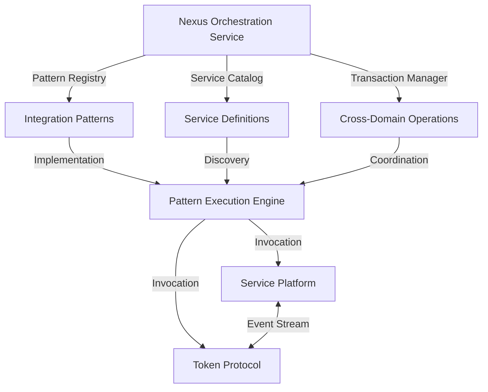
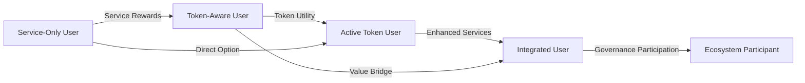
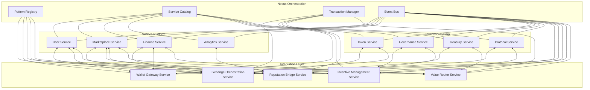

# Documentation

version: 2025-05-14

version: 2025-05-14

version: 2025-05-14

This document outlines the experimental patterns and service structures that enable the natural
integration of the OVASABI service platform with its token economic system. These integration
patterns leverage the platform's existing architecture to create a unified system that maximizes
value for all participants.

## 1. Architectural Integration Principles

### Nexus-Based Pattern System

The OVASABI platform's nexus service orchestration layer provides the foundation for seamless
integration through these key principles:

1. **Pattern Atomicity**: Each integration point is defined as a self-contained, reusable pattern
2. **Service Independence**: Token and service components maintain separate concerns
3. **Protocol Communication**: Standardized interfaces between systems
4. **Progressive Adoption**: Phased integration supporting multiple paths
5. **Stateful Orchestration**: Transactions coordinated across domains



The nexus layer provides the "connective tissue" that enables both systems to interact without tight
coupling, allowing each to evolve independently while maintaining integration points.

## 2. Core Integration Patterns

### Identity Unification Pattern

This pattern creates a unified identity that spans both service and token domains:

```go
// Identity Unification Pattern
{
    "id": "identity_unification_pattern",
    "version": "0.1",
    "description": "Creates a unified identity spanning service and token domains",
    "steps": [
        {
            "type": "user",
            "action": "create_identity",
            "parameters": {
                "service_profile": {
                    "required_fields": ["name", "email", "preferences"],
                    "optional_fields": ["professional_details", "service_history"]
                },
                "wallet_options": {
                    "custodial": {
                        "enabled": true,
                        "key_management": "platform_secured"
                    },
                    "non_custodial": {
                        "enabled": true,
                        "connection_methods": ["wallet_connect", "browser_extension"]
                    },
                    "progressive_custody": {
                        "enabled": true,
                        "transition_triggers": ["user_request", "threshold_balance", "activity_milestone"]
                    }
                },
                "reputation_system": {
                    "service_metrics": ["quality_score", "reliability_index", "responsiveness"],
                    "token_metrics": ["governance_participation", "holding_period", "community_contribution"],
                    "composite_score": {
                        "algorithm": "weighted_average",
                        "service_weight": 0.6,
                        "token_weight": 0.4,
                        "adaptable": true
                    }
                }
            }
        },
        {
            "type": "auth",
            "action": "configure_authentication",
            "parameters": {
                "methods": ["email", "social", "wallet_signature", "biometric"],
                "cross_domain_session": {
                    "enabled": true,
                    "session_bridge": "secure_token_exchange"
                },
                "progressive_security": {
                    "enabled": true,
                    "risk_based_factors": true
                }
            },
            "depends_on": ["create_identity"]
        },
        {
            "type": "preferences",
            "action": "establish_preferences",
            "parameters": {
                "default_currency": "user_selectable",
                "payment_methods": {
                    "fiat": true,
                    "token": true,
                    "default": "fiat_with_token_rewards"
                },
                "service_token_exposure": {
                    "initial": "minimal",
                    "progression": "experience_based"
                }
            },
            "depends_on": ["configure_authentication"]
        }
    ]
}
```

This pattern creates a unified but flexible identity system that allows users to engage with either
service or token components based on their preferences and experience level.

### Value Exchange Pattern

This pattern enables seamless value exchange between service-based activities and token economics:

```go
// Value Exchange Pattern
{
    "id": "value_exchange_pattern",
    "version": "0.1",
    "description": "Enables bidirectional value exchange between service and token economies",
    "steps": [
        {
            "type": "finance",
            "action": "create_exchange_mechanism",
            "parameters": {
                "exchange_types": {
                    "service_to_token": {
                        "enabled": true,
                        "mechanisms": ["reward_issuance", "discount_conversion", "revenue_share"]
                    },
                    "token_to_service": {
                        "enabled": true,
                        "mechanisms": ["service_purchase", "premium_access", "priority_matching"]
                    }
                },
                "conversion_logic": {
                    "pricing_oracle": "multi_source",
                    "rate_publication": "regular_interval",
                    "slippage_protection": true,
                    "minimum_amounts": {
                        "service_to_token": "configurable",
                        "token_to_service": "configurable"
                    }
                },
                "treasury_operations": {
                    "liquidity_management": true,
                    "reserve_requirements": "dynamic_based_on_volume",
                    "rebalancing_frequency": "market_condition_based"
                }
            }
        },
        {
            "type": "service",
            "action": "implement_service_rewards",
            "parameters": {
                "reward_triggers": [
                    {"type": "service_purchase", "reward_mechanism": "percentage_back"},
                    {"type": "quality_rating", "reward_mechanism": "tiered_bonus"},
                    {"type": "platform_engagement", "reward_mechanism": "milestone_reward"},
                    {"type": "referral", "reward_mechanism": "dual_reward"}
                ],
                "reward_delivery": {
                    "immediate_rewards": {
                        "enabled": true,
                        "threshold": "minimal"
                    },
                    "vested_rewards": {
                        "enabled": true,
                        "vesting_period": "activity_based",
                        "acceleration_factors": ["continued_engagement", "quality_metrics"]
                    }
                }
            },
            "depends_on": ["create_exchange_mechanism"]
        },
        {
            "type": "token",
            "action": "implement_token_benefits",
            "parameters": {
                "benefit_types": [
                    {"type": "fee_discount", "mechanism": "tiered_by_holdings"},
                    {"type": "service_access", "mechanism": "token_gated"},
                    {"type": "priority_service", "mechanism": "proportional_to_stake"},
                    {"type": "exclusive_opportunities", "mechanism": "threshold_based"}
                ],
                "implementation": {
                    "seamless_presentation": true,
                    "progressive_visibility": true,
                    "service_integration": "native_experience"
                }
            },
            "depends_on": ["implement_service_rewards"]
        }
    ]
}
```

This pattern creates the economic bridge between service activities and token value, enabling each
domain to reinforce the other while preserving independent operation when needed.

### Data Intelligence Integration Pattern

This pattern unifies data intelligence across service and token domains while preserving privacy:

```go
// Data Intelligence Integration Pattern
{
    "id": "data_intelligence_integration",
    "version": "0.1",
    "description": "Unifies data intelligence across service and token domains with privacy preservation",
    "steps": [
        {
            "type": "data",
            "action": "establish_data_framework",
            "parameters": {
                "data_domains": {
                    "service_data": {
                        "types": ["activity_metrics", "quality_indicators", "engagement_patterns", "conversion_funnels"],
                        "privacy_level": "user_controlled"
                    },
                    "token_data": {
                        "types": ["holding_patterns", "transaction_behaviors", "governance_participation", "liquidity_provision"],
                        "privacy_level": "pseudonymous"
                    },
                    "integrated_data": {
                        "types": ["cross_domain_journeys", "value_flow_analysis", "behavioral_segments"],
                        "privacy_level": "aggregate_only"
                    }
                },
                "privacy_mechanisms": {
                    "differential_privacy": true,
                    "zero_knowledge_proofs": {
                        "enabled": true,
                        "selective_disclosure": true
                    },
                    "data_minimization": true,
                    "purpose_limitation": true
                }
            }
        },
        {
            "type": "analytics",
            "action": "implement_intelligence_layer",
            "parameters": {
                "intelligence_products": {
                    "user_facing": {
                        "personal_insights": true,
                        "opportunity_identification": true,
                        "performance_optimization": true,
                        "market_intelligence": true
                    },
                    "platform_operations": {
                        "matching_optimization": true,
                        "pricing_efficiency": true,
                        "fraud_detection": true,
                        "ecosystem_health": true
                    },
                    "token_ecosystem": {
                        "governance_insights": true,
                        "economic_parameter_optimization": true,
                        "incentive_alignment": true,
                        "value_flow_visualization": true
                    }
                },
                "intelligence_delivery": {
                    "embedded_insights": true,
                    "api_accessibility": true,
                    "customizable_dashboards": true,
                    "alert_mechanisms": true
                }
            },
            "depends_on": ["establish_data_framework"]
        }
    ]
}
```

This pattern creates an intelligence layer that derives insights from both service activity and
token economics, enhancing both systems while maintaining appropriate privacy boundaries.

## 3. Service Integration Components

### Service-Token Interface Layer

The following services form the integration layer between conventional services and token economics:

| Service                        | Purpose                                       | Integration Responsibility                 |
| ------------------------------ | --------------------------------------------- | ------------------------------------------ |
| Exchange Orchestration Service | Manages value exchange between domains        | Service-Token value conversion and routing |
| Wallet Gateway Service         | Provides wallet capabilities to service users | Progressive custody and seamless UX        |
| Incentive Management Service   | Coordinates rewards across domains            | Cross-domain incentive alignment           |
| Reputation Bridge Service      | Unifies reputation across domains             | Multi-domain trust and quality metrics     |
| Value Router Service           | Directs value flows between systems           | Optimized economic pathways                |

### Exchange Orchestration Service

The Exchange Orchestration Service (EOS) serves as the critical link between the service economy and
token economy:

```go
// Exchange Orchestration Service Pattern
{
    "id": "exchange_orchestration_service",
    "version": "0.1",
    "description": "Central service for managing exchange between service and token value",
    "components": [
        {
            "name": "rate_oracle",
            "purpose": "Determine exchange rates between service value and tokens",
            "functions": [
                "aggregate_price_sources",
                "calculate_fair_value",
                "publish_rate_updates",
                "provide_historical_data"
            ],
            "integration_points": [
                {"service": "finance_service", "interaction": "bidirectional"},
                {"service": "token_service", "interaction": "bidirectional"}
            ]
        },
        {
            "name": "routing_engine",
            "purpose": "Determine optimal pathways for value exchange",
            "functions": [
                "analyze_transaction_requirements",
                "identify_optimal_routes",
                "calculate_cost_efficiency",
                "execute_multi_step_transactions"
            ],
            "integration_points": [
                {"service": "all_services", "interaction": "receiving"},
                {"service": "finance_service", "interaction": "bidirectional"}
            ]
        },
        {
            "name": "liquidity_manager",
            "purpose": "Ensure sufficient liquidity for seamless exchange",
            "functions": [
                "monitor_liquidity_pools",
                "rebalance_reserves",
                "integrate_external_liquidity",
                "optimize_capital_efficiency"
            ],
            "integration_points": [
                {"service": "finance_service", "interaction": "bidirectional"},
                {"service": "treasury_service", "interaction": "bidirectional"}
            ]
        },
        {
            "name": "transaction_coordinator",
            "purpose": "Ensure atomic execution of cross-domain transactions",
            "functions": [
                "prepare_transaction_steps",
                "coordinate_execution",
                "handle_rollbacks",
                "verify_completion"
            ],
            "integration_points": [
                {"service": "all_services", "interaction": "bidirectional"}
            ]
        },
        {
            "name": "compliance_engine",
            "purpose": "Ensure regulatory compliance across domains",
            "functions": [
                "verify_transaction_legitimacy",
                "apply_regional_rules",
                "maintain_audit_records",
                "enforce_limits_and_thresholds"
            ],
            "integration_points": [
                {"service": "user_service", "interaction": "receiving"},
                {"service": "finance_service", "interaction": "bidirectional"}
            ]
        }
    ],
    "internal_patterns": [
        "atomic_swap_pattern",
        "liquidity_pool_pattern",
        "multi_hop_exchange_pattern",
        "batched_settlement_pattern"
    ],
    "data_storage": {
        "transaction_records": "distributed_ledger",
        "exchange_rates": "time_series_database",
        "liquidity_data": "in_memory_with_persistence",
        "routing_tables": "graph_database"
    }
}
```

This service combines the reliability of traditional financial systems with the efficiency of token
economics, creating a seamless value bridge between the two domains.

## 4. Progressive Integration Pathways

### User Journey Integration

The integration process follows a natural progression based on user activity and comfort:



Each stage represents a natural progression that introduces token elements at the appropriate pace:

1. **Service-Only User**: Experiences traditional service with no token exposure
2. **Token-Aware User**: Receives token rewards but primarily uses services
3. **Active Token User**: Actively uses tokens for service benefits
4. **Integrated User**: Seamlessly moves between service and token domains
5. **Ecosystem Participant**: Participates in platform governance and economics

### Regional Integration Strategies

The integration approach varies by region to address specific needs and regulatory requirements:

| Region         | Primary Integration Pattern            | Rationale                                                                |
| -------------- | -------------------------------------- | ------------------------------------------------------------------------ |
| Nigeria/Africa | Service-First with Financial Inclusion | Build service utility before token adoption, address banking limitations |
| Europe         | Compliance-First with Token Benefits   | Ensure regulatory compliance before expanding token functionality        |
| Asia           | Token-First with Service Applications  | Leverage existing crypto adoption with service utility                   |
| Americas       | Hybrid-Balanced Approach               | Balance regulatory compliance with innovation                            |

Each regional strategy is implemented through region-specific orchestration of the same core
patterns.

## 5. Architecture Implementation

### System Component Diagram



### Implementation Phases

| Phase                 | Timeline     | Key Components                                       | Milestone Outcomes                                |
| --------------------- | ------------ | ---------------------------------------------------- | ------------------------------------------------- |
| Foundation            | Months 1-3   | Identity Unification Pattern, Basic Service Platform | Unified user accounts with minimal token features |
| Value Bridge          | Months 4-6   | Exchange Orchestration Service, Wallet Gateway       | Initial service-to-token conversion capabilities  |
| Incentive Alignment   | Months 7-9   | Incentive Management Service, Value Router           | Cross-domain reward structures activated          |
| Full Integration      | Months 10-12 | Reputation Bridge, Data Intelligence Integration     | Seamless user experience across both domains      |
| Regional Optimization | Months 13-18 | Region-specific pattern implementations              | Tailored experiences for target markets           |

## 6. Pattern Composition and Reuse

The power of the OVASABI architecture comes from pattern composition - combining smaller patterns
into comprehensive solutions:

### Marketplace-Token Integration Pattern

```go
// Marketplace-Token Integration Pattern
{
    "id": "marketplace_token_integration_pattern",
    "version": "0.1",
    "description": "Integrates marketplace functionality with token economics",
    "composed_patterns": [
        {
            "pattern": "identity_unification_pattern",
            "configuration": {
                "reputation_system.composite_score.service_weight": 0.7,
                "reputation_system.composite_score.token_weight": 0.3
            }
        },
        {
            "pattern": "value_exchange_pattern",
            "configuration": {
                "exchange_types.service_to_token.mechanisms": ["service_completion_rewards", "quality_bonuses"],
                "exchange_types.token_to_service.mechanisms": ["premium_listings", "featured_placement", "rapid_matching"]
            }
        },
        {
            "pattern": "data_intelligence_integration",
            "configuration": {
                "intelligence_products.user_facing.opportunity_identification": true,
                "intelligence_products.platform_operations.matching_optimization": true
            }
        }
    ],
    "additional_steps": [
        {
            "type": "marketplace",
            "action": "implement_token_enhanced_features",
            "parameters": {
                "enhanced_matching": {
                    "token_staking_tiers": [
                        {"tier": "basic", "stake": "none", "benefits": "standard_matching"},
                        {"tier": "enhanced", "stake": "minimal", "benefits": "priority_matching"},
                        {"tier": "premium", "stake": "moderate", "benefits": "advance_visibility"},
                        {"tier": "elite", "stake": "significant", "benefits": "exclusive_opportunities"}
                    ],
                    "implementation": "progressive_disclosure"
                },
                "reputation_mechanisms": {
                    "token_backed_guarantees": true,
                    "staking_for_quality": true,
                    "reputation_portability": true
                },
                "marketplace_governance": {
                    "category_creation": "token_weighted_voting",
                    "dispute_resolution": "staked_juror_system",
                    "fee_structure": "community_governance"
                }
            }
        }
    ]
}
```

This composed pattern demonstrates how the marketplace service integrates with token economics
through a combination of foundational patterns and service-specific enhancements.

## 7. Integration Benefits Analysis

### Value Synergies

| Domain            | Without Integration     | With Integration        | Enhancement                    |
| ----------------- | ----------------------- | ----------------------- | ------------------------------ |
| User Acquisition  | $15-50 CAC              | $5-15 CAC               | 67-70% reduction               |
| Service Liquidity | 15-30% match rate       | 40-70% match rate       | 133-167% improvement           |
| Revenue Models    | 2-3 revenue streams     | 5-7 revenue streams     | 150-133% increase              |
| Network Effects   | Linear growth           | Exponential growth      | Order of magnitude improvement |
| User Retention    | 20-40% annual retention | 50-75% annual retention | 88-150% improvement            |
| Economic Security | Limited mechanisms      | Multi-layered security  | Qualitative improvement        |

### Implementation Efficiency

| Resource          | Separate Implementation | Integrated Implementation | Efficiency Gain  |
| ----------------- | ----------------------- | ------------------------- | ---------------- |
| Engineering       | 13-25 engineers         | 1 engineer + patterns     | 92-96% reduction |
| Development Time  | 12-18 months            | 4-6 months                | 67-67% reduction |
| Operational Costs | $2-5M annually          | $250-500K annually        | 88-90% reduction |
| Time to Market    | 9-12 months             | 3-4 months                | 67-67% reduction |

### Key Integration Advantages

1. **Unified Value Proposition**: Services provide immediate utility while tokens offer long-term
   alignment
2. **Capital Efficiency**: Service revenue can fund token ecosystem development
3. **Progressive Complexity**: Users can engage at their comfort level
4. **Regulatory Adaptability**: Regional approaches can adjust the service-token balance
5. **Resilience Through Diversity**: Multiple economic models provide stability
6. **Enhanced Network Effects**: Each system's network effects amplify the other

## Conclusion

The OVASABI architecture's pattern-based approach enables natural integration between service
platforms and token economics. By using the nexus orchestration layer and carefully designed
integration patterns, the system creates a unified experience that preserves the strengths of both
domains while mitigating their individual weaknesses.

This experimental approach creates unprecedented efficiency in both development and operation,
allowing a minimal team to build and manage a sophisticated platform that spans traditional services
and token economics. The integration patterns enable a progressive user experience that adapts to
both user preferences and regional requirements, creating optimal pathways for adoption.

As these patterns mature from experimental to production status, they will provide a framework for
building the next generation of digital platforms that seamlessly bridge conventional commerce with
token-based economics.
