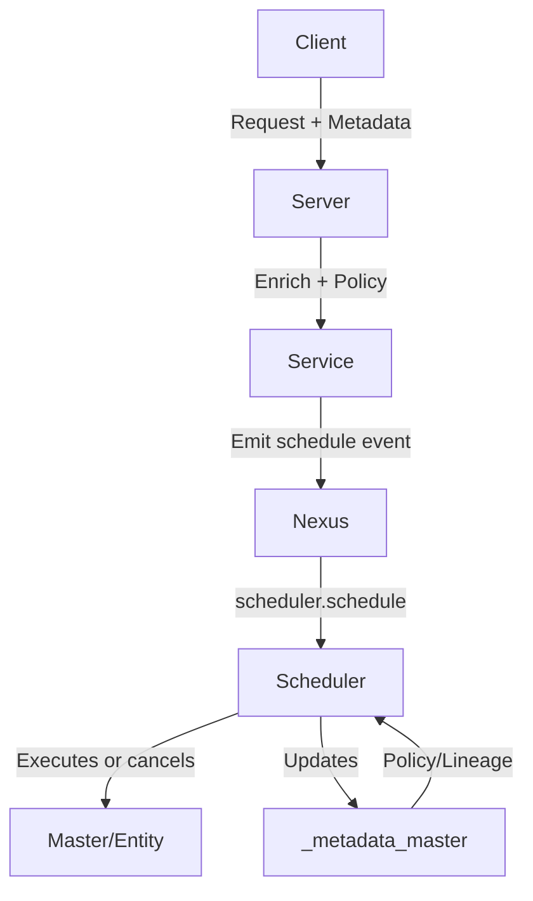

# Metadata-Driven Orchestration & Optimistic Scheduling

## 1. Efficiency and System Performance: When to Use Metadata-Driven Orchestration

### What is Metadata-Driven Orchestration?

- All actions, entities, and events are tied to a central, evolving metadata object.
- Orchestration, scheduling, and cleanup are driven by metadata policies, categories, roles, and
  environments.
- The system emits events (e.g., schedule, cancel, update) and services act on these events,
  updating metadata as the single source of truth.

### Efficiency Implications

- **Best for:**
  - Distributed, event-driven, or workflow-heavy systems.
  - Systems requiring auditability, compliance, or dynamic policy enforcement.
  - Environments where orchestration, retention, and cleanup must be dynamic and traceable.
- **Not ideal for:**
  - High-throughput, low-latency, CPU-bound computation (e.g., real-time analytics, scientific
    computing, ML inference, gaming, etc.).
  - Tight, in-memory, synchronous workflows where orchestration overhead would dominate.
- **Why?**
  - Event emission, metadata enrichment, and DB writes introduce overhead (serialization, network,
    I/O).
  - For pure computation, direct, in-memory, and optimized code is more efficient.
  - Use this pattern to coordinate, schedule, and monitor CPU jobs—not to perform them.

### Hybrid Recommendation

- Use metadata/event-driven orchestration to schedule, monitor, and manage jobs.
- Use dedicated, optimized workers/services for the actual CPU-intensive computation.

---

## 2. Central Metadata Approach: Policy-Driven, Ephemeral, and Context-Aware

### Key Features

- **Central, private metadata table** (`_metadata_master`):
  - Stores all metadata objects, with lineage, environment, category, and policy fields.
  - Can be ephemeral (unlogged, TTL, or scheduled cleanup) and hidden from public APIs.
- **Role, environment, and category-aware:**
  - Policies for retention, access, validation, and exposure are determined by the combination of
    role, environment, and category.
  - Example: Admins in prod get strict validation and long retention; services in dev get lenient
    validation and short retention.
- **Dynamic policy enforcement:**
  - Policies can be updated centrally and applied at runtime.
  - Scheduler and services act based on metadata policies, not hardcoded rules.

### Example Policy Matrix

| Role    | Environment | Category      | Retention | Access     | Validation | Exposure     |
| ------- | ----------- | ------------- | --------- | ---------- | ---------- | ------------ |
| admin   | prod        | orchestration | 1 year    | full       | strict     | internal     |
| service | dev         | analytics     | 7 days    | internal   | lenient    | none         |
| user    | prod        | user          | 90 days   | self+admin | strict     | summary only |

---

## 3. Optimistic, Event-Driven Scheduling Pattern

### How It Works

- When an entity/metadata is created or updated, emit a `scheduler.schedule` event with intent
  (e.g., delete in 90 days).
- Scheduler service receives the event and schedules the action for the specified time.
- If a cancellation/override event is received before the scheduled time, the scheduler cancels or
  updates the action.
- Otherwise, the action is executed as scheduled.

### Example Event Payload

```json
{
  "action": "delete",
  "run_at": "2024-12-01T00:00:00Z",
  "pattern": "delete_user",
  "cancel_on": ["user_reactivated", "policy_override"]
}
```

### Benefits

- No need for periodic polling or scanning for expired records.
- All scheduling, cancellation, and execution is event-driven and auditable.
- Scalable and efficient: only scheduled actions are tracked, not the entire DB.

### Example Flow

1. User account created: emit `scheduler.schedule` event to delete in 90 days.
2. Scheduler schedules deletion.
3. If user reactivates, emit `user_reactivated` event; scheduler cancels deletion.
4. If not, scheduler deletes user and metadata after 90 days.

---

## 4. Practical Recommendations

## Use This Pattern When:

- You need dynamic, policy-driven orchestration, retention, and cleanup.
- You require auditability, compliance, or lineage tracking.
- Your system is distributed, event-driven, or workflow-heavy.
- You want to decouple orchestration from computation.

## Avoid for:

- Pure, high-performance, CPU-bound computation (do the work in optimized, direct code; use
  orchestration only for coordination).
- Ultra-low-latency, in-memory, or real-time systems where orchestration overhead is unacceptable.

---

## 5. Example Diagram



---

## 6. Summary

- **Metadata-driven orchestration** is powerful for dynamic, policy-aware, and auditable systems.
- **Optimistic, event-driven scheduling** enables proactive, scalable, and efficient cleanup and
  orchestration.
- **For CPU-bound computation, use this pattern for coordination, not for the computation itself.**
- **Central metadata, with role/environment/category-aware policies, gives you maximum flexibility,
  compliance, and control.**

---

## Proactive, Event-Driven, Optimistic Scheduling Pattern

### 1. Pattern Overview

Instead of the scheduler polling for what to clean up, the system emits a "future intent" event
(e.g., "delete this in 30 days") and the scheduler acts on that intent unless it receives a
cancellation or override. This is a powerful, scalable, and auditable approach that fits perfectly
with a robust scheduler and event-driven Nexus architecture.

#### How It Works

- When a metadata/master/entity is created or updated, the service emits a "future intent" event to
  the scheduler via Nexus:
  - "Delete this entity in 90 days"
  - "Archive this campaign in 30 days"
  - "Run this pattern in 7 days unless cancelled"
- The scheduler service receives the event and schedules the action for the specified time.
- If, before the scheduled time, a cancellation or override event is received (e.g., "user
  reactivated", "policy changed"), the scheduler cancels or updates the scheduled action.
- Otherwise, when the time arrives, the scheduler executes the action (delete, archive, run pattern,
  etc.).

### 2. Implementation in the Nexus/Event-Driven Stack

#### A. Event Emission (Nexus)

When creating/updating metadata, emit a `scheduler.schedule` event:

```go
// Go code example for emitting a schedule event
func ScheduleDeletion(ctx context.Context, nexus NexusClient, entityID uuid.UUID, meta *commonpb.Metadata, days int) error {
    payload := map[string]interface{}{
        "action": "delete",
        "run_at": time.Now().Add(time.Duration(days) * 24 * time.Hour).Format(time.RFC3339),
        "pattern": "delete_entity",
        "cancel_on": []string{"entity_reactivated", "policy_override"},
    }
    event := &nexusv1.EventRequest{
        EventType: "scheduler.schedule",
        EntityId:  entityID.String(),
        Metadata:  meta,
        Payload:   &commonpb.Payload{Data: metadata.MapToStruct(payload)},
    }
    _, err := nexus.EmitEvent(ctx, event)
    return err
}
```

### B. Scheduler Service

- Listens for `scheduler.schedule` events.
- Schedules the action for the specified time.
- Listens for cancellation/override events (e.g., `user_reactivated`, `policy_override`).
- If a cancellation event is received before the scheduled time, cancels the action.

#### Pseudocode

```go
for event in nexus.Subscribe("scheduler.schedule") {
    scheduleAction(event.EntityId, event.Payload["run_at"], event.Payload["action"], event.Payload["cancel_on"])
}

for cancelEvent in nexus.Subscribe(cancelEventTypes...) {
    cancelScheduledAction(cancelEvent.EntityId)
}
```

### C. Metadata-Driven

- The metadata for the entity includes the scheduled action and its status.
- The scheduler updates the metadata as actions are scheduled, cancelled, or executed.

## 3. Benefits

- **Optimistic, not pessimistic:** No need to poll or scan for expired records; schedule intent at
  creation/update.
- **Event-driven and auditable:** Every scheduled action, cancellation, or override is an event in
  the system—fully traceable.
- **Flexible and dynamic:** Reschedule, cancel, or override actions at any time by emitting the
  right event.
- **Scalable:** The scheduler only needs to track scheduled actions, not scan the whole DB.

## 4. Example Flows

### A. User Account Created

1. User created: Metadata includes retention policy: delete after 90 days of inactivity. Service
   emits `scheduler.schedule` event: "delete user in 90 days unless reactivated."
2. Scheduler receives event: Schedules deletion for 90 days from now.
3. User reactivates account on day 85: Service emits `user_reactivated` event. Scheduler receives
   cancellation event, cancels scheduled deletion.
4. If no reactivation: On day 90, scheduler deletes user and metadata, emits `user_deleted` event.

### B. Campaign Ends

1. Campaign ends: Service emits `scheduler.schedule` event: "archive campaign in 30 days unless
   extended."
2. If campaign is extended: Service emits `policy_override` event, scheduler cancels or reschedules.
3. If not: Scheduler archives campaign after 30 days.

## 5. How to Express "Unless Told Not To"

- In the event payload, include a `cancel_on` or `override_on` field listing event types that should
  cancel or reschedule the action.
- The scheduler subscribes to those event types and matches them to scheduled actions.

## 6. Summary Table

| Action        | How Scheduled       | How Cancelled/Overridden   | How Audited          |
| ------------- | ------------------- | -------------------------- | -------------------- |
| Delete entity | Emit schedule event | Emit cancel/override event | All via Nexus events |
| Archive data  | Emit schedule event | Emit cancel/override event | All via Nexus events |
| Run pattern   | Emit schedule event | Emit cancel/override event | All via Nexus events |

## 7. Conclusion

- You can make your scheduler optimistic and event-driven: Schedule actions at creation/update, and
  only cancel if told to.
- This is scalable, auditable, and fits perfectly with your Nexus/event-driven architecture.
- All actions, cancellations, and overrides are events—giving you a full audit trail and dynamic
  control.

---

# End of Optimistic Scheduling Section

---

# Naming, Domain, and UI Layer Integration

## Project Naming: "Tempo"

- "Tempo" is a strong, evocative name for a temporal, event-driven orchestration system.
- It aligns with the system's focus on time, causality, and orchestration.
- Note: There is an existing open source project called Grafana Tempo (distributed tracing backend).
  If your domain is distinct, this may not be an issue, but consider namespace and trademark
  implications for open source or commercial use.
- Alternatives: Temporis, Tempora, Tempus, Causalo, Chronos, CadenceOS, Orchestrate, DAGOS.

## Domain Availability

- Check for domain and package name availability if you want a unique web presence.

## Go-Based UI Layer (React/WASM)

- It is increasingly feasible to build a Go-based UI layer that integrates with React, either via
  WebAssembly (WASM) or by embedding a JavaScript engine like V8.
- The article
  [Rendering React on Golang with V8Go](https://medium.com/itnext/rendering-react-on-golang-with-v8go-fd84cdad2844)
  demonstrates how to use the V8Go library to run and render React components server-side, entirely
  within a Go application.
- **Benefits:**
  - No need for a separate Node.js process for SSR (server-side rendering).
  - Everything runs inside the Go application, simplifying deployment and reducing dependencies.
  - Enables SSR for React, improving performance, SEO, and initial page load.
  - WASM can be used for portable, sandboxed UI logic that runs on both client and server.
- **Motivation for This Architecture:**
  - Fits perfectly with a Go-based, event-driven backend.
  - Enables a self-contained, high-performance stack where UI and backend logic can be tightly
    integrated.
  - Supports the vision of a distributed, modular, and reactive UI engine (as described in the Tempo
    architecture).

## Further Reading

- [Rendering React on Golang with V8Go](https://medium.com/itnext/rendering-react-on-golang-with-v8go-fd84cdad2844)

---

# Go-Based SSR, Microfrontends, and Conversational AI Layer

## Unified Interface for Microfrontend Orchestration

- You can build a Go-based, SSR-capable, microfrontend-ready UI layer around React today.
- **V8Go** enables seamless, self-contained server-side rendering (SSR) of React components directly
  within your Go application—no Node.js required.
- **Microfrontends** can be developed and managed in separate Git repositories, each as an
  independent React app or component.
- The Go backend can expose a **unified interface** (API, manifest, or registry) for orchestrating,
  loading, and rendering these microfrontends at runtime.
  - This interface can dynamically fetch, register, and compose microfrontends based on user, agent,
    or system context.
  - Microfrontends can be versioned, hot-swapped, or feature-flagged without redeploying the entire
    system.
- **Deployment and Management:**
  - Each microfrontend can have its own CI/CD pipeline and release cycle.
  - The Go SSR layer can load microfrontends from local files, remote URLs, or a service registry.
- **Result:**
  - A modular, extensible, and high-performance UI platform, with clear separation of concerns and
    easy onboarding for new teams or features.

## Lightweight, Embedded AI Layer for System/Agent/User Conversation

- A lightweight AI layer can be embedded directly in the Go backend, or run as a modular
  microservice or WASM module.
- **Purpose:**
  - Acts as a conversational interface between the system, users, and agents.
  - Can interpret user/system intent, mediate requests, and orchestrate workflows or responses.
  - Enables proactive system notifications, agent-based orchestration, and context-aware assistance.
- **Implementation:**
  - Use a small LLM, rules engine, or intent parser (Go-native or via gRPC/REST to an external
    service).
  - Integrate with the event/DAG system for full context awareness.
  - Expose a simple API (e.g., `/converse`, `/notify`, `/route`) for UI and backend to interact with
    the AI layer.
- **Benefits:**
  - Modular and pluggable—can be upgraded or swapped as AI capabilities evolve.
  - Context-aware—always has access to system state, user profile, and event history.
  - Enables rich, conversational, and proactive user experiences.

## Actionable Summary

- **You have a clear path to a Go-based, SSR, microfrontend-ready UI platform with a unified
  orchestration interface.**
- **A lightweight, embedded AI layer can provide conversational, context-aware interaction between
  system, agent, and user.**
- **This architecture is modular, extensible, and ready for onboarding new teams, features, or AI
  capabilities.**

---

# (The rest of the doc continues...)
