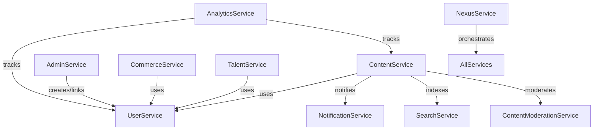

# Architecture Overview

## Core Services

- User: User mgmt, profile, RBAC
- Notification: Multi-channel, templates, real-time, streaming
- Campaign: Campaign mgmt, analytics
- Referral: Referral, rewards, fraud
- Security: Policies, audit, compliance
- Content: Articles, micro-posts, video, comments, reactions, FTS
- Commerce: Orders, payments, billing
- Localization: i18n, translation
- Search: Full-text, fuzzy, entity search
- Admin: Admin user mgmt, roles, audit (links to UserService via gRPC)
- Analytics: Event, usage, reporting
- ContentModeration: Moderation, compliance
- Talent: Talent profiles, bookings
- Nexus: Orchestration, patterns

## Service Relationships

- All cross-service relationships are via gRPC and DI.
- AdminService always creates/links admin users to main users via UserService gRPC.
- No direct DB access across service boundaries.

## Diagram

## Provider/DI Pattern

- All services are registered in the DI container in internal/service/provider.go.
- Dependencies are resolved via the DI container, not direct instantiation.
- Cross-service calls (e.g., AdminService → UserService) use gRPC clients.
