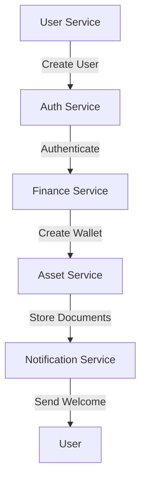
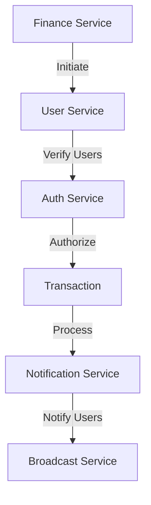
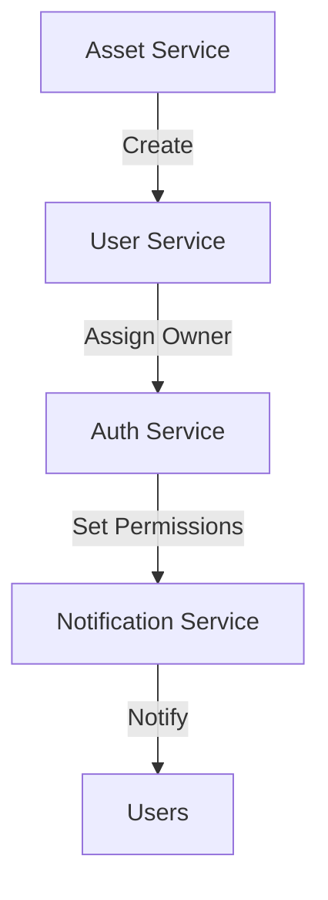
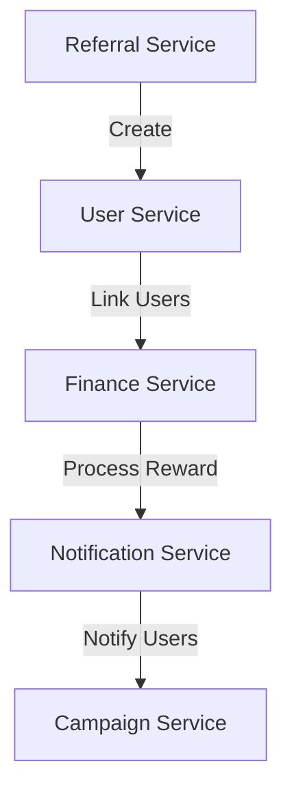
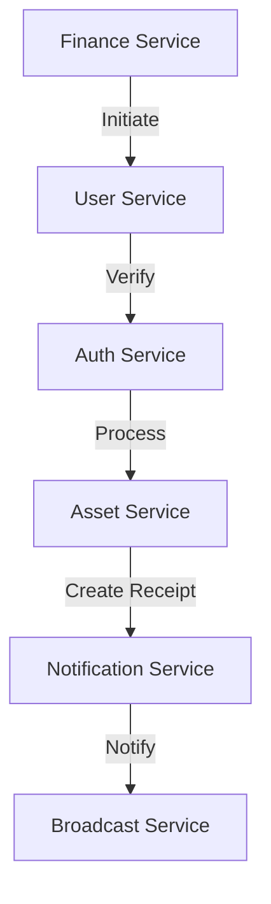
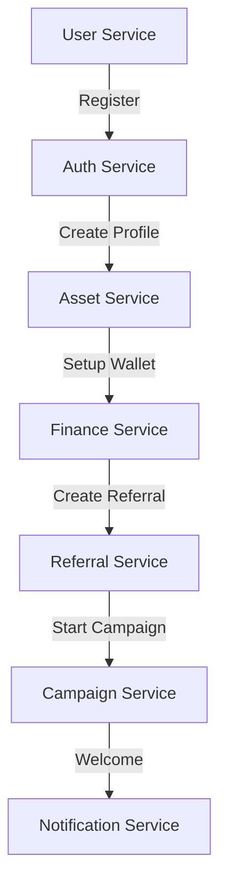
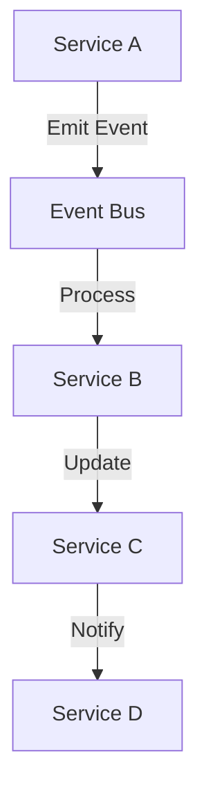
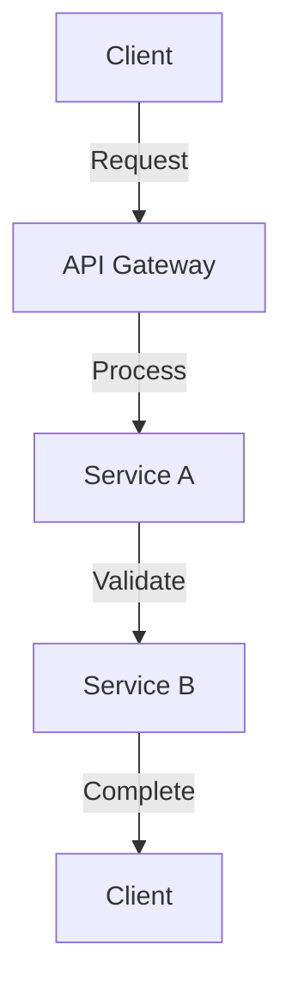

# Documentation

version: 2025-05-14

version: 2025-05-14

version: 2025-05-14

## Overview

This document outlines the various use-case scenarios and service relationships possible within the
OVASABI platform. It describes how different services can interact and form relationships to create
complex, yet maintainable business workflows.

## Core Service Relationships

### 1. User-Finance Ecosystem

#### A. User Onboarding with Financial Integration



**Implementation Pattern:**

```go
// User Onboarding Pattern
{
    "id": "user_onboarding_finance",
    "steps": [
        {
            "type": "user",
            "action": "create",
            "parameters": {
                "user_data": "{user_input}"
            }
        },
        {
            "type": "finance",
            "action": "create_wallet",
            "parameters": {
                "wallet_type": "primary",
                "currency": "USD"
            },
            "depends_on": ["create"]
        },
        {
            "type": "notification",
            "action": "send_welcome",
            "parameters": {
                "template": "welcome_with_wallet",
                "channel": "email"
            },
            "depends_on": ["create_wallet"]
        }
    ]
}
```

#### B. Financial Transaction Network



### 2. Asset Management Ecosystem

#### A. Asset Creation and Sharing



**Implementation Pattern:**

```go
// Asset Management Pattern
{
    "id": "asset_creation_sharing",
    "steps": [
        {
            "type": "asset",
            "action": "create",
            "parameters": {
                "asset_type": "document",
                "metadata": "{asset_metadata}"
            }
        },
        {
            "type": "relationship",
            "action": "create",
            "parameters": {
                "type": "owner",
                "entity_type": "asset"
            },
            "depends_on": ["create"]
        },
        {
            "type": "notification",
            "action": "notify_creation",
            "parameters": {
                "template": "asset_created",
                "channels": ["email", "push"]
            },
            "depends_on": ["create"]
        }
    ]
}
```

### 3. Campaign and Referral Network

#### A. Referral Program Integration



**Implementation Pattern:**

```go
// Referral Program Pattern
{
    "id": "referral_program",
    "steps": [
        {
            "type": "referral",
            "action": "create_link",
            "parameters": {
                "program_type": "user_invite",
                "reward_type": "financial"
            }
        },
        {
            "type": "relationship",
            "action": "create",
            "parameters": {
                "type": "referral",
                "metadata": {
                    "program_id": "{program_id}",
                    "reward_status": "pending"
                }
            },
            "depends_on": ["create_link"]
        },
        {
            "type": "campaign",
            "action": "track_referral",
            "parameters": {
                "campaign_type": "user_growth",
                "source": "referral"
            },
            "depends_on": ["create"]
        }
    ]
}
```

## Complex Service Interactions

### 1. Multi-Service Transaction Flow

#### A. Financial Transaction with Asset Creation



**Implementation Pattern:**

```go
// Complex Transaction Pattern
{
    "id": "transaction_with_asset",
    "steps": [
        {
            "type": "finance",
            "action": "process_transaction",
            "parameters": {
                "type": "transfer",
                "amount": "{amount}"
            }
        },
        {
            "type": "asset",
            "action": "create_receipt",
            "parameters": {
                "asset_type": "receipt",
                "metadata": {
                    "transaction_id": "{transaction_id}"
                }
            },
            "depends_on": ["process_transaction"]
        },
        {
            "type": "notification",
            "action": "notify_transaction",
            "parameters": {
                "template": "transaction_complete",
                "channels": ["email", "push"]
            },
            "depends_on": ["create_receipt"]
        }
    ]
}
```

### 2. User Journey Patterns

#### A. Complete User Onboarding



**Implementation Pattern:**

```go
// Complete Onboarding Pattern
{
    "id": "complete_onboarding",
    "steps": [
        {
            "type": "user",
            "action": "create",
            "parameters": {
                "user_data": "{user_input}"
            }
        },
        {
            "type": "finance",
            "action": "setup_wallet",
            "parameters": {
                "wallet_type": "primary"
            },
            "depends_on": ["create"]
        },
        {
            "type": "referral",
            "action": "generate_code",
            "parameters": {
                "program": "new_user"
            },
            "depends_on": ["create"]
        },
        {
            "type": "campaign",
            "action": "enroll",
            "parameters": {
                "campaign_type": "welcome"
            },
            "depends_on": ["create"]
        }
    ]
}
```

## Service-Specific Patterns

### 1. Finance Service Patterns

#### A. Wallet Management

- Primary wallet creation
- Multiple currency support
- Wallet linking
- Transaction history

#### B. Transaction Processing

- User-to-user transfers
- Batch transactions
- Scheduled payments
- Cross-currency transactions

### 2. Asset Service Patterns

#### A. Document Management

- Secure storage
- Version control
- Access control
- Sharing permissions

#### B. Asset Relationships

- Owner relationships
- Shared access
- Temporary permissions
- Group access

### 3. User Service Patterns

#### A. Profile Management

- Basic profile
- Extended profile
- Preferences
- Settings

#### B. User Relationships

- Direct connections
- Group memberships
- Role assignments
- Permission sets

## Integration Patterns

### 1. Event-Driven Integration



### 2. Synchronous Integration



## Best Practices

### 1. Pattern Design

- Keep patterns focused and single-purpose
- Include proper validation
- Handle errors appropriately
- Document dependencies
- Set appropriate timeouts

### 2. Service Integration

- Use appropriate integration style
- Implement proper error handling
- Include retry mechanisms
- Monitor performance
- Maintain security

### 3. Data Management

- Use appropriate storage
- Implement caching
- Handle consistency
- Manage transactions
- Monitor performance

## Security Considerations

### 1. Authentication and Authorization

- Implement proper auth checks
- Validate permissions
- Secure sensitive data
- Monitor access
- Log security events

### 2. Data Protection

- Encrypt sensitive data
- Implement access controls
- Monitor usage
- Regular audits
- Secure communication

## Performance Optimization

### 1. Caching Strategy

- Implement Redis caching
- Use appropriate TTLs
- Cache invalidation
- Monitor hit rates
- Optimize storage

### 2. Resource Management

- Connection pooling
- Resource limits
- Monitoring
- Scaling rules
- Performance metrics

## Monitoring and Maintenance

### 1. Health Checks

- Service health
- Dependency health
- Resource usage
- Performance metrics
- Error rates

### 2. Maintenance Tasks

- Regular cleanup
- Performance tuning
- Security updates
- Dependency updates
- Documentation updates
