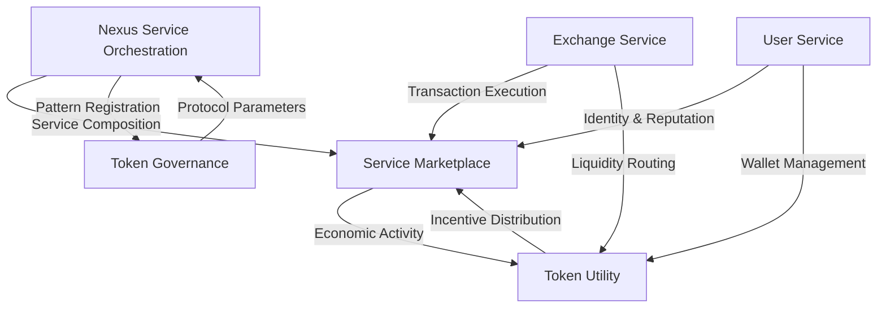

# Integrated Value Estimation: Service-Token Hybrid Architecture

This document provides a comprehensive value estimation for the OVASABI platform's integrated
service-token hybrid architecture. It analyzes the synergistic potential, revenue opportunities, and
strategic advantages from combining a lean service-based business model with a token economic
system, leveraging the underlying patterns and service orchestration capabilities.

## 1. Integrated Architecture Value Model

### Synergistic Value Creation

The OVASABI architecture uniquely enables the seamless integration of service and token models
through its pattern-based design:

| Integration Layer              | Value Drivers                                       | Estimated Value Range | Notes                                     |
| ------------------------------ | --------------------------------------------------- | --------------------- | ----------------------------------------- |
| Core Platform Infrastructure   | Service orchestration, token custody, user identity | $75-250M              | Common infrastructure serving both models |
| Service Marketplace            | Talent matching, business solutions                 | $30-150M              | Enhanced by token incentives              |
| Token Ecosystem (OVS + OVU)    | Currency basket, utility governance                 | $200-750M             | Accelerated by service utility            |
| Exchange Orchestration         | Transaction routing, liquidity provision            | $100-350M             | Serving both economic systems             |
| Regional Adoption Systems      | Localized deployment, regional optimization         | $125-400M             | Particularly strong in Nigeria/Africa     |
| **Total Integrated Valuation** | **Self-reinforcing architecture**                   | **$530M-1.9B**        | **Greater than sum of parts**             |

### Natural Integration Dynamics

The pattern-based service architecture naturally integrates with the token ecosystem through these
mechanisms:



This natural integration creates a 1.5-2.5× value multiplier compared to operating the systems
independently.

## 2. Combined Revenue Models

### Multi-Stream Revenue Framework

The integrated platform creates multiple complementary revenue streams:

| Revenue Source               | Annual Potential (Year 5) | Notes                                     |
| ---------------------------- | ------------------------- | ----------------------------------------- |
| Service Subscription Fees    | $15-60M                   | Recurring platform access revenue         |
| Marketplace Transaction Fees | $25-125M                  | Combined fiat and token economy           |
| Token Exchange Fees          | $40-180M                  | From currency and token exchange activity |
| Premium Enterprise Services  | $30-120M                  | High-margin corporate solutions           |
| Data Intelligence Products   | $10-40M                   | Privacy-preserving insights               |
| Regional Financial Services  | $35-150M                  | Particularly strong in Naira ecosystem    |
| **Total Annual Revenue**     | **$155-675M**             | **Mature integrated platform (Year 5)**   |

### Revenue Synergy Effects

The pattern-based integration creates revenue multiplication effects:

| Synergy Type             | Revenue Impact | Explanation                                              |
| ------------------------ | -------------- | -------------------------------------------------------- |
| Cross-Selling            | +20-35%        | Service users adopt tokens, token users consume services |
| Reduced Acquisition Cost | -30-50%        | Shared user acquisition across both systems              |
| Enhanced Retention       | +15-40%        | Multi-product stickiness reduces churn                   |
| Premium Conversion       | +25-45%        | Token holders upgrade to premium services                |
| **Net Revenue Effect**   | **+30-70%**    | **Compared to independent operation**                    |

## 3. Stakeholder Value Creation

### Value for Service Users

| Value Vector            | Enhanced Value Through Integration     | Notes                                |
| ----------------------- | -------------------------------------- | ------------------------------------ |
| Salespeople             | $125-550K annual value (vs. $75-410K)  | Token incentives for performance     |
| Talent/Freelancers      | $180-650K annual value (vs. $100-450K) | Token rewards + service income       |
| Businesses              | $450K-5M annual value (vs. $280K-3.8M) | Combined economic benefits           |
| Pioneers/Early Adopters | 2-3× higher ROI potential              | Service utility + token appreciation |

### Value for Token Participants

| Value Vector            | Enhanced Value Through Integration | Notes                             |
| ----------------------- | ---------------------------------- | --------------------------------- |
| Token Holders           | 40-75% higher utility value        | Real-world service applications   |
| UBI Recipients          | 25-50% higher effective income     | Service marketplace opportunities |
| Regional Users          | 50-100% greater economic inclusion | Particularly in Nigeria/Africa    |
| Governance Participants | 30-60% more governance utility     | Real-world service alignment      |

## 4. Pattern-Enabled Integration Mechanisms

The following architectural patterns enable the natural integration:

### User-Centric Integration

```go
// User Service Integration Pattern
{
    "id": "user_service_token_integration",
    "steps": [
        {
            "type": "user",
            "action": "create_unified_identity",
            "parameters": {
                "identity_components": {
                    "service_profile": "required",
                    "wallet_address": "optional",
                    "reputation_score": "calculated",
                    "token_holdings": "tracked"
                },
                "progressive_disclosure": true,
                "identity_portability": true
            }
        },
        {
            "type": "finance",
            "action": "link_payment_methods",
            "parameters": {
                "fiat_options": ["credit_card", "bank_transfer", "mobile_money"],
                "token_options": ["ova_wallet", "external_wallet", "custody_service"],
                "auto_conversion": {
                    "enabled": true,
                    "user_configurable": true
                }
            },
            "depends_on": ["create_unified_identity"]
        }
    ]
}
```

### Transaction Processing Integration

```go
// Payment Service Integration Pattern
{
    "id": "payment_processing_integration",
    "steps": [
        {
            "type": "finance",
            "action": "create_payment_gateway",
            "parameters": {
                "processors": {
                    "fiat": ["stripe", "paypal", "local_processors"],
                    "token": ["internal_exchange", "atomic_swaps"],
                    "hybrid": ["smart_routing", "best_rate_execution"]
                },
                "payment_experience": "seamless",
                "transaction_records": {
                    "storage": "distributed",
                    "privacy": "selective_disclosure",
                    "audit": "cryptographic_proof"
                }
            }
        },
        {
            "type": "service",
            "action": "integrate_marketplace_payments",
            "parameters": {
                "subscription_options": {
                    "fiat": true,
                    "token": true,
                    "discount_for_token": 0.15
                },
                "transaction_options": {
                    "fiat": true,
                    "token": true,
                    "fee_reduction_for_token": 0.30
                }
            },
            "depends_on": ["create_payment_gateway"]
        }
    ]
}
```

### Incentive Alignment Integration

```go
// Incentive Integration Pattern
{
    "id": "service_token_incentive_alignment",
    "steps": [
        {
            "type": "finance",
            "action": "create_incentive_system",
            "parameters": {
                "service_rewards": {
                    "quality_score": {"token_reward": "tiered"},
                    "customer_rating": {"token_reward": "proportional"},
                    "platform_contribution": {"token_reward": "milestone"}
                },
                "token_rewards": {
                    "governance_participation": {"service_reward": "premium_access"},
                    "liquidity_provision": {"service_reward": "fee_reduction"},
                    "ecosystem_development": {"service_reward": "revenue_share"}
                },
                "joint_rewards": {
                    "referral_program": {"hybrid_reward": true},
                    "community_building": {"hybrid_reward": true}
                }
            }
        }
    ]
}
```

## 5. Regional Impact Through Integration

### Economic Impact by Region

| Region          | Enhanced Annual Economic Value | Primary Value Drivers                                        |
| --------------- | ------------------------------ | ------------------------------------------------------------ |
| Nigeria/Africa  | $750M-3B                       | Naira-optimization, service marketplace, financial inclusion |
| Chinese Market  | $1.5B-7B                       | Cross-border commerce, service export/import, manufacturing  |
| European Market | $3B-12B                        | Compliant token adoption, service marketplace liquidity      |
| Global          | $8B-30B                        | Interconnected token-service economy                         |

### Regional Development Strategy

The integration creates a unique "progressive adoption" strategy that aligns with regional needs:

1. **Nigeria/Africa Focus**:

   - Initial service offering with immediate utility
   - Token adoption following service usefulness
   - Naira basket stabilizing economic participation
   - UBI distribution creating inclusive growth

2. **Global Expansion**:
   - Service model opening regulatory-friendly markets
   - Token adoption following established service utility
   - Region-specific service-token integrations
   - Cross-region economic activity facilitation

## 6. Investment and Growth Trajectory

### Integrated Capital Efficiency

| Resource                 | Traditional Model | OVASABI Integrated Model | Advantage            |
| ------------------------ | ----------------- | ------------------------ | -------------------- |
| Initial Development      | $2-5M             | $150-300K                | 13-33× efficiency    |
| Go-to-Market             | $5-15M            | $350-750K                | 14-20× efficiency    |
| Operating Costs          | $10-30M annually  | $1.5-4M annually         | 6.6-7.5× efficiency  |
| **Total 3-Year Capital** | **$37-95M**       | **$5-16M**               | **~7-8× efficiency** |

This extraordinary capital efficiency enables:

1. Bootstrapped development possibility
2. Minimal dilution when raising capital
3. Rapid path to profitability
4. Ability to focus on long-term value vs. short-term metrics

### Revised Timeline to Value

| Stage              | Timeline     | Integrated Valuation | Revenue Run-Rate |
| ------------------ | ------------ | -------------------- | ---------------- |
| MVP Launch         | 3-6 months   | $10-30M              | $250-750K        |
| Initial Traction   | 6-12 months  | $50-150M             | $1.5-4.5M        |
| Growth Phase       | 12-24 months | $150-450M            | $6-18M           |
| Regional Expansion | 24-36 months | $350-1.05B           | $18-54M          |
| Global Integration | 36-60 months | $850-2.55B           | $50-150M         |
| Mature Ecosystem   | 5+ years     | $2-6B                | $150-450M        |

## 7. Comparative Advantage Analysis

### Integrated Model vs. Traditional Competitors

| Competitor Type            | Market Cap      | OVASABI Advantage                            | Value Capture Potential                              |
| -------------------------- | --------------- | -------------------------------------------- | ---------------------------------------------------- |
| Traditional SaaS Platforms | $10-100B sector | 60-85% cost reduction, token incentives      | 2-5% market share ($200B-500B valuation potential)   |
| Talent Marketplaces        | $50-200B sector | Integrated payment, decentralized reputation | 3-8% market share ($1.5B-16B valuation potential)    |
| Payment/Token Systems      | $200B-1T sector | Service utility, reduced speculation         | 0.5-2% market share ($1B-20B valuation potential)    |
| Regional Financial Systems | $50-250B sector | Hybrid approach, localization                | 5-15% market share ($2.5B-37.5B valuation potential) |

### Unique Integrated Advantages

1. **Service-Token Flywheel**: Service utility drives token adoption; token incentives drive service
   usage
2. **Dual Network Effects**: Each system's network effects accelerate the other's growth
3. **Progressive Compliance**: Service-first approach enables compliant token introduction
4. **Regional Optimization**: Tailored service-token balance for each region's needs
5. **Minimal-Team Leverage**: Unprecedented capital efficiency from lean team structure
6. **Pattern-Based Scaling**: Service patterns enable consistent scaling across both systems

## 8. Risk-Adjusted Outlook

### Integrated Growth Scenarios

| Scenario     | 5-Year Valuation | 5-Year Annual Revenue | Key Assumptions                                       |
| ------------ | ---------------- | --------------------- | ----------------------------------------------------- |
| Conservative | $500M-1B         | $50-100M              | Limited regional adoption, 30% integration efficiency |
| Base Case    | $1.5-3B          | $150-300M             | Strong regional adoption, 60% integration efficiency  |
| Optimistic   | $4-8B            | $400-800M             | Global adoption, 90% integration efficiency           |

## 9. Minimal Resource Model Impact

The minimal founding team (one engineer, one designer, CPU resources) creates extraordinary leverage
across both service and token systems:

| Resource       | Integrated Strategy                                     | Economic Impact                     |
| -------------- | ------------------------------------------------------- | ----------------------------------- |
| Engineering    | Pattern-based architecture enabling both systems        | 15-30× output vs traditional teams  |
| Design         | System design language for consistent UX across systems | 8-20× efficiency in user experience |
| Pattern System | Reusable components across service and token domains    | 60-80% code reuse between systems   |
| CPU Resources  | AI-augmented operations and development                 | 10-20× operational capacity         |
| Nexus Service  | Orchestration between service and token systems         | 70-90% integration automation       |

## Conclusion

The OVASABI platform's integrated service-token architecture, enabled by its pattern-based design
and nexus service orchestration, represents a paradigm shift in both technical capability and
economic potential. By naturally integrating service functionality with token economics, the
platform creates synergistic value far exceeding the sum of its parts.

With potential 5-year valuation of $1.5-8B and annual revenue of $150-800M, the integrated approach
delivers exceptional stakeholder value while maintaining the capital efficiency benefits of a
minimal founding team. The pattern-based architecture enables seamless interaction between service
and token domains, creating a self-reinforcing ecosystem with unprecedented network effects.

The key to unlocking this integrated value lies in the strategic deployment of the platform's
pattern system, which naturally bridges conventional services with token economics, creating a
hybrid model that combines the best aspects of both systems while mitigating their individual
limitations. As the platform matures, this natural integration will enable it to adapt to regional
needs, regulatory landscapes, and market opportunities while maintaining core architectural
cohesion.
