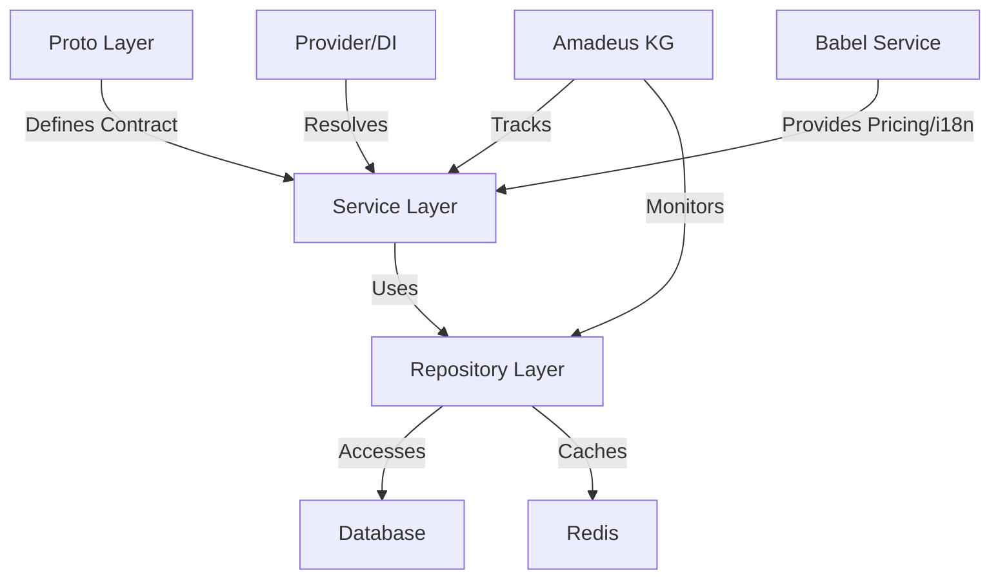
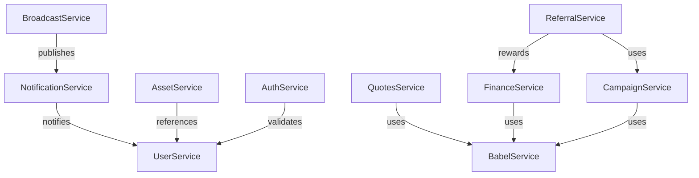

# Article 1: Knowledge Graph-Driven Architecture for Modern Backends

> **Draft**

## Abstract

This article explores how knowledge graph-driven architecture transforms backend platforms, enabling modularity, observability, and AI-readiness. Using OVASABI/Amadeus as a case study, we demonstrate how a persistent, self-documenting knowledge graph can orchestrate and document all services, relationships, and system evolution.

## Introduction

Traditional backend architectures struggle with complexity, service sprawl, and lack of systemic insight. By adopting a knowledge graph as the architectural backbone, platforms gain a living map of all components, dependencies, and data flows—empowering both humans and AI to reason about the system.

## Why Knowledge Graphs?

- Capture relationships and dependencies explicitly
- Enable impact analysis and change prediction
- Support self-documentation and automated visualization
- Provide a foundation for AI-driven insights
- Facilitate automated compliance and governance

## System Overview

The OVASABI platform uses Amadeus, a knowledge graph that tracks all services, their registrations, dependencies, and capabilities. All services are registered via a Provider/DI container, ensuring modularity and single registration. The knowledge graph is stored in a JSON file and accessed via a Go API.

## Implementation Patterns

- Layered architecture: Proto → Service → Repository → DB/Redis
- Centralized service registration
- Automated documentation and visualization
- Service hooks for real-time updates
- CI/CD integration for validation

## Impact on Modularity & Observability

- Single source of truth for all services
- Real-time health and metrics tracking
- Easy onboarding and impact analysis
- Automated relationship and dependency diagrams

## Case Study: OVASABI/Amadeus

Amadeus maintains a JSON-based knowledge graph, updated via service hooks, CI/CD, and manual tools. It powers documentation, diagrams, and impact analysis. The system supports versioning, backups, and rollback.

### Example: Service Registration in the Knowledge Graph

```go
// Registering a service in Amadeus KG
type ServiceRegistration struct {
    Name         string
    Version      string
    Capabilities []string
    Dependencies []string
    Endpoints    []EndpointInfo
}

amadeusKG.RegisterService(ServiceRegistration{
    Name: "QuotesService",
    Version: "v1.2.0",
    Capabilities: []string{"quote-generation", "pricing"},
    Dependencies: []string{"BabelService", "UserService"},
    Endpoints: []EndpointInfo{/* ... */},
})
```

## Diagrams & Data Flows

### Layered Architecture


### Service Relationships


## Lessons Learned

- Invest in self-documenting systems early
- Make relationships explicit for AI and humans
- Automate as much as possible
- Use versioning and backups for safety

## Conclusion

Knowledge graph-driven architecture is a powerful pattern for modern, extensible, and observable backends. OVASABI/Amadeus demonstrates its real-world value.

---

*This is a living document. Contributions and updates are welcome.* 