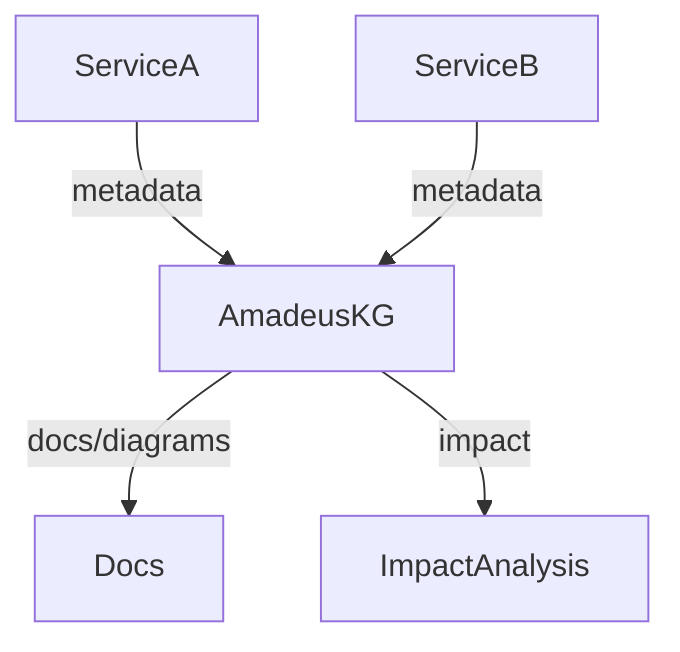
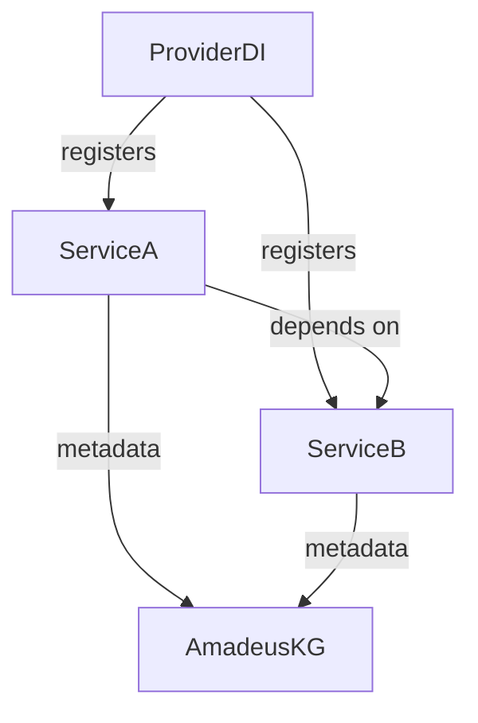

# Article 2: Metadata-Driven Orchestration and Self-Documenting Systems

> **Draft**

## Abstract

This article examines how metadata-driven orchestration enables self-documenting, adaptive backend systems. We show how OVASABI/Amadeus leverages metadata to automate service registration, relationship mapping, and documentation, reducing manual effort and increasing system transparency.

## Introduction

Modern distributed systems are complex and ever-changing. By treating metadata as a first-class citizen, platforms can automate orchestration, documentation, and compliance, making the system easier to reason about and evolve.

## Metadata as a First-Class Citizen

- All services and components declare metadata (capabilities, dependencies, endpoints)
- Metadata is stored in the knowledge graph and used for orchestration and documentation
- Metadata includes versioning, health, metrics, and schema

## Orchestration Patterns

- Centralized registration via DI/Provider
- Automated relationship mapping
- Impact analysis before changes
- Metadata-driven dependency resolution

## Self-Documenting Systems

- Documentation is generated from live metadata
- Diagrams and relationship maps are always up to date
- Service network and changelog are auto-generated

## Implementation in OVASABI/Amadeus

```go
// Example: Service registration with metadata
type ServiceRegistration struct {
    Name         string
    Version      string
    Capabilities []string
    Dependencies []string
    Endpoints    []EndpointInfo
}

provider.Register(&ServiceRegistration{
    Name: "QuotesService",
    Version: "v1.2.0",
    Capabilities: []string{"quote-generation", "pricing"},
    Dependencies: []string{"BabelService", "UserService"},
    Endpoints: []EndpointInfo{/* ... */},
})
```

### Automated Documentation Generation

```go
// Example: Generating service network documentation from metadata
for _, svc := range amadeusKG.ListServices() {
    fmt.Printf("- %s (v%s): %v\n", svc.Name, svc.Version, svc.Capabilities)
    for _, dep := range svc.Dependencies {
        fmt.Printf("  depends on: %s\n", dep)
    }
}
```

## CI/CD Validation

- CI pipeline checks metadata consistency before merge
- Automated tests ensure all services are registered and documented
- Docs are regenerated on every deployment

## Diagrams & Examples

### Metadata Flow


### Orchestration Pattern


## Challenges & Solutions

- Ensuring metadata accuracy: use CI/CD validation
- Avoiding duplication: single source of truth in the knowledge graph
- Keeping documentation in sync with code

## Conclusion

Metadata-driven orchestration is key to building adaptive, self-documenting systems. OVASABI/Amadeus demonstrates how this approach reduces manual work and increases system clarity.

---

*This is a living document. Contributions and updates are welcome.* 