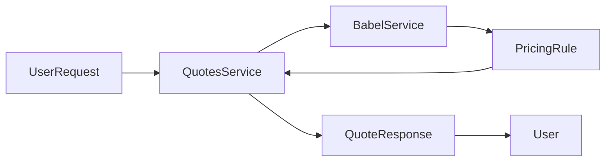

# Article 3: Babel—Unified i18n and Location-Based Pricing as a Platform Service

> **Draft**

## Abstract

This article details how Babel unifies internationalization (i18n) and location-based pricing as a platform service, enabling consistent, dynamic experiences across products. We show how Babel integrates with Quotes, Finance, and Campaign services in OVASABI, and provide code examples and data flow diagrams.

## Introduction

Global products require both localization and dynamic pricing. Babel abstracts these concerns into a single, reusable service, reducing duplication and enabling rapid expansion into new markets.

## The Need for Unified i18n & Pricing

- Consistent user experience across locales
- Dynamic pricing based on location, currency, and context
- Centralized rules and translations

## Babel Service Overview

- Provides translation and pricing APIs
- Integrates with core business services
- Rules and translations are centrally managed

## Integration Patterns

```go
// Example: Using Babel for location-based pricing
pricingRule, err := babelClient.GetLocationContext(ctx, &babelpb.LocationContextRequest{
    Country: user.Country,
    Region: user.Region,
    City: user.City,
})
if err != nil {
    // fallback or error handling
}
quote.Price = basePrice * pricingRule.Multiplier
```

## Impact on Product & Engineering

- Faster rollout to new regions
- Consistent pricing and messaging
- Reduced engineering overhead

## Case Study: Quotes, Finance, Campaign

- QuotesService uses Babel for pricing
- FinanceService uses Babel for currency conversion
- CampaignService uses Babel for locale targeting

## Diagrams & Data Flows



## Lessons Learned

- Centralize i18n and pricing logic
- Keep rules and translations up to date
- Integrate early in the service lifecycle

## Conclusion

Babel demonstrates the power of unified platform services for i18n and pricing, enabling global scale and consistency.

---

*This is a living document. Contributions and updates are welcome.* 