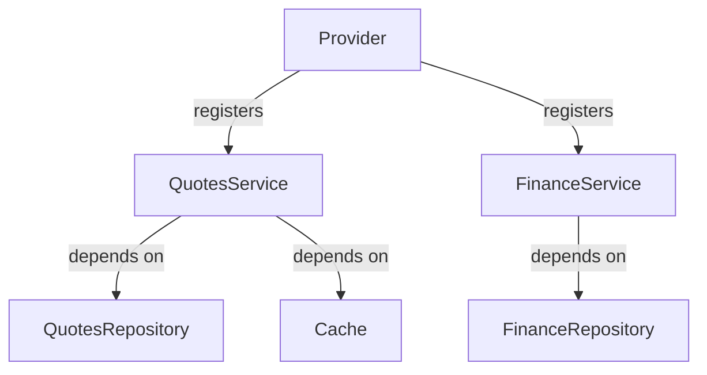

# Article 4: The DI/Provider Pattern in Go—Modular, Extensible, and Testable Services

> **Draft**

## Abstract

This article explores the DI/Provider pattern in Go, showing how it enables modular, extensible, and
testable service architectures. Using OVASABI/Amadeus as a case study, we demonstrate best practices
for dependency injection, service registration, and testing.

## Introduction

Go's simplicity and static typing make it ideal for building robust backends, but managing
dependencies can become complex as systems grow. The DI/Provider pattern centralizes service
registration and resolution, improving maintainability and testability.

## Why Dependency Injection?

- Decouples service construction from usage
- Enables easier testing and mocking
- Supports modular, pluggable architectures

## Provider Pattern Explained

- Central container manages all service registrations
- Services are resolved by type, not by manual wiring
- Enforces single registration and dependency tracking

## Implementation in Go

```go
// Registering a service in the provider
type QuotesService struct { /* ... */ }

provider.Register((*QuotesService)(nil), func(c *Container) (interface{}, error) {
    repo := c.Resolve((*QuotesRepository)(nil)).(QuotesRepository)
    cache := c.Resolve((*Cache)(nil)).(Cache)
    return NewQuotesService(repo, cache), nil
})
```

## Service Registration & Resolution

- All services registered at startup
- Dependencies resolved via the provider
- No manual instantiation in business logic

## Testing & Extensibility

- Swap implementations for tests
- Add new services without changing consumers

## Case Study: OVASABI/Amadeus

- All core and feature services use the provider pattern
- Health and metrics endpoints registered centrally

## Diagrams & Code Examples



## Lessons Learned

- Enforce single registration to avoid runtime errors
- Use interfaces for all dependencies
- Centralize health and metrics endpoints

## Conclusion

The DI/Provider pattern in Go is a proven approach for building scalable, maintainable, and testable
backends. OVASABI/Amadeus demonstrates its effectiveness at scale.

---

_This is a living document. Contributions and updates are welcome._
