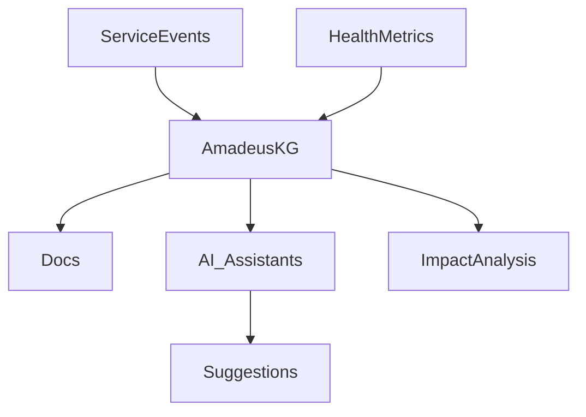
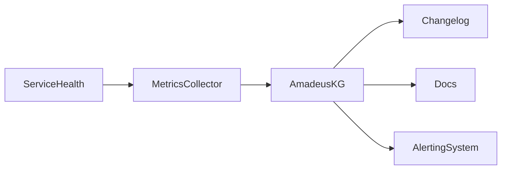

# Article 5: AI, Observability, and Self-Documenting Systems—The Future of Backend Platforms

> **Draft**

## Abstract

This article explores how AI and observability are converging to create self-documenting, adaptive backend systems. Using OVASABI/Amadeus as a reference, we show how knowledge graphs, metrics, and automated documentation enable rapid evolution and AI-driven insights.

## Introduction

As systems grow in complexity, traditional documentation and monitoring approaches fall short. By integrating observability, knowledge graphs, and AI, platforms can become self-documenting and self-improving.

## The Role of AI in Modern Backends

- Automated anomaly detection and impact analysis
- AI-assisted documentation and onboarding
- Pattern recognition for system optimization
- Predictive maintenance and alerting

### AI-Driven Impact Analysis

- Uses the knowledge graph to trace dependencies
- Predicts which services are affected by changes
- Suggests test cases and documentation updates

## Observability as a Foundation

- Centralized health and metrics endpoints
- Real-time data feeds into the knowledge graph
- Enables proactive system management
- Supports distributed tracing and log aggregation

## Self-Documenting Systems

- Documentation generated from live system state
- Diagrams and relationship maps always up to date
- Reduces onboarding and maintenance effort
- Automated changelogs and service network maps

### Example: Automated Changelog Generation

```go
// Example: Generating a changelog from service updates
for _, update := range amadeusKG.ListServiceUpdates(since) {
    fmt.Printf("- [%s] %s: %s\n", update.Timestamp.Format("2006-01-02"), update.ServiceID, update.UpdateType)
}
```

## Implementation in OVASABI/Amadeus

- Amadeus tracks all service registrations, health, and metrics
- Automated diagrams and changelogs
- AI-ready context for assistants and developers
- Event-driven updates and validation

## Diagrams & Future Directions

### AI & Observability Integration


### Observability Data Flow


## Challenges & Opportunities

- Ensuring data quality and consistency
- Balancing automation with human oversight
- Leveraging AI for continuous improvement
- Handling scale and performance

## Conclusion

The future of backend platforms lies in self-documenting, observable, and AI-augmented systems. OVASABI/Amadeus is a blueprint for this new paradigm.

---

*This is a living document. Contributions and updates are welcome.* 