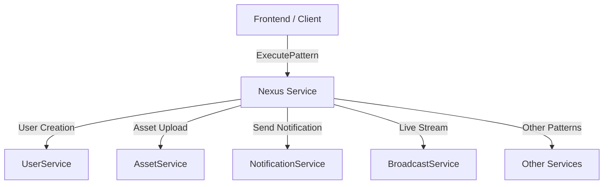
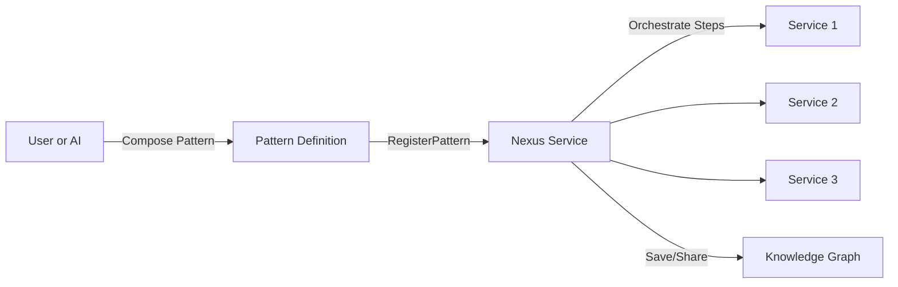

# Nexus as an Orchestrator for Microservices: A Go, gRPC, and DI Architecture Case Study

## Introduction

In modern distributed systems, orchestrating complex workflows across multiple microservices is a
common challenge. The **Nexus** service in the OVASABI platform demonstrates a powerful pattern:
exposing a single orchestration endpoint that coordinates all backend services, rather than exposing
each service directly. This article explores the design, benefits, limitations, and future
improvements of this approach, with a focus on Go, gRPC, and dependency injection (DI).

---

## The Orchestrator Pattern: Why Only Expose Nexus?

Instead of having the frontend or external clients interact with every microservice (User, Asset,
Notification, Broadcast, etc.), the Nexus service acts as a **facade** or "API gateway" for
orchestrated workflows. Clients interact only with Nexus, which then coordinates the necessary calls
to underlying services.

### **How It Works**

- **Pattern-Based API:** Nexus exposes a flexible `ExecutePattern` RPC. Clients specify a pattern
  (e.g., `user_creation`, `subscribe_live_stream`), and Nexus executes the corresponding workflow.
- **Service Composition:** Each pattern encapsulates a sequence of service calls (e.g., create user,
  upload asset, send notification) and handles data flow between them.
- **Centralized Registration:** New patterns can be registered at runtime, allowing for extensible,
  user-defined, or system-generated workflows.

### **Go, gRPC, and DI in Action**

- **Go** provides strong typing, concurrency, and performance for implementing orchestration logic.
- **gRPC** enables efficient, strongly-typed communication between Nexus and underlying services.
- **Dependency Injection (DI)** ensures that all service dependencies are managed centrally, making
  it easy to swap implementations, mock services for testing, and manage lifecycle.

---

## Example: User Registration and Live Stream Subscription

Suppose a user wants to register and then subscribe to a live stream. Instead of calling UserService
and BroadcastService directly, the frontend calls Nexus:

1. **Register User:**
   - `ExecutePattern` with `pattern_name = "user_creation"`.
   - Nexus calls UserService, AssetService, and NotificationService as needed.
2. **Subscribe to Live Stream:**
   - `ExecutePattern` with `pattern_name = "subscribe_live_stream"`.
   - Nexus calls BroadcastService and handles any required authentication or permission checks.

All orchestration logic is centralized in Nexus, making the API surface simple and secure.

---

## Current Limitations

While this approach is powerful, there are some important limitations:

### 1. **Pattern Definition Flexibility**

- The current proto uses `map<string, string>` for pattern configuration, which is flexible but
  lacks strong typing and validation.
- All structure and validation must be handled in application code, and frontend/backend must agree
  on the pattern format (often JSON).

### 2. **Streaming Support**

- gRPC-Web/Connect-Web (used for browser clients) only supports unary and server streaming, not
  bidirectional streaming.
- If a pattern needs to proxy a live stream (e.g., video chunks), Nexus must implement a
  server-streaming RPC and forward data from the underlying service.

### 3. **Potential for "God Service"**

- As more workflows are centralized, Nexus can become a bottleneck or single point of failure if not
  carefully managed.
- Complex patterns may lead to large, hard-to-maintain orchestration logic.

### 4. **No Built-in Versioning or Ownership**

- Patterns are registered by name, but there is no built-in support for versioning, sharing, or
  ownership metadata.

---

## Possible Improvements for the Future

### 1. **Strongly-Typed Pattern Definitions**

- Extend the proto to include a `PatternStep` message, allowing for validation and IDE support.
- Example:

  ```proto
  message PatternStep {
    string service = 1;
    string action = 2;
    map<string, string> params = 3;
  }
  message RegisterPatternRequest {
    string pattern_name = 1;
    string pattern_type = 2;
    repeated PatternStep steps = 3;
  }
  ```

### 2. **Pattern Versioning and Ownership**

- Add fields for version, owner, and description to support sharing, auditing, and evolution of
  patterns.

### 3. **Enhanced Streaming and Event-Driven Patterns**

- Add support for more advanced streaming (e.g., via WebSockets or native gRPC clients).
- Enable event-driven patterns that react to system events, not just direct RPC calls.

### 4. **Pattern Marketplace and Sharing**

- Allow users to share, fork, and reuse patterns, building a "lego block" ecosystem for automation.

### 5. **AI-Assisted Pattern Generation**

- Integrate AI to suggest or generate patterns based on usage analytics or user goals.

---

## User- and AI-Generated Patterns: Building with Legos

One of the most powerful aspects of the Nexus orchestrator is its potential to let users—or even
AI—compose new workflows from existing microservice actions, much like building with legos.

#### **How It Works**

- **Pattern Composition UI:** Users interact with a visual or form-based interface to select,
  arrange, and connect service actions (e.g., CreateUser, SendNotification, StartStream) into a
  custom workflow.
- **Pattern Definition:** The composed workflow is serialized (e.g., as JSON) and sent to the
  backend via `RegisterPattern`, where it is stored in the knowledge graph.
- **Pattern Execution:** Any user or system process can later execute the saved pattern by name,
  with Nexus orchestrating the steps across services.
- **AI-Generated Patterns:** The system or an AI assistant can analyze usage, suggest, or even
  auto-generate new patterns to optimize workflows or automate common tasks.

### **Benefits**

- Empowers users to automate and customize business logic without backend changes.
- Enables rapid prototyping and sharing of best-practice workflows.
- Lays the foundation for AI-driven automation and optimization.

---

## Visual Diagrams: Nexus and Microservices (Abstract)

### **1. Centralized Orchestration (Nexus as Facade)**



### **2. Pattern Composition and Execution Flow**



---

## Conclusion

The Nexus orchestrator pattern, implemented in Go with gRPC and DI, offers a powerful way to
centralize and automate complex workflows in a microservices architecture. By exposing only the
Nexus endpoint, you simplify the API surface, improve security, and enable rapid evolution of
business logic. As the system grows, investing in stronger typing, streaming support, and pattern
management will unlock even greater flexibility and power for both users and developers.

---

_For more details, see the Nexus service implementation and proto definitions in the OVASABI
codebase._
