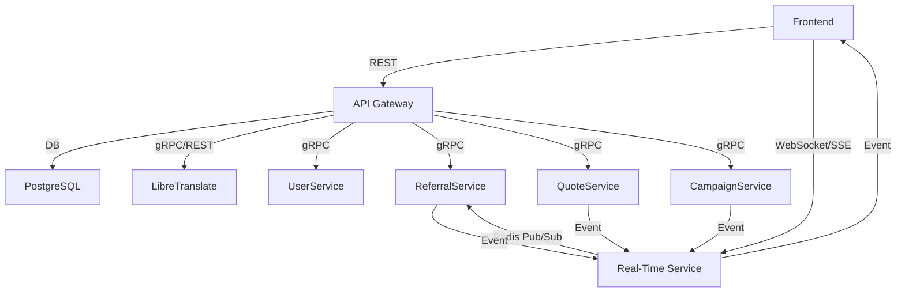

# Ovasabi Website Campaign: Backend & Frontend Integration

## Overview

This document describes the required backend functionality, service responsibilities, and
frontend-backend communication patterns for the Ovasabi Website campaign, with a focus on
extensibility and reproducibility for future campaigns.

---

## 1. Key Features & User Stories

- **Real-time active user streaming:**
  - Show number of active users on the site.
  - Display their mouse/tap positions in real time.
- **Quote/Lead generation:**
  - Users can submit a form to request a quote or express interest in services.
  - The **QuoteService** is responsible for handling and communicating leads.
- **User registration:**
  - Users can register ("join user") and enter the database.
- **Live translation:**
  - Frontend can send strings to backend for translation to relevant locales, with context.
- **Referral handling:**
  - Users can enter referral codes; backend tracks and recognizes referrals.
  - Backend broadcasts a stream of user events (e.g., "User X now has 100 referrals") to the
    frontend.

---

## 2. Required Backend Functionality & Service Responsibilities

### **A. Real-Time User Streaming**

- **Service(s) involved:**
  - WebSocket or Server-Sent Events (SSE) gateway (could be a new microservice or part of the main
    app)
  - Redis (for pub/sub and fast state tracking)
- **Responsibilities:**
  - Track active user sessions (user ID or anonymous session ID).
  - Receive and broadcast mouse/tap positions to all connected clients.
  - Maintain and stream the count of active users.

### **B. Quote/Lead Generation (QuoteService)**

- **Service(s) involved:**
  - **QuoteService** (dedicated microservice for quote/lead submission and management)
  - Database (PostgreSQL: `service_quote_main` or similar table)
- **Responsibilities:**
  - Accept and validate quote/lead form submissions.
  - Store leads in the database.
  - Communicate new leads to internal teams or CRM.
  - Optionally, trigger notifications or event streams for new leads.

#### **Communication Patterns for Quote/Lead Submission**

- **REST API:**
  - Easiest and most common for form submissions from frontend to backend.
  - Example: `POST /api/quote` with lead details in JSON.
- **WebSocket:**
  - Useful if you want real-time feedback or to stream lead status/updates to the frontend.
  - Example: Client sends lead data over WebSocket, receives real-time status/events.
- **gRPC:**
  - Suitable for backend-to-backend communication (e.g., QuoteService to CRM, or internal
    microservices).
  - Can be exposed to frontend via gRPC-Web, but REST is simpler for browser clients.
- **Recommendation:**
  - Use **REST** for initial lead/quote submission from frontend.
  - Use **WebSocket/SSE** for real-time updates or notifications to the frontend (e.g., "Your quote
    is being processed").
  - Use **gRPC** for internal service-to-service communication (e.g., QuoteService <->
    CampaignService, CRM, NotificationService).

### **C. User Registration**

- **Service(s) involved:**
  - UserService (existing)
  - Database (PostgreSQL: `service_user_master`)
- **Responsibilities:**
  - Accept registration data (email, name, etc.).
  - Create user record and assign a master ID.
  - Optionally, send welcome notification.

### **D. Live Translation**

- **Service(s) involved:**
  - Main app (API endpoint for translation requests)
  - LibreTranslate (self-hosted or Azure Container App)
- **Responsibilities:**
  - Accept string and context from frontend.
  - Call LibreTranslate API with context.
  - Return translated string to frontend.

### **E. Referral Handling & Event Broadcasting**

- **Service(s) involved:**
  - ReferralService (existing)
  - Notification/Broadcast service (WebSocket/SSE)
  - Redis (for pub/sub event streaming)
- **Responsibilities:**
  - Accept and validate referral codes.
  - Track referral counts and milestones.
  - Broadcast referral events (e.g., "User X now has 100 referrals") to all connected clients.

### **F. Campaign Management (CampaignService)**

- **Service(s) involved:**
  - **CampaignService** (existing)
- **Responsibilities:**
  - Create and manage campaigns (e.g., Ovasabi Website campaign) in the database
    (`service_campaign_main`).
  - Associate leads, users, and events with a specific campaign via `campaign_id` or `master_id`.
  - Provide APIs to query campaign status, metrics, and participants.

#### **How Campaigns Are Created and Used**

- Campaigns are created via the CampaignService (e.g., `POST /api/campaign` with campaign details).
- Each campaign can define its own logic for lead capture, referral tracking, and event
  broadcasting.
- All user actions (leads, registrations, referrals) are linked to a campaign via `campaign_id`.
- This pattern allows new campaigns to be created and managed with minimal code changes—just
  configure a new campaign and reuse the same service interfaces.

---

## 3. Frontend-Backend Communication Patterns

### **A. REST API**

- For user registration, quote/lead submission, translation requests, and referral code entry.
- Endpoints:
  - `POST /api/user/register`
  - `POST /api/quote` (handled by QuoteService)
  - `POST /api/translate`
  - `POST /api/referral`
  - `POST /api/campaign` (for campaign creation/management)

### **B. WebSocket or Server-Sent Events (SSE)**

- For real-time features:
  - Active user count and positions
  - Referral event broadcasts
  - Real-time lead/quote status updates (optional)
- Pattern:
  - Frontend opens a WebSocket/SSE connection to backend.
  - Backend pushes events (user activity, referral milestones, lead status) to all connected
    clients.
  - Frontend can send user activity (mouse/tap) events to backend for rebroadcast.

### **C. gRPC**

- For internal service-to-service communication:
  - QuoteService <-> CampaignService
  - QuoteService <-> NotificationService/CRM
  - UserService <-> CampaignService
- Can be extended to gRPC-Web for advanced frontend use cases, but REST is simpler for most web
  clients.

### **D. Example Communication Flow**

---

## 4. Extensibility & Reproducibility for Future Campaigns

- **Service-Oriented Pattern:** Each campaign is an entity managed by the CampaignService, with
  leads, users, referrals, and events linked via `campaign_id`.
- **Reusable APIs:** All core actions (lead submission, registration, referral, translation) use
  standard REST/gRPC APIs, making it easy to add new campaigns.
- **Event-Driven Architecture:** Real-time events (user activity, referrals, lead status) are
  broadcast via WebSocket/SSE, and can be subscribed to by any frontend.
- **Configuration-Driven:** New campaigns can be created by configuring campaign metadata and rules
  in the CampaignService, without duplicating code.
- **Extensible Event Types:** The event system supports new event types (e.g., "User X completed
  onboarding") for future campaigns.

---

## 5. Implementation Notes & Recommendations

- **Session Management:** Use JWT or session cookies for user identification.
- **Scalability:** Use Redis pub/sub for real-time event fan-out.
- **Security:** Validate all inputs, rate-limit real-time events, and secure WebSocket endpoints.
- **Localization:** Pass context (user locale, page, etc.) with translation requests.
- **Extensibility:** Design APIs and event payloads to allow for future features (e.g., chat,
  notifications, campaign-specific logic).

---

## 6. Next Steps

- Define and document all required API endpoints and payloads.
- Implement QuoteService and real-time event streaming.
- Integrate CampaignService for campaign creation and management.
- Ensure all backend services are containerized and ready for Azure deployment.
- Set up monitoring and logging for all real-time and API services.

---

## 7. Campaign Scaffolding: Best Practices & Workflow

To ensure rapid, consistent, and reproducible campaign launches, follow this campaign scaffolding
workflow:

### 7.1. Campaign Scaffolding Steps

1. **Define Campaign Requirements:**
   - Gather user stories, business goals, and required features.
   - Document in a new numbered file in `docs/campaign/` (e.g., `002_new_campaign.md`).
2. **Service Mapping:**
   - Map required features to existing services (User, Referral, Quote, etc.).
   - Identify any new service or event types needed.
3. **API & Event Design:**
   - Define REST/gRPC endpoints and event payloads for campaign actions.
   - Document all endpoints and event types in the campaign file.
4. **Configuration:**
   - Add campaign metadata and rules to CampaignService (DB/config).
   - Use configuration-driven logic for campaign-specific behavior.
5. **Frontend Integration:**
   - Integrate frontend with documented APIs and real-time events.
   - Use WebSocket/SSE for real-time features.
6. **Testing & Monitoring:**
   - Test all campaign flows end-to-end.
   - Set up monitoring, logging, and analytics for campaign events.
7. **Documentation & Review:**
   - Update Amadeus context and knowledge graph with new campaign and relationships.
   - Review for extensibility and compliance with best practices.

### 7.2. Numbered Campaign Files

- All campaign documentation files must be numbered (e.g., `001_ovasabi_website.md`,
  `002_new_campaign.md`).
- This ensures clear versioning, ordering, and reproducibility.
- Update Amadeus context and service list to reference new campaign files.

### 7.3. Reference

- See [Amadeus Context](../amadeus/amadeus_context.md) for system-wide campaign integration.
- See [Service List](../services/service_list.md) for all available services.
- See [Implementation Pattern](../services/implementation_pattern.md) for service and campaign
  extensibility.

---

**This document will evolve as the Ovasabi Website campaign progresses and new requirements
emerge.**
