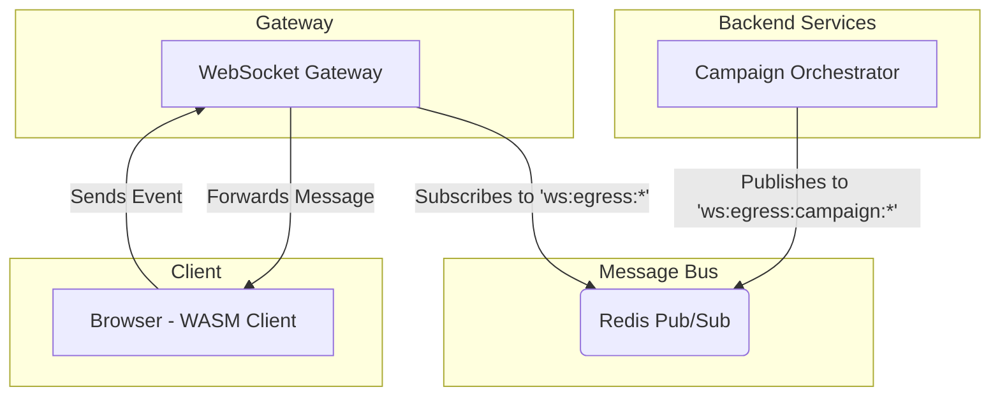

# Gemini AI Assistant Guide for the OVASABI/Inos Platform

**Version:** 1.2
**Last Updated:** 2025-06-26

> **Objective:** This document provides a canonical guide for AI assistants interacting with the OVASABI/Inos codebase. It synthesizes the core architectural principles, development patterns, and standards from the project's documentation to ensure all contributions are consistent, idiomatic, and adhere to best practices.

---

## 1. System Overview: An Operating System for a Digital Economy

Inos is not merely a backend platform; it is a modular, event-driven operating system designed to orchestrate a complete digital economy. It is built on three core pillars that work in concert:

1. **The Service Platform:** A robust set of microservices that provide the traditional features of a modern application (users, content, commerce, etc.).
2. **The Token Ecosystem:** A native, first-class system for managing digital assets (`OvaStable`, `OvaUtility`), governance, and economic mechanisms like Universal Basic Income (`UBI_distribution`).
3. **The Integration Layer:** The crucial bridge that translates actions on the Service Platform into value within the Token Ecosystem, using services like a `reputation_bridge` and `value_router`.

**Core Architectural Principles:**

* **Metadata as System Currency:** Metadata is the literal fuel for the economy. The Integration Layer uses the rich, structured metadata from system events to drive incentives, reputation, and value distribution.
* **Event-Driven Economy:** The Nexus event bus is the real-time "tick" of the economy. Every event is a potential economic transaction that can be processed by the Integration Layer.
* **Graceful Orchestration:** Ensures that every economic transaction and service interaction is robust, auditable, and reliable.
* **AI-Native:** The entire system, including its economic rules and structure, is defined in the machine-readable Amadeus knowledge graph, making it transparent and manageable by AI.

---

## 2. Core Concepts & Terminology

* **Amadeus:** The knowledge persistence system and the "constitution" of the digital economy. It's a living knowledge graph of all system components, services, economic rules, and their relationships.
* **Nexus:** The event bus and orchestration engine. It is the real-time "nervous system" that carries event-driven transactions through the platform.
* **Metadata (`common.Metadata`):** The universal, extensible data packet for all events. It provides the rich context needed for the Integration Layer to function.
* **Graceful Package (`pkg/graceful`):** The centralized package for handling all success and error orchestration, ensuring all transactions are atomic and auditable.
* **Campaign Orchestrator:** A generic, real-time "Application Engine" capable of creating diverse, stateful, interactive experiences (like a flash sale or a live feed) based on the metadata in a "campaign" record.

---

## 3. The Three Pillars of the Inos Architecture

Based on the Amadeus knowledge graph, the system is best understood as three distinct but interconnected layers:

### 3.1. The Service Platform (The "Civil Service")

This layer contains the core functional services that users interact with directly.

| Service             | Responsibility                                       |
| ------------------- | ---------------------------------------------------- |
| **User**            | Identity, auth, RBAC, profiles, audit                |
| **Security**        | Policies, compliance, bad actor detection            |
| **Notification**    | Multi-channel, real-time notifications & streaming   |
| **Campaign**        | Manages the records that configure the Campaign Orchestrator |
| **Content**         | Articles, videos, comments, reactions, FTS           |
| **Commerce**        | Orders, payments, billing                            |
| ...and others       | (See `knowledge_graph.json` for a full list)         |

### 3.2. The Token Ecosystem (The "Central Bank & Treasury")

This layer defines the economic foundation of the platform.

| Component              | Responsibility                                    |
| ---------------------- | ------------------------------------------------- |
| **Tokens**             | `OvaStable` & `OvaUtility` digital assets.        |
| **Token Governance**   | Manages the rules of the economy.                 |
| **Treasury**           | Holds the system's assets.                        |
| **Economic Mechanisms**| Implements staking, governance, and UBI distribution. |

### 3.3. The Integration Layer (The "Economic Engine")

This is the bridge that makes the system a true economy. It translates platform activity into economic value.

| Service                 | Responsibility                                                    |
| ----------------------- | ----------------------------------------------------------------- |
| **Value Router**        | Directs value (tokens, reputation) based on event metadata.       |
| **Reputation Bridge**   | Converts positive user actions into a quantifiable reputation score. |
| **Incentive Management**| Distributes rewards and incentives based on rules and actions.    |
| **Exchange Orchestration**| Manages the exchange of digital assets within the ecosystem.      |
| **Wallet Gateway**      | Provides a secure interface to user wallets.                      |

---

## 4. Development Patterns & Standards

### 4.1. Service Implementation Pattern

Follow the three-layer architecture: Proto, Service, and Repository.

### 4.2. Database & Caching

* **PostgreSQL:** Use `jsonb` for metadata. Table Naming: `service_{service}_{entity}`.
* **Redis:** Used for caching and as the **Pub/Sub transport for the Nexus event bus**.

### 4.3. Graceful Orchestration (Success & Error Handling)

This is a critical, non-negotiable standard for all service interactions and economic transactions.

### 4.4. Metadata (`common.Metadata`)

This is the universal currency. It **MUST** be included in all core entities and events to fuel the Integration Layer.

### 4.5. Real-Time Architecture: Nexus, WebSockets, and WASM

The platform uses a decoupled real-time architecture where services publish to Redis, and a dedicated WebSocket gateway pushes updates to clients.



### 4.6. API & Communication Protocols

* **gRPC:** Primary internal communication.
* **REST:** For external APIs, using the Composable Request Pattern.
* **WebSockets:** For real-time client communication via the gateway.

### 4.7. Service Instantiation & DI

Services self-register with a central provider and **MUST** start the `hello-world` event loop for health signaling.

---

## 5. Key File & Directory Locations

* **Canonical Context:** `docs/amadeus/amadeus_context.md`.
* **System Blueprint:** `amadeus/knowledge_graph.json`.
* **Proto Definitions:** `api/protos/`
* **Service Logic:** `internal/service/`
* **WASM Client:** `wasm/`
* **Makefile:** `Makefile` (in root)

---

## 6. Core `Makefile` Commands

* `make setup`: Set up the development environment.
* `make build`: Build the project, including proto generation.
* `make test`: Run all tests.
* `make lint`: Run the full linting suite.
* `make docker-up`: Start all services using Docker Compose.

---

## 7. AI Interaction Guidelines

* **Adhere to Conventions:** Your primary goal is to write code that is indistinguishable from the existing code.
* **Understand the Three Pillars:** Frame all contributions within the context of the Service Platform, Token Ecosystem, and Integration Layer.
* **Metadata is Economic Fuel:** Treat the `common.Metadata` field as the critical data packet that drives the entire economy. Ensure it is rich and accurate.
* **Use the `graceful` Package:** All service logic, especially logic that could have economic consequences, must be wrapped in the `graceful` package's orchestration methods.
* **Keep it DRY:** Always look for opportunities to use shared patterns and helpers.

---

## 8. Error Handling Standard (Platform-Wide)

**All errors must be handled explicitly. Never ignore errors or assign them to underscore (`_`).**

* Every error returned by a function, especially in business logic, event emission, and integration points, must be checked and handled appropriately.
* Log all errors with sufficient context for observability and debugging.
* If an error is non-fatal but important, log it at the appropriate level (warn, info, etc.).
* If an error is fatal, propagate it with context using error wrapping or gRPC status codes.
* This standard applies to all Go code, service logic, event bus usage, and orchestration flows.
* **Rationale:** Ignoring errors leads to silent failures, poor observability, and unreliable systems. Robust error handling is required for production-grade, maintainable, and auditable services.

---

## 9. Platform Standard: Graceful Error and Success Handling

All services must use the `graceful` package for robust, context-aware error and success handling. This includes:

**Extensible Error Maps:**

* Register all service-specific error mappings at startup using `graceful.RegisterErrorMap`.
* Use `graceful.MapAndWrapErr` to map errors to gRPC codes/messages and wrap with context, eliminating repetitive switch/case logic.
* Ensures consistent, DRY, and observable error handling across the platform.

**Success Orchestration:**

* Use `graceful.WrapSuccess` and `StandardOrchestrate` for all post-success activities (caching, event emission, knowledge graph enrichment, etc.).
* Centralizes and standardizes all post-success flows, reducing repetition and improving maintainability.

**Error Orchestration:**

* Use `graceful.ContextError.StandardOrchestrate` for audit logging, alerting, and fallback on error flows.
* Supports conditional/switch-based orchestration for advanced error handling patterns.

### Success Orchestration

```go
success := graceful.WrapSuccess(ctx, codes.OK, "user updated", response, nil)
success.StandardOrchestrate(ctx, graceful.SuccessOrchestrationConfig{
    Log:          logger,
    Cache:        cache,
    CacheKey:     user.ID,
    CacheValue:   response,
    CacheTTL:     10 * time.Minute,
    Metadata:     user.Metadata,
    EventEmitter: eventEmitter,
    EventEnabled: eventEnabled,
    EventType:    "user_updated",
    EventID:      user.ID,
    PatternType:  "user",
    PatternID:    user.ID,
    PatternMeta:  user.Metadata,
    // Optionally override any step with a custom hook
    // MetadataHook: func(ctx context.Context) error { ... },
})
```

### Error Orchestration

```go
err := graceful.WrapErr(ctx, codes.Internal, "something failed", cause)
err.StandardOrchestrate(graceful.ErrorOrchestrationConfig{
    Log: logger,
    // Optionally override with custom audit, alert, fallback, etc.
})
```
