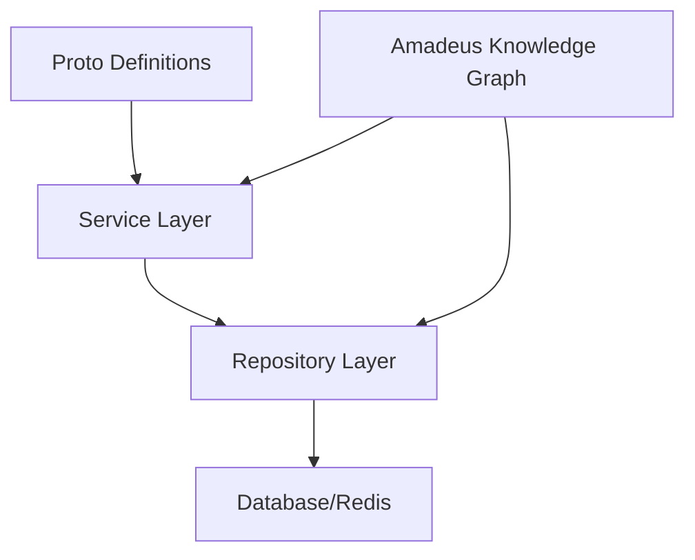

# OVASABI Services Documentation

This directory contains comprehensive documentation for all OVASABI services, their implementation
patterns, and integration with the Amadeus knowledge graph system.

## Service Implementation Pattern

Our services follow a clean, layered architecture pattern:

### Key Components

1. **Proto Definitions** (`api/protos/{service}/v0`)

   - Define service interfaces and data models
   - Version controlled API contracts
   - Language-agnostic service definitions

2. **Service Layer** (`internal/service/{service}`)

   - Business logic implementation
   - gRPC service handlers
   - Internal service interfaces

3. **Repository Layer** (`internal/repository/{service}`)

   - Data access abstraction
   - Caching implementation
   - Transaction management

4. **Knowledge Graph Integration**
   - Service capability registration
   - Dependency tracking
   - Evolution history

## Directory Structure

- [Implementation Pattern](./implementation_pattern.md) - Detailed guide on service implementation
- [Knowledge Graph Integration](./knowledge_graph.md) - Amadeus integration guide
- [Service List](./service_list.md) - Current services and their status
- Individual Service Documentation:
  - [Finance Service](./finance/README.md)
  - [User Service](./user/README.md)
  - [Auth Service](./auth/README.md)
  - [Asset Service](./asset/README.md)
  - [Broadcast Service](./broadcast/README.md)
  - [Campaign Service](./campaign/README.md)
  - [Notification Service](./notification/README.md)
  - [Quotes Service](./quotes/README.md)
  - [Referral Service](./referral/README.md)

## Best Practices

- Follow the established implementation pattern
- Document all service capabilities in Amadeus
- Maintain service evolution history
- Use consistent error handling
- Implement proper logging and tracing
