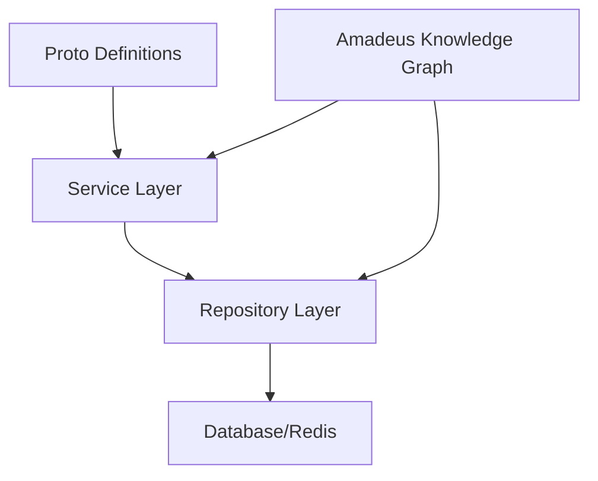

# Documentation

version: 2025-05-14

version: 2025-05-14

version: 2025-05-14

This directory contains comprehensive documentation for all OVASABI services, their implementation
patterns, and integration with the Amadeus knowledge graph system.

## Service Implementation Pattern

Our services follow a clean, layered architecture pattern:

### Key Components

1. **Proto Definitions** (`api/protos/{service}/v0`)

   - Define service interfaces and data models
   - Version controlled API contracts
   - Language-agnostic service definitions

2. **Service Layer** (`internal/service/{service}`)

   - Business logic implementation
   - gRPC service handlers
   - Internal service interfaces
   - Registered with Provider/DI container

3. **Repository Layer** (`internal/repository/{service}`)

   - Data access abstraction
   - Caching implementation
   - Transaction management

4. **Knowledge Graph Integration**

   - Service capability registration
   - Dependency tracking
   - Evolution history
   - Amadeus registration at startup

5. **Dependency Injection & Provider Pattern**

   - Modular, concurrent service registration ensures each service is only registered once and is
     tracked in the Nexus orchestrator for orchestration and introspection.
   - The Provider manages all dependencies and now includes a patternStore for pattern orchestration
     registration in Nexus.
   - Robust error handling ensures all registration and orchestration steps are logged and managed.

6. **Babel & Location-Based Pricing**
   - The Babel service provides i18n and dynamic, location-based pricing rules.
   - Quotes, Finance, and Campaign services integrate with Babel for pricing and localization.

## Directory Structure

- [Implementation Pattern](./implementation_pattern.md) - Detailed guide on service implementation
- [Knowledge Graph Integration](./knowledge_graph.md) - Amadeus integration guide
- [Service List](./service_list.md) - Current services and their status
- Individual Service Documentation:
  - [Finance Service](./finance/README.md)
  - [User Service](./user/README.md)
  - [Auth Service](./auth/README.md)
  - [Asset Service](./asset/README.md)
  - [Broadcast Service](./broadcast/README.md)
  - [Campaign Service](./campaign/README.md)
  - [Notification Service](./notification/README.md)
  - [Quotes Service](./quotes/README.md)
  - [Referral Service](./referral/README.md)
  - **ContentService**: Dynamic content (articles, micro-posts, video), comments, reactions, and
    full-text search. Orchestrates with UserService for author info, NotificationService for
    engagement, SearchService for indexing, and ContentModerationService for compliance.

## Best Practices

- Follow the established implementation pattern
- Register all service capabilities in Amadeus at startup
- Maintain service evolution history
- Use consistent error handling
- Implement proper logging, tracing, health, and metrics
- Integrate with Babel for i18n and pricing where relevant

## Logging at Scale: Industry Standards & Best Practices

Modern distributed systems, especially those with real-time features (websockets, security audit,
analytics, etc.), generate very high log volumes. The following practices are industry standard and
recommended for all OVASABI services:

- **High-Volume Logging is Normal:** Large-scale systems routinely generate massive logs (e.g.,
  security, audit, analytics, websocket events). This is expected and standard.
- **Centralized Log/Event Storage:** Use centralized log/event storage (e.g., ELK Stack, Loki,
  Datadog, Splunk, or cloud-native solutions like AWS CloudWatch, GCP Stackdriver) for scalable
  ingestion, indexing, and querying.
- **Structured Logging:** Always use structured logs (JSON, key-value pairs) for all events. This
  enables efficient search, filtering, and analytics. The use of JSONB payloads and metadata fields
  in the schema aligns with this best practice.
- **Log Levels & Filtering:** Not all logs are equal. Use log levels (DEBUG, INFO, WARN, ERROR) and
  filter what you store long-term. For high-volume, low-value logs (e.g., websocket pings), consider
  only storing aggregates or sampling.
- **Retention & Archival:** Set retention policies. Keep detailed logs for a short period, then
  aggregate or archive. Use cold storage (S3, Glacier, etc.) for old logs if required for
  compliance.
- **Real-Time Processing:** For real-time analytics, use streaming platforms (Kafka, Kinesis,
  Pub/Sub) to decouple log ingestion from processing/storage.
- **Security & Compliance:** Security/audit logs should be immutable and tamper-evident. Consider
  append-only storage or WORM (Write Once, Read Many) solutions for critical audit trails.
- **Cost Management:** Logging at scale can be expensive. Monitor log volume and costs, and tune
  what you log and how you store it.

> **Summary:**
>
> - Averaging a lot of logs is normal and expected in modern systems.
> - What matters is how you manage, store, and process them.
> - Your schema (with JSONB, metadata, etc.) is modern and flexible.
> - Use log levels, retention, and centralized log management to keep things efficient and
>   cost-effective.

> **Standard:** All service documentation must follow the
> [Unified Communication & Calculation Standard](../amadeus/amadeus_context.md#unified-communication--calculation-standard-grpc-rest-websocket-and-metadata-driven-orchestration).
> This includes:
>
> - Documenting all metadata fields and calculation/enrichment chains
> - Referencing canonical metadata patterns and calculation endpoints
> - Using the Makefile and Docker configuration for all proto/code generation and builds

**Service Documentation Checklist:**

- [ ] Documents all metadata fields and calculation/enrichment chains
- [ ] References the Amadeus context and unified standard
- [ ] Uses Makefile/Docker for all builds and proto generation

---
