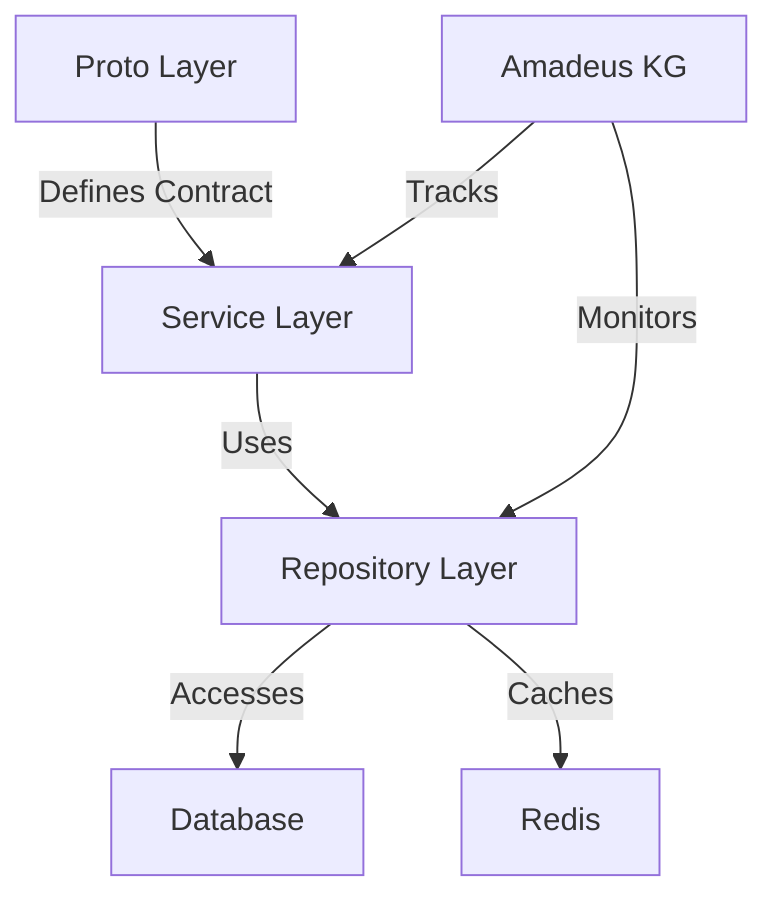

# Service Implementation Pattern

This document describes the standard implementation pattern for OVASABI services, using the Finance
service as a reference implementation.

## Overview

Each service follows a three-layer architecture with Amadeus knowledge graph integration:



## Layer Details

### 1. Proto Layer

Located in `api/protos/{service}/v0`, defines the service interface and data models.

Example (Finance Service):

```protobuf
service FinanceService {
    rpc GetBalance(GetBalanceRequest) returns (GetBalanceResponse);
    rpc Deposit(DepositRequest) returns (TransactionResponse);
    rpc Withdraw(WithdrawRequest) returns (TransactionResponse);
    rpc Transfer(TransferRequest) returns (TransactionResponse);
}
```

### 2. Service Layer

Located in `internal/service/{service}`, implements business logic and gRPC handlers.

Key Components:

- Service interface for internal use
- gRPC service implementation
- Business logic
- Error handling
- Logging and tracing

Example Pattern:

```go
// Service interface for internal use
type Service interface {
    GetBalanceInternal(ctx context.Context, userID uuid.UUID) (float64, error)
    DepositInternal(ctx context.Context, userID uuid.UUID, amount float64) (*TransactionModel, error)
    // ... other methods
}

// service struct implements both Service interface and gRPC service
type service struct {
    UnimplementedServiceServer
    repo   Repository
    master MasterRepository
    cache  *redis.Cache
    logger *zap.Logger
}

// Internal method implementation
func (s *service) GetBalanceInternal(ctx context.Context, userID uuid.UUID) (float64, error) {
    // Business logic implementation
}

// gRPC method implementation
func (s *service) GetBalance(ctx context.Context, req *pb.GetBalanceRequest) (*pb.GetBalanceResponse, error) {
    // Convert proto request to internal format
    // Call internal method
    // Convert response to proto format
}
```

### 3. Repository Layer

Located in `internal/repository/{service}`, handles data access and caching.

Key Components:

- Repository interface
- Database implementation
- Cache implementation
- Transaction handling
- Error mapping

Example Pattern:

```go
// Repository interface
type Repository interface {
    GetBalance(ctx context.Context, userID uuid.UUID) (float64, error)
    UpdateBalance(ctx context.Context, userID uuid.UUID, amount float64) error
    // ... other methods
}

// Implementation with caching
type cachedRepository struct {
    db     *sql.DB
    cache  *redis.Cache
    logger *zap.Logger
}

func (r *cachedRepository) GetBalance(ctx context.Context, userID uuid.UUID) (float64, error) {
    // Try cache first
    // If not in cache, query DB
    // Update cache
    // Return result
}
```

## Error Handling Pattern

1. **Repository Layer**: Return domain-specific errors
2. **Service Layer**: Map to gRPC status codes
3. **Logging**: Log with context at appropriate levels

Example:

```go
// Repository error
if err != nil {
    return nil, fmt.Errorf("failed to get balance: %w", err)
}

// Service error mapping
if err != nil {
    return nil, status.Errorf(codes.Internal, "failed to get balance: %v", err)
}
```

## Amadeus Integration

Services must register their capabilities and dependencies with Amadeus:

```go
func (s *service) RegisterWithAmadeus(ctx context.Context) error {
    return s.amadeus.RegisterService(ctx, &kg.ServiceRegistration{
        Name: "finance",
        Capabilities: []string{
            "balance_management",
            "transactions",
            "transfers",
        },
        Dependencies: []string{
            "user_service",
            "notification_service",
        },
        Schema: &kg.ServiceSchema{
            ProtoPath: "api/protos/finance/v0/finance.proto",
            Methods: []string{
                "GetBalance",
                "Deposit",
                "Withdraw",
                "Transfer",
            },
        },
    })
}
```

## Testing Pattern

1. **Unit Tests**: Test business logic in isolation
2. **Integration Tests**: Test with real dependencies
3. **Repository Tests**: Test with test database
4. **Service Tests**: Test with mocked dependencies

Example:

```go
func TestService_GetBalance(t *testing.T) {
    // Setup test dependencies
    mockRepo := NewMockRepository(t)
    mockCache := NewMockCache(t)

    // Create service instance
    svc := New(mockRepo, mockCache, zap.NewNop())

    // Run test cases
    t.Run("successful balance retrieval", func(t *testing.T) {
        // Test implementation
    })
}
```

## Logging Pattern

Use structured logging with consistent fields:

```go
logger := logger.With(
    zap.String("service", "finance"),
    zap.String("method", "GetBalance"),
    zap.String("user_id", userID.String()),
)
```

## Best Practices

1. **Clean Interface Segregation**

   - Separate internal and gRPC interfaces
   - Use clear method naming

2. **Consistent Error Handling**

   - Use domain-specific errors
   - Map to appropriate gRPC codes
   - Include context in errors

3. **Effective Caching**

   - Cache frequently accessed data
   - Use appropriate TTLs
   - Handle cache failures gracefully

4. **Proper Testing**

   - High test coverage
   - Use test containers
   - Mock external dependencies

5. **Documentation**

   - Document public interfaces
   - Include examples
   - Keep docs updated with code

6. **Monitoring**

   - Use structured logging
   - Implement metrics
   - Set up tracing

7. **Security**
   - Validate all inputs
   - Use proper authentication
   - Follow least privilege principle
