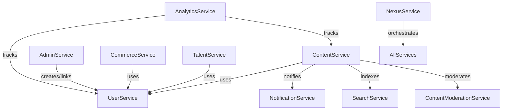

# Service Implementation Pattern

## Standardized Service Pattern

All services follow a layered pattern:

- **Proto Layer**: Defines the gRPC contract (api/protos/{service}/v1)
- **Service Layer**: Implements business logic and gRPC handlers (internal/service/{service})
- **Repository Layer**: Handles DB and cache access (internal/repository/{service})

## Example: ContentService

- Integrates with UserService (for author info), NotificationService (for engagement), SearchService
  (for indexing), and ContentModerationService (for compliance).
- All cross-service calls use gRPC clients, resolved via the DI container.

## Example: AdminService

- Uses UserService gRPC to create or link main users when creating admin users.
- All admin users are linked to main users via user_id.

## Service Registration

- All services are registered in the DI container in internal/service/provider.go.
- Dependencies are resolved via the DI container, not direct instantiation.
- Cross-service calls (e.g., AdminService → UserService) use gRPC clients.

## Updated Service List

- User, Notification, Campaign, Referral, Security, Content, Commerce, Localization, Search, Admin,
  Analytics, ContentModeration, Talent, Nexus.

## Diagrams

## Notes

- All service-to-service relationships are via gRPC and DI.
- AdminService always creates/links admin users to main users via UserService gRPC.
- No direct DB access across service boundaries.
