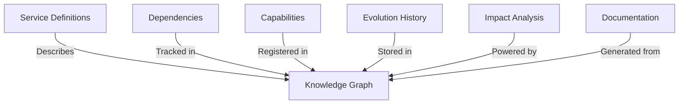

# Knowledge Graph Integration

This document describes how services integrate with the Amadeus Knowledge Graph system to maintain a
comprehensive understanding of the system's architecture and capabilities.

## Overview

The Amadeus Knowledge Graph maintains a complete model of the system, including:



---

**All services are registered and resolved via a central Provider using a DI container. Modular
registration ensures each service is only registered once. Health and metrics are managed centrally
and exposed for observability. Amadeus registration is performed at service startup for capability
tracking.**

**The Babel service provides i18n and dynamic, location-based pricing rules. Quotes, Finance, and
Campaign services integrate with Babel for pricing and localization.**

---

## Service Registration

Every service must register itself with Amadeus during startup:

```go
type ServiceRegistration struct {
    Name         string           `json:"name"`
    Version      string           `json:"version"`
    Capabilities []string         `json:"capabilities"`
    Dependencies []string         `json:"dependencies"`
    Schema       *ServiceSchema   `json:"schema"`
    Endpoints    []EndpointInfo   `json:"endpoints"`
    Models       []ModelInfo      `json:"models"`
}

type ServiceSchema struct {
    ProtoPath string   `json:"proto_path"`
    Methods   []string `json:"methods"`
}

type EndpointInfo struct {
    Name        string   `json:"name"`
    InputType   string   `json:"input_type"`
    OutputType  string   `json:"output_type"`
    Description string   `json:"description"`
    Tags        []string `json:"tags"`
}

type ModelInfo struct {
    Name       string     `json:"name"`
    Fields     []Field    `json:"fields"`
    Validators []string   `json:"validators"`
}
```

## Integration Points

### 1. Service Startup

Services must register on startup:

```go
func (s *service) Start(ctx context.Context) error {
    // Register with Amadeus
    if err := s.registerWithAmadeus(ctx); err != nil {
        return fmt.Errorf("failed to register with Amadeus: %w", err)
    }

    // Start service
    return nil
}
```

### 2. Runtime Updates

Services should update their state during runtime:

```go
func (s *service) UpdateCapability(ctx context.Context, cap string, status bool) error {
    return s.amadeus.UpdateCapability(ctx, s.name, cap, status)
}
```

### 3. Dependency Tracking

Track service dependencies:

```go
func (s *service) AddDependency(ctx context.Context, dep string) error {
    return s.amadeus.AddDependency(ctx, s.name, dep)
}
```

### 4. Evolution History

Record significant changes:

```go
func (s *service) RecordChange(ctx context.Context, change *kg.Change) error {
    return s.amadeus.RecordChange(ctx, &kg.ChangeRecord{
        Service:     s.name,
        ChangeType:  change.Type,
        Description: change.Description,
        Timestamp:   time.Now(),
    })
}
```

## Knowledge Graph Queries

### 1. Impact Analysis

Before making changes:

```go
func (s *service) AnalyzeImpact(ctx context.Context, change *kg.Change) (*kg.ImpactAnalysis, error) {
    return s.amadeus.AnalyzeImpact(ctx, &kg.ImpactRequest{
        Service: s.name,
        Change:  change,
    })
}
```

### 2. Capability Discovery

Find services by capability:

```go
func (s *service) FindCapableServices(ctx context.Context, capability string) ([]string, error) {
    return s.amadeus.FindServices(ctx, &kg.CapabilityQuery{
        Required: []string{capability},
    })
}
```

### 3. Dependency Graph

Generate dependency visualization:

```go
func (s *service) GenerateDependencyGraph(ctx context.Context) (*kg.Graph, error) {
    return s.amadeus.GenerateGraph(ctx, &kg.GraphRequest{
        Type: kg.GraphTypeDependency,
        Root: s.name,
    })
}
```

## Documentation Generation

Amadeus can generate documentation from the knowledge graph:

```go
func (s *service) GenerateDocs(ctx context.Context) error {
    return s.amadeus.GenerateDocs(ctx, &kg.DocsRequest{
        Service: s.name,
        Output:  "docs/services/generated",
        Format:  kg.DocsFormatMarkdown,
    })
}
```

## Best Practices

1. **Regular Updates**

   - Keep service registration current
   - Update capabilities as they change
   - Record significant changes

2. **Dependency Management**

   - Explicitly declare dependencies
   - Version dependencies appropriately
   - Track transitive dependencies

3. **Impact Analysis**

   - Run impact analysis before changes
   - Consider downstream effects
   - Plan for migrations

4. **Documentation**

   - Keep service descriptions updated
   - Document all capabilities
   - Include usage examples

5. **Evolution Tracking**

   - Record breaking changes
   - Track API versions
   - Document migrations

6. **Security**
   - Register security capabilities
   - Track security dependencies
   - Document security requirements

## Example: Finance Service Integration

Complete example of Finance service integration:

```go
func (s *service) registerWithAmadeus(ctx context.Context) error {
    return s.amadeus.RegisterService(ctx, &kg.ServiceRegistration{
        Name:    "finance",
        Version: "v1",
        Capabilities: []string{
            "balance_management",
            "transactions",
            "transfers",
            "audit_logging",
        },
        Dependencies: []string{
            "user_service:v1",
            "notification_service:v1",
        },
        Schema: &kg.ServiceSchema{
            ProtoPath: "api/protos/finance/v0/finance.proto",
            Methods: []string{
                "GetBalance",
                "Deposit",
                "Withdraw",
                "Transfer",
            },
        },
        Endpoints: []kg.EndpointInfo{
            {
                Name:        "GetBalance",
                InputType:   "GetBalanceRequest",
                OutputType: "GetBalanceResponse",
                Description: "Retrieves current balance for a user",
                Tags:        []string{"read-only", "cached"},
            },
            // ... other endpoints
        },
        Models: []kg.ModelInfo{
            {
                Name: "Transaction",
                Fields: []kg.Field{
                    {Name: "id", Type: "uuid", Required: true},
                    {Name: "user_id", Type: "uuid", Required: true},
                    {Name: "amount", Type: "float64", Required: true},
                    // ... other fields
                },
                Validators: []string{
                    "amount > 0",
                    "status in (pending,complete,failed)",
                },
            },
        },
    })
}
```

## Monitoring and Alerts

Amadeus can monitor service health and dependencies:

```go
func (s *service) setupMonitoring(ctx context.Context) error {
    return s.amadeus.SetupMonitoring(ctx, &kg.MonitoringConfig{
        Service: s.name,
        Checks: []kg.HealthCheck{
            {
                Name:     "database_connection",
                Interval: time.Minute,
            },
            {
                Name:     "cache_connection",
                Interval: time.Minute,
            },
        },
        Alerts: []kg.Alert{
            {
                Name:        "high_error_rate",
                Threshold:   0.01,
                Window:     time.Minute * 5,
                Notify:     []string{"slack-alerts"},
            },
        },
    })
}
```
