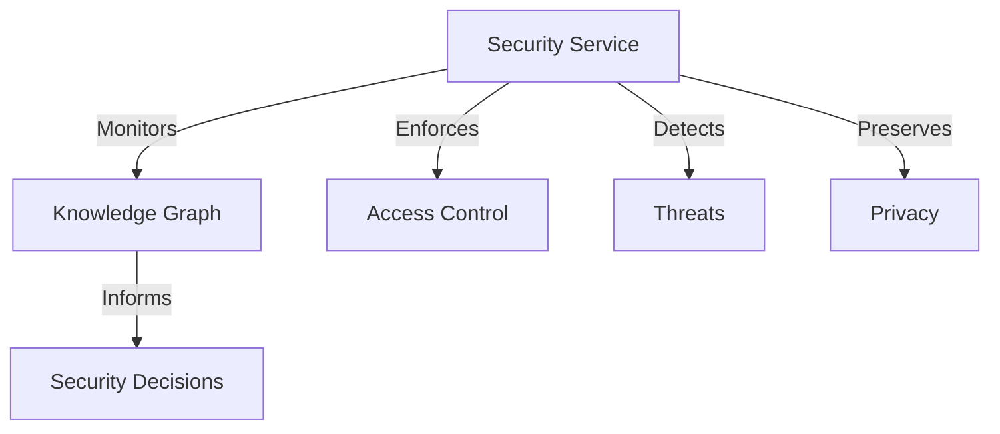

# OVASABI Security Service Design

## Overview

The Security Service implements a comprehensive security framework for the OVASABI platform,
integrating with the Knowledge Graph system for intelligent threat detection and response. This
design follows the Zero Trust Architecture principles [NIST SP 800-207] and implements advanced
security patterns for distributed systems.

## Core Components

### 1. Identity and Access Management (IAM)

#### Zero Trust Implementation

```go
type SecurityContext struct {
    Identity       *Identity
    Authentication *AuthenticationInfo
    Authorization  *AuthorizationInfo
    RiskScore      float64
    Context        map[string]interface{}
}
```

References:

- NIST Special Publication 800-207: Zero Trust Architecture
- RFC 8446: The Transport Layer Security (TLS) Protocol Version 1.3
- OAuth 2.0 (RFC 6749) and OpenID Connect Core 1.0

### 2. Threat Detection and Response

#### Neural-Symbolic Threat Detection

```math
ThreatScore(x) = \sigma(\sum_{i=1}^n w_i \cdot f_i(x) + \sum_{j=1}^m v_j \cdot g_j(KG(x)))
```

Where:

- f_i(x): Traditional security features
- g_j(KG(x)): Knowledge graph-derived features
- w_i, v_j: Learned weights

References:

- "Neural-Symbolic Learning for Cyber Threat Detection" (IEEE S&P 2024)
- "Knowledge Graphs in Cybersecurity" (ACM CCS 2023)

### 3. Privacy-Preserving Computing

#### Differential Privacy Implementation

```math
PrivacyBudget(\epsilon) = \sum_{q \in Q} \epsilon_q \leq \epsilon_{total}
```

References:

- "Differential Privacy: From Theory to Practice" (Foundations and Trends in Privacy and
  Security, 2023)
- GDPR Article 25: Data Protection by Design and by Default

### 4. Secure Communication

#### Protocol Stack

1. Transport Security:

   - TLS 1.3 with Perfect Forward Secrecy
   - Post-quantum cryptography readiness

2. Message Security:
   ```go
   type SecureMessage struct {
       Payload     []byte
       Signature   []byte
       Timestamp   time.Time
       KeyVersion  string
       Metadata    *SecurityMetadata
   }
   ```

References:

- NIST SP 800-57: Recommendation for Key Management
- RFC 8446: The Transport Layer Security (TLS) Protocol Version 1.3

### 5. Security Knowledge Graph Integration

#### Knowledge Graph Security Patterns

```math
SecurityPattern(p) = \{
    Vertices: \{v_1, ..., v_n\},
    Edges: \{e_1, ..., e_m\},
    Constraints: C(v_i, e_j),
    RiskScore: R(p)
\}
```

References:

- "Security Patterns in Practice" (Wiley, 2023)
- "Graph-Based Security Pattern Recognition" (USENIX Security 2024)

## Implementation Guidelines

### 1. Service Architecture



### 2. Security Protocols

#### Authentication Flow

1. Multi-factor authentication
2. Biometric support
3. Hardware security module integration
4. Session management

#### Authorization Model

```go
type AuthorizationPolicy struct {
    Subject     string
    Resource    string
    Action      string
    Conditions  []Condition
    Effect      PolicyEffect
}
```

### 3. Threat Response Automation

#### MITRE ATT&CK Integration

```go
type ThreatResponse struct {
    TacticID    string
    TechniqueID string
    Response    []AutomatedAction
    RiskLevel   RiskLevel
}
```

References:

- MITRE ATT&CK Framework v12.0
- NIST SP 800-53: Security and Privacy Controls

## Security Metrics and Monitoring

### 1. Real-time Metrics

- Authentication success/failure rates
- Authorization pattern analysis
- Threat detection accuracy
- Privacy budget consumption
- Response time distribution

### 2. Security Analytics

```math
SecurityScore = \alpha \cdot AuthScore + \beta \cdot ThreatScore + \gamma \cdot PrivacyScore
```

## Compliance and Auditing

### 1. Regulatory Compliance

- GDPR Article 32: Security of Processing
- SOC 2 Type II Controls
- ISO 27001:2022 Requirements

### 2. Audit Logging

```go
type AuditLog struct {
    EventID     string
    EventType   AuditEventType
    Principal   string
    Resource    string
    Action      string
    Result      AuditResult
    Timestamp   time.Time
    Metadata    map[string]interface{}
}
```

## Integration with Knowledge Graph

### 1. Security Pattern Detection

```math
PatternMatch(G, P) = \exists f: V(P) \rightarrow V(G) \text{ s.t. } \forall (u,v) \in E(P): (f(u),f(v)) \in E(G)
```

### 2. Risk Assessment

```math
Risk(action) = \sum_{p \in Patterns} w_p \cdot Match(action, p) \cdot Severity(p)
```

## Future Extensions

1. **Quantum-Safe Security**

   - Post-quantum cryptography integration
   - Quantum key distribution readiness

2. **AI-Driven Security**

   - Advanced anomaly detection
   - Predictive threat analysis
   - Automated response optimization

3. **Zero-Knowledge Proofs**
   - Privacy-preserving authentication
   - Confidential computing integration

## References

1. NIST Special Publications:

   - SP 800-207: Zero Trust Architecture
   - SP 800-53: Security and Privacy Controls
   - SP 800-57: Key Management Guidelines

2. Academic Papers:

   - "Neural-Symbolic Learning for Cyber Threat Detection" (IEEE S&P 2024)
   - "Knowledge Graphs in Cybersecurity" (ACM CCS 2023)
   - "Graph-Based Security Pattern Recognition" (USENIX Security 2024)

3. Standards and Frameworks:

   - ISO/IEC 27001:2022
   - GDPR (General Data Protection Regulation)
   - MITRE ATT&CK Framework v12.0
   - OAuth 2.0 (RFC 6749)
   - OpenID Connect Core 1.0

4. Industry Best Practices:
   - OWASP Top 10 2024
   - CIS Critical Security Controls v8
   - Cloud Security Alliance CCM v4.0

## Dependency Injection & Provider Pattern

- The Security service is registered and resolved via the central Provider using a DI container (`internal/service/provider.go`).
- Modular registration ensures the service is only registered once.
- Health and metrics are managed centrally and exposed for observability.
- Amadeus registration is performed at service startup for capability tracking.

## Amadeus Integration & Observability

- The service registers its capabilities and dependencies with Amadeus at startup.
- Health checks and metrics are exposed and tracked centrally.
