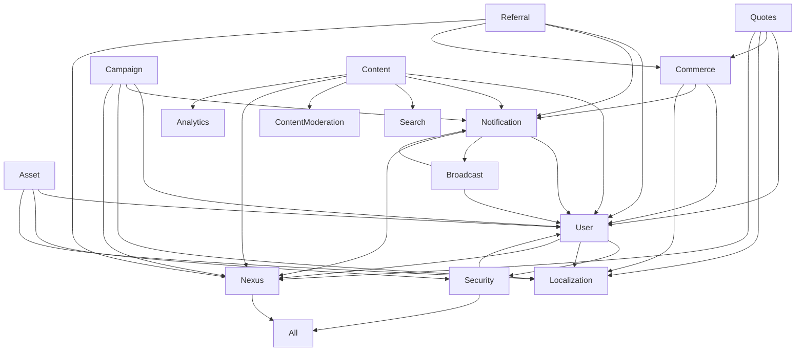

# Documentation

version: 2025-05-14

> Run > 2025-05-14 > to get the current system date dynamically. > > **Information Quality &
> Traceability Guidance:** > - All documentation, OpenAPI specs, and standards should include a
> version or date field reflecting the last update or generation date. > - The current system date
> is used for traceability and should be referenced in all new or updated files. > - The AI
> assistant's knowledge is current up to the training data cutoff; for anything after 2024-06,
> always verify with the latest platform docs, code, or authoritative sources. > - When in doubt,
> prefer the most recent file date, version field, or explicit changelog entry in service
> documentation. > - Reference this section in onboarding and developer docs as the source of truth
> for date/version context and information freshness. version: 2025-05-14

version: 2025-05-14

> **Standard:** All services must follow the
> [Unified Communication & Calculation Standard](../amadeus/amadeus_context.md#unified-communication--calculation-standard-grpc-rest-websocket-and-metadata-driven-orchestration).
> This includes:
>
> - Exposing calculation/enrichment endpoints (gRPC, REST, WebSocket) that accept and return
>   canonical metadata.
> - Documenting all metadata fields and calculation chains in service docs and onboarding.
> - Using the Makefile and Docker configuration for all proto/code generation and builds.

**Canonical Endpoint Example:**

```proto
// Calculates risk for a user and enriches security metadata.
rpc CalculateRisk(CalculateRiskRequest) returns (CalculateRiskResponse) {
  // See Amadeus context for calculation chain standard.
}
message CalculateRiskRequest {
  string user_id = 1;
  common.Metadata metadata = 2;
}
message CalculateRiskResponse {
  common.Metadata metadata = 1;
}
```

**Service Checklist:**

- [ ] Exposes calculation/enrichment endpoints using canonical metadata
- [ ] Documents all metadata fields and calculation chains
- [ ] References the Amadeus context and unified standard
- [ ] Uses Makefile/Docker for all builds and proto generation

---

> **Note:** This list reflects the new consolidated architecture. See the migration plan for
> details.

> **Documentation Reference:**
>
> - All user management, authentication, and authorization logic is tracked in
>   [User Service Implementation Guide](user_service.md). Refer to this document for current and
>   ongoing requests, migration steps, and best practices.

| Service           | Description                                             | Dependencies                                  | Integration Points       |
| ----------------- | ------------------------------------------------------- | --------------------------------------------- | ------------------------ |
| User              | User mgmt, profile, RBAC, authentication, authorization | Security                                      | Localization, Nexus      |
| Notification      | Multi-channel, templates, real-time, streaming          | User                                          | Broadcast, Nexus         |
| Campaign          | Campaign mgmt, analytics                                | User, Notification                            | Localization, Nexus      |
| Referral          | Referral, rewards, fraud                                | User, Notification                            | Commerce, Nexus          |
| Security          | Policies, audit, compliance                             | All services                                  | User, Nexus              |
| Content           | Articles, micro-posts, video, comments, reactions, FTS  | User, Notification, Search, ContentModeration | Nexus, Analytics         |
| Commerce          | Orders, payments, billing, pricing, rewards             | User, Notification, Localization              | Localization, Nexus      |
| Localization      | i18n, translation, locale-based pricing                 | -                                             | Commerce, Content, User  |
| Search            | Full-text, fuzzy, entity search                         | All entities                                  | Content, Product, Talent |
| Admin             | Admin user mgmt, roles, audit                           | User (via gRPC)                               | Security, Nexus          |
| Analytics         | Event, usage, reporting                                 | User, Content                                 | Nexus                    |
| ContentModeration | Moderation, compliance                                  | Content, User                                 | Nexus                    |
| Talent            | Talent profiles, bookings                               | User                                          | Search, Analytics        |
| Nexus             | Orchestration, patterns                                 | All services                                  | Amadeus, All             |
| Asset             | 3D asset mgmt, CDN, version                             | User, Security                                | Localization, Nexus      |
| Broadcast         | Real-time, pub/sub, streaming                           | User, Notification                            | Nexus                    |
| Product           | Product catalog, listings, inventory, reviews           | Commerce, User                                | Search, Analytics        |
| Quotes            | Quote gen, pricing, history                             | User, Commerce                                | Localization, Nexus      |

## Service Dependencies



## Implementation Status

| Service      | Status | Dependencies                                  | Cache | Database    | Events |
| ------------ | ------ | --------------------------------------------- | ----- | ----------- | ------ |
| Commerce     | ✅     | User, Notification, Localization              | Redis | Postgres    | Yes    |
| User         | ✅     | Security, Localization                        | Redis | Postgres    | Yes    |
| Asset        | ✅     | User, Security, Localization                  | Redis | Postgres+S3 | Yes    |
| Broadcast    | ✅     | User, Notification                            | Redis | Postgres    | Yes    |
| Campaign     | ✅     | User, Notification, Localization              | Redis | Postgres    | Yes    |
| Notification | ✅     | User                                          | Redis | Postgres    | Yes    |
| Quotes       | ✅     | User, Commerce, Localization                  | Redis | Postgres    | Yes    |
| Referral     | ✅     | User, Notification, Commerce                  | Redis | Postgres    | Yes    |
| Localization | ✅     | -                                             | Redis | Postgres    | Yes    |
| Nexus        | ✅     | All services                                  | Redis | Postgres    | Yes    |
| Security     | ✅     | All services                                  | Redis | Postgres    | Yes    |
| Content      | ✅     | User, Notification, Search, ContentModeration | Redis | Postgres    | Yes    |

## Service Patterns

All services follow these common patterns:

1. **Data Storage**
   - Master-client pattern
   - JSONB for flexible fields
   - Event logging table
2. **Caching**
   - Redis for transient data
   - Structured key naming
   - TTL management
3. **API Design**
   - gRPC interfaces
   - Protocol Buffers
   - Versioned APIs
4. **Documentation**
   - Amadeus integration
   - Generated docs
   - Example usage
5. **Monitoring**
   - Health checks
   - Metrics
   - Tracing

## Priority Roadmap

This roadmap prioritizes foundational and high-impact features to maximize value and enable
dependent functionality. As each step is implemented, it will be documented here with technical
references and best practices.

### Phase 1: Core User & Security Foundations

1. **User Sessions & Authentication**
   - Create, get, revoke, and list sessions
   - SSO, MFA, SCIM integration
   - Role & permission management (assign/remove/list roles/permissions)
   - Audit logs for user actions
2. **Security Service**
   - Permission checks (CheckPermission, Authorize)
   - Authentication (Authenticate, ValidateToken)
   - Threat detection & incident reporting
   - Security metrics aggregation

### Phase 2: Communication & Orchestration

3. **Notification Service**
   - Send email, SMS, push notifications
   - Broadcast events
   - Event streaming/subscription
4. **Scheduler Service**
   - List, get, run jobs
   - List job runs
   - CDC event subscription

### Phase 3: Commerce & Transactional Services

5. **Commerce Service**
   - Quotes: create, get, list
   - Orders: create, update status, list
   - Payments: initiate, confirm, refund
   - Transactions & balances: get/list
   - Event logging for commerce actions

### Phase 4: Content, Moderation, and Talent

6. **Content Moderation Service**
   - Approve/reject/list flagged content
   - Submit content for moderation
7. **Talent Service**
   - Book talent, list bookings
   - Get/list/search talent profiles

### Phase 5: Media, Broadcast, and Search

8. **Media Service**
   - Upload, stream, get, delete, list user media
9. **Broadcast Service**
   - Create, get, list broadcasts
   - Publish/subscribe to live asset chunks
   - Smart routing, analytics integration
10. **Search Service**
    - Entity search (across users, content, campaigns, etc.)

### Phase 6: Analytics, ML, and Advanced Features

11. **Analytics & ML**
    - Real-time analytics dashboards
    - A/B testing, ML-based targeting
    - Fraud detection (finance/referral/campaign)

### Phase 7: Accessibility, Compliance, and Globalization

12. **Accessibility & Compliance Automation**
    - Automated accessibility checks for all content/assets
    - Compliance metadata integration and reporting
13. **Localization at Scale**
    - Automated localization for all campaign scripts/assets
    - Integration with external translation providers

### Phase 8: Ecosystem & Developer Experience

14. **API Gateway & Developer Portal**
    - Unified API docs, onboarding, and sandbox
    - SDKs and integration guides
15. **Plugin/Extension System**
    - Allow third parties to extend platform functionality

---

**As you proceed through each phase, document each step here with technical references and best
practices.**

## Service Health

Current service health status is tracked in Amadeus and can be queried:

```go
health, err := amadeus.GetServiceHealth(ctx, &kg.HealthRequest{
    Services: []string{"finance", "user", "auth"},
})
```

## Documentation

Each service maintains its own documentation:

- Implementation details
- API reference
- Usage examples
- Integration guide
- Testing guide

Documentation is automatically generated and updated through Amadeus.

**All services are registered and resolved via a central Provider using a DI container. Modular
registration ensures each service is only registered once. Health and metrics are managed centrally
and exposed for observability. Amadeus registration is performed at service startup for capability
tracking.**

**The Babel service provides i18n and dynamic, location-based pricing rules. Quotes, Finance, and
Campaign services integrate with Babel for pricing and localization.**

NotificationService now consolidates all messaging, broadcast, and event delivery logic.

- **ContentService**: Provides dynamic content (articles, micro-posts, video), comments, reactions,
  and full-text search. Integrates with UserService for author info, NotificationService for
  engagement, SearchService for indexing, and ContentModerationService for compliance.

> **Note:** AdminService always creates/links admin users to main users via UserService gRPC. All
> cross-service relationships are via gRPC and DI. No direct DB access is allowed across service
> boundaries.

**Migration Note:**

- The Finance, Babel, I18n, and Auth services are now deprecated or obsolete. All financial
  operations (payments, pricing, rewards, etc.) are handled by the Commerce service. All
  translation, i18n, and locale-based pricing is handled by the Localization service. All
  authentication and authorization is handled by the User service. Legacy references will be removed
  as migration completes.

## Obsolete Service Migration Guide

As part of the ongoing migration, the following services are now deprecated or obsolete:

- **Finance** → replaced by **Commerce**
- **Babel, I18n** → replaced by **Localization**
- **Auth** → replaced by **User** (for authentication/authorization)

### What to Do

- **Grep for references** to the obsolete services in your codebase:
  - `grep -iR 'Finance' .`
  - `grep -iR 'Babel' .`
  - `grep -iR 'I18n' .`
  - `grep -iR 'Auth' .`
- **For each reference:**
  - If it is a dependency, update to the new service (see table below).
  - If it is a function call or integration, use the new service's API.
  - If it is data or event logging, store the relevant info in the `metadata` field under the new
    namespace.
- **Update DI containers, service registration, and configuration** to remove obsolete services.
- **Test all integrations** to ensure the new services are functioning as expected.
- **Document all changes** and update onboarding guides.

### Replacement Table

| Obsolete Service | Replacement  | Metadata Namespace | Example Use Case     |
| ---------------- | ------------ | ------------------ | -------------------- |
| Finance          | Commerce     | `commerce`         | Payments, rewards    |
| Babel, I18n      | Localization | `localization`     | Translation, i18n    |
| Auth             | User         | `user` or `auth`   | Authentication, RBAC |

### Example Metadata Patterns

- **Payment Event:**
  ```json
  {
    "commerce": {
      "transaction_id": "txn_123",
      "amount": 100.0,
      "currency": "USD",
      "status": "completed",
      "method": "credit_card"
    }
  }
  ```
- **Translation Event:**
  ```json
  {
    "localization": {
      "original_text": "Welcome",
      "translated_text": "Bienvenue",
      "locale": "fr-FR",
      "status": "translated"
    }
  }
  ```
- **Authentication Event:**
  ```json
  {
    "user": {
      "user_id": "user_456",
      "session_id": "sess_789",
      "auth_method": "password",
      "timestamp": "2024-05-15T12:00:00Z"
    }
  }
  ```

---

**Tip:** Manual migration is recommended for accuracy. Use the above grep commands to find all
references, and update them according to the table and patterns above. Store all essential, cleaned
information in the extensible `metadata` field for future-proofing and discoverability.
