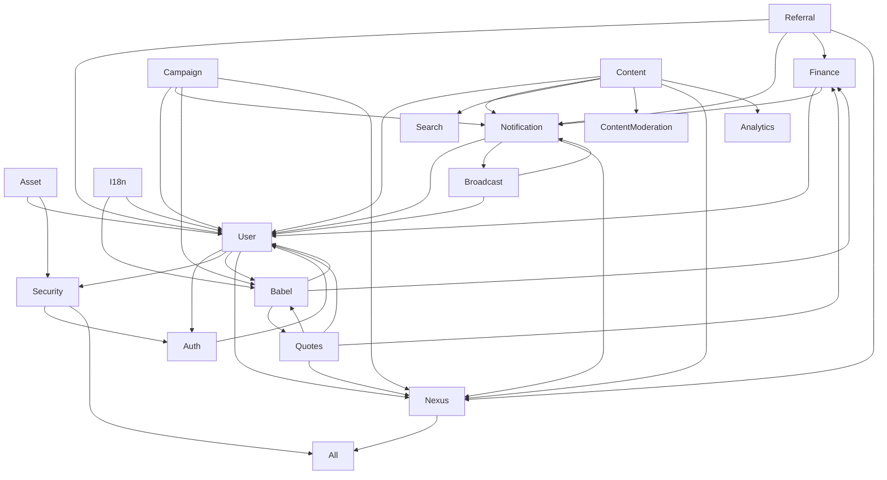

# Service List

> **Note:** This list reflects the new consolidated architecture. Some services are merged/renamed
> for clarity and scalability. See migration plan for details.

| Service           | Description                                            | Dependencies                                  | Integration Points  |
| ----------------- | ------------------------------------------------------ | --------------------------------------------- | ------------------- |
| User              | User mgmt, profile, RBAC                               | Security                                      | Notification, Nexus |
| Notification      | Multi-channel, templates, real-time, streaming         | User                                          | Nexus               |
| Campaign          | Campaign mgmt, analytics                               | User, Notification                            | Nexus               |
| Referral          | Referral, rewards, fraud                               | User, Notification                            | Nexus               |
| Security          | Policies, audit, compliance                            | All services                                  | Nexus               |
| Content           | Articles, micro-posts, video, comments, reactions, FTS | User, Notification, Search, ContentModeration | Nexus, Analytics    |
| Commerce          | Orders, payments, billing                              | User                                          | Nexus               |
| Localization      | i18n, translation                                      | -                                             | User, Content       |
| Search            | Full-text, fuzzy, entity search                        | Content, User                                 | Nexus               |
| Admin             | Admin user mgmt, roles, audit                          | User (via gRPC)                               | Security, Nexus     |
| Analytics         | Event, usage, reporting                                | User, Content                                 | Nexus               |
| ContentModeration | Moderation, compliance                                 | Content, User                                 | Nexus               |
| Talent            | Talent profiles, bookings                              | User                                          | Nexus               |
| Nexus             | Orchestration, patterns                                | All services                                  | Amadeus, All        |

- **Legend:**
  - 🔄 = Consolidated/renamed
  - 🆕 = New service
  - ✅ = Existing, unchanged

For details on migration and implementation, see the migration plan.

## Core Services

| Service      | Status | Capabilities                                                           | Dependencies                                  | Integration Points       |
| ------------ | ------ | ---------------------------------------------------------------------- | --------------------------------------------- | ------------------------ |
| Asset        | 🔄     | 3D asset mgmt, CDN, version                                            | User, Security                                | Babel, Nexus             |
| Auth         | 🔄     | Auth, token, session, policy                                           | User                                          | Security, Nexus          |
| Babel        | 🔄     | i18n, pricing, translation                                             | -                                             | Quotes, Finance, User    |
| Broadcast    | 🔄     | Real-time, pub/sub, streaming                                          | User, Notification                            | Nexus                    |
| Campaign     | 🔄     | Campaign mgmt, analytics                                               | User, Notification                            | Babel, Nexus             |
| Commerce     | 🔄     | Pricing, quotes, payments, subscriptions, rewards, financial reporting | User, Notification                            | Babel, Nexus             |
| Content      | 🆕     | Articles, micro-posts, video, comments, reactions, FTS                 | User, Notification, Search, ContentModeration | Nexus, Analytics         |
| Finance      | ✅     | Balance, tx, audit, rewards                                            | User, Notification                            | Babel, Nexus             |
| I18n         | 🔄     | Localization, translation                                              | -                                             | Babel, User              |
| Localization | 🔄     | Translations, locale-based pricing, content adaptation                 | -                                             | Commerce, Content, User  |
| Nexus        | ✅     | Orchestration, patterns                                                | All services                                  | Amadeus, All             |
| Notification | 🔄     | Multi-channel, templates                                               | User                                          | Broadcast, Nexus         |
| Product      | 🆕     | Product catalog, listings, inventory, reviews, marketplace logic       | Commerce, User                                | Search, Analytics        |
| Quotes       | 🔄     | Quote gen, pricing, history                                            | User, Babel                                   | Finance, Nexus           |
| Referral     | 🔄     | Referral, rewards, fraud                                               | User, Notification                            | Finance, Nexus           |
| Search       | 🆕     | Full-text, semantic, faceted search                                    | All entities                                  | Content, Product, Talent |
| Security     | 🔄     | Policies, audit, compliance                                            | All services                                  | Auth, Nexus              |
| Talent       | 🆕     | Talent profiles, portfolios, booking, testimonials                     | User                                          | Search, Analytics        |
| User         | 🔄     | User mgmt, profile, RBAC                                               | Auth, Security                                | Babel, Nexus             |

## Service Dependencies



## Implementation Status

| Service      | Status | Dependencies                                  | Cache | Database    | Events |
| ------------ | ------ | --------------------------------------------- | ----- | ----------- | ------ |
| Finance      | ✅     | User, Notification                            | Redis | Postgres    | Yes    |
| User         | 🔄     | Auth, Security                                | Redis | Postgres    | Yes    |
| Auth         | 🔄     | User                                          | Redis | Postgres    | Yes    |
| Asset        | 🔄     | User, Security                                | Redis | Postgres+S3 | Yes    |
| Broadcast    | 🔄     | User, Notification                            | Redis | Postgres    | Yes    |
| Campaign     | 🔄     | User, Notification                            | Redis | Postgres    | Yes    |
| Notification | 🔄     | User                                          | Redis | Postgres    | Yes    |
| Quotes       | 🔄     | User, Babel                                   | Redis | Postgres    | Yes    |
| Referral     | 🔄     | User, Notification                            | Redis | Postgres    | Yes    |
| Babel        | 🔄     | -                                             | Redis | Postgres    | Yes    |
| I18n         | 🔄     | -                                             | Redis | Postgres    | Yes    |
| Nexus        | ✅     | All services                                  | Redis | Postgres    | Yes    |
| Security     | 🔄     | All services                                  | Redis | Postgres    | Yes    |
| Content      | 🆕     | User, Notification, Search, ContentModeration | Redis | Postgres    | Yes    |

## Service Patterns

All services follow these common patterns:

1. **Data Storage**

   - Master-client pattern
   - JSONB for flexible fields
   - Event logging table

2. **Caching**

   - Redis for transient data
   - Structured key naming
   - TTL management

3. **API Design**

   - gRPC interfaces
   - Protocol Buffers
   - Versioned APIs

4. **Documentation**

   - Amadeus integration
   - Generated docs
   - Example usage

5. **Monitoring**
   - Health checks
   - Metrics
   - Tracing

## Implementation Roadmap

1. **Phase 1 - Core Infrastructure** ✅

   - Finance service
   - Basic user management
   - Authentication

2. **Phase 2 - Asset Management** 🔄

   - Asset service
   - CDN integration
   - Optimization pipeline

3. **Phase 3 - Communication** 🔄

   - Broadcast service
   - Notification service
   - Real-time capabilities

4. **Phase 4 - Business Logic** 🔄

   - Campaign service
   - Quotes service
   - Referral system

5. **Phase 5 - Analytics & ML** 🔄
   - Data pipeline
   - ML integration
   - Advanced analytics

## Service Health

Current service health status is tracked in Amadeus and can be queried:

```go
health, err := amadeus.GetServiceHealth(ctx, &kg.HealthRequest{
    Services: []string{"finance", "user", "auth"},
})
```

## Documentation

Each service maintains its own documentation:

- Implementation details
- API reference
- Usage examples
- Integration guide
- Testing guide

Documentation is automatically generated and updated through Amadeus.

**All services are registered and resolved via a central Provider using a DI container. Modular
registration ensures each service is only registered once. Health and metrics are managed centrally
and exposed for observability. Amadeus registration is performed at service startup for capability
tracking.**

**The Babel service provides i18n and dynamic, location-based pricing rules. Quotes, Finance, and
Campaign services integrate with Babel for pricing and localization.**

NotificationService now consolidates all messaging, broadcast, and event delivery logic.

- **ContentService**: Provides dynamic content (articles, micro-posts, video), comments, reactions,
  and full-text search. Integrates with UserService for author info, NotificationService for
  engagement, SearchService for indexing, and ContentModerationService for compliance.

> **Note:** AdminService always creates/links admin users to main users via UserService gRPC. All
> cross-service relationships are via gRPC and DI. No direct DB access is allowed across service
> boundaries.
