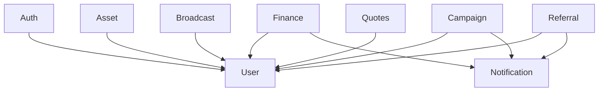

# Service List

This document provides an overview of all services in the OVASABI platform, their current status,
and capabilities.

## Core Services

### 1. Finance Service

**Status:** Implemented ✅

- Balance management
- Transaction processing
- Transfer capabilities
- Audit logging
- Redis caching integration
- Master-client pattern implementation

### 2. User Service

**Status:** Planned 🔄

- User management
- Profile handling
- Authentication integration
- Role-based access control
- User preferences

### 3. Auth Service

**Status:** Planned 🔄

- Authentication
- Authorization
- Token management
- Session handling
- Security policies

### 4. Asset Service

**Status:** Planned 🔄

- 3D asset management
- Asset versioning
- CDN integration
- Optimization pipeline
- Access control

### 5. Broadcast Service

**Status:** Planned 🔄

- Real-time messaging
- Event broadcasting
- WebSocket handling
- Message queuing
- Delivery guarantees

### 6. Campaign Service

**Status:** Planned 🔄

- Campaign management
- Targeting rules
- Analytics integration
- A/B testing
- Performance tracking

### 7. Notification Service

**Status:** Planned 🔄

- Multi-channel notifications
- Template management
- Delivery scheduling
- Rate limiting
- Preference management

### 8. Quotes Service

**Status:** Planned 🔄

- Quote generation
- Pricing rules
- Dynamic pricing
- Quote history
- Analytics integration

### 9. Referral Service

**Status:** Planned 🔄

- Referral tracking
- Reward management
- Link generation
- Analytics integration
- Fraud prevention

## Service Dependencies



## Implementation Status

| Service      | Status | Dependencies       | Cache | Database    | Events |
| ------------ | ------ | ------------------ | ----- | ----------- | ------ |
| Finance      | ✅     | User, Notification | Redis | Postgres    | Yes    |
| User         | 🔄     | Auth               | Redis | Postgres    | Yes    |
| Auth         | 🔄     | -                  | Redis | Postgres    | Yes    |
| Asset        | 🔄     | User               | Redis | Postgres+S3 | Yes    |
| Broadcast    | 🔄     | User               | Redis | Postgres    | Yes    |
| Campaign     | 🔄     | User, Notification | Redis | Postgres    | Yes    |
| Notification | 🔄     | User               | Redis | Postgres    | Yes    |
| Quotes       | 🔄     | User               | Redis | Postgres    | Yes    |
| Referral     | 🔄     | User, Notification | Redis | Postgres    | Yes    |

## Service Patterns

All services follow these common patterns:

1. **Data Storage**

   - Master-client pattern
   - JSONB for flexible fields
   - Event logging table

2. **Caching**

   - Redis for transient data
   - Structured key naming
   - TTL management

3. **API Design**

   - gRPC interfaces
   - Protocol Buffers
   - Versioned APIs

4. **Documentation**

   - Amadeus integration
   - Generated docs
   - Example usage

5. **Monitoring**
   - Health checks
   - Metrics
   - Tracing

## Implementation Roadmap

1. **Phase 1 - Core Infrastructure** ✅

   - Finance service
   - Basic user management
   - Authentication

2. **Phase 2 - Asset Management** 🔄

   - Asset service
   - CDN integration
   - Optimization pipeline

3. **Phase 3 - Communication** 🔄

   - Broadcast service
   - Notification service
   - Real-time capabilities

4. **Phase 4 - Business Logic** 🔄

   - Campaign service
   - Quotes service
   - Referral system

5. **Phase 5 - Analytics & ML** 🔄
   - Data pipeline
   - ML integration
   - Advanced analytics

## Service Health

Current service health status is tracked in Amadeus and can be queried:

```go
health, err := amadeus.GetServiceHealth(ctx, &kg.HealthRequest{
    Services: []string{"finance", "user", "auth"},
})
```

## Documentation

Each service maintains its own documentation:

- Implementation details
- API reference
- Usage examples
- Integration guide
- Testing guide

Documentation is automatically generated and updated through Amadeus.
