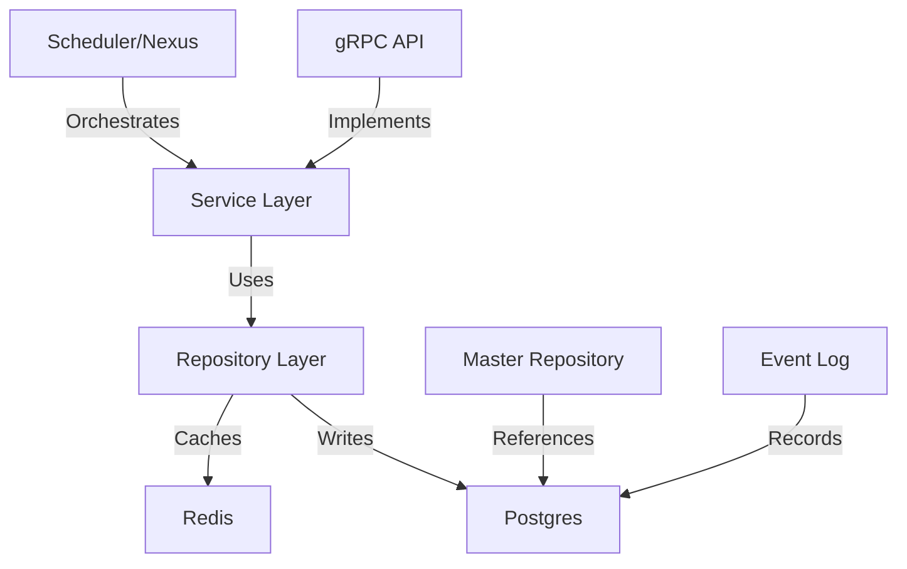

# User Service Documentation

version: 2025-05-14

> **Standard:** This service follows the
> [Unified Communication & Calculation Standard](../../amadeus/amadeus_context.md#unified-communication--calculation-standard-grpc-rest-websocket-and-metadata-driven-orchestration).
>
> - Exposes calculation/enrichment endpoints using canonical metadata
> - Documents all metadata fields and calculation chains
> - References the Amadeus context and unified standard
> - Uses Makefile/Docker for all builds and proto generation

> **Note:** The Auth service is deprecated. All authentication and authorization is now handled by
> the User service. See
> [Amadeus context](../../amadeus/amadeus_context.md#user-service-canonical-identity--access-management)
> and [Service List](../service_list.md#obsolete-service-migration-guide) for migration details.

The User service is the canonical service for user management, authentication, RBAC, and audit
logging in the OVASABI platform. It implements all identity and access management logic, following
the robust metadata pattern and platform-wide standards.

## Architecture



## Features

1. **User Management**
   - User registration, CRUD, and profile management
   - Account deactivation, search, and filtering
2. **Authentication & Session Management**
   - Secure password hashing (bcrypt)
   - Session/token management (JWT, Redis)
   - Login, logout, refresh endpoints
   - All events logged in metadata
3. **Role Management (RBAC)**
   - Role assignment, permission management
   - Access level control, role hierarchies
   - All RBAC events logged in metadata
4. **Audit Logging**
   - All critical user/auth actions are logged in metadata and audit logs
5. **Integration Points**
   - Centralized with all services via metadata, Scheduler, Nexus, and Knowledge Graph
   - Caches metadata, registers with Scheduler, enriches Knowledge Graph, and orchestrates with
     Nexus

## Communication Channels

- **gRPC:** Implements all endpoints in `api/protos/user/v1/user.proto` (CRUD, session, RBAC, audit,
  SSO/MFA, etc.)
- **REST:** Exposed via gRPC-Gateway/REST layer, following the composable request pattern (see
  OpenAPI spec)
- **WebSocket:** Real-time state updates and notifications propagate user metadata
- **Orchestration:** Integrated with Nexus for cross-service orchestration and automation
- **Knowledge Graph:** All metadata is ingested for analytics, impact analysis, and orchestration

## Metadata Pattern

- Uses `common.Metadata` for all extensible fields, including `service_specific.user` (see
  [metadata.md](../metadata.md))
- All communication (REST, gRPC, WebSocket, orchestration, analytics, audit) propagates and updates
  metadata
- Implements bad actor detection, compliance, accessibility, and audit fields as per platform
  standards

## API Reference

### Proto Definition (see `api/protos/user/v1/user.proto`)

```protobuf
service UserService {
  // User Management
  rpc CreateUser(CreateUserRequest) returns (CreateUserResponse);
  rpc GetUser(GetUserRequest) returns (GetUserResponse);
  rpc GetUserByUsername(GetUserByUsernameRequest) returns (GetUserByUsernameResponse);
  rpc GetUserByEmail(GetUserByEmailRequest) returns (GetUserByEmailResponse);
  rpc UpdateUser(UpdateUserRequest) returns (UpdateUserResponse);
  rpc DeleteUser(DeleteUserRequest) returns (DeleteUserResponse);
  rpc ListUsers(ListUsersRequest) returns (ListUsersResponse);
  rpc UpdatePassword(UpdatePasswordRequest) returns (UpdatePasswordResponse);
  rpc UpdateProfile(UpdateProfileRequest) returns (UpdateProfileResponse);
  // Session Management
  rpc CreateSession(CreateSessionRequest) returns (CreateSessionResponse);
  rpc GetSession(GetSessionRequest) returns (GetSessionResponse);
  rpc RevokeSession(RevokeSessionRequest) returns (RevokeSessionResponse);
  rpc ListSessions(ListSessionsRequest) returns (ListSessionsResponse);
  // RBAC & Permissions
  rpc AssignRole(AssignRoleRequest) returns (AssignRoleResponse);
  rpc RemoveRole(RemoveRoleRequest) returns (RemoveRoleResponse);
  rpc ListRoles(ListRolesRequest) returns (ListRolesResponse);
  rpc ListPermissions(ListPermissionsRequest) returns (ListPermissionsResponse);
  // Audit/Event Log
  rpc ListUserEvents(ListUserEventsRequest) returns (ListUserEventsResponse);
  rpc ListAuditLogs(ListAuditLogsRequest) returns (ListAuditLogsResponse);
  // SSO, MFA, SCIM
  rpc InitiateSSO(InitiateSSORequest) returns (InitiateSSOResponse);
  rpc InitiateMFA(InitiateMFARequest) returns (InitiateMFAResponse);
  rpc SyncSCIM(SyncSCIMRequest) returns (SyncSCIMResponse);
  // Legacy/Platform-specific
  rpc RegisterInterest(RegisterInterestRequest) returns (RegisterInterestResponse);
  rpc CreateReferral(CreateReferralRequest) returns (CreateReferralResponse);
}
```

### Methods

- All methods accept and return messages with a `metadata` field for extensibility and audit
- See proto for full request/response details

## Data Model

- See proto and repository for canonical user model
- Metadata is stored as `jsonb` in Postgres and cached in Redis

## Caching Strategy

- User Profile: `cache:user:profile:{user_id}` (TTL: 1 hour)
- User Roles: `cache:user:roles:{user_id}` (TTL: 30 minutes)
- Username/Email Lookup: `cache:user:username:{username}`, `cache:user:email:{email}` (TTL: 24
  hours)

## Knowledge Graph & Orchestration

- All user metadata is ingested into the Knowledge Graph for analytics, orchestration, and impact
  analysis
- Scheduler and Nexus use metadata for dynamic orchestration and automation

## Translator Role

- Translators can be assigned as a user role (RBAC/workflow)
- Linked to talent profiles and referenced in `translation_provenance` for localization/content
  metadata
- See
  [Amadeus context](../../amadeus/amadeus_context.md#machine-vs-human-translation--translator-roles)
  and [metadata.md](../metadata.md)

## OAuth 2.0 Authentication

The User Service supports robust OAuth 2.0 authentication using the
[markbates/goth](https://github.com/markbates/goth) library for multi-provider support (Google,
GitHub, etc.).

### How It Works

- **Providers:** Easily add Google, GitHub, and other OAuth providers via configuration.
- **Endpoints:**
  - `/auth/{provider}`: Initiates the OAuth flow for the given provider.
  - `/auth/{provider}/callback`: Handles the OAuth callback, processes the user profile, and creates
    or looks up a user in the system.
- **User Flow:**
  1. User clicks 'Sign in with Google' (or other provider).
  2. User is redirected to the provider's login/consent screen.
  3. On success, the callback handler receives the user's profile info and tokens.
  4. The service looks up or creates a user, issues a session, and updates user metadata with OAuth
     info (provider, provider_user_id, email, etc.).
  5. All OAuth logins are logged in the audit metadata for compliance and traceability.

### Metadata Pattern

- OAuth provider info is stored in `user.Metadata.ServiceSpecific["user"].oauth`:
  ```json
  {
    "provider": "google",
    "provider_user_id": "123456789",
    "email": "user@example.com",
    "name": "Jane Doe",
    "avatar_url": "https://..."
  }
  ```
- All logins (including OAuth) are recorded in the audit history.

### Security

- Access tokens are stored securely (server-side session or encrypted cookie).
- All OAuth events are logged for audit and compliance.

### References

- [Permify: How to Implement OAuth 2.0 into a Golang App](https://permify.co/post/implement-oauth-2-golang-app/)
- [Dev.to: OAuth 2.0 Implementation in Golang](http://dev.to/siddheshk02/oauth-20-implementation-in-golang-3mj1)
- [Goth Documentation](https://github.com/markbates/goth)

## References

- [Amadeus Context: User Service](../../amadeus/amadeus_context.md#user-service-canonical-identity--access-management)
- [General Metadata Documentation](../metadata.md)
- [Versioning Standard & Documentation](../versioning.md)
- [Service List](../service_list.md)
