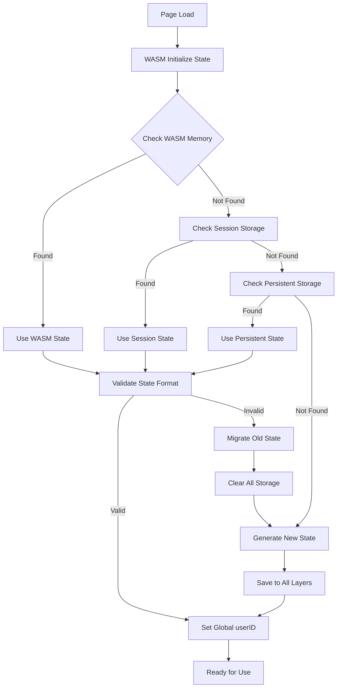

# Multi-Layer State Management Solution

## Problem

Need to clear localStorage on refresh while maintaining frontend state and ensuring proper user ID
migration from old 8-character format to new 32-character crypto hash format.

## Solution Architecture

### 1. Multi-Layer Storage Strategy

```typescript
// Storage Layers (in priority order):
// 1. WASM Memory (highest priority - source of truth)
// 2. Session Storage (survives refresh, cleared on tab close)
// 3. Persistent Storage (survives sessions)
// 4. Generated State (fallback)
```

### 2. Browser Technologies Used

#### Session Storage

- **Purpose**: Survives page refresh, cleared on tab close
- **Use Case**: Temporary state during current session
- **Key**: `temp_user_state`

#### Local Storage

- **Purpose**: Persists across sessions
- **Use Case**: Long-term user preferences and device ID
- **Key**: `persistent_user_state`

#### WASM Memory

- **Purpose**: Source of truth for user state
- **Use Case**: Real-time state management
- **Integration**: Exposed via JS global functions

### 3. State Migration Strategy

```typescript
// Migration Process:
// 1. Detect old format (8-character guest IDs)
// 2. Clear all storage
// 3. Generate new 32-character crypto hash
// 4. Update all storage layers
```

### 4. Implementation Files

#### Frontend State Manager (`frontend/src/utils/stateManager.ts`)

- Multi-layer state management
- Automatic migration detection
- Storage layer fallbacks
- TypeScript interfaces for type safety

#### WASM State Manager (`wasm/state_manager.go`)

- Go-based state management
- JS-exposed functions
- Crypto hash generation
- Storage integration

#### Updated Metadata Store (`frontend/src/store/stores/metadataStore.ts`)

- Integration with new state manager
- Async user ID resolution
- WASM-first approach

### 5. Usage Examples

#### Basic State Initialization

```typescript
import { stateManager } from './utils/stateManager';

// Initialize state (handles migration automatically)
const state = await stateManager.initialize();
console.log('User ID:', state.userId);
```

#### Clear Storage on Refresh

```typescript
// Clear only persistent storage (keep session state)
stateManager.clearPersistentStorage();

// Clear all storage (force regeneration)
stateManager.clearAllStorage();
```

#### WASM Integration

```javascript
// Initialize state from WASM
const state = await window.initializeState();

// Migrate old state format
window.migrateOldState();

// Clear storage
window.clearAllStorage();
```

### 6. Migration Flow



### 7. Benefits

1. **Seamless Migration**: Automatically detects and migrates old user ID formats
2. **Refresh Persistence**: State survives page refresh via session storage
3. **Session Isolation**: Each tab gets its own session state
4. **Fallback Strategy**: Multiple layers ensure state is never lost
5. **Type Safety**: Full TypeScript support with proper interfaces
6. **WASM Integration**: Leverages Go's crypto capabilities for secure ID generation

### 8. Configuration

#### Storage Keys

```typescript
const STORAGE_KEYS = {
  TEMP: 'temp_user_state', // Session storage
  PERSISTENT: 'persistent_user_state', // Local storage
  MIGRATION: 'user_state_migration' // Migration flag
};
```

#### State Version

```typescript
const VERSION = '1.0.0'; // For state format validation
```

### 9. Error Handling

- Graceful fallbacks at each storage layer
- Automatic retry mechanisms
- Console warnings for debugging
- Type validation for state integrity

### 10. Performance Considerations

- Lazy loading of state manager
- Minimal storage operations
- Efficient state validation
- Cached state access patterns

This solution provides a robust, multi-layer approach to state management that handles migration,
persistence, and refresh scenarios while maintaining type safety and performance.
